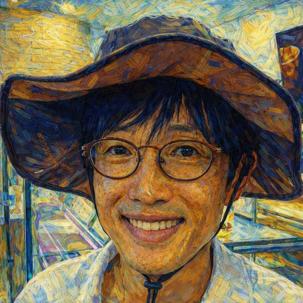

# Goangseup Zi

{width=220 fig-align="right"}

**School of Civil, Environmental and Architectural Engineering**  
**Korea University**

I am a professor of School of Civil, Environmental and Architectural Engineering at Korea University.

My research spans offshore wind energy substructures, digital transformation of civil engineering information, multidisciplinary structural durability, and computational mechanics. Across these areas, I am interested in how mechanics, computation, data, and engineering knowledge can be brought together to understand complex structural systems and support better engineering decisions.

Engineering education is another important part of my work. In particular, I am interested in ways of making mechanics more intuitive by connecting mathematical formulations to their underlying physical meaning.

## About This Site

**Zi’s Structural Engineering & Mechanics** is a place where I explain research, mechanics, and technical methods in a form that goes beyond conventional academic papers and textbooks.

The site is organized around four themes:

- **Research Explained** — published research explained through its underlying engineering ideas and practical significance.
- **Engineering Mechanics** — concepts in structural mechanics, mechanics of materials, fracture, fatigue, and computational mechanics.
- **Z Diagram** — a framework for organizing and teaching engineering mechanics.
- **LaTeX & Writing** — practical methods for scientific writing, LaTeX, and AI-assisted engineering workflows.

The objective is not simply to present equations or research results, but to explain **why they matter and what they mean physically and practically**.

## Research & Teaching Interests

- Structural mechanics
- Computational mechanics
- Fracture and damage mechanics
- Offshore structures and offshore wind energy
- Engineering education
- Scientific and technical communication

## Author

**Goangseup Zi**

Published academically as **Goangseup Zi** and **G. Zi**.

## Links

- [Structural Engineering and Mechanics Laboratory](https://structure.korea.ac.kr)
- [SEMLAB YouTube Channel](https://www.youtube.com/@semlabtv4824)
