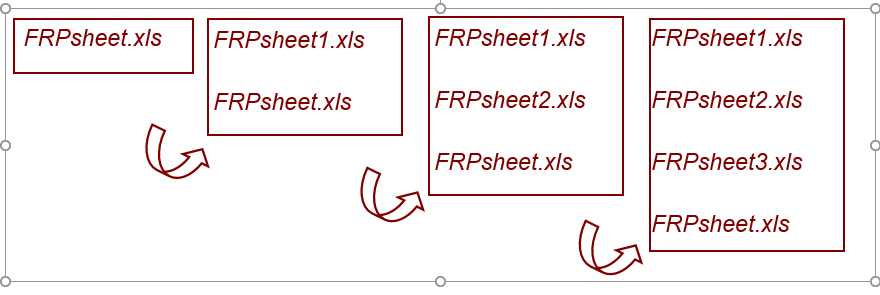

<div class="language-switch">[English](lab-orientation.qmd) | **한글**</div>

# 구조공학 및 역학연구실

고려대학교 **구조공학 및 역학연구실(Structural Engineering and Mechanics Laboratory, SEM Lab)**은 **응용역학(applied mechanics)**을 바탕으로 다양한 길이 척도의 구조시스템을 개발하고 해석한다.

우리가 다루는 구조시스템은 전체 구조물에서 시작해 구조부재로, 다시 재료 수준까지 내려갈 수 있다.

$$
\text{구조물}
\;\longleftrightarrow\;
\text{부재}
\;\longleftrightarrow\;
\text{재료}.
$$

크기는 달라져도 생각하는 방식은 같다. **계산이나 실험 결과를 믿기 전에, 그 시스템을 지배하는 역학을 먼저 이해한다.**

현재 연구실의 연구는 크게 네 분야로 나뉜다.

## 주요 연구 분야

### 해양구조물과 해상풍력

고정식 및 부유식 **해상풍력 하부구조물**을 연구한다. 구조해석뿐 아니라 운송·설치(transportation and installation, T&I), 새로운 구조형식의 개발에도 관심을 둔다.

이미 존재하는 구조형식을 해석하는 데 그치지 않는다. 해상풍력이 던지는 공학적 문제에 대응할 수 있는 **새롭고, 경우에 따라서는 기존 개념을 크게 바꿀 수 있는 구조시스템**을 만드는 것도 중요한 목표다. 이를 위해 구조역학만 보는 것이 아니라 유체역학, 기초, 계류시스템, 제작, 운송, 설치, 운영을 함께 생각해야 한다. 특정 해석 프로그램 하나에 의존하기보다, 풀어야 할 공학 문제에 따라 여러 계산·실험 도구를 사용한다.

이 연구는 국내 엔지니어링 실무와도 밀접하게 연결되어 있다. 지광습 교수는 **대한토목학회(KSCE)** 해상풍력 및 플랜트 관련 전문위원회를 이끌고 있으며, 국내 해상풍력 하부구조물 설계·시공지침 작성에도 주저자로 참여해 왔다. 연구와 기준·실무의 접점에 있으면 학술적으로 흥미로운 문제뿐 아니라 실제 설계와 시공에서 무엇이 필요한지도 볼 수 있다.

따라서 우리에게 해상풍력공학은 단순히 환경하중을 받는 구조물을 해석하는 문제가 아니다. **역학, 구조혁신, 해석, 시공, 엔지니어링 실무가 만나는 문제**다.

### 건설기준의 디지털 전환

AI 시대가 되면서 **설계·시공기준의 디지털 전환**은 점점 중요한 문제가 되고 있다.

기존 기준은 기본적으로 사람이 읽도록 작성된 문서다. 그러나 AI와 계산 시스템이 공학기준을 사용하려면 요구사항을 기계가 안정적으로 검색하고 해석하고 적용할 수 있는 형태로 표현해야 한다. 그래서 기존 설계·시공기준을 사람이 읽는 문서로 유지하면서도 **구조화되고 기계가 접근할 수 있는 공학지식**으로 바꾸는 방법을 연구한다.

여기서 중요한 목표는 AI가 근거 없이 내용을 생성하거나 환각(hallucination)에 의존하지 않고 **정확한 공학 요구사항에 도달하도록 하는 것**이다. 이를 위해 구조화된 기준 데이터를 구축하고, 적용해야 할 조항에 결정론적으로 접근할 수 있는 AI 활용 프레임워크를 개발해 왔다. 단순히 언어모델에게 기준서를 읽으라고 시키는 것이 아니다. AI가 권위 있는 공학 요구사항으로 안내되도록 정보구조 자체를 만드는 것이 핵심이다.

이 구조는 **자동 적합성 검토(Automatic Compliance Check, ACC)**, BIM 기반 설계검토, 공학지식 검색, 나아가 AI 지원 설계와 최적화의 기반이 된다.

이 연구는 보다 넓게는 **AX(AI Transformation)**의 한 방향이며, 국토교통부의 건설기준 디지털 전환 방향과도 밀접하게 연결되어 있다.

결국 질문은 이것이다.

> **사람을 위해 쓰인 공학지식을 어떻게 바꾸어야 엔지니어와 AI가 같은 권위 있는 기준을 함께 신뢰하고 사용할 수 있을까?**

### 콘크리트, 재료와 열화

현재는 **콘크리트와 콘크리트 구조물의 복합열화**를 중점적으로 연구한다.

콘크리트 열화는 하나의 독립된 현상만으로 진행되는 경우가 드물다. 수분과 유해물질의 이동, 화학반응, 미세구조의 변화, 역학적 손상과 균열이 서로 영향을 준다. 손상이 물질 이동 특성을 바꾸고, 그 결과 화학적·물리적 열화가 더 빨라질 수도 있다. 결국 본질적으로 연성된(coupled) 문제다.

이러한 상호작용을 정량적으로 설명하기 위해 **화학-역학 연성모델과 계산모델**을 개발한다. 물질이동과 반응, 미세구조 변화, 손상과 균열, 탄산화와 같은 환경 열화에 수반되는 역학이 주요 관심사다.

이론 연구와 함께 실험 및 재료 연구도 수행한다. 폐유리와 같은 폐기물을 활용한 고성능 콘크리트, 특히 제설염 등 가혹한 환경에 대한 저항성을 높이기 위한 재료도 연구해 왔다. 재료 수준에서 관찰한 현상을 구조물 수준의 열화와 연결하는 것이 중요한 연구 방향이다.

과거에는 **콘크리트의 이축강도**와 같은 주제도 연구했다. 이는 현재의 주된 연구방향이라기보다 연구실이 축적해 온 연구의 한 부분이다.

지금의 질문은 더 넓다.

> **화학, 물질이동, 재료와 역학 현상의 상호작용이 콘크리트 구조물의 장기 성능을 어떻게 결정하는가?**

### 계산역학과 파괴

계산역학은 간단한 폐쇄형 해만으로 충분히 이해하기 어려운 구조 및 재료 거동을 연구할 수 있게 해준다.

우리 연구실에서는 파괴·손상역학, 비선형해석, enriched finite element 및 meshfree 방법, 다중균열 표현, 구조시스템의 수치해석 등을 연구해 왔다. 이러한 방법은 재료의 파괴에서 대형 구조시스템까지 서로 다른 길이 척도에 적용된다.

하지만 계산모델을 복잡하게 만드는 것 자체가 목표는 아니다. 계산모델은 현상을 설명하는 데 필요한 역학을 포함해야 하며, 동시에 해석 가능하고 검증 가능하며 계산적으로 의미가 있어야 한다.

그래서 계산연구에서도 한 가지 원칙을 중요하게 생각한다.

> **계산으로 역학을 드러내라. 계산 뒤에 역학을 숨기지 마라.**

# 연구란 무엇인가?

연구는 논문, 그래프, 시뮬레이션 결과나 실험 데이터를 만들어내는 일만은 아니다. 의미 있는 질문을 던지고, 이미 알려진 것을 찾아보고, 설명이나 모델을 만들고, 그것을 검증하고, 실패에서 배우고, 알아낸 것을 다른 사람에게 전달하는 과정이 반복되는 일이다.

연구를 하나의 순환으로 생각해 볼 수 있다.

$$
\text{질문}
\rightarrow
\text{학습}
\rightarrow
\text{모델 또는 실험}
\rightarrow
\text{증거}
\rightarrow
\text{해석}
\rightarrow
\text{새로운 질문}.
$$

물론 실제 연구는 이렇게 한 방향으로 매끈하게 흘러가지 않는다. 결과를 보고 가정을 다시 생각하기도 하고, 실험이 모델의 약점을 드러내기도 한다. 계산을 하다가 처음에는 생각하지 못했던 질문을 발견하기도 한다.

## 까마귀와 물병

{#fig-crow-ko fig-align="center" width="85%"}

우리 연구실 오리엔테이션에서 오래전부터 사용해 온 비유가 **까마귀와 물병**이다. 까마귀의 부리는 물에 닿지 않는다. 그래서 돌을 하나씩 물병에 넣어 물의 높이를 올린다.

여기서 중요한 것은 까마귀가 사용한 바로 그 방법이 아니다. 연구자는 **당장 풀 수 없어 보이는 문제를 풀 수 있는 문제로 바꾸는 능력**을 길러야 한다.

처음 연구를 시작하면 경험 많은 연구자에게 정답이나 비법을 배우고 싶어진다. 하지만 연구훈련의 목적은 최종 비법을 전달받는 것이 아니라, 그 방법을 스스로 찾아낼 수 있게 되는 것이다.

# 수면 위와 아래의 연구자

성공한 연구자를 보면 논문, 인용, 전문성, 자신감, 리더십, 명성과 같이 밖으로 드러난 성과가 먼저 보인다.

하지만 그 성과를 만드는 대부분의 일은 보이지 않는다. 논문과 책 읽기, 프로그래밍, 실험, 실패한 계산, 데이터 처리, 그림 만들기, 연구제안서, 문서화, 의사소통, 사소해 보이는 기술의 습득, 그리고 결국 논문으로 이어지지 않은 시도까지 모두 여기에 들어간다.

이것이 **연구의 빙산**이다.

{#fig-iceberg-ko fig-align="center" width="85%"}

> **연구역량의 대부분은 수면 아래에서 만들어진다.**

하루 동안 최종 결과가 나오지 않았다고 해서 그날의 연구가 가치 없었던 것은 아니다. 다만 보이지 않는 노력도 결국은 이해, 재현 가능한 증거, 그리고 유용한 연구성과로 축적되어야 한다.

# 기초를 단단히 하라

## 문제를 역학으로 보라

SEM Lab에서 중요하게 생각하는 원칙은 간단하다.

> **어떤 공학 문제든 먼저 역학으로 보려고 하라.**

구조역학, 재료역학, 연속체역학, 탄성론, 동역학, 파괴역학과 자신의 연구에 필요한 수학적 기초를 단단히 해야 한다.

소프트웨어는 답을 계산해 준다. **그 답이 말이 되는지는 역학이 판단해 준다.**

낯선 문제를 만나면 이런 질문을 해보자.

- 어떤 힘과 경계조건이 중요한가?
- 무엇이 평형을 만족해야 하는가?
- 운동학적으로 어떤 변형이 가능한가?
- 응력과 변형률을 연결하는 구성관계는 무엇인가?
- 에너지는 어디에 저장되고, 소산되고, 전달되는가?
- 어떤 길이 척도와 시간 척도가 현상을 지배하는가?

콘크리트 미세구조를 보든, 전파하는 균열을 보든, 해상풍력 하부구조물을 보든, 디지털 공학모델을 보든 이 질문들은 여전히 유효하다.

## 논문과 책을 읽어라

필요한 답 하나를 검색하는 것으로 읽기를 대신할 수는 없다. 논문을 읽으면 현재 연구에서 질문을 어떻게 만드는지 볼 수 있고, 책을 읽으면 개별 논문이 당연하다고 가정하고 넘어가는 더 깊은 구조를 배울 수 있다.

당장 해결해야 할 문제가 생겼을 때만 읽지 말고, 읽는 것 자체를 연구의 일상적인 과정으로 만들어야 한다.

## 다른 사람에게 배워라

같은 분야의 연구자뿐 아니라 다른 분야의 사람들과도 이야기하라. 같은 문제를 다른 방향에서 보는 사람에게서 의외로 좋은 아이디어가 나오는 경우가 많다.

스승은 지도교수나 자기 대학에만 있는 것이 아니다.

# 도구를 익혀라—하지만 도구를 연구와 혼동하지 마라

연구에는 많은 도구가 필요하다. 글쓰기, 데이터 처리, 실험, 문헌검색, 그림, 의사소통, 프로그래밍, 시뮬레이션, 아이디어 정리, 데이터 관리가 모두 연구의 도구다.

{#fig-tools-ko fig-align="center" width="90%"}

도구를 능숙하게 사용할 줄 알아야 한다. 더 중요한 것은 필요한 도구를 골라 효율적으로 조합할 줄 아는 것이다.

> **도구는 연구를 가능하게 한다. 그러나 어떤 질문이 연구할 가치가 있는지는 도구가 결정하지 않는다.**

아무리 정교한 시뮬레이션도 잘못 설정된 연구질문을 구해주지 못한다. 데이터가 아무리 많아도 물리적 해석을 대신하지 못한다.

# 효율적으로 일하라

연구를 하다 보면 놀랄 만큼 반복적인 일이 많다. 불필요한 반복은 가능한 한 줄여야 한다.

스크립트, 함수, 매크로, 재사용 가능한 plotting routine, 문서 template, 자동화 workflow를 활용하라. 일을 시작하기 전에 순서를 생각하라. 협업이 중복을 줄이거나 서로 다른 전문성을 실제로 결합할 수 있다면 적극적으로 협업하라.

우리 연구실 오리엔테이션에서 예전부터 쓰던 표현이 있다.

> **Use your nut, not the muscle.**

도구는 많이 바뀌었다. 예전의 office macro와 spreadsheet function에서 Python, Git, LaTeX, 자동화 pipeline, AI까지 왔다. 그래도 원칙은 같다. **체계화하고 재현 가능하게 만들 수 있는 일을 계속 손으로 반복하지 마라.**

연구실에서 만든 template이 다른 사람의 시간을 절약할 수 있다면 공유한다. 공통 도구나 template을 개선했다면 다음 사람이 그 개선을 다시 사용할 수 있게 만들어야 한다.

# 연구자료를 지켜라

연구자료는 한 번 잃으면 다시 만들기 어렵거나 불가능할 수 있다. 그만큼 제대로 보호해야 한다.

중요한 연구자료는 여러 곳에 백업한다. 원자료와 처리된 데이터를 분리한다. 그림과 결론을 재현하는 데 필요한 정보를 보존한다. 공유자료나 서버자료를 함부로 삭제하지 않는다.

예를 들어 현대적인 연구 프로젝트는 다음처럼 구성할 수 있다.

```text
project-name/
├── README.md
├── references/
├── data/
│   ├── raw/
│   └── processed/
├── code/
├── experiments/
├── models/
├── figures/
├── presentations/
└── papers/
```

프로젝트에 따라 실제 폴더 이름은 달라질 수 있다. 중요한 것은 이름이 아니라 원칙이다. **다른 사람—그리고 몇 달 뒤의 나 자신—이 이 파일들이 무엇인지 이해할 수 있어야 한다.**

프로젝트 폴더에는 목적, 중요한 파일, 주요 가정, 현재 상태를 적은 짧은 README나 이에 해당하는 기록을 남기는 것이 좋다.

{#fig-directory-ko fig-align="center" width="85%"}

## 파일 이름: 현재 파일에는 번호를 붙이지 않는다

계속 수정되는 파일에 대해 SEM Lab에서는 오래전부터 간단한 원칙을 사용해 왔다.

> **현재 사용하는 파일은 기본 이름을 유지하고, 과거 버전에 번호를 붙인다.**

예를 들어 현재 작업파일이 `FRPsheet.xls`라면 첫 번째 수정본을 `FRPsheet1.xls`로 만드는 것이 아니다. 기존 `FRPsheet.xls`를 `FRPsheet1.xls`로 보관하고, 새 현재 파일은 다시 `FRPsheet.xls`라는 이름을 사용한다. 수정할 때마다 같은 방식으로 반복한다.

```text
현재:
FRPsheet.xls

한 번 수정한 뒤:
FRPsheet1.xls   <- 이전 버전
FRPsheet.xls    <- 현재 버전

세 번 수정한 뒤:
FRPsheet1.xls
FRPsheet2.xls
FRPsheet3.xls   <- 현재 파일의 바로 이전 버전
FRPsheet.xls    <- 현재 버전
```

즉 번호는 **현재 파일이 아니라 이력(history)**에 붙는다. 어느 순간이든 번호가 없는 파일이 지금 사용할 파일이고, 가장 큰 번호가 붙은 파일이 그 직전 버전이다.

{#fig-filename-ko fig-align="center" width="95%"}

### 왜 `final`을 쓰지 않는가?

흔히 다음과 같은 이름이 생긴다.

```text
FRPsheet-final.xls
FRPsheet-final-real.xls
FRPsheet-final-realfinal.xls
FRPsheet-final-last.xls
```

문제는 *final*이라는 말이 더 이상 어느 파일이 진짜 현재 파일인지, 어느 것이 바로 이전 파일인지 알려주지 못한다는 것이다. 번호 없는 현재 파일 규칙을 쓰면 두 질문에 바로 답할 수 있다.

```text
FRPsheet.xls     = 지금 사용할 파일
FRPsheet3.xls    = 바로 이전 버전
```

### 큰 프로젝트에서는 왜 안정된 파일명이 중요한가?

여러 파일이 하나의 시스템을 이루는 프로젝트에서는 이 규칙이 더 유용하다. 예를 들어 LaTeX 프로젝트에는 다음 파일들이 있을 수 있다.

```text
paper.tex
commands.tex
tables.tex
references.bib
```

프로그램도 마찬가지다.

```text
main.py
solver.py
material.py
postprocess.py
```

이 파일들은 서로를 참조한다. 현재 파일의 이름이 수정할 때마다 바뀌면 reference, import, script, build command와 연결된 다른 파일까지 바꿔야 할 수 있다. 현재 사용 중인 파일명을 고정하면 버전 정보가 프로젝트 전체로 불필요하게 전파되는 것을 막을 수 있다.

예를 들어 LaTeX master file은 과거 `commands.tex`나 `tables.tex`가 몇 개 쌓였는지와 관계없이 항상 다음과 같이 쓸 수 있다.

```latex
\input{commands.tex}
\input{tables.tex}
```

프로그램도 `solver.py`를 계속 import할 수 있다. `solver.py`는 항상 **현재 프로젝트에서 사용하는 버전**이라는 뜻이기 때문이다.

핵심적인 구분은 간단하다.

```text
기본 파일명       -> 기능적 정체성: 프로젝트가 지금 사용하는 파일
번호가 붙은 파일명 -> 역사적 정체성: 과거 버전이 이력에서 차지하는 위치
```

이 방식은 spreadsheet, CAD file, presentation, proprietary engineering file처럼 과거 사본을 명시적으로 보관하는 것이 편리한 파일에 특히 유용하다. source code나 text document에는 Git이 훨씬 강력한 이력관리를 제공하지만 기본 원칙은 여전히 의미가 있다. **실제 작업 프로젝트는 `final`, `real-final`과 같은 임시적인 생각을 파일명에 넣기보다 안정된 현재 파일명을 참조해야 한다.**

> **현재 파일명은 고정하라. 버전 정보는 지금 쓰는 파일이 아니라 과거 파일에 붙여라.**

백업과 버전 이력은 서로 다른 문제를 해결한다. 중요한 연구라면 둘 다 필요할 수 있다.

> **결과를 다시 만들어낼 수 없다면 아직 신뢰할 수 있는 연구결과가 아니다.**

# 자기 연구의 주인이 되어라

SEM Lab에서 프로젝트를 배정하는 기본 원칙은 학생이 맡은 연구문제를 점차 독립적으로 수행할 수 있게 되는 것이다. 물론 큰 프로젝트라면 여러 연구자가 함께 일할 수 있다.

프로젝트를 맡는다는 것은 내용을 이해하고, 일을 계획하고, 문제가 생기면 알리고, 연구를 앞으로 움직일 책임을 맡는다는 뜻이다. 연구방향이 바뀌거나, 다른 프로젝트가 학생의 배경에 더 적합하거나, 역할을 재조정할 필요가 있으면 프로젝트 배정도 달라질 수 있다.

지도교수는 방향을 제시하고, 가정을 의심하게 하고, 방법을 제안하고, 장애물을 해결하는 데 도움을 줄 수 있다. 하지만 연구자가 성장할수록 연구에 대한 지적 주도권은 점점 본인에게 넘어가야 한다.

> **주어진 일을 소유하지 말고, 문제 자체의 주인이 되어라.**

## 시간을 관리하라

연구를 위한 시간을 따로 확보해야 한다. 회의, 수업, 행정업무와 마감은 가만히 두어도 달력을 채운다. 깊이 생각해야 하는 연구시간은 남는 틈에 저절로 생기지 않는다.

신뢰할 수 있고 전문적인 업무습관을 유지하되, 연구에 대한 헌신을 겉으로 바빠 보이는 정도로 판단해서는 안 된다. 지속적으로 생각하고 책임지는지가 더 중요하다.

모르는 것을 모른다고 말하는 것은 괜찮다. 다만 보통 그 다음 문장이 따라와야 한다.

> **아직 모릅니다. 알아보겠습니다.**

# 연구실은 함께 일하는 곳이다

연구실에는 개인 논문이나 학위논문에 속하지 않는 공동의 일도 있다. 공용 자원을 관리하고, 활동을 조직하고, 프로젝트 정보를 공유하고, 실무적인 문제를 해결해야 한다.

## 랩 매니저

랩 매니저는 연구실의 공동 업무를 조정하고 필요한 경우 역할을 나눈다. 반드시 가장 선임 학생이 맡아야 하는 것은 아니다.

조정 업무 자체에도 상당한 시간이 들어간다. 다른 구성원은 이 역할을 존중하고 불필요하게 매니저의 일을 늘리지 않아야 한다. 공동의 일을 각자가 책임 있게 처리해야 연구실이 제대로 돌아간다.

## 협업

내가 가진 지식으로 다른 구성원의 불필요한 시행착오를 줄일 수 있다면 도와준다. 다시 필요할 가능성이 있는 해결방법은 기록해 둔다.

그러나 협업이 자기 연구에 대한 지적 책임까지 다른 사람에게 넘긴다는 뜻은 아니다. 다른 사람에게 배우되, 자신의 모델, 데이터, 가정과 결론은 스스로 이해해야 한다.

# 글쓰기도 연구다

계산이 끝났거나 실험이 끝났다고 연구가 끝난 것은 아니다. 결과를 해석하고 다른 사람에게 전달해야 한다.

우리 연구실 오리엔테이션에서 오래전부터 강조해 온 원칙이 있다.

> **논문 출판은 연구의 마지막 단계다.**

글을 쓰다 보면 실제 연구질문이 무엇이었는지 분명해지고, 증거와 해석을 구분하게 되고, 논리에서 빠진 부분이 드러나며, 이 결과가 무엇을 새롭게 말하는지 결정하게 된다.

영어로 기술적인 내용을 독립적으로 작성할 수 있는 능력을 길러야 한다. 지도교수와 공동연구자는 논문을 개선할 수 있지만, 연구자가 자신의 연구를 설명해야 할 책임 자체를 대신할 수는 없다.

좋은 논문이라면 독자가 다음 질문에 답할 수 있어야 한다.

1. 어떤 공학적 질문을 던졌는가?
2. 왜 중요한가?
3. 답을 얻기 위해 무엇을 했는가?
4. 어떤 증거를 얻었는가?
5. **왜 이 결과가 공학적으로 말이 되는가?**
6. 이 결과로 무엇을 말할 수 있고, 무엇은 말할 수 없는가?

# 저자라는 것은 기여와 책임을 뜻한다

프로젝트에 참여했다는 사실만으로 저자가 되는 것은 아니다. 저자됨(authorship)은 연구의 지적 내용이나 수행에 실질적으로 기여했고, 그 결과로 출판되는 연구에 책임을 진다는 뜻이어야 한다.

제1저자는 일반적으로 연구를 주도하고 논문의 구성과 작성에 크게 기여한다. 교신저자는 연구와 출판과정에 대한 책임을 반영하며, 실제 연구 및 지도 역할에 따라 결정한다.

> **저자는 단순한 참여가 아니라 기여와 책임을 반영한다.**

여러 연구자가 함께 참여한다면 구체적인 저자 문제는 가능한 한 초기에 논의하는 것이 좋다.

# 연구지원과 책임

학생의 지원은 연구과제, 교육조교, 장학금 또는 기타 대학 제도를 통해 이루어질 수 있다. 지원의 형태와 수준은 과제, 역할, 연구비 조건과 대학 정책에 따라 달라질 수 있다.

연구과제의 지원을 받는 학생은 해당 과제의 목표와 업무에 실질적으로 기여해야 한다. 교육조교 역시 학부교육을 지원하는 데 따르는 책임이 있다.

# SEM Lab에 합류하려면

역량 있고 동기부여된 학생과 연구자는 이 모든 연구활동에 필수적이다. SEM Lab은 공학 문제를 깊이 이해하는 능력을 키우고 책임 있게 연구에 기여하고 싶은 사람에게 열려 있다.

우리 연구실의 네 가지 주요 연구분야는 다음과 같다.

- **해양구조물과 해상풍력**
- **건설기준의 디지털 전환**
- **콘크리트, 재료와 열화**
- **계산역학과 파괴**

연구실 합류 또는 공동연구에 관심이 있다면 **지광습** 교수에게 [g-zi@korea.ac.kr](mailto:g-zi@korea.ac.kr)로 연락하면 된다.

연구실에 관한 자세한 정보는 [구조공학 및 역학연구실 홈페이지](https://structure.korea.ac.kr)에서 확인할 수 있다.

# 기억할 원칙

도구와 프로젝트, 연구주제는 계속 바뀔 것이다. 하지만 연구하는 기본 습관은 쉽게 바뀌지 않는다.

> **역학을 배워라. 문제의 주인이 되어라. 도구를 잘 써라. 연구자료를 지켜라. 그리고 왜 그 결과가 공학적으로 말이 되는지 설명하라.**
