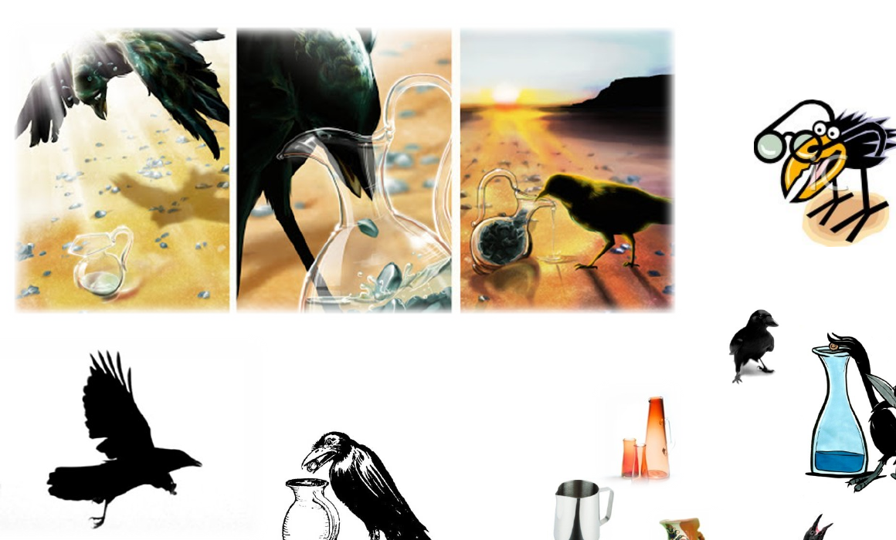
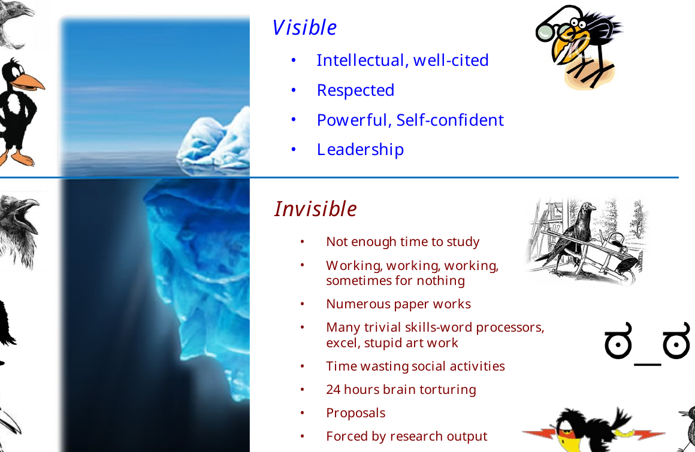
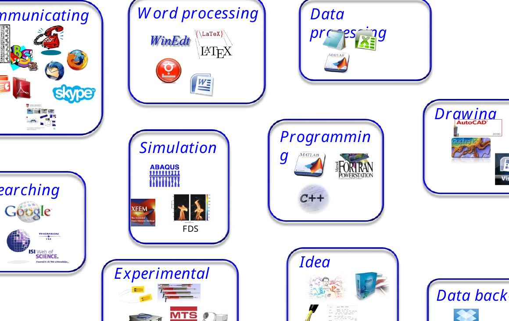
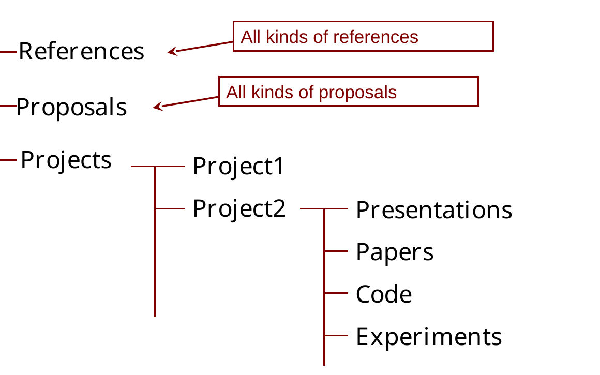

<div class="language-switch">**English** | [한글](lab-orientation-ko.qmd)</div>

# Structural Engineering and Mechanics Laboratory

The **Structural Engineering and Mechanics Laboratory (SEM Lab)** at Korea University applies **applied mechanics** to the development and analysis of structural systems across different length scales.

The structural system of interest may therefore range from a complete structure to a structural member and further down to the material scale:

$$
\text{Structures}
\;\longleftrightarrow\;
\text{Members}
\;\longleftrightarrow\;
\text{Materials}.
$$

The scale changes, but the central habit of thought remains the same: **understand the mechanics governing the system before relying on a computational or experimental result.**

Our current research is organized around four major areas.

## Our Research Areas

### Offshore Structures and Offshore Wind

We study **fixed and floating offshore wind energy substructures**, with particular emphasis on structural analysis, transportation and installation (T&I), and the development of new structural concepts.

Our interest is not limited to analyzing existing structural types. An important objective is to develop **new and potentially revolutionary structural systems** that respond to the engineering challenges of offshore wind energy. This requires us to consider structural mechanics together with hydrodynamics, foundations, mooring systems, fabrication, transportation, installation, and operation. We use various computational and experimental tools depending on the engineering problem rather than relying on a single analysis platform.

Our work is also closely connected to the development of engineering practice in Korea. Prof. Goangseup Zi leads a specialized committee of the **Korean Society of Civil Engineers (KSCE)** for offshore wind energy and plants and has served as a principal author of Korean design and construction guidelines for offshore wind energy substructures. This interaction between research and engineering standards helps us identify problems that matter not only academically but also in actual design and construction.

For us, offshore wind engineering is therefore more than the analysis of structures under environmental loads. It connects **mechanics, structural innovation, analysis, construction, and engineering practice**.

### Digital Transformation of Construction Standards

The **digital transformation of design and construction standards** is becoming increasingly important as engineering enters the AI era.

Conventional standards are primarily documents written for human readers. AI and computational engineering systems, however, require engineering requirements to be represented in forms that machines can retrieve, interpret, and apply reliably. Our research therefore investigates how conventional design and construction standards can be transformed into **structured, machine-accessible engineering knowledge** while preserving the documents required by human engineers.

A central objective is to build standard-code data that allows AI to reach the correct engineering requirements **without relying on unsupported generation or hallucination**. In our work, we have developed structured standard-code data and an AI-accessible framework designed to provide deterministic access to the applicable provisions. The goal is not simply to ask a language model to read a standard, but to construct an information architecture in which the AI is guided to the authoritative engineering requirement.

This provides a foundation for **Automatic Compliance Check (ACC)**, BIM-based design checking, engineering knowledge retrieval, and ultimately AI-assisted design and optimization.

Our work in this area is part of a broader **AX (AI Transformation)** direction and is closely aligned with the digital transformation objectives of the Korean **Ministry of Land, Infrastructure and Transport (MOLIT)**.

The broader engineering question is:

> **How can engineering knowledge written for humans be transformed so that both engineers and AI can use the same authoritative standards reliably?**

### Concrete, Materials, and Deterioration

Our current research focuses on the **combined deterioration of concrete and concrete structures**.

Concrete deterioration is rarely governed by a single isolated mechanism. Transport of moisture and aggressive substances, chemical reactions, changes in microstructure, mechanical damage, and cracking interact with one another. Damage may alter transport properties, which can accelerate further chemical or physical deterioration. The problem is therefore inherently coupled.

We develop **chemo-mechanical and computational models** for quantitatively describing these interactions. Particular interests include transport and reaction processes, microstructural evolution, damage and cracking, and the mechanics associated with environmental deterioration such as carbonation.

Experimental and material research complements this theoretical work. We have investigated high-performance concrete incorporating waste materials such as waste glass, including materials intended to improve resistance to aggressive environments involving deicing salts. Connecting material-scale observations with structural-scale deterioration is an important part of this research direction.

The laboratory has also conducted earlier research on topics such as the **biaxial strength of concrete**. That work forms part of our research history rather than our present principal research direction.

Our current emphasis is broader:

> **How do interacting chemical, transport, material, and mechanical processes determine the long-term performance of concrete structures?**

### Computational Mechanics and Fracture

Computational mechanics provides methods for studying structural and material behavior that cannot be understood adequately through simple closed-form models alone.

Our research has included fracture and damage mechanics, nonlinear analysis, enriched finite-element and meshfree methods, multiple-crack representation, and numerical methods for structural systems. These methods have been applied across different length scales, from material fracture to large structural systems.

The objective, however, is not merely to make a numerical model more sophisticated. A computational model should contain the mechanics necessary to explain the phenomenon while remaining interpretable, verifiable, and computationally meaningful.

This leads to a principle that applies throughout our computational research:

> **Use computation to reveal mechanics, not to hide it.**

# What Is Research?

Research is not simply the production of papers, graphs, simulations, or experimental data. It is a repeated process of asking a meaningful question, finding what is already known, constructing an explanation or model, testing it, learning from failure, and communicating what has been learned.

A useful way to think about research is as a cycle:

$$
\text{Question}
\rightarrow
\text{Study}
\rightarrow
\text{Model or Experiment}
\rightarrow
\text{Evidence}
\rightarrow
\text{Interpretation}
\rightarrow
\text{New Question}.
$$

The cycle rarely proceeds perfectly in one direction. Results force us to reconsider assumptions. Experiments expose weaknesses in models. Computations reveal questions that were not obvious at the beginning.

## The Crow and the Pitcher

{fig-align="center" width="85%"}


A long-standing metaphor in our lab orientation is **the crow and the pitcher**. The crow cannot simply reach the water. It changes the problem by repeatedly dropping stones into the pitcher until the water rises.

The lesson is not the particular trick used by the crow. The important lesson is that a researcher must learn how to **change an apparently inaccessible problem into one that can be solved**.

A student may initially want to learn the final trick from an experienced researcher. Research training is different. The objective is to develop the ability to find the trick independently.

# The Researcher Above and Below the Waterline

Successful researchers are often seen through their visible achievements: papers, citations, expertise, confidence, leadership, and recognition.

Much of the work that creates those achievements is invisible. It includes reading, programming, experiments, failed calculations, data processing, figure preparation, proposals, documentation, communication, learning small technical skills, and sometimes pursuing an approach that ultimately produces no publishable result.

This is the **iceberg of research**.

{fig-align="center" width="85%"}

> **Research competence is built mostly below the waterline.**

Do not judge the value of a day only by whether it produced a final result. At the same time, invisible effort must gradually accumulate into understanding, reproducible evidence, and useful research output.

# Build a Strong Foundation

## See Problems Through Mechanics

A central principle of SEM Lab is simple:

> **Try to see every engineering problem through mechanics first.**

Strengthen your foundation in structural mechanics, mechanics of materials, continuum mechanics, elasticity, dynamics, fracture, and the mathematical tools required by your research.

Software can calculate a result. Mechanics helps you decide whether the result is plausible.

When you encounter an unfamiliar problem, ask questions such as:

- What are the relevant forces and boundary conditions?
- What must satisfy equilibrium?
- What deformation is kinematically possible?
- What constitutive behavior connects stress and strain?
- Where is energy stored, dissipated, or transferred?
- What length and time scales govern the phenomenon?

These questions remain useful whether the problem involves a concrete microstructure, a propagating crack, an offshore wind substructure, or a digital engineering model.

## Read Papers and Books

Reading cannot be replaced by searching for isolated answers. Papers show how current research questions are framed; books provide the deeper structure that individual papers often assume.

Make reading a routine part of research rather than something done only when an immediate problem appears.

## Learn from Other People

Talk to researchers in your own field and in other fields. A useful idea often arrives from a person who approaches the same problem from a different direction.

Your teachers are not limited to your advisor or your university.

# Learn the Tools—but Do Not Confuse Tools with Research

Research requires many tools: writing, data processing, experiments, literature search, drawing, communication, programming, simulation, idea development, and data management.

{fig-align="center" width="90%"}

Become competent with them. More importantly, learn to select and combine them efficiently.

> **Tools make research possible. They do not decide what question is worth asking.**

A sophisticated simulation cannot rescue a poorly posed research question, and a large dataset cannot replace physical interpretation.

# Work Efficiently

Research contains a surprising amount of repetitive work. Reduce unnecessary repetition whenever possible.

Use scripts, functions, macros, reusable plotting routines, document templates, and automated workflows. Plan the order of tasks before starting them. Collaborate when collaboration genuinely reduces duplication or brings complementary expertise.

A traditional phrase in our lab orientation was:

> **Use your nut, not the muscle.**

The tools have changed—from office macros and spreadsheet functions to Python, Git, LaTeX, automated pipelines, and AI—but the principle has not. **Do not repeatedly perform by hand what can be made systematic and reproducible.**

Templates developed in the laboratory should be shared when they can save other members time. If you improve a common tool or template, make the improvement reusable by the next person.

# Protect Your Research

Research data are difficult or impossible to recreate once lost. Protect them accordingly.

Keep multiple backups of important research material. Separate original data from processed data. Preserve the information required to reproduce figures and conclusions. Do not casually delete shared or server data.

A useful modern project structure is, for example:

```text
project-name/
├── README.md
├── references/
├── data/
│   ├── raw/
│   └── processed/
├── code/
├── experiments/
├── models/
├── figures/
├── presentations/
└── papers/
```

The exact folders depend on the project. The principle is more important than the names: **someone—including your future self—should be able to understand what the files mean.**

Keep a short README or equivalent note in a project folder describing its purpose, important files, assumptions, and current status.

{fig-align="center" width="85%"}

## File Naming: Keep the Current File Number-Free

For files that are revised repeatedly, SEM Lab has traditionally used one simple rule:

> **The current file keeps the base name. Older versions receive numbers.**

For example, if the working file is `FRPsheet.xls`, the first revision does **not** become `FRPsheet1.xls`. Instead, the old `FRPsheet.xls` is archived as `FRPsheet1.xls`, and the new current file again takes the name `FRPsheet.xls`. The same operation is repeated at every revision.

```text
Current:
FRPsheet.xls

After one revision:
FRPsheet1.xls   <- previous version
FRPsheet.xls    <- current version

After three revisions:
FRPsheet1.xls
FRPsheet2.xls
FRPsheet3.xls   <- most recent version before the current one
FRPsheet.xls    <- current version
```

The numbering therefore belongs to the **history**, not to the current file. At any time, the file without a number is the file to use now, while the file with the highest number is the version immediately preceding it.

{fig-align="center" width="95%"}

### Why not use `final`?

A common alternative eventually produces names such as:

```text
FRPsheet-final.xls
FRPsheet-final-real.xls
FRPsheet-final-realfinal.xls
FRPsheet-final-last.xls
```

Such names become ambiguous because words such as *final* no longer tell us which file is actually current or which one immediately preceded it. The number-free-current convention answers both questions immediately:

```text
FRPsheet.xls     = use this file now
FRPsheet3.xls    = the immediately previous version
```

### Why stable filenames matter in a large project

The convention becomes especially useful when many files form one working system. A LaTeX project, for example, may contain:

```text
paper.tex
commands.tex
tables.tex
references.bib
```

and a program may contain:

```text
main.py
solver.py
material.py
postprocess.py
```

These files refer to one another. If the name of the current file changes every time it is revised, references, imports, scripts, build commands, or other dependent files may also have to be changed. Keeping the live filename stable avoids this unnecessary propagation of version information through the project.

For example, a LaTeX master file can always contain:

```latex
\input{commands.tex}
\input{tables.tex}
```

regardless of how many historical copies of `commands.tex` or `tables.tex` have accumulated. Similarly, a program can continue to import `solver.py` because `solver.py` always means **the version currently used by the project**.

The underlying distinction is simple:

```text
base filename      -> functional identity: what the project uses now
numbered filename  -> historical identity: where an old version sits in the history
```

This convention is particularly useful for spreadsheets, CAD files, presentations, proprietary engineering files, and other files for which explicit archived copies are convenient. Git provides a more powerful history for source code and text-based documents, but the same design principle remains valuable: **the working project should refer to stable current filenames rather than filenames that encode temporary ideas such as `final` or `real-final`.**

> **Keep the current filename stable. Put version information on the old files, not on the file the project currently uses.**

Backups and version history solve different problems. Important research work may need both.

> **If a result cannot be reconstructed, it is not yet a reliable research result.**

# Take Ownership of Your Project

The general principle of project assignment in SEM Lab is that a student should progressively become capable of working independently on an assigned research problem. Large projects may naturally require several researchers.

Receiving a project means accepting responsibility for understanding it, planning the work, reporting problems, and moving it forward. Project assignments may change when the research direction changes, when another project better matches a student's background, or when responsibilities need to be reorganized.

Your advisor can define a direction, challenge an assumption, suggest a method, or help remove an obstacle. The intellectual ownership of your research should nevertheless increase as you develop.

> **Take ownership of the problem, not merely ownership of the assigned task.**

## Manage Your Time

Set aside protected time for research. Meetings, classes, administrative tasks, and deadlines will naturally fill a calendar. Research requiring concentrated thought rarely appears automatically in the remaining gaps.

Maintain a reliable and professional working routine, but judge research commitment by sustained intellectual engagement and responsibility rather than by visible busyness alone.

When you do not know something, saying so is appropriate—but it should normally be followed by investigation:

> **I do not know yet. I will find out.**

# Working as a Laboratory

A laboratory also has shared work: maintaining common resources, organizing activities, communicating project information, and solving practical problems that do not belong to a single paper or thesis.

## Lab Manager

The lab manager coordinates shared laboratory responsibilities and distributes common tasks when necessary. This role does not have to belong to the most senior student.

Because coordination itself requires substantial time, other members should respect the role and avoid unnecessarily increasing the manager's workload. A well-functioning laboratory depends on members completing shared responsibilities reliably rather than leaving coordination to one person.

## Collaboration

Help other members when your knowledge can save them unnecessary effort, and document solutions that are likely to be needed again.

At the same time, collaboration does not mean transferring intellectual responsibility for your own research to someone else. Learn from others, but understand your own models, data, assumptions, and conclusions.

# Writing Is Part of Research

Research is not complete when the computation finishes or the experiment ends. The result must be interpreted and communicated.

A long-standing principle in our lab orientation is:

> **Publishing is the final step of research.**

Writing forces you to identify the actual question, distinguish evidence from interpretation, expose missing logic, and decide what the result contributes.

Develop the ability to write technical material independently in English. Advisors and collaborators can improve a manuscript, but they should not substitute for the researcher's responsibility to explain the work.

A useful paper should allow the reader to understand:

1. What engineering question was asked?
2. Why does it matter?
3. What was done to answer it?
4. What evidence was obtained?
5. Why does the result make engineering sense?
6. What can and cannot be concluded from it?

# Authorship Means Contribution and Responsibility

Authorship is not automatically earned by being associated with a project. It should reflect substantial contribution to the intellectual content or execution of the research and responsibility for the resulting publication.

The first author normally plays a leading role in the work and makes a major contribution to developing the paper and writing it. Corresponding authorship reflects responsibility for the research and publication process and is determined according to the actual research and supervisory roles.

> **Authorship reflects contribution and responsibility—not simply participation.**

Specific authorship decisions should be discussed early when several researchers contribute to the same work.

# Research Support and Responsibilities

Student support may come from funded research projects, teaching-assistant positions, scholarships, or other university arrangements. The available form and level of support can vary with projects, responsibilities, funding conditions, and university policies.

Students participating in funded research are expected to contribute meaningfully to the objectives and responsibilities of the project. Teaching assistants likewise have responsibilities associated with supporting undergraduate education.

# Joining SEM Lab

Capable and motivated students and researchers are essential to all of these activities. SEM Lab is open to people who are interested in developing the ability to understand engineering problems deeply and contribute to research responsibly.

Our four principal research areas are:

- **Offshore Structures and Offshore Wind**
- **Digital Transformation of Construction Standards**
- **Concrete, Materials, and Deterioration**
- **Computational Mechanics and Fracture**

If you are interested in joining or working with the laboratory, please contact **Goangseup Zi** at [g-zi@korea.ac.kr](mailto:g-zi@korea.ac.kr).

More information about the laboratory is available at the [Structural Engineering and Mechanics Laboratory website](https://structure.korea.ac.kr).

# The Principle to Remember

Many details in this orientation will change as tools, projects, and research topics evolve. The underlying research habits should remain useful.

> **Learn the mechanics. Own the problem. Use the tools well. Protect your work. Explain why the result makes engineering sense.**
