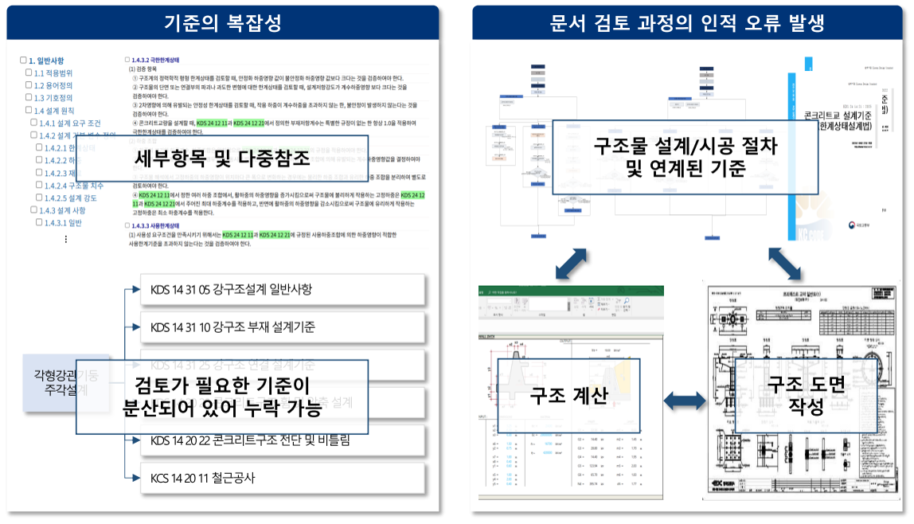
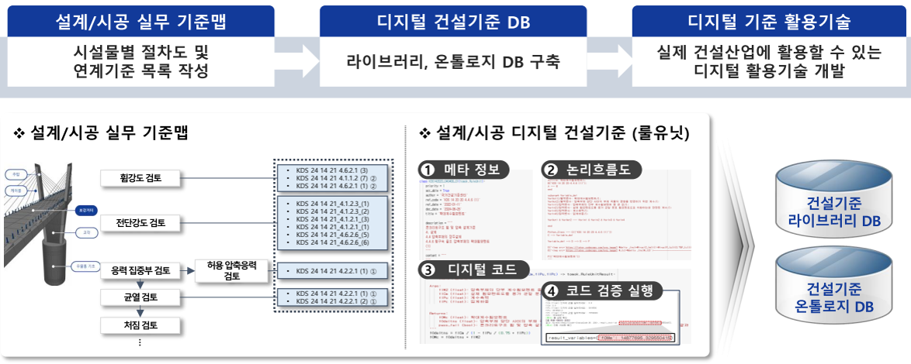
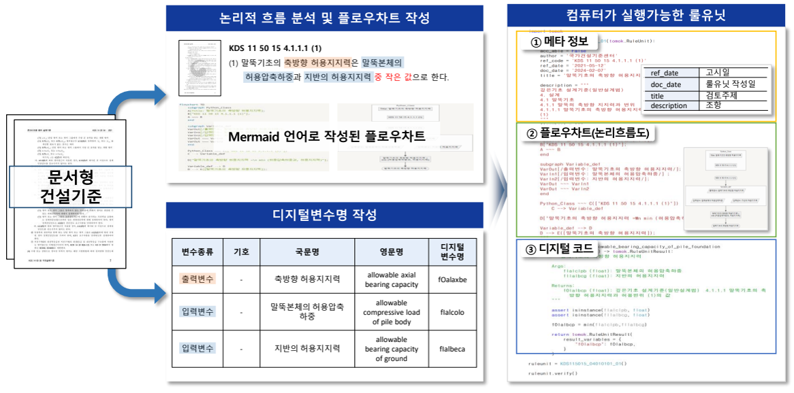
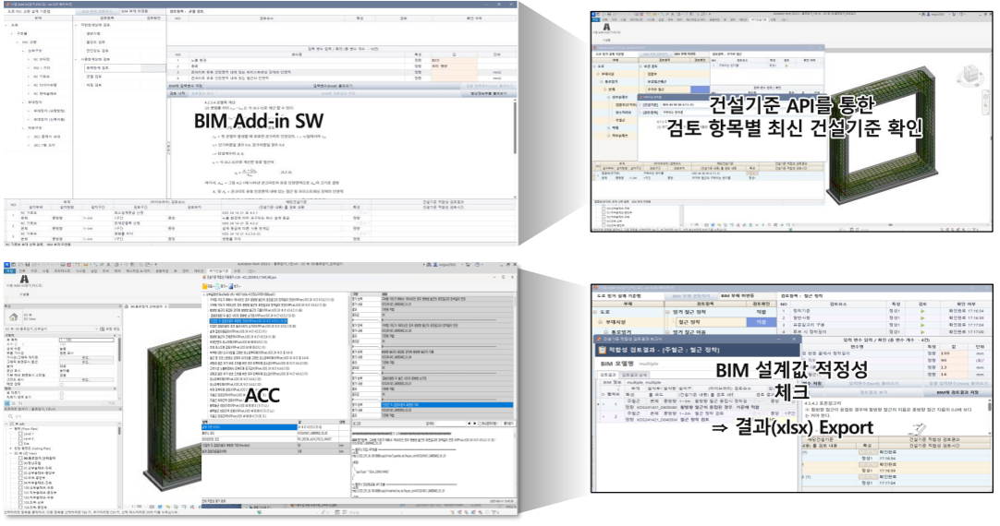
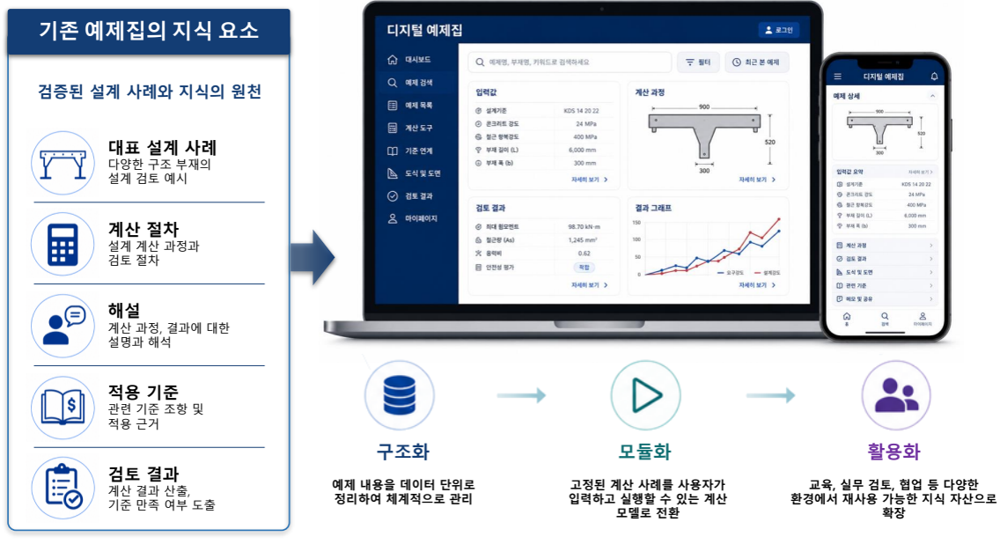

[English](index.qmd) | **한글**

나도 요즘은 AI를 거의 끼고 생활한다. 내 주변 많은 분들도, 요즘은 먼저 AI에게 물어본다. 건설기준도 예외는 아니다.

KDS/KCS 기준서를 PDF로 AI에게 입력한후 질문을 하면 제법 그럴듯하게 답을 한다. 필요한 조항도 찾아주고, 복잡한 문장을 풀어서 설명하기도 한다. 얼핏 보면 이제 두꺼운 기준서를 직접 뒤질 필요가 없어 보인다.

문제는 그 다음이다.

**그 답을 믿고 실제 설계를 해도 되는가?**

건설기준은 단순한 문장이 아니다. 하나의 설계 조항은 기준 체계 안에서 특정한 위치를 가지고 있고, 다른 기준의 정의를 가져오기도 하며, 여러 조항을 참조하기도 한다. 필요한 입력변수가 있고 계산 순서가 있으며, 마지막에는 공학적인 판단으로 이어진다.

이 관계가 명시적으로 정리되어 있지 않다면 AI는 질문을 받을 때마다 문장 속에서 그 관계를 다시 추론해야 한다.

공학에서 이것은 상당히 위험한 방식이다.

그래서 질문을 조금 바꿀 필요가 있다.

> **AI가 건설기준을 어떻게 잘 읽게 할 것인가?**

보다는,

> **사람과 AI가 동일한 공인된 공학 지식을 신뢰성 있게 사용할 수 있도록 건설기준 자체를 어떻게 구조화할 것인가?**

이 질문이 우리가 진행하고 있는 디지털 건설기준 연구의 핵심이다.

## AI가 없어도 건설기준은 원래 어렵다

설계를 해 본 사람이라면 잘 안다.

하나의 설계 문제를 해결하는 데 필요한 내용이 한 조항에 모두 들어 있는 경우는 많지 않다. 여러 설계기준과 시방서에 흩어져 있고, 다른 조항을 다시 참조하며, 계산서와 도면까지 연결된다.

{fig-align="center" width="100%"}

그림 1에서 왼쪽을 보면 하나의 업무에 필요한 요구사항이 여러 기준과 조항에 분산되어 있다. 참조 하나를 놓치면 필요한 공학적 요구사항의 일부를 놓칠 수 있다.

오른쪽도 중요하다. 실제 설계와 시공에서는 기준서, 구조계산서, 도면이 따로 존재하는 것이 아니다. 서로 연결되어 하나의 공학적 의사결정 과정을 만든다.

숙련된 기술자는 경험을 통해 머릿속에서 이 관계를 자연스럽게 구성한다.

컴퓨터에게도 그런 방식으로 일하라고 하면 문제가 생긴다.

즉, 기존의 문서형 건설기준에는 본질적으로 **지식구조의 문제**가 존재한다.

## 기준서 PDF를 LLM에게 입력해 주면 되는 것 아닌가?

LLM은 언어를 이해하고 설명하는 데 매우 뛰어나다.

그렇다고 기준 문서가 바로 전산공간에서 추론과 계산이 가능한 형태로 전환되는 것은 아니다.

예를 들어 어떤 기준 조항에서 허용값을 두 계산값 중 작은 값으로 정하도록 했다고 하자. 사람은 문장을 읽고 쉽게 이해할 수 있다.

하지만 실제 공학용 전산시스템에서는 그것만으로 부족하다.

시스템은 적어도 다음을 알아야 한다.

- 두 입력값이 무엇인가?
- 각각은 어디에서 정의되는가?
- 단위와 공학적 의미는 무엇인가?
- 출력값은 무엇인가?
- 어떤 비교 연산을 수행해야 하는가?
- 이 규칙의 원문은 어느 기준의 어느 조항인가?
- 계산 결과를 어떻게 검증할 것인가?

여기에 여러 기준과 조항이 연결되기 시작하면 문제는 훨씬 복잡해진다.

결국 프롬프트를 잘 쓰는 것만으로는 근본적인 문제가 해결되지 않는다.

**공학 지식이 문서 속에 암묵적으로 남아 있는 한, AI는 그 논리를 계속 다시 추론해야 한다.**

우리가 하려는 것은 반대다.

먼저 그 논리를 명시적으로 구성한다.

## PDF를 만드는 것이 디지털화는 아니다

디지털 건설기준은 종이 문서를 PDF로 바꾸는 것에서 시작하지 않는다.

실제 설계와 시공 업무가 어떻게 진행되는지를 먼저 보고, 그 과정에 어떤 기준이 어떻게 연계죄는 것인지를 파악해야 한다.

{fig-align="center" width="100%"}

그림 2의 구조는 크게 세 단계로 볼 수 있다.

첫째, **설계·시공 실무 맵**을 만든다. 실제 업무 절차를 정리하고 각 단계에서 어떤 기준이 필요한지를 파악하여 연결한다.

둘째, 그 정보를 **디지털 건설기준 DB**로 구조화한다. 여기에는 라이브러리와 온톨로지 같은 지식구조가 포함된다.

셋째, 이렇게 구조화된 정보를 실제 설계와 시공 업무에 활용한다.

따라서 중요한 변화는

$$
\text{종이 문서} \rightarrow \text{PDF}
$$

가 아니다.

실제로 필요한 변화는

$$
\text{문서}
\rightarrow
\text{구조화된 공학 지식}
\rightarrow
\text{컴퓨터가 사용할 수 있는 논리}
$$

이다.

PDF는 저장 형식 측면에서는 디지털이다.

하지만 **지식구조까지 디지털인 것은 아니다.**

## RuleUnit: 문장을 공학 논리로 바꾸는 단위

여기서 중요한 것이 **RuleUnit**이다.

RuleUnit은 사람이 읽도록 작성된 기준 조항에서 실제 공학 논리를 분리해 명시적으로 표현한다.

{fig-align="center" width="100%"}

그림 3의 예를 보자.

기준 문장에는 말뚝 몸체의 허용압축하중과 지반의 허용지지력을 이용해 허용축방향 지지력을 결정하는 규칙이 들어 있다.

기술자가 보면 논리가 어렵지 않을 수 있다.

하지만 컴퓨터에게는 그 논리를 암묵적으로 남겨둘 이유가 없다.

RuleUnit에서는 이를 다음과 같은 요소로 분리한다.

1. **메타데이터** — 이 요구사항이 어디에서 왔고 무엇에 관한 것인가?
2. **논리 흐름** — 어떤 판단과 계산을 어떤 순서로 수행하는가?
3. **디지털 변수** — 공학량을 어떤 표준화된 변수로 표현하는가?
4. **디지털 코드** — 기준에서 요구하는 연산을 어떻게 실행하는가?

여기서 AI의 역할이 달라진다.

기준 문장을 보고 매번 계산 논리를 새로 만들어 내라고 하는 것이 아니다. 이미 구조화되고 검증된 공학 규칙을 찾아 사용하도록 하는 것이다.

여기서 중요한 것은 바로 이것이다.

> **AI에게 기준 문서에서 공학 논리를 매번 다시 추론하게 하지 말자. 한 번 제대로 구조화하고, 그 다음부터는 그 지식을 사용하게 하자.**

## 그러면 환각은 없어지는가?

여기서는 조금 조심해서 말해야 한다.

'환각 없는 AI'라고 하면 마치 어떤 질문에도 틀린 답을 하지 않는 시스템을 만들 수 있다는 의미로 들릴 수 있다.

현재 우리의 연구 방향은 그런 것이 아니다.

공학에서 AI 환각 문제의 일부는 LLM 자체의 문제이지만, 다른 일부는 **정보구조의 문제**다.

서로 느슨하게 연결된 수많은 문서를 AI에게 주면 AI는 스스로 처리해야 할 일이 많아진다.  AI가 스스로 처리하는 일은,사람이 그 인과관계를 추적하는 것이 불가능하다.

어떤 조항이 적용되는지 찾아야 하고, 참조 관계를 따라가야 하고, 정의와 요구사항을 구분해야 하며, 계산 순서도 복원해야 한다.

즉, 암묵적인 관계가 하나 늘어날 때마다 AI가 추론해야 할 것도 하나씩 늘어나며 오류의 개연성도 증가한다.

우리가 줄이고 싶은 것이 바로 이것이다.

질문을

> "이 기준에서는 어떻게 하라고 하는 건가?"

에서

> "적용되는 공인 RuleUnit과 그 의존관계, 변수, 실행 논리를 찾아서 이 검토 결과를 설명해다오."

로 바꾸는 것이다.

물론 이것만으로 모든 AI 응답에 대해 환각이 영이라고 보장할 수는 없다. 그런 주장을 하려면 환각을 명확하게 정의하고 충분한 검증 체계를 만들어 실제로 시험해야 한다.

하지만 공학적으로 방향은 분명하다.

> **AI가 추측해야 하는 부분은 줄이고, 명시적으로 제공되는 공인된 공학 지식은 늘린다.**

## 기준이 계산 가능해지면 ACC가 가능해진다

기준 요구사항이 컴퓨터가 사용할 수 있는 형태가 되면 실제 공학 업무 흐름에 직접 들어갈 수 있다.

대표적인 것이 **자동 적합성 검토(Automatic Compliance Check, ACC)**다.

{fig-align="center" width="100%"}

그림 4는 BIM 환경에서 이 과정을 보여준다.

목적은 기술자를 없애는 것이 아니다.

반복적으로 기준을 찾고 값을 옮기고 동일한 검토를 수행하는 일을 줄이면서, 무엇을 근거로 판단했는지를 더 명확하게 만드는 것이다.

제대로 된 적합성 검토 시스템이라면 기술자는 최소한 다음 질문에 답할 수 있어야 한다.

- 어떤 기준 요구사항을 검토했는가?
- 어떤 설계값을 사용했는가?
- 어느 버전의 기준을 적용했는가?
- 어떤 계산 또는 논리 검토를 수행했는가?
- 왜 적합 또는 부적합이라는 결론이 나왔는가?

챗봇이 답을 하나 내놓고 "믿으세요" 하는 것과는 전혀 다르다.

공학 AI에서는 **추적성(traceability)도 정확성의 일부**다.

## 디지털 건설기준은 재사용 가능한 공학 지식이 된다

이 개념은 공식적인 기준 검토에만 적용되는 것이 아니다.

기존의 설계 예제집에도 상당한 공학 지식이 들어 있다. 대표적인 설계 사례, 계산 절차, 설명, 적용 기준, 검증된 결과가 모두 포함되어 있다.

문제는 책에 적힌 예제는 입력값과 계산 순서가 페이지 위에 고정되어 있다는 것이다.

이것도 구조화할 수 있다.

{fig-align="center" width="100%"}

그림 5의 과정을 간단히 쓰면

$$
\text{구조화}
\rightarrow
\text{모델화}
\rightarrow
\text{활용}
$$

이다.

예제에 들어 있는 공학 지식을 먼저 구조화한다. 고정된 계산을 입력값에 따라 실행할 수 있는 모델로 만든다. 그러면 교육, 실무 검토, 협업, AI 기반 공학 업무에서 다시 사용할 수 있다.

그래서 나는 디지털 전환을 단순히 종이를 파일로 바꾸는 것으로 보지 않는다.

**공학 지식을 다시 사용할 수 있는 계산 자산으로 바꾸는 것이 진짜 디지털 전환이다.**

## AI 시대에는 무엇이 달라지는가?

사실 디지털 건설기준은 생성형 AI가 등장하기 전에도 필요했다.

BIM 연계, 자동 검토, 데이터베이스, 소프트웨어 간 정보교환을 위해서 이미 필요했다.

그런데 AI가 등장하면서 필요성이 훨씬 커졌다.

LLM의 장점은 사람과 정보 사이의 인터페이스를 아주 유연하게 만들어 준다는 것이다. 기술자는 복잡한 DB 구조를 직접 찾아다니지 않고 자연어로 질문할 수 있다.

하지만 인터페이스가 유연하다고 해서 그 아래의 공학 지식까지 모호해도 된다는 뜻은 아니다.

우리가 원하는 조합은 다음과 같다.

$$
\boxed{
\text{자연어의 유연성}
+
\text{구조화된 공인 지식}
+
\text{실행 가능한 공학 논리}
}
$$

LLM은 기술자의 질문 의도를 이해하고 결과를 설명하는 데 사용할 수 있다.

디지털 건설기준은 판단의 공학적 근거를 제공한다.

그리고 확률적인 언어 생성에 맡겨서는 안 되는 계산과 검토는 실행 가능한 RuleUnit이 담당한다.

각자의 역할을 구분하는 것이 중요하다.

## AI 전환은 AI를 붙이기 전에 시작된다

기존 업무에 AI를 하나 붙이면 AI 전환이 된다고 생각하기 쉽다.

건설기준에서는 순서가 반대다.

기존 정보가 여러 문서에 흩어져 있고, 표현이 일관되지 않으며, 중요한 관계를 사람이 알아서 해석해야 하는 상태라면 아무리 좋은 LLM을 붙여도 그 자체로 신뢰할 수 있는 공학 시스템이 되지는 않는다.

먼저 지식 인프라가 바뀌어야 한다.

그래서 AI 시대에 디지털 건설기준이 더 중요하다.

기존의 건설기준 문서를 BIM, 계산 기반 검토, 데이터베이스, 온톨로지, 실행 가능한 규칙, 자연어 AI 인터페이스와 연결할 수 있기 때문이다.

이 문제는 건설기준에만 해당하지 않는다.

> **공학 AI의 신뢰성은 AI 모델이 얼마나 똑똑한가에만 달려 있지 않다. AI에게 어떤 구조와 권위를 가진 공학 정보를 주는가에도 달려 있다.**

더 짧게 말하면,

> **AI에게 추론시키기 전에 공학 지식부터 구조화하자.**

## 우리가 만들려는 것은 '건설기준 챗봇'이 아니다

이 글에서 설명한 내용은 현재 진행 중인 디지털 건설기준 및 AI 기반 공학 활용 연구의 일부다.

설계·시공 기준 맵, 건설기준 라이브러리와 온톨로지, 실행 가능한 RuleUnit, BIM 기반 자동 적합성 검토, 공사시방서 자동 생성, 현장 활용, 디지털 공학 예제집 등으로 확장할 수 있다.

하지만 장기적인 목표를 '건설기준을 잘 대답하는 챗봇'으로 잡으면 너무 작다.

우리가 만들고 싶은 것은 **사람이 읽는 건설기준과 컴퓨터가 사용하는 건설기준이 동일한 공인된 공학 요구사항을 공유하는 정보 환경**이다.

문서를 잘 검색하는 것보다 훨씬 어려운 문제다.

하지만 공학 AI를 실제로 사용하려면 훨씬 필요한 문제이기도 하다.

## 프로젝트 상태

이 글은 현재 **진행 중인 R&D 프로젝트**에서 개발하고 있는 개념과 기술을 설명한다. 완료된 동료평가 연구의 최종 결과를 보고하는 글이 아니라, 연구의 공학적 문제와 구조를 설명하기 위한 글이다. 따라서 구체적인 성능에 관한 주장은 별도의 정의와 검증이 이루어진 범위에서만 해석해야 한다.

## 프로젝트 자료

**Digital Construction Standards and AI-Based Application Technologies**  
고려대학교 구조공학 및 역학연구실 발표자료, 2026년 6월 26일.
