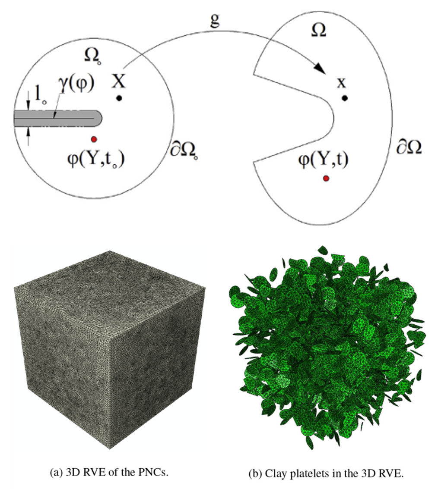

<div class="language-switch">[English](index.qmd) | **한글**</div>

**계산파괴역학 시리즈:** [← 전체 보기](../computational-fracture-overview/index-ko.qmd) · [← 다중균열](../multiple-cracks-fracture-network/) · 7편 중 5편

앞의 글들에서는 다음과 같은 고찰을 계속 따라왔다.

균열이 생기면 일반적으로 사용하는 연속적인 변위장을 근사하는 변위계로는 표현할 수 없는 운동학이 나타난다. **확장유한요소법(XFEM)**과 **확장무요소법(XEFG)**은 이때 빠져 있는 불연속 정보를 변위공간에 부가하여 변위공간을 확충한다.

그러면 자연스럽게 이런 질문이 생긴다.

> **균열을 표현하려면 반드시 변위공간을 부가적으로 확충(enrichment)해야만 하는가?**

꼭 그렇지는 않다.

하지만 어떤 파괴해석 기법이 가장 좋은가를 묻는 것보다 더 중요한 질문이 있다.

> **“여기에 균열이 있다”는 정보를 수치해석 과정의 어디에 표현할 것인가?**

파괴해석 기법들의 차이는 상당 부분 이 질문에 대한 서로 다른 접근법으로 볼 수 있다.

```text
XFEM / XEFG
근사공간에 불연속 정보를 저장
        ↓
phantom node
균열 너머까지 연장된 요소 영역을 사용하되 균열면에서 부분적으로 적분하여 불연속을 표현
        ↓
cracking particle
입자의 support / 가시성(visibility)을 조절하여 불연속을 표현
        ↓
peridynamics
비국소 상호작용 자체가 불연속을 허용
        ↓
phase field
날카로운 균열을 정규화된 파괴장으로 이용해서 표현
```

이렇게 보면 이 방법들의 역사는 서로 무관한 알고리즘이 차례로 등장한 것이 아니다.

**재료가 연속성을 잃었다는 사실을 어디에, 어떻게 표현할 것인가**에 대한 여러 선택이다.

## 먼저 균열에 필요한 물리적인 요구사항이 무엇인지 보자

수치기법을 보기 전에 파괴가 역학적으로 어떤 조건을 의미하는지부터 생각해 보자.

균열이 생기기 전에는 내부에 어떤 면을 사이에 두더라도 변위장은 연속이다.

$$
\llbracket \mathbf{u} \rrbracket = \mathbf{0}.
$$

하지만, 균열이 생긴 뒤에는 양쪽 면이 서로 독립적으로 움직일 수 있다.

$$
\llbracket \mathbf{u} \rrbracket \neq \mathbf{0}.
$$

**점성균열(cohesive crack)**에서는 완전히 분리되기 전까지 두 면 사이에 traction--separation 관계가 남는다.

$$
\mathbf{t}
=
\mathbf{t}\!\left(\llbracket\mathbf{u}\rrbracket\right).
$$

따라서 수치적으로 본질적인 질문은 “균열을 어떻게 그릴 것인가?”가 아니다.

> **역학적으로 연속성이 사라져야 하는 곳에서 어떤 근사함수를 도입하여 불연속을 표현할 것인가?**

XFEM에서는 근사공간에 불연속성 함수를 확충함으로써 해결하였다. 이후의 다른 방법들은 같은 정보를 다른 형태로 구현하였다.

## XFEM: 균열 정보를 근사공간에 넣는다

균열이 유한요소망을 가로질러 지나간다고 하자. 보통의 유한요소 근사

$$
\mathbf{u}^h(\mathbf{x})
=
\sum_I N_I(\mathbf{x})\mathbf{u}_I
$$

는 하나의 요소 내부에서 연속이다.

XFEM은 이 근사에 불연속을 표현할 수 있는 함수를 추가한다. 가장 단순하게 변위의 불연속 점프를 표현하기 위한 확충 형태는

$$
\mathbf{u}^h(\mathbf{x})
=
\sum_I N_I(\mathbf{x})\mathbf{u}_I
+
\sum_{J\in\mathcal{N}_{\mathrm{enr}}}
N_J(\mathbf{x})H(\mathbf{x})\mathbf{a}_J
$$

와 같이 쓸 수 있다.

요소망은 그대로이며 변경될 필요가 없다.

**변위계 근사공간이 부가되어 확충된다.**

이것이 앞의 글에서 설명한 XFEM의 핵심이다.

물론 변위공간의 확충을 도입하면 구현에서 새로운 문제가 생긴다. 어느 절점에서 변위공간을 확충할 것인가, 일부만 잘린 요소를 어떻게 적분할 것인가, 균열선단은 어떻게 표현할 것인가, 추가 자유도는 어떻게 조립할 것인가, 동적 문제의 질량행렬은 어떻게 다룰 것인가, 상호 연결되는 복잡한 균열의 위상은 어떻게 관리할 것인가 등의 문제다.

이런 문제들이 다른 표현법을 찾게 만든 이유 중 하나였다.

## Phantom node: 이번에는 이산화된 영역을 바꾼다

Phantom-node 방법에서도 균열면에서 확실한 불연속성(sharp crack)을 표현한다. 다만 균열 양쪽을 표현하는 방식이 다르다.

원래 요소에 명시적인 불연속 확충 자유도를 붙이는 대신, 균열이 생긴 요소를 불연속의 양쪽에 대응하는 **서로 겹친 요소 영역**으로 표현한다.

여기서 중요한 점이 있다.

> **Phantom node는 XFEM의 균열 운동학을 부정한 방법이 아니다. 본질적으로 같은 변위 점프를 다른 이산화 방식으로 구현한 것이다.**

2008년 연구에서는 균열 요소에 대해 step-enriched XFEM 표현과 phantom-node 표현이 서로 등가임을 보였다.

{#fig-phantom-xfem fig-align="center" width="84%"}

그림 [-@fig-phantom-xfem]을 보면, 여기서 중요한 것은 방법의 이름이 아니다.

물리적인 통찰점은 바뀌지 않았다.

균열면을 중심으로 변위계에는 점프가 존재한다.

달라진 것은 **근사공간을 관리하는 방식**, 말하자면 bookkeeping이다.

## 왜 명시적으로 부가하는 자유도 확충 대신 다른 방법을 강구하였을까?

수치기법은 올바른 함수공간을 표현할 수 있다는 것만으로 평가되지 않는다. 실제 구현이 얼마나 단순하고 안정적인지도 중요하다.

특히 동적 파괴에서는 질량집중(lumped mass)을 편리하게 적용할 수 있고 새로 균열이 생긴 요소를 단순하게 처리할 수 있다면 상당한 장점이 있다.

Phantom-node 방법은 일반적인 XFEM 형식으로 확충된 변위공간의 유한요소 방정식을 직접 다루는 대신, 겹쳐진 요소 표현을 활성화하여 불연속을 도입한다.

여기서 계산역학 분야에서 일반적으로 잘 알려진 교훈을 다시 발견할 수 있다.

> **두 방법이 거의 같은 역학을 표현하더라도 계산 구현의 구조는 크게 다를 수 있다.**

방법의 이름만 비교하면 이 차이를 놓치기 쉽다.

## 그렇다고 균열선단 문제가 없어지는 것은 아니다

XFEM에서 phantom node로 바꾼다고 균열선단 문제가 사라지는 것은 아니다.

균열이 요소 내부에서 끝나면 선단에서 변위 점프가 적절히 영으로 닫혀야 한다. 그래서 phantom-node 연구에서도 임의의 점성균열을 위한 crack-tip element를 도입했다.

앞서 XFEM에서 해결했던 것과 동일한 물리적 요구사항이다.

```text
균열선단 뒤쪽:
두 균열면이 독립적으로 움직임

균열선단:
변위 점프가 닫혀서 변위계의 불연속성이 없어져야 함

균열선단 앞쪽:
변위계가 연속적
```

수치기술은 달라졌다.

**역학적 요구조건은 달라지지 않았다.**

## Cracking particle: 더 단순하게 표현할 수 있을까?

무요소법에서는 고정된 요소의 연결성 대신 입자의 support domain으로 변위 근사함수를 구성하기 때문에 또 다른 방식으로 해결할 수 있다.

후속 연구에서 개발한 cracking-particle 방법은 **추가적인 확충 자유도 없이** 균열의 발생과 성장을 표현하려는 것이었다.

대신 균열선분이 입자의 support를 가르고, 불연속을 사이에 둔 가시성(visibility)에 따라 근사관계를 수정한다.

개념적으로 보면

```text
일반적인 입자 support
        ↓
균열이 support를 통과
        ↓
균열에 의해 support가 분리
        ↓
균열 양쪽 입자가 더 이상
하나의 연속 근사를 통해 상호작용하지 않음
```

이 된다.

불연속 정보가 다시 다른 곳으로 이동한 것이다.

이제 그 정보는 주로 부가적인 확충 자유도에 들어 있는 것이 아니라 **입자 사이의 support 관계**에 들어 있다.

{#fig-cracking-particle fig-align="center" width="80%"}

그림 [-@fig-cracking-particle] 역시 같은 질문에 대한 또 하나의 답으로 읽는 것이 좋다.

> 균열 정보는 어디에 저장되어 있는가?

XFEM에서는 확충함수에 명시적으로 들어 있다.

Cracking-particle 방법에서는 그 상당 부분이 변화하는 support와 가시성(visibility) 관계에 들어 있다.

## 균열의 기하정보는 추적해야 한다

XFEM, XEFG, phantom-node, cracking-particle 방법은 구현상 상당히 다르다.

하지만 중요한 공통점이 있다.

모두 식별 가능한 **불연속(sharp discontinuity) 변위계**를 유지한다.

따라서 어떤 형태로든 균열의 기하학적 정보를 가지고 있어야 한다.

- 2차원에서는 균열선분,
- 3차원에서는 균열면,
- 균열선단 또는 균열전면,
- 균열의 교차,
- 분기,
- 접합.

앞의 다중균열 글에서 보았듯이 균열이 여러 개 상호작용하면 이 작업은 빠르게 복잡해진다.

그러면 더 근본적인 질문을 할 수 있다.

> **아예 변위의 불연속인 균열면을 명시적으로 표현하지 않으면 어떨까?**

## Peridynamics: 근사법이 아니라 지배방정식의 기술방식을 바꾼다

Peridynamics는 다른 방향에서 파괴문제에 접근한다.

고전적인 국부 연속체역학은 변위장의 공간미분을 사용한다. 그런데 변위 불연속이 생기면 바로 그 지점에서 고전적인 의미의 미분을 정의할 수 없다.

Peridynamics는 국부 미분방정식 대신 유한한 이웃 영역 사이의 **비국소(nonlocal) 상호작용**으로 문제를 기술한다.

이 글의 관점에서 중요한 결과는 다음과 같다.

> **지배방정식 자체가 비국소적이므로 불연속을 국부 근사공간에 XFEM과 같은 방식으로 삽입할 필요가 없다.**

본 저자의 열가소성 재료 파괴 연구에서는 3차원 열-역학 파괴를 위해 non-ordinary state-based peridynamic formulation을 사용했다.

이것은 XFEM에서 phantom node로 옮겨가는 것보다 더 큰 변화다.

균열 정보가 이산 근사공간에서 **진화하는 비국소 재료 상호작용의 상태**로 이동했기 때문이다.

## 변위공간의 확충이 없다고해서  파괴모델링이 없어지는 것은 아니다

여기서

```text
변위공간 확충 없음
=
균열 표현 문제 없음
```

이라고 생각하면 곤란하다.

어떤 방법이든 물리적으로는 여전히 다음 질문에 답해야 한다.

- 재료 분리는 언제 시작되는가?
- 파괴에너지는 어떻게 소산되는가?
- 어떤 길이 척도가 들어가는가?
- 필요한 경우 인장과 압축을 어떻게 구별하는가?
- 비가역적 변화는 어떻게 표현하는가?
- 수치해상도와 파괴모델은 어떻게 상호작용하는가?

Bookkeeping은 달라진다.

**역학이 없어지는 것은 아니다.**

## Phase field: 불연속 변위계를 만드는 균열을 하나의 장으로 바꾼다

Phase-field fracture는 불연속 균열이라는 그림에서 가장 분명하게 벗어나는 방법 중 하나다.

균열면 $\Gamma$를 명시적으로 기술하는 대신 스칼라장 $\phi(\mathbf{x})$를 도입한다.

본 저자의 나노복합재 연구에서 사용한 phase-field formulation에서는

$$
\phi=0
$$

재료의 건전한 상태에 해당하고,

$$
\phi=1
$$

이 완전히 파괴된 재료에 해당한다.

그 사이에는 유한한 폭의 천이영역이 존재한다.

따라서 이 기법에서 균열은 두께가 영인 기하학적 면이 아니라 **확산된 파괴장(diffuse fracture field)**으로 표현된다.

정규화된 균열면 밀도는 예를 들어

$$
\gamma(\phi)
=
\frac{1}{2}
\left(
\ell_0 \nabla\phi\cdot\nabla\phi
+
\frac{\phi^2}{\ell_0}
\right)
$$

와 같이 쓸 수 있다. 여기서 $\ell_0$는 정규화된 균열의 폭을 제어한다.

이에 대응하는 파괴에너지는 체적적분으로

$$
\Psi_s
=
G_c
\int_\Omega
\gamma(\phi)\,d\Omega
$$

와 같이 표현된다.

표현방식이 근본적으로 바뀐 것이다.

변위가 불연속적인 균열의 기하학적 표면적분을 좁은 영역에 분포한 장의 체적적분으로 바꾸었다.

## 이렇게 해서 얻은 점은?

Phase-field formulation에서는 균열면을 명시적으로 추적할 필요가 없다.

따라서 XFEM/XEFG에서 필요한 것과 같은 균열면 추적기법을 계속 유지하지 않고도 균열의 발생, 성장, 합체와 복잡한 경로를 다룰 수 있다.

{#fig-phase-field fig-align="center" width="82%"}

그림 [-@fig-phase-field]에서 중요한 것은 이 방법이 만드는 교환관계다.

이제

> 정확한 균열면은 어디에 있는가?

를 직접 묻는 대신

> 대상 영역 전체를 아우르는 파괴장의 값은 얼마인가?

를 푼다.

같은 방식으로 균열의 위상을 명시적으로 갱신하지도 않는다. **균열 형상은 장의 해에서 자연스럽게 얻어진다.**

## 그 대신 무엇이 소요되었는가?

여기서 파괴기법을 비교할 때 조심해야 한다.

Phase field가 어려운 수치문제 하나를 그냥 없애 준 것은 아니다.

**한 표현을 다른 표현으로 바꾼 것이다.**

명시적인 균열 추적은 줄었지만 정규화 길이 $\ell_0$가 들어왔다.

2018년 나노복합재 연구에서는 이 길이척도가 균열의 확산 폭을 제어하며 관련 기하학적 치수보다 작아야 한다고 설명했다. 이후 해석에 사용할 값을 정하기 전에 $\ell_0$의 영향도 수치적으로 조사했다.

따라서 대략 다음과 같은 교환이다.

```text
불연속 변위에 대한 균열 기하학
+ 명시적 균열 추적

            ↓

확산된 파괴장
+ 정규화 길이
+ 추가적인 장 방정식
```

어느 쪽도 공짜는 아니다.

**서로 다른 종류의 수치정보를 필요로 할 뿐이다.**

## 2018년 나노복합재 예를 보면 차이가 잘 보인다

Phase field는 불균질한 미세구조에서 특히 매력적이다.

Clay/epoxy 나노복합재 모델에서는 강성이 큰 다수의 clay platelet이 국부 균열경로를 바꾸는 가운데 matrix와 interphase zone을 통해 파괴가 진행될 수 있었다.

결과적으로 균열경로는 굴곡이 심했고 inclusion 주위에서 분산된 균열이 나타났다.

이 모든 기하학적 상호작용을 하나씩 미리 정하고 갱신하려면 상당히 번거롭다. Phase field에서는 결합된 에너지 문제를 풀면서 파괴 패턴이 나타나게 할 수 있다.

하지만 동일한 연구에서 길이척도와 재료모델이 왜 중요한지도 보여준다.

Interphase의 두께와 물성의 선택에 따라 인장강도, 전체 에너지방출률, 소산된 파괴에너지에 영향이 발생하였다.

즉 명시적인 균열 추적을 피하는 방법이라도 **파괴를 지배하는 실제 재료의 불균질성**은 제대로 표현해야 한다.

여기서 중요한 것은 바로 이것이다.

## Sharp와 diffuse의 차이는 정확하고 부정확하다는 뜻이 아니다

파괴해석 기법을

```text
옛날 → 최신
단순 → 고급
열등 → 우수
```

와 같은 서열로 정리하고 싶은 유혹이 있다.

공학적으로는 별로 좋은 분류가 아니다.

### 불연속적으로 날카로운 균열을 표현

XFEM, XEFG, phantom-node, cracking-particle formulation은 식별 가능한 불연속을 유지한다.

장점은 문제에 따라 다음과 같다.

- 기하학적으로 날카로운 균열면,
- 균열개구변위의 직접적인 해석,
- 점성 traction--separation 관계의 자연스러운 적용,
- 명시적인 균열전면 정보.

대신 다음과 같은 비용이 따른다.

- 균열 기하학 관리,
- 분기와 접합에 대한 논리,
- 불연속을 가로지르는 수치적분,
- 복잡해질 수 있는 위상 갱신.

### 확산된 균열을 표현

Phase-field fracture에서는 날카로운 균열면을 정규화된 장으로 바꾼다.

장점은 다음과 같다.

- 명시적인 균열면 추적이 필요하지 않음,
- 균열 발생과 복잡한 위상을 자연스럽게 다룰 수 있음,
- 분기와 합체가 장의 진화를 통해 나타날 수 있음.

반면 다음이 필요하다.

- 정규화 길이,
- 확산 균열 부근의 충분한 해상도,
- 추가적인 장 방정식,
- 두께 영인 정확한 면 대신 유한 폭의 손상영역에 대한 해석.

따라서 어떤 방법이 맞는지는 **공학문제가 어떤 정보를 요구하느냐**에 달려 있다.

## Peridynamics는 어디에 놓아야 할까?

Peridynamics는 sharp 대 diffuse라는 단순한 구분에 정확히 들어맞지 않는다.

핵심은 국부 근사공간을 확충하거나 날카로운 균열을 phase field로 정규화하는 대신, **비국소 상호작용을 통해 파괴를 허용한다**는 데 있다.

그래서 이 글을 읽을때 시간순으로 발전한 방법의 사다리인 것으로 받아들이면 안된다.

각 방법은 서로 다른 축을 탐색한다.

```text
연속성은 어떻게 사라지는가?
균열 기하학은 어떻게 표현되는가?
파괴 정보는 어디에 저장되는가?
추가적인 길이척도가 들어가는가?
파괴에너지는 어떻게 제어되는가?
얼마나 많은 위상정보를 명시적으로 추적해야 하는가?
```

어떤 방법이 가장 최신인가보다 다음과 같은 질문들이 훨씬 유용하다.

## 공학적으로 비교하면 이렇게 볼 수 있다

| 방법 | 불연속 정보가 주로 저장되는 곳 | 명시적인 sharp crack? | 주요 계산 문제 |
|---|---|---:|---|
| XFEM / XEFG | 확충된 근사공간 | 예 | 변위공간 확충, 적분, 균열 기하학 |
| Phantom node | 겹쳐진 이산 요소 영역 | 예 | 활성화와 균열선단 처리 |
| Cracking particle | 입자 support / 가시성(visibility) | 예 | support 수정과 균열 기하학 |
| Peridynamics | 비국소 재료 상호작용 | 고전적인 국부 의미에서는 불필요 | horizon/비국소 이산화와 파괴 구성모델 |
| Phase field | 정규화된 스칼라 파괴장 | 아니오 | 길이척도, 장의 해상도, 결합해석 |

이 표를 보면 변화의 본질이 보인다.

서로 다른 다섯 종류의 균열을 발견한 것이 아니다.

**재료 연속성의 상실을 표현하는 정보를 수치해석 과정의 서로 다른 곳에 저장한 것이다.**

## Z-Diagram과 연결해 보면

Z-Diagram의 기본 관계는

$$
F \leftrightarrow \sigma \leftrightarrow \varepsilon \leftrightarrow u
$$

이다.

파괴는 변위장 자체가 불연속이 될 수 있다는 점에서 이 통상적인 연결에 새로운 문제를 만든다.

날카로운 점성균열에서는 내부 균열면에 새로운 일-공액(work-conjugate) 관계가 나타난다.

$$
\mathbf{t}
\cdot
\llbracket \dot{\mathbf{u}} \rrbracket.
$$

균열개구 $\llbracket\mathbf{u}\rrbracket$와 점성 표면력 $\mathbf{t}$가 파괴과정의 일을 구성한다.

Phase-field 표현에서는 같은 파괴과정을 다른 좌표로 표현한다. 유한한 영역에 걸쳐 파괴장과 그 gradient가 진화하면서 에너지가 소산된다.

**물리적으로 필요한 것은 여전히 에너지의 일관성이다.**

달라지는 것은 그 에너지 변화를 표현하는 수치적 좌표다.

그래서 이 비교는 단순한 소프트웨어 알고리즘 비교가 아니라 계산역학의 문제다.

## 더 일반적인 계산역학의 교훈

이 논의는 파괴역학에만 해당하지 않는다.

수치역학에서는 항상 두 가지를 물어야 한다.

1. 해가 어떤 물리정보를 반드시 포함해야 하는가?
2. 그 정보를 계산모델의 어디에 표현할 것인가?

파괴에서 반드시 필요한 물리정보는 **연속성의 상실과 그에 따른 에너지 소산**이다.

XFEM은 그 정보를 확충함수에 넣는다.

Phantom node는 겹쳐진 이산 영역에 넣는다.

Cracking particle은 상당 부분을 변화하는 support 관계에 넣는다.

Peridynamics는 진화하는 비국소 상호작용 안에 넣는다.

Phase field는 정규화된 내부장에 넣는다.

물리적 사건은 같다.

**수학적 표현이 달라진다.**

결국 핵심은 “변위공간 확충 기법이 더 좋은 다른 방법으로 대체되었다”가 아니다.

> **균열은 특정한 하나의 수치기법을 요구하지 않는다. 물리적으로 요구하는 연속성의 상실을 표현할 수 있는 수치적인 표현을 요구한다.**

계산역학적으로는 한 문장으로 더 줄일 수 있다.

> **진짜 선택은 변위공간을 확충할 것인가 말 것인가가 아니라, 불연속 정보를 어디에 저장할 것인가이다.**

이 관점으로 보면 이름이 전혀 다른 파괴기법들이 왜 같은 역학을 공유하면서도 매우 다른 알고리즘이 되는지 이해하기 쉽다.

그리고 방법을 선택하는 기준도 분명해진다.

수치기법의 이름에서 시작하지 말자.

**공학문제가 요구하는 정보에서 시작하자.**

---

## 시리즈 계속 읽기

[← **이전: 여러 균열은 어떻게 분기하고 만나 파괴 네트워크를 만드는가?**](../multiple-cracks-fracture-network/)

[**시리즈 전체: 계산파괴역학은 왜 어려운가?**](../computational-fracture-overview/index-ko.qmd)

**다음 글 — 6편:** *계산파괴역학은 어떻게 서로 다른 스케일과 구조형식으로 확장되는가?*

## Original research

Rabczuk, T., Zi, G., Gerstenberger, A., & Wall, W. A. (2008).  
**A new crack tip element for the phantom-node method with arbitrary cohesive cracks.**  
*International Journal for Numerical Methods in Engineering, 75*, 577–599.  
https://doi.org/10.1002/nme.2273

Rabczuk, T., Zi, G., Bordas, S., & Nguyen-Xuan, H. (2010).  
**A simple and robust three-dimensional cracking-particle method without enrichment.**  
*Computer Methods in Applied Mechanics and Engineering, 199*, 2437–2455.

Chau-Dinh, T., Zi, G., Lee, P.-S., Rabczuk, T., & Song, J.-H. (2012).  
**Phantom-node method for shell models with arbitrary cracks.**  
*Computers & Structures, 92–93*, 242–256.

Amiri, F., Millán, D., Shen, Y., Rabczuk, T., & Arroyo, M. (2016).  
**Phase-field modeling of fracture in thermoplastic materials using non-ordinary state-based peridynamics.**  
*International Journal of Impact Engineering, 87*, 83–94.

Msekh, M. A., Silani, M., Jamshidian, M., Areias, P., Zhuang, X., Zi, G., & Rabczuk, T. (2016).  
**Predictions of J integral and tensile strength of clay/epoxy nanocomposites material using phase field model.**  
*Composites Part B: Engineering, 93*, 97–114.

Msekh, M. A., Cuong, N. H., Zi, G., Areias, P., Zhuang, X., & Rabczuk, T. (2018).  
**Fracture properties prediction of clay/epoxy nanocomposites with interphase zones using a phase field model.**  
*Engineering Fracture Mechanics, 188*, 287–299.  
https://doi.org/10.1016/j.engfracmech.2017.08.002
