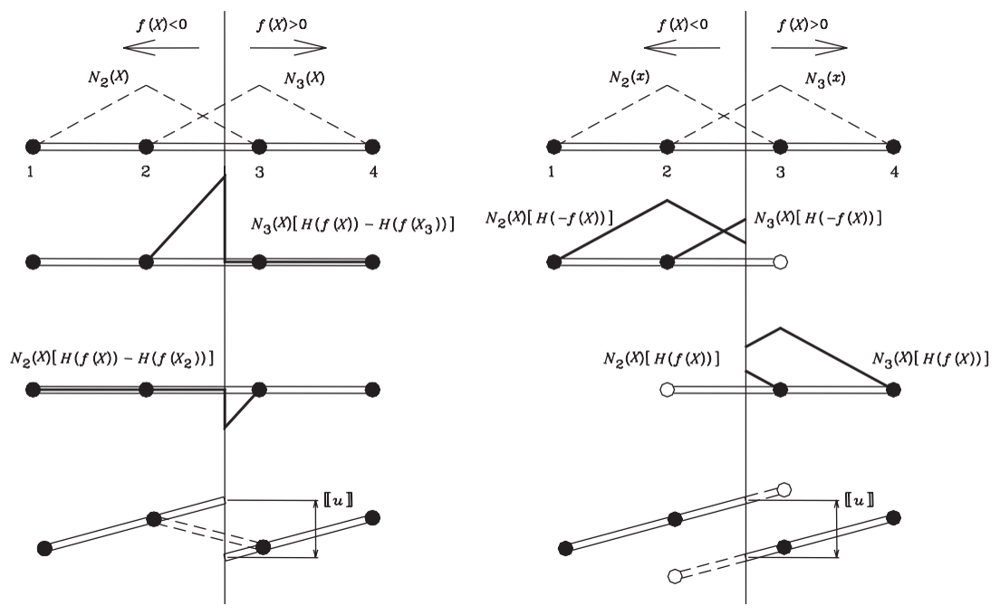
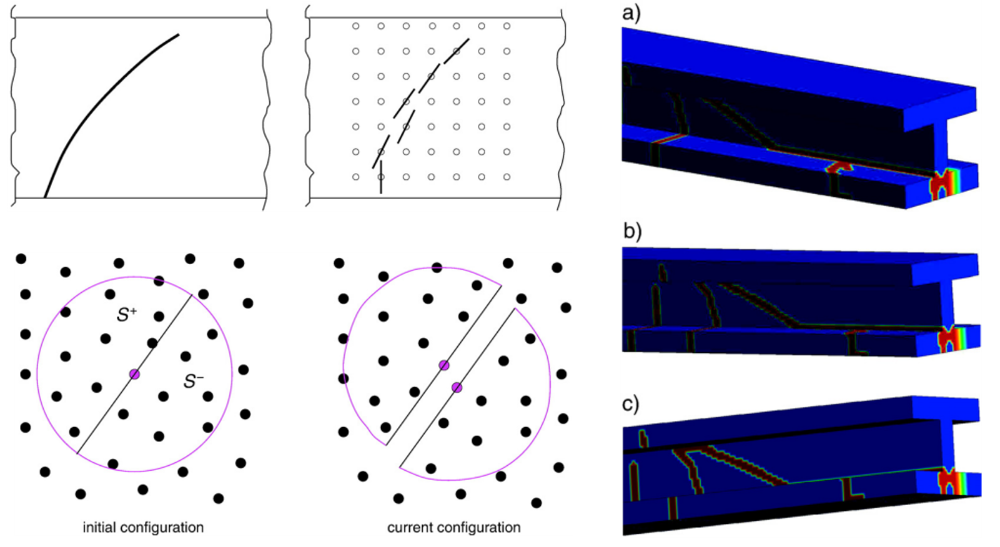

**Computational Fracture Series:** [← Overview](../computational-fracture-overview/) · [← Multiple cracks](../multiple-cracks-fracture-network/) · Article 5 of 7

The previous articles followed one central idea.

A crack introduces kinematics that an ordinary continuous approximation cannot represent. XFEM and XEFG respond by enriching the approximation with the missing discontinuity information.

That raises a natural question:

> **Is enrichment the only way to represent a crack?**

No.

But the more useful question is not which fracture method is best.

It is:

> **Where should the information that “there is a crack here” live in the numerical formulation?**

Different fracture methods answer that question differently.

```text
XFEM / XEFG
discontinuity information in the approximation space
        ↓
phantom node
discontinuity represented through overlapping element domains
        ↓
cracking particle
discontinuity represented through split particle support / visibility
        ↓
peridynamics
discontinuity admitted by nonlocal interactions
        ↓
phase field
sharp crack replaced by a regularized fracture field
```

Seen this way, the history is not a sequence of unrelated algorithms.

It is a sequence of different **representations of lost continuity**.

## The physical requirement comes first

Before discussing numerical methods, consider what fracture demands mechanically.

Before cracking, a displacement field is continuous across an internal surface:

$$
\llbracket \mathbf{u} \rrbracket = \mathbf{0}.
$$

After a crack forms, the two sides may move independently:

$$
\llbracket \mathbf{u} \rrbracket \neq \mathbf{0}.
$$

For a cohesive crack, the two sides remain mechanically coupled through a traction–separation relation,

$$
\mathbf{t}
=
\mathbf{t}\!\left(\llbracket\mathbf{u}\rrbracket\right),
$$

until the cohesive resistance vanishes.

The numerical problem is therefore not fundamentally:

> How do we draw a crack?

It is:

> **How do we allow the approximation to lose continuity where the mechanics requires it?**

XFEM answered this by enriching the approximation.

Later methods moved the same information elsewhere.

## XFEM: put the crack in the approximation space

For a crack cutting through a finite element mesh, the standard finite element interpolation

$$
\mathbf{u}^h(\mathbf{x})
=
\sum_I N_I(\mathbf{x})\mathbf{u}_I
$$

remains continuous inside an element.

XFEM adds functions capable of carrying the missing kinematics. In its simplest jump-enriched form,

$$
\mathbf{u}^h(\mathbf{x})
=
\sum_I N_I(\mathbf{x})\mathbf{u}_I
+
\sum_{J\in\mathcal{N}_{\mathrm{enr}}}
N_J(\mathbf{x})H(\mathbf{x})\mathbf{a}_J.
$$

The mesh remains unchanged.

The approximation space changes.

That is the central achievement discussed in Articles 1 and 2.

But enrichment also brings implementation questions:

- Which nodes should be enriched?
- How should partially cut elements be treated?
- How should crack tips be represented?
- How should additional degrees of freedom be assembled?
- How should mass matrices be treated in dynamics?
- How should complex crack topology be managed?

These questions motivated alternative representations.

## Phantom nodes: change the discrete domain instead

The phantom-node method retains a sharp crack, but it represents the two sides differently.

Rather than attaching explicit discontinuous enrichment degrees of freedom to the original element, a cracked element is represented through overlapping elements associated with the two sides of the discontinuity.

The key conceptual point is subtle:

> **Phantom nodes are not a rejection of the XFEM crack kinematics. They are another discrete realization of essentially the same displacement jump.**

The 2008 formulation showed the equivalence between a step-enriched XFEM representation and the phantom-node representation for a cracked element.

{#fig-phantom-xfem fig-align="center" width="84%"}

Figure @fig-phantom-xfem is important because it prevents a misleading interpretation.

The physics has not changed.

The crack remains a sharp displacement discontinuity.

What changes is the **bookkeeping of the approximation**.

## Why would we move away from explicit enrichment DOFs?

A numerical formulation is not judged only by whether it can represent the correct function space.

Implementation matters.

For dynamic fracture in particular, convenient mass lumping and a simple treatment of newly cracked elements are valuable.

The phantom-node approach provides a way to activate the discontinuity by introducing overlapping element descriptions rather than manipulating the enriched finite element equations in the usual XFEM form.

This suggests a broader computational lesson:

> Two methods may represent essentially the same mechanics while having very different implementation structures.

That distinction is easy to miss when fracture methods are classified only by name.

## The crack tip still requires special treatment

Changing from XFEM to phantom nodes does not make the crack-tip problem disappear.

A crack terminating inside an element still requires the displacement jump to close appropriately at the tip.

Our phantom-node work therefore introduced a crack-tip element for arbitrary cohesive cracks.

This is the same physical requirement encountered earlier in XFEM:

```text
behind the tip:
two independent crack faces

at the tip:
the displacement jump must close

ahead of the tip:
the body is continuous
```

Again, the numerical technology changes.

The mechanical requirement does not.

## Cracking particles: can we simplify the representation further?

Meshfree methods provide another possibility because their approximation is built from particle support domains rather than fixed element connectivity.

The cracking-particle formulation developed in the later work was designed to represent crack initiation and growth **without additional enrichment unknowns**.

Instead, particles are split by crack segments and the approximation is modified according to visibility across the discontinuity.

Conceptually,

```text
ordinary particle support
        ↓
crack crosses support
        ↓
support is separated by the crack
        ↓
particles on opposite sides no longer interact
through the same continuous approximation
```

The discontinuity information has moved again.

It is no longer primarily an additional enriched degree of freedom.

It is encoded in the **support relationship of the particles**.

{#fig-cracking-particle fig-align="center" width="80%"}

Figure @fig-cracking-particle should be read as another answer to the same question:

> Where is the crack information stored?

In XFEM, it is explicit in enrichment functions.

In the cracking-particle method, much of it is carried by the changing support and visibility structure.

## Sharp-crack methods still track geometry

XFEM, XEFG, phantom-node methods, and cracking-particle methods differ substantially in implementation.

But they share an important characteristic.

They retain an identifiable **sharp discontinuity**.

Some representation of crack geometry must therefore be maintained:

- crack segments in two dimensions,
- crack surfaces in three dimensions,
- crack tips or fronts,
- intersections,
- branches,
- and junctions.

Article 4 showed why this becomes increasingly demanding when multiple cracks interact.

This leads to a more radical question:

> What if the method did not explicitly represent a sharp crack surface at all?

## Peridynamics: change the governing description

Peridynamics approaches fracture from a different direction.

Classical local continuum mechanics uses spatial derivatives of the displacement field. A displacement discontinuity creates difficulties precisely where those derivatives cease to be classically defined.

Peridynamics replaces the local differential description with nonlocal interactions over a finite neighborhood.

The important consequence for this article is conceptual:

> **A discontinuity does not have to be inserted into a local approximation space in the same way, because the governing formulation itself is nonlocal.**

In the uploaded thermoplastic-fracture work, a non-ordinary state-based peridynamic formulation was used for three-dimensional thermomechanical fracture.

This is a larger change than moving from XFEM to phantom nodes.

The location of the crack information has moved from the discrete approximation into the evolving state of nonlocal material interactions.

## But avoiding enrichment does not mean avoiding fracture modeling

It would be wrong to conclude:

```text
no enrichment
=
no crack representation problem
```

Every method still needs to answer physical questions:

- When does material separation begin?
- How is fracture energy dissipated?
- What length scale is involved?
- How does the material distinguish tension from compression where necessary?
- How are irreversible changes represented?
- How does the numerical resolution interact with the fracture model?

The bookkeeping changes.

The mechanics does not disappear.

## Phase field: replace the sharp crack by a field

Phase-field fracture makes perhaps the clearest conceptual break from the sharp-crack picture.

Instead of explicitly describing a crack surface $\Gamma$, it introduces a scalar field $\phi(\mathbf{x})$.

In the phase-field formulation used in our nanocomposite work,

$$
\phi = 0
$$

denotes intact material, while

$$
\phi = 1
$$

denotes fully broken material.

Between them lies a finite transition zone.

The crack is therefore not represented as a zero-thickness geometrical surface.

It is represented as a **diffuse fracture field**.

A regularized crack-surface density can be written in the form

$$
\gamma(\phi)
=
\frac{1}{2}
\left(
\ell_0 \nabla\phi\cdot\nabla\phi
+
\frac{\phi^2}{\ell_0}
\right),
$$

where $\ell_0$ controls the width of the regularized crack.

The corresponding fracture surface energy is expressed as a volume integral,

$$
\Psi_s
=
G_c
\int_\Omega
\gamma(\phi)\,d\Omega.
$$

This is a profound representational change.

A geometrical surface integral associated with a sharp crack is replaced by a field distributed over a narrow volume.

## What did we gain?

The phase-field formulation does not require explicit representation of the crack surface.

That means crack initiation, propagation, merging, and complicated paths can be handled without maintaining the same explicit crack-tracking machinery required by XFEM/XEFG.

{#fig-phase-field fig-align="center" width="82%"}

Figure @fig-phase-field shows the central conceptual trade.

Instead of asking

> Where exactly is the crack surface?

the method asks

> What is the fracture-field value throughout the body?

The topology of the crack is no longer updated explicitly in the same way.

It emerges from the field solution.

## What did we trade away?

This is where comparisons between fracture methods should be careful.

Phase field does not simply remove a difficult numerical problem.

It **replaces one representation by another**.

Explicit crack tracking is reduced, but a regularization length $\ell_0$ is introduced.

The 2018 nanocomposite study states that this length scale controls the diffusion width of the crack and should be small compared with the relevant geometrical dimensions. The study also examined the influence of $\ell_0$ numerically before selecting the value used in the subsequent simulations.

So the trade is approximately

```text
sharp crack geometry
+ explicit crack tracking

            ↓

diffuse fracture field
+ regularization length
+ additional field equation
```

Neither side is free.

They contain different numerical information.

## The 2018 nanocomposite example makes the distinction visible

The phase-field formulation becomes especially attractive in heterogeneous microstructures.

In the clay/epoxy nanocomposite model, fracture could occur through the matrix and interphase zones while many stiff clay platelets altered the local crack path.

The resulting fracture pattern was tortuous and involved distributed cracking around the inclusions.

Trying to prescribe and update every geometrical interaction explicitly would be cumbersome.

The phase field instead allowed the fracture pattern to emerge from the coupled energy problem.

But the same study also showed why the length-scale and material description matter.

The interphase thickness and its properties influenced tensile strength, global energy release rate, and dissipated fracture energy.

Thus a method that avoids explicit crack tracking still has to resolve the **physical heterogeneity controlling fracture**.

That is the deeper lesson.

## Sharp versus diffuse is not the same as accurate versus inaccurate

It is tempting to organize fracture methods into a hierarchy:

```text
older → newer
simple → advanced
inferior → superior
```

That is not a useful engineering classification.

A better distinction is:

### Sharp representations

XFEM, XEFG, phantom-node, and cracking-particle formulations preserve an identifiable discontinuity.

Advantages can include:

- geometrically sharp crack faces,
- direct interpretation of opening displacement,
- natural cohesive traction–separation descriptions,
- explicit crack-front information.

Costs include:

- crack geometry management,
- branching and junction logic,
- integration across discontinuities,
- potentially complicated topology updates.

### Diffuse representations

Phase-field fracture replaces the sharp surface by a regularized field.

Advantages can include:

- no explicit crack-surface tracking,
- natural handling of nucleation and complex topology,
- convenient treatment of branching and merging through field evolution.

Costs include:

- a regularization length,
- resolution requirements around the diffuse crack,
- an additional field problem,
- interpretation of a finite-width damaged zone rather than an exact zero-thickness surface.

The correct choice depends on what information the engineering problem requires.

## Where does peridynamics fit?

Peridynamics does not fit perfectly into a simple sharp-versus-diffuse classification.

Its distinctive feature is that fracture is accommodated through nonlocal interactions rather than by enriching a local differential approximation or regularizing a sharp crack through a phase field.

This is why Article 5 should not be read as a chronological ladder.

The methods explore different axes:

```text
How is continuity lost?
How is crack geometry represented?
Where is fracture information stored?
What additional length scale is introduced?
How is fracture energy controlled?
How much topology must be tracked explicitly?
```

Those questions are more useful than asking which method is most modern.

## A useful engineering comparison

| Method | Where the discontinuity information primarily lives | Explicit sharp crack? | Main computational issue |
|---|---|---:|---|
| XFEM / XEFG | Enriched approximation space | Yes | Enrichment, integration, crack geometry |
| Phantom node | Overlapping discrete element domains | Yes | Activation and crack-tip treatment |
| Cracking particle | Particle support / visibility | Yes | Support modification and crack geometry |
| Peridynamics | Nonlocal material interactions | Not required in the classical local sense | Horizon/nonlocal discretization and constitutive fracture |
| Phase field | Scalar regularized fracture field | No | Length scale, field resolution, coupled solution |

This table reveals the real progression.

We did not discover five different kinds of cracks.

We developed different numerical places to store the information required by the **same loss of material continuity**.

## Connection to the Z Diagram

The Z Diagram relates

$$
F \leftrightarrow \sigma \leftrightarrow \varepsilon \leftrightarrow u.
$$

Fracture challenges the ordinary path because the displacement field itself may become discontinuous.

For a sharp cohesive crack, an additional work-conjugate pair appears on the internal surface:

$$
\mathbf{t}
\cdot
\llbracket \dot{\mathbf{u}} \rrbracket.
$$

The crack opening $\llbracket\mathbf{u}\rrbracket$ and cohesive traction $\mathbf{t}$ carry the local fracture work.

In a phase-field description, the same fracture process is represented differently. Energy is dissipated through evolution of the fracture field and its gradient over a finite region.

The physical requirement remains energy consistency.

The numerical coordinates used to express that energy change.

That is why the comparison belongs naturally in computational mechanics rather than being merely a comparison of software algorithms.

## The broader mechanics lesson

There is a general lesson here that extends beyond fracture.

Numerical mechanics always has two questions:

1. What physical information must the solution contain?
2. Where should that information be represented computationally?

For fracture, the indispensable physical information is the loss of continuity and the associated energy dissipation.

XFEM places that information in enrichment functions.

Phantom nodes place it in overlapping discrete domains.

Cracking particles place much of it in changing support relationships.

Peridynamics places fracture within evolving nonlocal interactions.

Phase field places it in a regularized internal field.

The physical event is the same.

The mathematical representation changes.

## Engineering takeaway

The main lesson is therefore not

> Enrichment was replaced by better methods.

It is:

> **A crack does not require one particular numerical technology. It requires a representation capable of expressing the loss of continuity demanded by the physics.**

And the computational version is even more useful:

> **The real choice is not enrichment or no enrichment. It is where the discontinuity information is stored.**

That question helps explain why apparently different fracture methods often share the same mechanics while producing very different algorithms.

It also provides a better way to choose a method.

Do not begin with the name of the numerical technique.

Begin with the information the engineering problem requires.

---

## Continue the series

[← **Previous: How Do Multiple Cracks Branch, Join, and Form a Fracture Network?**](../multiple-cracks-fracture-network/)

[**Series overview: Why Is Computational Fracture So Difficult?**](../computational-fracture-overview/)

**Coming next — Article 6:** *How Does Computational Fracture Move Across Scales and Structural Forms?*

## Original research

Rabczuk, T., Zi, G., Gerstenberger, A., & Wall, W. A. (2008).  
**A new crack tip element for the phantom-node method with arbitrary cohesive cracks.**  
*International Journal for Numerical Methods in Engineering, 75*, 577–599.  
https://doi.org/10.1002/nme.2273

Rabczuk, T., Zi, G., Bordas, S., & Nguyen-Xuan, H. (2010).  
**A simple and robust three-dimensional cracking-particle method without enrichment.**  
*Computer Methods in Applied Mechanics and Engineering, 199*, 2437–2455.

Chau-Dinh, T., Zi, G., Lee, P.-S., Rabczuk, T., & Song, J.-H. (2012).  
**Phantom-node method for shell models with arbitrary cracks.**  
*Computers & Structures, 92–93*, 242–256.

Amiri, F., Millán, D., Shen, Y., Rabczuk, T., & Arroyo, M. (2016).  
**Phase-field modeling of fracture in thermoplastic materials using non-ordinary state-based peridynamics.**  
*International Journal of Impact Engineering, 87*, 83–94.

Msekh, M. A., Silani, M., Jamshidian, M., Areias, P., Zhuang, X., Zi, G., & Rabczuk, T. (2016).  
**Predictions of J integral and tensile strength of clay/epoxy nanocomposites material using phase field model.**  
*Composites Part B: Engineering, 93*, 97–114.

Msekh, M. A., Cuong, N. H., Zi, G., Areias, P., Zhuang, X., & Rabczuk, T. (2018).  
**Fracture properties prediction of clay/epoxy nanocomposites with interphase zones using a phase field model.**  
*Engineering Fracture Mechanics, 188*, 287–299.  
https://doi.org/10.1016/j.engfracmech.2017.08.002
