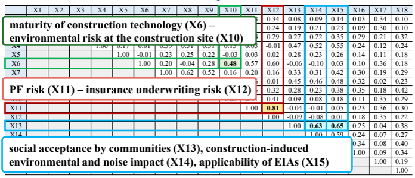
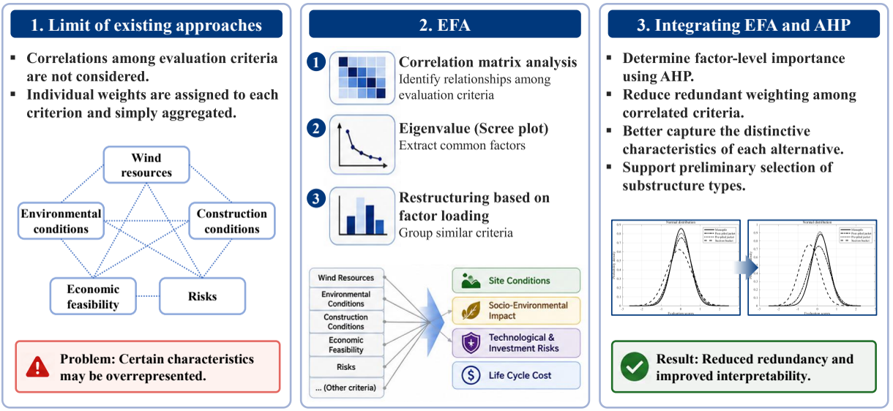
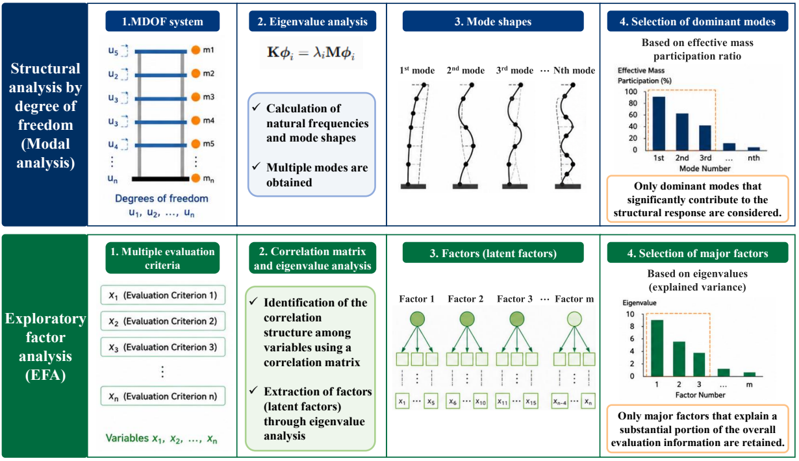
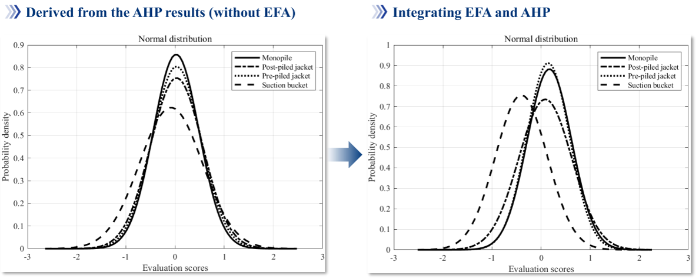

Engineering decisions are rarely made from a single number.

When selecting a structural system, a construction method, or an offshore wind substructure, we may need to consider cost, construction duration, technical maturity, environmental impact, financing risk, maintenance, public acceptance, and many other criteria.

At first glance, using **more criteria** seems safer.

More information should lead to a better decision.

But there is a hidden problem:

> **More criteria do not necessarily mean more independent information.**

If several criteria measure essentially the same underlying concern, that concern can be counted repeatedly. The final ranking may then become unintentionally biased toward one aspect of the decision.

This was the motivation behind our study on offshore wind substructure selection:

**S. Lee, Y. Kang, Y. Kim, S. Kim, and G. Zi,  
"Integrated EFA–AHP decision-making framework for fixed offshore wind energy substructures,"  
*Ocean Engineering*, Vol. 349, 124094, 2026.**

[Original paper](https://doi.org/10.1016/j.oceaneng.2025.124094)

This article explains the central idea without requiring a background in statistics.

## The hidden bias in multicriteria decisions

Suppose an engineering team compares several design alternatives using the following criteria:

- construction cost,
- construction duration,
- equipment rental cost,
- labor cost,
- maintenance cost,
- environmental impact.

There are six criteria, so it may appear that the decision is balanced.

But construction duration influences labor cost and equipment rental cost. Those costs also contribute to total construction cost.

So the first four criteria are not truly independent.

If all six criteria are treated separately, **economic performance may effectively receive several votes**, while environmental impact receives only one.

This is not necessarily an intentional bias.

It is a **structural bias produced by redundant criteria**.

The problem becomes more serious as the number of criteria grows.

---

## Why conventional AHP can be vulnerable

The Analytic Hierarchy Process (AHP) is one of the most widely used multicriteria decision-making methods.

Its basic idea is intuitive:

1. define the criteria,
2. compare their relative importance,
3. determine weights,
4. evaluate the alternatives,
5. calculate a final score.

AHP is attractive because expert judgments can be converted into quantitative weights, and the consistency of those judgments can be checked.

However, conventional AHP effectively treats the criteria as independent.

That assumption is often difficult to satisfy in real engineering problems.

In our offshore wind study, for example, **project-financing risk** and **insurance-underwriting risk** had a correlation coefficient of **0.81**.

Likewise, **social acceptance by local communities** and **applicability of environmental impact assessments** had a correlation of **0.65**.

These are different criteria in name, but they clearly contain shared information.

{fig-align="center" width="90%"}

The question is therefore not simply:

> Which criterion is more important?

A more fundamental question should come first:

> **Are these criteria really independent dimensions of the decision?**

---

## Fix the decision structure before assigning weights

Our approach was to place **Exploratory Factor Analysis (EFA)** before AHP.

Instead of asking experts to assign weights immediately to a long list of possibly overlapping criteria, we first examine the structure hidden inside the data.

{fig-align="center" width="95%"}

EFA searches for a smaller number of **latent factors** that explain why several observed criteria move together.

In other words, EFA asks:

> **What underlying concepts are these criteria actually measuring?**

Only after this information structure has been clarified is AHP used to assign relative importance.

This separation is central to the method.

---

## From 18 criteria to four underlying factors

Our offshore wind application began with **18 evaluation criteria** covering constructability, economic feasibility, project risk, and social and environmental impacts.

The survey involved **164 professionals** from academia, industry, and public institutions engaged in offshore wind development.

Before performing factor analysis, we checked whether the dataset was suitable for EFA.

The Kaiser–Meyer–Olkin measure was

$$
\mathrm{KMO}=0.868,
$$

and Bartlett's test rejected the hypothesis that the correlation matrix was an identity matrix.

The analysis showed that the 18 criteria could be represented by **four major independent factors**, explaining **60.30%** of the cumulative variance.

They were interpreted as:

| Factor | Representative meaning |
|---|---|
| **Socio-environmental impact** | public acceptance, environmental impact and noise, EIA applicability, decommissioning |
| **Technological and investment risks** | technology maturity, project-financing risk, insurance risk |
| **Site conditions** | fabrication conditions and construction feasibility |
| **Life-cycle cost** | construction cost, construction duration, O&M cost |

This is the key transformation.

Instead of assigning importance independently to 18 partly redundant criteria, the decision is reorganized around **four broader and statistically independent dimensions**.

---

## A useful engineering analogy

There is a useful analogy with structural dynamics.

Structural engineers routinely simplify complicated systems without trying to preserve every degree of freedom.

In modal analysis, a structure may have a very large number of degrees of freedom, but only a limited number of dominant modes contribute significantly to the response of interest.

{fig-align="center" width="95%"}

The analogy is not exact, but it is conceptually useful.

In structural modal analysis,

- many degrees of freedom describe the structure,
- eigenvalue analysis identifies mode shapes,
- only the dominant modes may be retained for practical analysis.

In EFA,

- many evaluation criteria describe the decision problem,
- the correlation matrix and eigenvalue analysis reveal latent structure,
- only the major factors that explain a substantial portion of the information are retained.

The objective in both cases is not simply to remove variables.

It is to retain the **dominant independent information** while reducing redundancy.

---

## What EFA does—and what it does not do

EFA does **not** tell us which factor should be considered most important.

It identifies the structure of the information.

For example, it can reveal that construction cost, construction duration, and O&M cost largely belong to a common life-cycle-cost dimension.

But whether life-cycle cost is more important than technological risk is still a matter of engineering judgment and project priorities.

This is where AHP becomes useful.

After EFA reduces the criteria to independent factors, AHP is applied to those factors.

In our example, five evaluators representing academic, client, and contractor perspectives produced the following aggregated weights:

| Factor | Weight |
|---|---:|
| Technological and investment risks | 0.443 |
| Life-cycle cost | 0.245 |
| Site conditions | 0.192 |
| Socio-environmental impact | 0.121 |

All evaluator consistency ratios were below 0.1, indicating acceptable consistency in the pairwise comparisons.

So the two methods play different roles:

> **EFA organizes the information.**

> **AHP introduces engineering priorities.**

That separation is important.

---

## Application to offshore wind substructures

We tested the framework using four fixed offshore wind substructure alternatives:

- monopile,
- postpiled jacket,
- prepiled jacket,
- suction bucket.

Each alternative had different strengths.

For example, the suction bucket scored strongly in the socio-environmental factor but poorly in technological and investment risks. The postpiled jacket performed well under site conditions, while the monopile performed well in life-cycle cost.

Once the factor scores and AHP-derived weights were combined, the final scores were:

| Alternative | Final score |
|---|---:|
| **Monopile** | **0.127** |
| Prepiled jacket | 0.102 |
| Postpiled jacket | 0.056 |
| Suction bucket | -0.284 |

At first sight, the monopile therefore appears to be the preferred option.

But engineering decisions should not stop at ranking.

---

## The highest score is not always the whole story

The monopile exceeded the prepiled jacket by only

$$
0.025
$$

in the final score.

When we examined the variation among stakeholder evaluations, the prepiled jacket showed a slightly smaller standard deviation than the monopile:

$$
0.388
\quad\text{versus}\quad
0.405.
$$

A two-sample statistical test also showed that their mean difference was not statistically significant:

- $p = 0.571$,
- 95% confidence interval: $(-0.061,\ 0.111)$,
- Cohen's $d = 0.062$.

This leads to an important engineering interpretation.

If the objective is simply to maximize the average score, the monopile ranks first.

But if the project places greater value on **stakeholder consensus and stability of judgment**, the prepiled jacket may be equally defensible—and potentially preferable.

Decision-making is therefore not just about generating a ranking.

It is also about understanding **how reliable that ranking is**.

---

## Did removing redundancy actually help?

We compared the integrated EFA–AHP approach with conventional AHP.

{fig-align="center" width="95%"}

The improvement was substantial.

The integrated method produced:

- a **75.41% reduction in the coefficient of variation**, and
- a **3.08-fold increase in the signal-to-noise ratio**.

In this study, those changes indicated that the resulting evaluations were more stable and that the alternatives were more clearly distinguishable.

The important point is not that EFA somehow makes expert judgment objective.

It does not.

Rather, it helps prevent the decision structure itself from giving excessive influence to groups of strongly correlated criteria.

---

## Why the improvement occurs

The mechanism can be understood conceptually.

Suppose several highly correlated criteria represent essentially the same underlying concern.

If conventional AHP assigns separate weights to each criterion, the same information may enter the final evaluation repeatedly.

Schematically,

$$
\text{shared information}
\rightarrow
\begin{cases}
X_1\\
X_2\\
X_3
\end{cases}
\rightarrow
\text{multiple weighted contributions}.
$$

EFA instead attempts to identify their common latent component:

$$
(X_1,X_2,X_3)
\rightarrow
F_1.
$$

The weighting process is then applied to the factor rather than repeatedly to overlapping manifestations of the same information.

The objective is therefore not merely dimensional reduction.

It is **redundancy control before weighting**.

---

## A general workflow for less biased multicriteria decisions

The broader lesson extends beyond offshore wind.

When many evaluation criteria are used, a practical workflow is:

1. **Define candidate criteria.**
2. **Collect evaluation data.**
3. **Examine correlations among the criteria.**
4. **Check whether the dataset is suitable for factor analysis.**
5. **Extract and interpret latent factors.**
6. **Assign relative importance to those factors.**
7. **Evaluate the alternatives.**
8. **Check sensitivity and stakeholder variation.**

This framework can be useful whenever criteria are likely to overlap—for example:

- infrastructure planning,
- structural-system selection,
- construction-method selection,
- sustainability assessment,
- technology selection,
- site selection,
- investment decisions.

The essential principle is simple:

> **Do not assign weights before understanding the structure of the criteria.**

---

## What this method does not solve

There are important limitations.

First, the initial list of criteria may itself be incomplete.

EFA can reorganize the information that has been collected, but it cannot identify an important consideration that was never included in the evaluation.

Second, the offshore wind example used simplified environmental and economic assumptions. Actual projects involve time-varying wind, waves, currents, costs, and uncertainty.

Third, the method treated evaluators as having equal decision-making competence, even though expertise and experience can vary.

Finally, AHP weights still come from subjective pairwise comparisons.

EFA can reduce redundancy among the criteria, but it cannot remove the preferences of the decision-makers.

A future direction is therefore to combine the framework with more data-driven or evaluator-specific weighting approaches when suitable information is available.

---

## Takeaway

Bias in engineering decision-making does not always come from an obviously biased person.

It can be embedded in the **structure of the evaluation itself**.

If several criteria contain overlapping information, treating them as independent may unintentionally amplify one dimension of the decision.

The EFA–AHP approach addresses this problem in two stages:

1. **use EFA to identify independent underlying factors**, then
2. **use AHP to express engineering priorities among those factors**.

The result is not a perfectly objective decision.

But it is a decision whose structure is more transparent, less redundant, and easier to justify.

The engineering principle can be summarized in one sentence:

> **Understand the information structure before assigning importance to it.**

---

## Original research

Lee, S., Kang, Y., Kim, Y., Kim, S., & Zi, G. (2026).  
**Integrated EFA–AHP decision-making framework for fixed offshore wind energy substructures.**  
*Ocean Engineering, 349*, 124094.  
https://doi.org/10.1016/j.oceaneng.2025.124094
