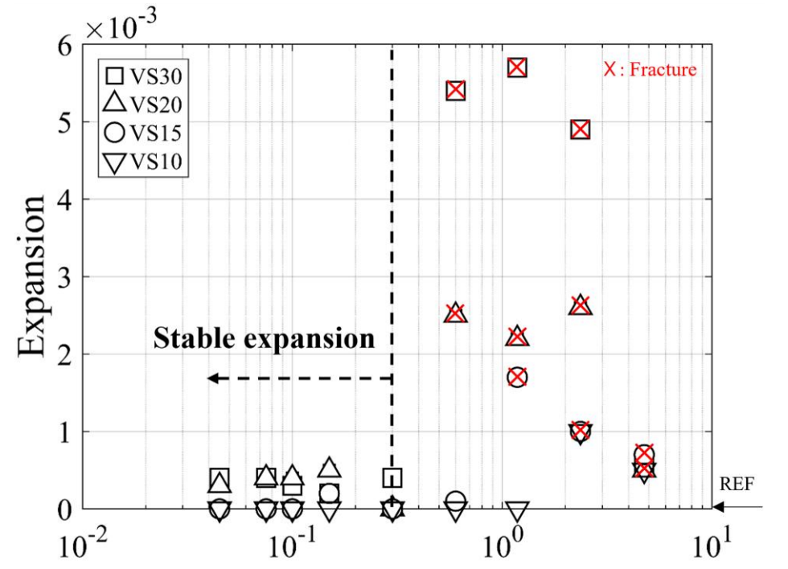
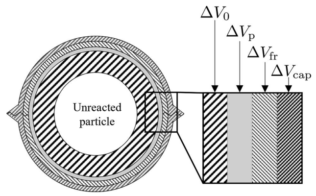
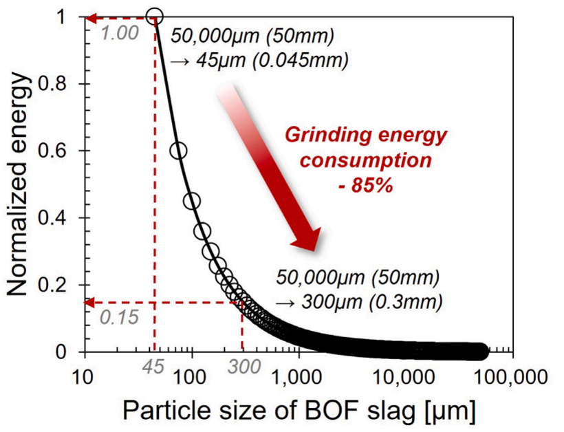

## An industrial byproduct with considerable potential

Basic oxygen furnace (BOF) slag is produced during steelmaking. It is available in large quantities and has considerable potential as a construction material.

There is, however, a fundamental problem.

BOF slag contains **free calcium oxide (free CaO)**. When free CaO reacts with water, calcium hydroxide is formed:

$$
\mathrm{CaO + H_2O \rightarrow Ca(OH)_2}.
$$

This reaction is accompanied by a substantial increase in solid volume.

When it occurs inside a hardened cementitious matrix, the reaction products may generate internal pressure, microcracking, pop-outs, and eventually macroscopic fracture.

This volume instability has been one of the principal obstacles to wider use of BOF slag in cementitious materials.

A straightforward solution would seem to be:

> **Grind the slag into a very fine powder.**

Fine steel slag has indeed been used successfully in cementitious materials. But BOF slag is difficult to grind, and the energy required for grinding increases rapidly as the target particle size becomes smaller.

This raises a more useful engineering question:

> **How fine does BOF slag actually need to be?**

The answer turns out to involve an interesting interaction among chemistry, transport, mechanics, and fracture.

---

## Particle size changes the nature of expansion

Our experiments examined steel slag over a broad particle-size range, from particles several millimeters in size down to particles smaller than 45 $\mu$m.

The result was not a simple relationship in which larger particles always produced proportionally larger expansion.

Instead, we observed a **particle-size-dependent damage threshold**.

Fine particles generally produced limited expansion while the specimens remained intact.

Beyond certain particle sizes, however, the behavior changed qualitatively. Expansion became much more pronounced and could be accompanied by cracking or complete fracture.

In the experimental/modeling study, the observed threshold particle sizes for abrupt expansion and fracture under the prescribed accelerated curing condition were approximately

- 2.36 mm at 10% slag content,
- 1.2 mm at 15%,
- 0.6 mm at 20%, and
- 0.6 mm at 30%.

The threshold therefore depends not only on particle size but also on the **amount of slag present in the material**. :contentReference[oaicite:2]{index=2}

{fig-align="center" width="75%"}

As shown above, the transition is not gradual.

Below a certain particle size, expansion remains small and stable. Once the particle size exceeds a mixture-dependent threshold, the response changes qualitatively: expansion increases abruptly and may be accompanied by fracture.

This observation suggests that particle size is not merely a secondary parameter controlling reaction rate.

It governs whether the chemically generated expansion can be accommodated by the surrounding cementitious matrix.

---

## Why should particle size matter?

The chemical source of the problem is free CaO, but chemistry alone does not explain the experimental observations.

Suppose that a slag particle is embedded inside hardened cement paste.

Water reaches the particle and hydration begins. Reaction proceeds from the particle surface, and a reaction front gradually penetrates inward.

For a sufficiently small particle, a relatively large fraction of the particle can react while the reaction products are accommodated by available pore space in the surrounding matrix and within porous regions of the slag itself.

The resulting expansion is spatially distributed.

For a larger particle, the situation is different.

A substantial unreacted core remains while reaction products accumulate around the particle. Once the available space can no longer accommodate these products, internal pressure develops.

The sequence can be summarized as

$$
\text{free CaO hydration}
\rightarrow
\text{reaction products}
\rightarrow
\text{confinement}
\rightarrow
\text{internal pressure}
\rightarrow
\text{microcracking}.
$$

Thus, particle size does not simply change the amount of CaO available for reaction.

It changes **how the chemical reaction interacts mechanically with the surrounding material**.

The modeling study interprets this through the interaction of reaction-front progression, available pore volume, internal pressure, and fracture. :contentReference[oaicite:3]{index=3}

---

## From chemical reaction to fracture

To understand this mechanism quantitatively, we developed a simplified physics-based model.

The cementitious material is idealized as a collection of microcells, each containing a slag particle surrounded by hardened cementitious material.

As the reaction proceeds, the chemically generated volume must be accommodated somewhere.

Conceptually, the volume compatibility can be written as

$$
\Delta V_{\mathrm{che}}
=
\Delta V_0
+
\Delta V_p
+
\Delta V_{\mathrm{fr}}
+
\Delta V_{\mathrm{cap}},
$$

where

- $\Delta V_{\mathrm{che}}$ is the volume generated by chemical reaction,
- $\Delta V_0$ is the original volume associated with the reacted material,
- $\Delta V_p$ represents compressive deformation,
- $\Delta V_{\mathrm{fr}}$ represents volume associated with microfracturing, and
- $\Delta V_{\mathrm{cap}}$ represents reaction products accommodated by available pore space.

{fig-align="center" width="65%"}

The figure provides the mechanical core of the model.

The chemical reaction creates additional solid volume, but that additional volume does not automatically become macroscopic expansion.

Part of it may be accommodated by surrounding pores, part by compression, and part by cracking.

If sufficient pore volume is available,

$$
\Delta V_{\mathrm{cap}}
$$

can accommodate much of the reaction product and little macroscopic damage occurs.

If that capacity is exhausted, the excess reaction volume must be accommodated increasingly through deformation and fracture.

The chemical problem therefore becomes a **volume-compatibility problem** and ultimately a **fracture-mechanics problem**. :contentReference[oaicite:4]{index=4}

---

## Reaction fronts explain the size effect

Particle size also affects how much of a slag particle reacts during a given period.

The hydration process can be represented by a reaction front moving inward from the particle surface.

For small particles, the reaction front penetrates a relatively large fraction of the particle.

For large particles, a substantial unreacted core can remain.

This produces a nontrivial size effect because the expansion depends simultaneously on

$$
\text{particle size},
$$

$$
\text{reaction-front propagation},
$$

$$
\text{free CaO content},
$$

$$
\text{slag incorporation ratio},
$$

and

$$
\text{available pore space}.
$$

The homogenization model reproduced the observed transition from stable behavior to abrupt expansion reasonably well across different slag contents.

More importantly, the model provides a physical explanation for why a threshold particle size should exist. :contentReference[oaicite:5]{index=5}

---

## A second study isolates particle size more systematically

A subsequent experimental study focused specifically on BOF slag and classified it into nine particle-size fractions ranging from

$$
45~\mu\mathrm{m}
\quad \text{to} \quad
4750~\mu\mathrm{m}.
$$

The fractions were tested systematically at BOF slag incorporation ratios of 10% and 20%.

The experiments confirmed that the particle-size effect is strongly nonlinear.

Coarse particles produced localized hydration and concentrated expansive stresses. Cracking, pop-outs, and fracture followed.

Fine particles behaved quite differently. Their reactions were distributed more uniformly through the matrix, reducing the localization of expansive stresses.

Under the investigated conditions, all fractions of 600 $\mu$m and above fractured at 20% incorporation, and the 600 $\mu$m fraction exhibited particularly severe deterioration.

By contrast, controlling the particle size below approximately 300 $\mu$m substantially reduced expansion-induced cracking. :contentReference[oaicite:6]{index=6}

This confirms an important point:

> **The problem is not simply how much the slag reacts. It is where and how the expansion generated by that reaction is accommodated.**

---

## Free CaO provides the potential; particle size governs the damage

The second study also helps separate the chemical and mechanical roles.

After all size fractions were ground to a common size for measurement, the free CaO content remained approximately constant across the original particle-size fractions.

Yet the expansion and cracking behavior varied strongly with particle size. :contentReference[oaicite:7]{index=7}

This suggests a useful distinction:

> **Free CaO determines the potential for expansion, whereas particle size strongly influences how that potential is expressed mechanically.**

A coarse particle may generate localized expansive pressure and cracking.

A fine particle with similar free CaO content may react in a more distributed manner and remain comparatively stable.

This is why particle-size control can be effective even without eliminating free CaO completely.

---

## Expansion is not the only benefit

Reducing particle size also affected mechanical performance.

The 28-day compressive strength increased as BOF slag particle size decreased, with a pronounced improvement for particle sizes below approximately 300 $\mu$m.

This size range is particularly interesting because it coincides approximately with the range in which expansion-induced damage becomes much easier to control. :contentReference[oaicite:8]{index=8}

Particle-size reduction can therefore provide two benefits simultaneously:

1. mitigation of expansion-induced cracking, and
2. improvement of compressive strength.

But there is a cost.

---

## Why not simply grind everything to 45 μm?

Grinding becomes increasingly demanding as particle size decreases.

Using Bond's law, the grinding-energy requirement may be represented approximately as

$$
W
\propto
\frac{1}{\sqrt{d_p}}
-
\frac{1}{\sqrt{d_f}},
$$

where $d_f$ is the feed particle size and $d_p$ is the final particle size.

The important feature of this relationship is its nonlinearity.

The energy demand rises rapidly as the desired product size becomes very small.

{fig-align="center" width="75%"}

This curve reveals why the particle-size threshold matters economically.

For the Bond-law estimate used in the BOF slag study, reducing a representative 50 mm feed to approximately 300 $\mu$m requires only about **15% of the normalized grinding energy** needed to grind it all the way to 45 $\mu$m.

Equivalently, stopping near 300 $\mu$m corresponds to an approximately **85% reduction in grinding-energy demand** relative to ultrafine grinding to 45 $\mu$m under this estimate. :contentReference[oaicite:9]{index=9}

Therefore, grinding BOF slag much more finely than necessary can consume considerable additional energy while producing only a limited additional benefit in expansion mitigation.

The engineering objective should not be

> **as fine as possible,**

but rather

> **fine enough to suppress harmful localized expansion.**

---

## Particle size and slag content must be designed together

The experiments also reveal an important qualification.

The recommended particle size cannot be specified without considering the incorporation ratio.

In the BOF slag study, a practical interpretation under the investigated conditions was approximately:

| BOF slag incorporation | Practical particle-size target |
|---|---:|
| about 10% | below 300 $\mu$m |
| approaching 20% | about 75 $\mu$m or finer |

The 10% mixtures showed stable behavior without macroscopic damage when the particle size was controlled below about 300 $\mu$m, whereas the higher incorporation level required finer control. :contentReference[oaicite:10]{index=10}

Why does increasing the slag content require finer particles?

At higher incorporation ratios, more slag particles react simultaneously and less matrix volume is available around each particle to accommodate the reaction products.

The same particle size can therefore become more damaging as the slag content increases.

This means that particle size and incorporation ratio should be treated as **coupled design variables**.

---

## The engineering design problem

The practical utilization of BOF slag can therefore be viewed as an optimization problem involving three competing requirements:

$$
\boxed{
\text{Expansion stability}
\quad+\quad
\text{Mechanical performance}
\quad+\quad
\text{Grinding efficiency}
}
$$

Very coarse particles require little processing but may generate localized expansion and fracture.

Extremely fine particles can suppress expansion effectively but require substantially more grinding energy.

Between these extremes lies a useful engineering range.

For the BOF slag and mixture conditions investigated in our studies, particle sizes below approximately 300 $\mu$m provide an important practical range for moderate incorporation, while higher slag contents may require considerably finer particles. :contentReference[oaicite:11]{index=11}

This distinction is essential.

The value of 300 $\mu$m should therefore **not** be interpreted as a universal material constant or a code limit.

The threshold can change with

- free CaO content,
- slag incorporation ratio,
- mixture design,
- matrix porosity,
- curing temperature,
- moisture conditions, and
- other material characteristics.

The experimental studies themselves were conducted under prescribed accelerated curing conditions, so the identified thresholds should be understood within that context. :contentReference[oaicite:12]{index=12} :contentReference[oaicite:13]{index=13}

---

## A broader mechanics perspective

This problem illustrates something more general about engineering materials.

A chemical reaction alone does not determine structural damage.

Damage occurs when the deformation generated by that reaction interacts with

- geometry,
- confinement,
- transport,
- available pore space,
- material stiffness, and
- fracture resistance.

BOF slag expansion is therefore not merely a materials-chemistry problem.

It is a **chemo-mechanical problem**.

Understanding that coupling changes the engineering question from

> "How can we eliminate the reaction?"

to

> "How can we control the reaction and its mechanical consequences?"

That distinction opens a more practical route toward utilization of industrial byproducts.

---

## Practical implication

The central message of these studies is simple:

> **BOF slag does not necessarily need to be pulverized into an ultrafine powder before it can be used in cementitious materials.**

Instead, particle size can be designed so that expansive reaction products are accommodated without producing damaging stress concentrations.

Under the investigated conditions, approximately 300 $\mu$m emerges as an important practical scale for moderate incorporation, while higher slag contents require finer control.

This provides a route toward using BOF slag with less grinding energy while maintaining expansion stability and useful mechanical performance.

In other words:

> **Do not grind BOF slag as finely as possible. Grind it as finely as necessary.**

---

## Further reading

This article explains results developed in the following studies:

**Seo, S., Lee, O., Lee, Y., Zhu, X., & Zi, G. (2026).**  
*Particle-size dependent expansion of cement composites incorporating steel slag.*  
Journal of Sustainable Cement-Based Materials, 15(6), 2001–2014.  
DOI: 10.1080/21650373.2026.2625184

**Lee, Y., Seo, S., Yi, C., Lee, S.-H., & Zi, G. (2026).**  
*Governing role of particle size in expansion of cement composites incorporating basic oxygen furnace slag.*  
Case Studies in Construction Materials, 25, e06428.  
DOI: 10.1016/j.cscm.2026.e06428
