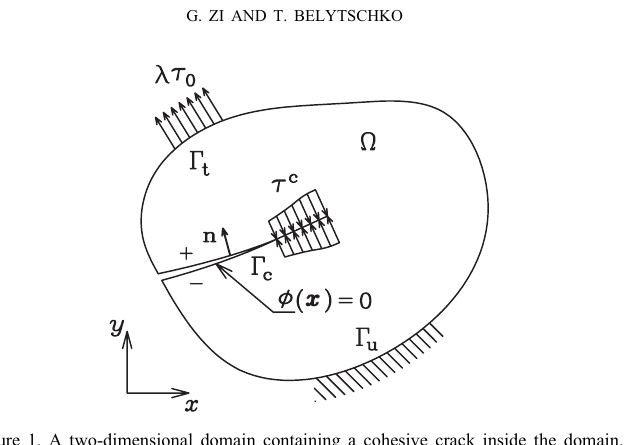
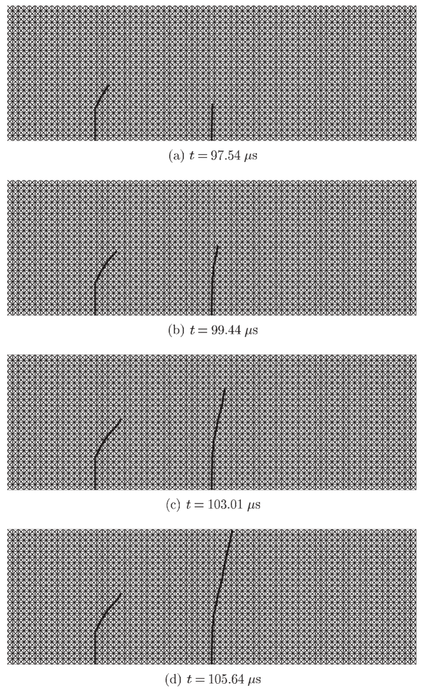

<div class="language-switch">[English](index.qmd) | **한글**</div>

**계산파괴역학 시리즈:** 7편 중 1편 · [다음: XFEM →](../xfem-crack-through-mesh/index-ko.qmd)

균열은 계산역학에서 상당히 특이한 문제를 만든다.

균열이 생기기 전에는 보통 물체 내부의 연속적인 변위장을 근사한다. 그런데 균열이 생기면 내부의 균열면을 사이에 두고 변위장이 불연속이 될 수 있다. 더구나 균열은 성장하면서 방향을 바꾸고, 분기하고, 다른 균열과 만나기도 하며, 애초에 균열을 포함하도록 만들어지지 않은 요소를 가로질러 지나가기도 한다.

**실제 물체 내부의 위상은 계속 변하는데 수치해석의 요소망은 그대로 있고 싶어 한다.**

바로 이것이 계산파괴역학의 근본적인 어려움이다.

나는 거의 20년 이상 계산파괴역학 분야의 연구를 활발하게 수행했다. 이 분야에서 수행한 연구의 상당 부분은 **확장유한요소법(extended finite element method, XFEM)**과 이에 대응하는 무요소법인 **확장무요소법(extended element-free Galerkin method, XEFG)**에 관한 것이었다. 동적 파괴, 점성균열(cohesive crack), 다중균열 성장, 3차원 균열 추적, phantom-node 방법 등도 함께 다루었다.

지금 돌아보면 이 연구들을 논문 하나씩 설명하는 것보다 다음의 공학적인 질문으로 연결해서 보는 것이 훨씬 유용하다.

> **수치적 이산화와 독립적으로 움직이는 균열을 근사함수는 어떻게 표현할 수 있을까?**

이 질문이 이 연구들을 관통한다.

## 일반적인 유한요소법에서는 왜 균열을 다루기 어려운가?

일반적인 유한요소 근사는

$$
\mathbf{u}^h(\mathbf{x})
=
\sum_I N_I(\mathbf{x})\mathbf{u}_I
$$

와 같이 요소망에 연결된 형상함수로 변위장을 근사한다. 변위장이 이 근사에서 가정하는 정도의 연속성을 가지고 있다면 매우 효과적이다.

문제는 균열이 생긴 다음이다.

균열면을 사이에 두고 변위는 점프할 수 있다.

$$
[\![\mathbf{u}]\!] \neq \mathbf{0}.
$$

또한 고전적인 균열선단 부근에서는 응력과 변형률에 매우 큰 구배 또는 특이한 점근거동이 나타날 수 있다.

균열이 요소 경계만 따라가도록 제한하면 균열을 표현하기는 쉽다. 하지만 그 순간 요소망의 방향이 균열경로에 영향을 주기 시작한다. 반대로 균열이 요소를 임의의 방향으로 가로지를 수 있게 하려면 **원래 요소망의 연결성에는 들어 있지 않은 불연속을 근사함수가 표현해야 한다.**

전통적으로 이를 해결하는 한 가지 방법은 요소망 재생성(remeshing)이었다.

```text
균열 성장
→ 요소망 수정
→ 상태변수 투영
→ 다시 해석
→ 균열 성장
→ 다시 요소망 생성
```

물론 이 방법으로 해석할 수 있다. 하지만 균열이 성장할 때마다 요소망을 다시 만들면 이전 요소망과 새로운 요소망 사이에서 상태변수를 투영해야 한다. 이력에 의존하는 문제는 더 복잡해지고, 균열이 여러 개이거나 분기하거나 동적으로 전파되면 문제는 훨씬 어려워진다.

XFEM의 더 근본적인 생각은 **균열의 모든 기하정보를 요소망 자체가 담당하도록 하지 말자**는 것이었다.

## 핵심 아이디어: 균열과 요소망을 분리한다

일반적인 유한요소 근사공간에 불연속에 관한 정보를 가진 함수를 부가할 수 있다.

$$
\mathbf{u}^h(\mathbf{x})
=
\sum_I N_I(\mathbf{x})\mathbf{u}_I
+
\sum_{J\in\mathcal{N}_c}N_J(\mathbf{x})\Psi_J(\mathbf{x})\mathbf{a}_J
$$

첫 번째 항은 일반적인 유한요소 근사이고 두 번째 항은 균열을 표현하기 위한 추가 자유도와 함수를 제공한다.

여기서 중요한 것은 식 자체보다 개념이다.

```text
배경 요소망
    물체를 이산화

변위공간의 확충
    일반 근사에 빠져 있는 균열 정보를 표현
```

따라서 균열이 요소 내부를 지나가더라도 요소 경계가 균열과 일치하도록 다시 만들 필요가 없다.

{#fig-domain-crack fig-align="center" width="62%"}

그림 [-@fig-domain-crack]은 단순해 보이지만 관점의 중요한 변화를 담고 있다.

**균열은 물체 내부의 기하학적 대상이다. 요소망은 수치적인 이산화 도구다. 둘이 같은 대상일 필요는 없다.**

> **요소망이 균열을 억지로 따라가게 하지 말고, 근사함수에 균열을 요소망과 독립적으로 표현할 수 있는 정보를 주자.**

이 생각은 계산파괴역학에서 매우 강력한 개념이 되었다.

## 균열 내부보다 균열선단이 왜 더 어려운가?

완전히 발달한 변위 점프를 표현하는 것은 비교적 간단하다. 문제는 균열선단이다.

열린 균열면에서는 양쪽 면이 서로 분리되어 있다. 그러나 균열선단에서는 균열개구가 적절하게 닫혀야 한다. 따라서 균열이 통과하는 모든 요소에 똑같은 불연속 함수를 넣는 것만으로는 균열선단의 운동학을 제대로 표현할 수 없다.

Ted Belytschko와 수행한 초기 연구 중 하나가 바로 이 점성균열 문제였다. 균열이 요소 내부에서 끝나면서도 필요한 균열폐합 조건을 만족하도록 새로운 균열선단 요소를 개발했다.

목표는 실용적이었다.

> **확충된 근사공간의 장점을 유지하면서 임의의 균열성장을 더 쉽게 구현하는 것.**

균열 내부는 불연속을 표현하는 문제다. 균열선단은 **불연속이 끝나는 문제인 동시에 균열이 어디로 성장할 것인가의 문제**다.

## 균열의 기하정보도 움직여야 한다

근사함수가 균열을 표현할 수 있게 되면 바로 다음 질문이 생긴다.

> 균열은 어디에 있는가?

성장하는 균열에서는 균열의 기하형상 자체가 계속 변한다. 레벨셋(level set)은 요소망의 위상을 계속 다시 만들지 않고 절점에 정의된 스칼라장으로 균열을 표현할 수 있기 때문에 유용하다.

```text
유한요소망
    ↓
근사공간

레벨셋 또는 기하학적 표현
    ↓
균열 위치와 균열선단

파괴기준
    ↓
균열이 다음에 진행할 위치
```

따라서 계산파괴역학은 단순히 응력을 계산하는 문제가 아니다. **진화하는 기하형상을 표현하는 방법도 필요하다.**

## 동적 파괴에서는 문제가 더 어려워진다

정적 균열성장에서는 파괴기준을 확인하고 균열을 조금씩 증가시키는 방식으로 해석할 수 있다. 동적 파괴에서는 관성이 중요한 상태에서 균열 자체가 전파된다.

그러면 균열은 언제 시작하는가, 어느 방향으로 얼마나 빠르게 진행하는가, 파괴에너지는 어떻게 소산되는가, 시간적분 과정에서 불연속을 어떻게 갱신하는가 등의 문제가 동시에 연결된다.

우리의 동적 파괴 XFEM 연구에서는 단위 분할(partition of unity) 개념에 의한 변위공간의 확충과 레벨셋을 함께 사용하여 재요소망 생성 없이 임의의 균열경로를 표현했다.

{#fig-dynamic-crack fig-align="center" width="78%"}

그림 [-@fig-dynamic-crack]에서 계산역학적인 아이디어는 분명하다.

**균열은 움직이는데, 배경 요소망은 움직이지 않는다.**

## 다중균열은 기하형상뿐 아니라 위상을 바꾼다

하나의 매끄러운 균열은 시작일 뿐이다. 실제 파괴에서는 여러 균열이 발생하고, 경쟁하고, 서로 차폐하며, 합체하고, 분기하고, 접합하여 결국 연결된 파괴 네트워크를 만들 수 있다.

두 균열이 만나면 단순히 균열의 위치만 변하는 것이 아니라 **불연속 네트워크의 위상이 변한다.** 좋은 수치기법이라면 위상이 바뀔 때마다 완전히 다른 알고리즘을 요구해서는 곤란하다.

변위공간의 확충을 사용하는 방법이 매력적이었던 이유 중 하나가 여기에 있다. 요소망은 배경 구조로 그대로 두고 불연속 네트워크만 별도로 진화시킬 수 있기 때문이다.

## XFEM에서 XEFG로

다음 질문은 자연스러웠다.

> 유한요소 근사공간에 불연속 정보를 부가할 수 있다면 같은 개념을 무요소 근사에도 적용할 수 있지 않을까?

이 질문에서 **확장무요소법(extended element-free Galerkin method, XEFG)** 연구가 시작되었다.

무요소법은 고정된 요소 연결성을 사용하지 않고 입자 주변의 영향영역(domain of influence)으로 근사함수를 만든다. XEFG는 단위의 분할을 이용한 변위공간 확충 개념을 이 무요소 근사에 도입한다.

{#fig-xfem-xefg fig-align="center" width="78%"}

무요소법에서는 입자의 support가 균열에 의해 완전히 잘릴 수도 있고 일부만 잘릴 수도 있으며 내부에 균열선단을 포함할 수도 있다. 따라서 운동학적인 문제가 유한요소법과 조금 다르다.

우리의 XEFG 연구에서는 정적 및 동적 점성균열을 다루었고 이후 3차원 균열의 발생, 성장, 분기와 접합까지 확장했다.

물리적인 문제는 그대로였다. **수치적인 표현방법이 달라진 것이다.**

## 왜 branch enrichment가 중요한 문제가 되었을까?

선형탄성파괴역학의 고전적인 XFEM에서는 균열선단의 점근해에 근거한 branch function을 사용하는 경우가 많다. 점근장이 실제 물리현상에 적합하다면 매우 높은 정확도를 얻을 수 있다.

하지만 점성파괴에서는 다른 질문을 해야 한다.

> 균열선단 거동이 고전적인 traction-free LEFM 특이장이 아니라 점성법칙에 의해 지배된다면, 고전적인 branch enrichment를 항상 넣어야 할까?

우리의 연구에서는 기존의 균열선단 branch enrichment 없이 점성균열을 표현하는 방법도 연구했다. 단순히 식을 짧게 만들기 위한 것이 아니었다. **가정한 파괴역학과 수치적인 표현이 더 잘 맞도록 하려는 것이었다.**

> **확충함수는 단순한 수치적인 기교가 아니다. 해에 대해 우리가 미리 알고 있는 정보를 근사공간에 넣는 것이다.**

따라서 어떤 함수를 부가할 것인지는 표현하려는 물리현상과 부합해야 한다.

## 3차원 파괴에서는 또 다른 어려움이 발생한다

2차원에서 균열은 선으로 표현된다. 3차원에서 균열은 면으로 형성되고 균열선단(crack front)은 커브로 형성된다.

얼핏 보면 차원이 하나 늘어난 것뿐이지만 수치적으로는 움직이는 균열면과 균열선단, 국부 방향, 성장 방향, 곡면, 분기와 접합을 모두 다루어야 한다.

문제는 단순히 계산량이 많아진다는 것이 아니다. **기하학적 일관성을 유지해야 한다.** 균열면을 잘못 추적하면 응력해가 상당히 정확하더라도 인위적인 꺾임, 불연속적인 법선벡터, 잘못된 접합 위상이 만들어질 수 있다.

그래서 3차원 계산파괴역학은 역학문제이면서 동시에 계산기하학의 문제이기도 하다.

## 다른 균열 표현법이 등장한 데에는 이유가 있다

XFEM과 XEFG가 계산파괴역학의 끝은 아니었다. 후속 연구에서는 phantom-node, cracking-particle, extended isogeometric formulation, 멀티스케일 결합, peridynamics, phase-field fracture 등 여러 방법을 연구했다.

이 방법들의 차이는 상당 부분 **불연속 정보를 어디에 표현할 것인가**에 있다.

날카로운 균열을 명시적으로 다루는 확충기법은 균열을 기하학적으로 날카로운 불연속으로 유지하면서 그 주위의 근사공간을 수정한다. Phase field는 날카로운 균열을 좁고 연속적인 파괴장으로 바꾼다. Peridynamics는 비국소 상호작용으로 역학 자체를 다시 기술한다. Phantom node는 명시적인 확충함수 대신 서로 겹쳐진 요소 표현으로 분리된 재료영역을 나타낸다.

이것들은 단순히 서로 경쟁하는 수치해석 기법의 이름이 아니다.

> **변화하는 불연속을 수치모델 안에서 어떻게 표현할 것인가?**

방법의 이름보다 이 질문이 더 중요하다.

## 본 저자의 계산 파괴역학 연구를 연결해 보면

지금까지의 연구를 돌아보면 비교적 분명한 흐름이 보인다.

### 1. 임의의 균열을 요소망과 독립적으로 만든다

초기 XFEM 연구에서는 재요소망 생성 없이 점성 균열선단, 동적 균열, 다중균열 성장을 다루었다.

### 2. 균열이 성장하고 서로 만날 때도 표현이 견고해야 한다

균열 접합, 합체, 동적 전파와 여러 균열선단 처리법으로 연구가 확장되었다.

### 3. 변위공간 확충 개념을 무요소 근사로 옮긴다

XEFG에서는 불연속 정보를 element-free Galerkin 근사에 도입하고 정적, 동적 및 3차원 점성파괴로 확장했다.

### 4. 기하형상과 적용영역을 넓힌다

후속 연구에서는 3차원 균열면, 철근콘크리트, 쉘, 압전재료와 멀티스케일 문제를 다루었다.

### 5. 다른 파괴 표현법을 탐색한다

Phantom node, cracking particle, peridynamics, phase field는 계산파괴역학에서 균열을 표현하는 방법이 어떻게 다양해졌는지를 보여준다.

그래서 내가 수행한 계산 파괴역학 연구를 한 편의 글에 모두 압축해서 쓰는 것은 적절하지 않다고 생각한다. 이 글은 그 시리즈로 들어가는 입구다.

## 계산파괴역학 시리즈

**1. 계산파괴역학은 왜 어려운가?**  
*이 글.* 불연속, 진화하는 기하형상, 재요소망 생성, 변위공간 확충, XFEM에서 XEFG와 후속 파괴표현으로 이어지는 전체적인 흐름을 설명한다.

**2. [XFEM은 어떻게 균열이 요소망을 가로질러 지나가게 하는가?](../xfem-crack-through-mesh/index-ko.qmd)**  
일반 유한요소로 표현할 수 없는 변위 점프와 균열선단 운동학을 어떻게 표현하는지 설명한다.

**3. [왜 XFEM을 무요소법으로 확장했는가?](../xefg-why-meshfree/index-ko.qmd)**  
같은 확충 개념이 유한요소에서 입자의 영향영역으로 어떻게 옮겨가는지 설명한다.

**4. [여러 균열은 어떻게 분기하고 만나 파괴 네트워크를 만드는가?](../multiple-cracks-fracture-network/index-ko.qmd)**  
다중균열 성장, 피로, 경쟁, 분기, 합체, 접합, 위상 진화와 3차원 균열 추적을 다룬다.

**5. [균열을 표현하려면 반드시 변위공간을 부가적으로 확충해야 하는가?](../alternative-crack-representations/index-ko.qmd)**  
Phantom node, cracking particle, peridynamics, phase field를 통해 여러 균열 표현법을 비교한다.

**6. 계산 파괴역학은 어떻게 서로 다른 스케일과 구조형식으로 확장되는가?**  
철근콘크리트, 압전재료, 쉘, 멀티스케일 결합, 원자모델, 그래핀과 나노복합재를 다룬다.

**7. 확충기법은 계산역학에 무엇을 남겼는가?**  
근사공간, 사전 물리정보, 기하와 독립적인 이산화라는 관점에서 파괴역학을 넘어 확충기법이 계산역학에 남긴 의미를 돌아본다.

> **시리즈의 핵심 원칙: 요소망은 수치적인 뼈대일 뿐이다. 근사함수가 역학을 표현해야 한다.**

## 더 일반적인 계산역학의 교훈

XFEM에서 가장 흥미로운 점은 단순히 재요소망 생성 없이 균열을 해석할 수 있다는 것이 아니다.

더 일반적인 계산역학의 원리가 그 안에 있다.

> **일반적인 근사함수로 해의 중요한 특성을 표현할 수 없다면, 이산화가 물리현상을 억지로 따라가게 하지 말고 빠져 있는 물리정보를 근사공간에 넣어라.**

파괴에서는 그 정보가 불연속이며, 사용하는 방법에 따라 균열선단 거동도 포함된다. 다른 문제에서는 계면, 특이성, 국부화 모드 또는 우리가 이미 알고 있는 해의 다른 특성일 수 있다.

계산 파괴역학에서 발전한 생각이 파괴문제를 넘어 중요한 이유가 여기에 있다.

**요소망은 수치적인 뼈대일 뿐이다.**

**근사함수가 역학을 표현해야 한다.**

---

## Original research

Zi, G., & Belytschko, T. (2003).  
**New crack-tip elements for XFEM and applications to cohesive cracks.**  
*International Journal for Numerical Methods in Engineering, 57*, 2221-2240.  
https://doi.org/10.1002/nme.849

Belytschko, T., Chen, H., Xu, J., & Zi, G. (2003).  
**Dynamic crack propagation based on loss of hyperbolicity and a new discontinuous enrichment.**  
*International Journal for Numerical Methods in Engineering, 58*, 1873-1905.  
https://doi.org/10.1002/nme.941

Zi, G., Song, J.-H., Budyn, E., Lee, S.-H., & Belytschko, T. (2004).  
**A method for growing multiple cracks without remeshing and its application to fatigue crack growth.**  
*Modelling and Simulation in Materials Science and Engineering, 12*, 901-915.  
https://doi.org/10.1088/0965-0393/12/5/009

Budyn, E., Zi, G., Moës, N., & Belytschko, T. (2004).  
**A method for multiple crack growth in brittle materials without remeshing.**  
*International Journal for Numerical Methods in Engineering, 61*, 1741-1770.  
https://doi.org/10.1002/nme.1130

Lee, S.-H., Song, J.-H., Yoon, Y.-C., Zi, G., & Belytschko, T. (2004).  
**Combined extended and superimposed finite element method for cracks.**  
*International Journal for Numerical Methods in Engineering, 59*, 1119-1136.  
https://doi.org/10.1002/nme.908

Zi, G., Chen, H., Xu, J., & Belytschko, T. (2005).  
**The extended finite element method for dynamic fractures.**  
*Shock and Vibration, 12*, 9-23.

Rabczuk, T., & Zi, G. (2007).  
**A meshfree method based on the local partition of unity for cohesive cracks.**  
*Computational Mechanics, 39*, 743-760.  
https://doi.org/10.1007/s00466-006-0067-4

Zi, G., Rabczuk, T., & Wall, W. (2007).  
**Extended meshfree methods without branch enrichment for cohesive cracks.**  
*Computational Mechanics, 40*, 367-382.  
https://doi.org/10.1007/s00466-006-0115-0

Rabczuk, T., Bordas, S., & Zi, G. (2007).  
**A three-dimensional meshfree method for continuous multiple-crack initiation, propagation and junction in statics and dynamics.**  
*Computational Mechanics, 40*, 473-495.  
https://doi.org/10.1007/s00466-006-0122-1

Bordas, S., Rabczuk, T., & Zi, G. (2008).  
**Three-dimensional crack initiation, propagation, branching and junction in non-linear materials by an extended meshfree method without asymptotic enrichment.**  
*Engineering Fracture Mechanics, 75*, 943-960.

Rabczuk, T., Zi, G., Gerstenberger, A., & Wall, W. A. (2008).  
**A new crack tip element for the phantom-node method with arbitrary cohesive cracks.**  
*International Journal for Numerical Methods in Engineering, 75*, 577-599.  
https://doi.org/10.1002/nme.2273

Rabczuk, T., Bordas, S., & Zi, G. (2010).  
**On three-dimensional modelling of crack growth using partition of unity methods.**  
*Computers & Structures, 88*, 1391-1411.
