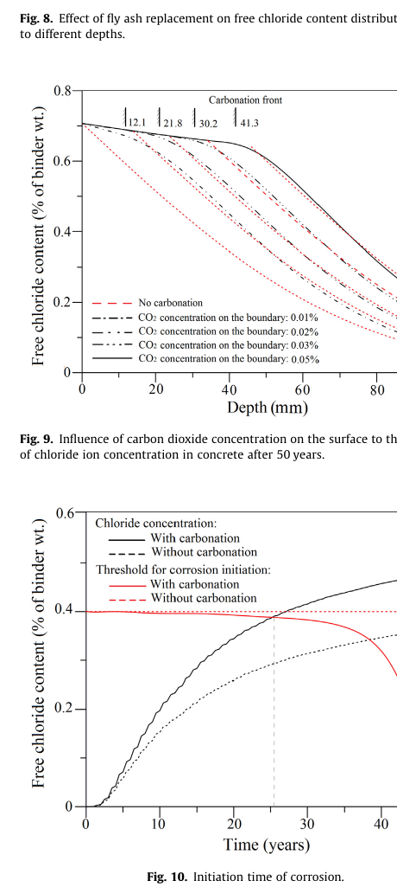
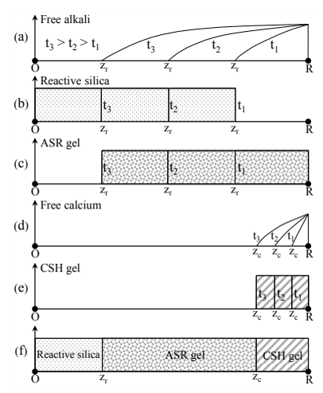
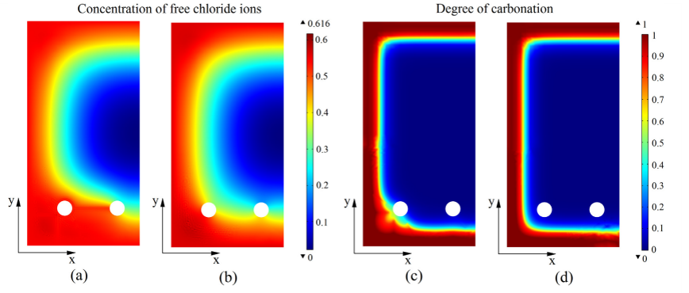
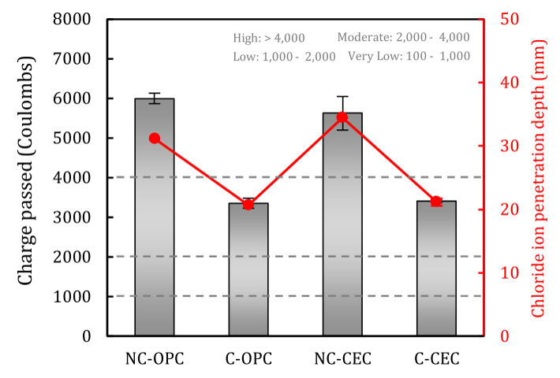

<div class="language-switch">[English](index.qmd) | **한글**</div>

콘크리트 내구성을 배울 때는 보통 열화현상을 하나씩 나누어 공부한다.

염화물 침투를 공부한다.  
탄산화를 공부한다.  
동결융해를 공부한다.  
알칼리-실리카 반응(ASR)을 공부한다.  
철근부식을 공부한다.

교육에서는 이렇게 나누는 것이 편하다. 실험에서도 한 가지 현상만 떼어내어 시험하는 경우가 많다.

그런데 실제 콘크리트는 우리가 교과서의 어느 장을 공부하고 있는지 모른다.

실제 구조물에서는 **역학적 변형, 수분 이동, 이온 이동, 기체 확산, 화학반응, 수화, 고체의 용해와 석출, 철근부식, 균열이 동시에 일어난다.**

더 중요한 것은 이 현상들이 서로 영향을 준다는 점이다.

균열이 생기면 물질이동이 달라진다.  
물질이동이 달라지면 화학반응이 달라진다.  
화학반응은 공극구조를 바꾼다.  
바뀐 공극구조는 다시 물질이동을 바꾼다.  
반응생성물이 팽창하면 응력이 생긴다.  
그 응력이 다시 균열을 만든다.

그래서 콘크리트 내구성 문제는 독립적인 확산방정식 몇 개를 각각 푸는 것보다 훨씬 어렵다.

지난 10여 년 동안 내가 수행한 연구의 상당 부분도 이 연성 문제의 서로 다른 조각들을 다루어 왔다. 탄산화와 염화물 침투에서 시작해 철근부식, 알칼리-실리카 반응(ASR)까지 이어졌다. 이 문제가 여전히 흥미로운 이유는 핵심적인 어려움이 아직 그대로 남아 있기 때문이다.

> **콘크리트 내구성이란 물질이동, 화학반응, 역학적 거동이 서로 영향을 주는 가운데 반응성 다공질 고체가 계속 변해가는 과정이다.**

이 글에서는 이 관점이 왜 중요한지 살펴본다.

## 기존의 그림은 너무 단순하다

가장 단순한 내구성 모델은 흔히 Fick 확산방정식에서 시작한다.

$$
\frac{\partial C}{\partial t}
=
\nabla \cdot \left(D\nabla C\right),
$$

여기서 $C$는 이동하는 물질의 농도이고 $D$는 확산계수이다.

매우 유용한 식이다.

그런데 $D$는 정말 일정한 값일까?

탄산화, 수화, 석출, 용해 또는 균열 때문에 공극구조가 변한다면 확산계수도 변해야 한다.

그렇다면 이동하는 물질은 정확히 무엇인가?

염화물은 공극수에 자유 염화물로 존재할 수도 있고 화학적으로 결합된 상태로 존재할 수도 있다. 탄산화가 진행되면 염화물 결합능력이 달라지고 이미 결합되어 있던 염화물이 다시 방출될 수 있다. 수분 상태는 기체와 이온이 이동할 수 있는 통로를 바꾸고, 온도는 반응속도와 이동속도를 모두 바꾼다.

철근의 부동태가 깨지는 임계조건조차 공극수의 화학상태가 변하면서 달라질 수 있다.

따라서 실제 문제는 다음에 더 가깝다.

```text
환경
    ↓
수분 / 이온 / 기체 / 열
    ↓
공극을 통한 물질이동
    ↓
화학 및 전기화학 반응
    ↓
고체 생성·용해와 공극구조 변화
    ↓
응력, 변형률, 팽창, 균열
    ↓
새로운 이동 경로
    ↺
```

여기서 중요한 것은 마지막 화살표다.

**확산이 일어나는 재료 자체가 계속 변하고 있다.**

## 예 1: 탄산화와 염화물 침투는 독립적이지 않다

탄산화와 염화물 침투는 이 문제를 가장 분명하게 보여주는 예 중 하나다.

일반적인 내구성 평가는 탄산화 깊이와 염화물 농도분포를 각각 계산한 뒤, 각각을 부식 개시 기준과 비교할 수 있다.

이 방법에는 탄산화가 염화물 이동을 크게 바꾸지 않는다는 가정이 숨어 있다.

하지만 탄산화는 콘크리트의 화학상태와 미세구조를 바꾼다.

우리의 탄산화-염화물 연성 모델에서는 이산화탄소, 염화물이온, 수분, 열의 이동을 함께 고려했다. 탄산화에 따른 공극구조와 염화물 결합능력의 변화도 포함했다.

특히 중요한 메커니즘 중 하나는 탄산화 과정에서 염화물을 포함한 Friedel's salt가 분해되는 것이다. 화학적으로 결합되어 있던 염화물이 다시 공극수로 방출될 수 있다.

개념적으로 쓰면,

$$
\text{결합 염화물}
\;\xrightarrow{\text{탄산화}}\;
\text{공극수의 자유 염화물}.
$$

두 열화 메커니즘을 독립적으로 풀면 이 현상의 중요성을 놓치기 쉽다.

철근 위치의 염화물 농도는 표면에서 들어오는 염화물만으로 결정되지 않는다. 콘크리트 내부에서 일어나는 화학반응이 **자유 염화물의 내부 공급원**을 만들 수도 있다.

{#fig-carbonation-chloride fig-align="center" width="78%"}

그림 @fig-carbonation-chloride에서 보아야 할 것은 탄산화와 염화물 침투가 동시에 존재한다는 사실 자체가 아니다.

**탄산화가 염화물 문제 자체를 바꾼다**는 점이다.

해당 연구의 예시 계산에서는 두 메커니즘을 함께 고려했을 때 계산된 부식 개시 시간이 약 40% 감소했다.

이 결과가 갖는 보다 일반적인 공학적 의미는 다음과 같다.

> **한 열화과정이 다른 열화과정을 지배하는 상태변수를 바꾼다면, 두 개의 독립적인 예측결과를 더하는 것만으로는 충분하지 않다.**

## 연성 내구성 문제에서는 열화현상의 이름보다 상태변수가 중요하다

*탄산화*, *염화물 침투*, *ASR*, *부식*이라는 말은 우리가 관찰하는 열화현상을 구분하는 데 유용하다.

하지만 계산에서는 시간에 따라 변하는 상태변수로 생각하는 편이 더 유용할 때가 많다.

예를 들면 다음과 같다.

- 수분함량 또는 상대습도
- 온도
- 이산화탄소 농도
- 자유 및 결합 염화물
- 산소 농도
- 알칼리 농도
- 칼슘 농도
- pH
- 탄산화 정도
- 공극률
- 대표 공극크기
- 반응생성물 함량
- 부식전류
- 역학적 손상
- 변형률과 응력

우리가 부르는 열화현상은 결국 이 상태변수들이 상호작용한 결과로 나타난다.

역학에서는 익숙한 사고방식이다.

구조공학자는 평형, 구성관계, 적합조건을 서로 무관한 세 개의 구조문제로 보지 않는다. 하나의 역학계에서 서로 다른 역할을 하는 관계들이다.

콘크리트 내구성도 비슷하게 볼 필요가 있다.

## 예 2: 부식이 균열을 만들고, 그 균열이 다시 부식을 가속한다

철근의 부동태가 깨진 뒤에는 연성이 더 강해진다.

부식은 전기화학 과정이다. 철이 용해되고, 산소가 음극반응에 참여하며, 부식생성물이 만들어진다. 녹은 소모된 철보다 더 큰 유효체적을 차지한다.

그 팽창이 주변 콘크리트에 압력을 가한다.

균열이 시작되면 물질이동 문제도 바뀐다.

균열은 수분, 산소, 이산화탄소, 염화물이온이 더 쉽게 이동할 수 있는 통로가 된다.

따라서 실제 과정은 단순히

```text
염화물
→ 부식
→ 균열
```

이 아니다.

오히려

```text
염화물 / 탄산화
→ 부동태 파괴
→ 전기화학적 부식
→ 녹의 팽창
→ 균열
→ 물질이동 가속
→ 부식상태 변화
→ 추가 균열
```

과 같다.

진짜 되먹임 고리(feedback loop)다.

우리의 2차원 역학-화학 철근부식 모델에서는 물질이동, 탄산화, 전기화학반응, 녹의 팽창, 콘크리트 균열을 연성하였다. 양극영역도 미리 고정하지 않고 국부적인 화학조건의 변화에 따라 발달하도록 하였다.

{#fig-crack-feedback fig-align="center" width="92%"}

그림 @fig-crack-feedback은 내가 보기에는 왜 콘크리트 내구성을 연성 문제로 보아야 하는지를 가장 분명하게 보여주는 사례 중 하나다.

균열이 단지 출력값이라면 물질이동을 먼저 계산하고 역학해석을 나중에 해도 된다.

하지만 균열이 물질이동을 바꾼다면 두 계산은 더 이상 일방향으로 분리될 수 없다.

해당 예제에서는 역학적 손상을 포함하자 철근의 일부 위치까지 염화물이 도달하는 속도가 크게 빨라졌다. 보고된 한 위치에서는 손상에 의한 되먹임을 포함했을 때 계산된 부식 개시 시간이 60년 이상에서 약 28년으로 감소했다.

정확한 수치는 그 특정 수치해석 예제에 해당한다.

더 중요한 것은 일반적인 원리다.

> **손상은 구조물 내부의 재료가 경험하는 환경 자체를 바꾼다.**

## 예 3: ASR은 화학, 수분, 역학이 순서대로 연결되어야 한다

알칼리-실리카 반응은 철근부식과 전혀 다른 현상처럼 보이지만, 역시 같은 다중물리 구조를 보여준다.

ASR은 반응성 실리카에 대한 화학적 공격에서 시작한다.

알칼리가 반응에 참여하여 ASR 생성물을 만들고, 이 생성물이 물을 흡수하면서 팽윤한다. 팽윤은 주변 고체골격에 압력을 가하고, 그 압력이 팽창과 손상을 일으킨다.

개념적인 과정은 다음과 같다.

```text
알칼리 이동
→ 실리카 반응
→ 기본 ASR 겔 형성
→ 수분 흡수
→ 겔 팽윤
→ 팽창압
→ 역학적 손상
```

우리의 화학-역학 ASR 모델에서는 **기본 겔의 형성**과 **겔의 팽윤**을 의도적으로 분리하였다.

첫 번째 과정은 주로 이용 가능한 알칼리의 양에 의해 지배된다.

두 번째 과정에는 수분이 필요하다.

이 구분이 중요한 이유는 반응생성물의 양과 그 생성물이 얼마나 팽윤할 수 있는가는 같은 물리량이 아니기 때문이다.

{#fig-asr-evolution fig-align="center" width="72%"}

그림 @fig-asr-evolution은 반응성 골재 규모에서 이러한 내부 변화를 보여준다.

칼슘은 여기에 또 하나의 연성을 추가한다. 반응층으로 들어간 칼슘은 알칼리를 치환하고 C-S-H와 유사한 생성물을 만들 수 있다. 겔의 화학조성은 팽윤능력에도 영향을 준다.

따라서 ASR을 이해하기 위해

> 알칼리가 얼마나 빨리 확산하는가?

만 물어서는 충분하지 않다.

다음 질문도 함께 해야 한다.

- 반응성 실리카가 얼마나 남아 있는가?
- 어떤 반응생성물이 만들어지는가?
- 겔에 얼마나 많은 물이 도달하는가?
- 생성물의 화학조성은 어떠한가?
- 그 생성물은 얼마나 팽윤할 수 있는가?
- 팽윤이 주변 콘크리트에 어느 정도의 응력을 만드는가?
- 그 결과 생긴 손상이 이후의 물질이동을 어떻게 바꾸는가?

어려운 것은 방정식 하나가 지나치게 복잡해서가 아니다.

**재료가 여러 스케일에서 동시에 변하고 있기 때문**이다.

## 수화와 나노스케일 고체 성장도 같은 그림 안에 있다

콘크리트는 물이 시멘트와 만나는 순간부터 변하기 시작한다.

수화반응은 물과 미수화 상을 소비하면서 새로운 고체를 만든다. 이 고체들이 점차 하중을 지지하는 골격과 공극망을 형성한다.

이후의 내구성 반응도 그 공극망을 계속 바꾼다.

탄산화는 일부 상을 용해하거나 소비하고 탄산칼슘을 석출할 수 있다.

ASR은 반응성 골재 주변 또는 내부에 반응생성물을 만든다.

부식은 철근-콘크리트 계면에서 고체 상태의 녹을 만든다.

충분히 작은 스케일에서 보면 내구성은 결국 **고체가 어디에서 성장하고, 용해되고, 재배열되는가**의 문제와 분리할 수 없다.

그래서 공극률 하나를 고정된 값으로 사용하는 것만으로는 충분하지 않은 경우가 많다.

총 공극률이 같은 두 콘크리트라도 공극의 연결성, 공극크기 분포, 포화도, 고체상의 분포가 다르면 거동이 달라질 수 있다.

물질이동에서 중요한 것은 빈 공간이 얼마나 많은가만이 아니다.

**그 빈 공간이 서로 연결된 이동경로를 만드는가**가 중요하다.

## 얼핏 모순처럼 보이는 결과: 탄산화가 염해를 가속할 수도, 염화물 저항성을 높일 수도 있다

연성 관점은 하나의 관찰된 메커니즘을 보편적인 규칙으로 일반화해서는 안 된다는 것도 보여준다.

성숙한 철근콘크리트를 대상으로 한 우리의 초기 연구에서는 탄산화가 염화물 결합, 공극구조, pH, 결합 염화물의 방출을 변화시켜 염화물 관련 부식을 가속할 수 있음을 보였다.

그런데 초기재령에 가속 탄산화를 의도적으로 적용하면 일부 콘크리트 시스템의 조직을 치밀하게 만들 수도 있다.

전기로슬래그를 사용한 carbon-eating concrete에 관한 최근 연구에서는 가속 탄산화로 표면 부근에 탄산칼슘이 풍부한 치밀한 층이 형성되고 공극체적이 감소했다. 탄산화한 시험체는 탄산화하지 않은 시험체보다 염화물 침투가 작았다.

{#fig-carbonation-beneficial fig-align="center" width="58%"}

여기서 중요한 점이 있다.

> 탄산화는 항상 염화물 침투를 악화시킨다.

라고 결론 내리는 것도 틀리고,

> 탄산화는 항상 염화물 저항성을 높인다.

라고 결론 내리는 것도 틀리다.

효과는 재료의 현재 상태와 그 상태에 도달한 경로에 따라 달라진다.

설계된 재료에 초기 가속 탄산화를 적용하면 치밀한 반응생성물이 만들어지고 표면 공극이 미세해질 수 있다.

반면 철근콘크리트가 환경에 장기간 노출되어 탄산화되면 알칼리도가 낮아지고, 염화물 결합상태가 변하며, 결합 염화물이 방출되고, 철근의 부동태 파괴에 기여할 수 있다.

둘 다 *탄산화*다.

하지만 **재료의 연성 상태(coupled state)**는 같지 않다.

그래서 메커니즘에 기반한 모델링이 필요하다.

## 콘크리트 내구성에는 여러 특성 스케일이 있다

또 하나의 어려움은 스케일이다.

나노 및 미시스케일에서는 다음을 볼 수 있다.

- 수화생성물
- 이온 결합
- 겔의 화학
- 석출과 용해
- 공극 형상

메조스케일에서는 다음이 중요할 수 있다.

- 골재
- 계면천이영역
- 국부적인 반응
- 분산된 미세균열

구조물 스케일에서는 다음을 보아야 한다.

- 피복두께
- 노출 경계조건
- 균열망
- 철근 배치
- 부식의 개시와 진행
- 강성과 하중지지능력
- 사용수명과 신뢰성

좋은 모델이라고 해서 모든 스케일을 명시적으로 해석할 필요는 없다.

그렇게 하면 계산 자체가 불가능한 경우가 많다.

진짜 어려운 문제는 **작은 스케일의 어떤 메커니즘을 큰 스케일 모델에서도 반드시 남겨야 하는가**를 결정하는 것이다.

예를 들어 탄산화로 결합 염화물이 방출되는 현상을 표현하기 위해 Friedel's salt 결정 하나하나를 해석할 필요는 없다.

하지만 그 방출 메커니즘은 거시적인 물질수지식에서 공급원 항(source term)으로 남아 있어야 할 수 있다.

ASR 분자 하나하나를 모델링할 필요도 없다.

그러나 반응생성물의 형성과 수분에 의한 팽윤이 서로 다른 관측 팽창거동을 지배한다면, 모델에서는 이 두 과정을 구분해야 한다.

이것이 **물리적 의미를 보존하는 모델 축소(model reduction)**다.

## 그렇다면 단일 열화 시험은 필요 없는가?

그렇지 않다.

단일 열화 시험은 반드시 필요하다.

염화물 이동시험은 물질이동 특성을 파악하는 데 유용하다.

탄산화 시험은 탄산화 저항성을 평가할 수 있다.

ASR 팽창시험은 골재의 반응성을 확인할 수 있다.

동결융해 시험은 배합별 성능을 비교할 수 있다.

문제는 **재료 특성평가**에서 **구조물 사용수명 예측**으로 넘어갈 때, 실험에서 분리해 놓은 열화 메커니즘들이 실제 구조물에서도 서로 독립적이라고 가정하는 데 있다.

단일 메커니즘 실험은 문제의 구성요소를 이해하게 해준다.

연성 모델은 그 구성요소들이 실제로 어떻게 상호작용하는지를 묻는다.

차이는 분명하다.

```text
실험실에서의 분리
    → 하나의 메커니즘을 이해하는 데 도움

실제 구조물의 노출
    → 메커니즘 사이의 상호작용을 이해해야 함
```

## 확률론을 도입하면 연성이 더 중요해진다

내구성 관련 매개변수에는 불확실성이 있다.

피복두께도 변한다.

표면 염화물 농도도 변한다.

습도와 온도도 변한다.

확산계수도 변한다.

화학적 임계값도 변한다.

재료조성도 변한다.

그래서 사용수명 예측은 본질적으로 확률론적인 문제다.

하지만 확률해석을 한다고 불완전한 물리모델이 고쳐지는 것은 아니다.

실제로는 탄산화와 염화물 침투가 연성되어 있는데 결정론적 모델에서 둘을 독립적으로 가정했다면, 아무리 정교한 확률분포를 추가해도 잘못된 물리구조 주변의 불확실성을 계산하는 것일 뿐이다.

우리의 탄산화-염화물 복합작용에 대한 확률론적 연구에서는 두 메커니즘을 독립적으로 처리했을 때보다 연성해석에서 훨씬 높은 부식 개시확률이 계산되었다.

이후에는 포괄적인 연성모델의 계산비용이 컸기 때문에 단순화된 확률모델을 개발하였다.

이 연구의 진행과정 자체가 중요한 점을 보여준다.

```text
연성 물리현상을 이해한다
→ 포괄적인 모델을 만든다
→ 지배변수를 찾는다
→ 연성을 훼손하지 않으면서 단순화한다
→ 실용적인 신뢰성 해석을 수행한다
```

어떤 상호작용이 중요한지 모르는 상태에서 단순한 독립 모델에 경험적인 보정계수를 붙이는 것보다 이 순서가 대체로 안전하다.

## 앞으로의 내구성 모델에는 무엇이 들어가야 할까?

모든 현상을 다 포함해야 하는 하나의 보편적인 모델은 없다.

필요한 연성 수준은 우리가 답하려는 공학적 질문에 따라 달라진다.

다만 복잡한 장기 내구성 문제라면 나는 다음 다섯 층의 상호작용으로 생각하는 편이다.

### 1. 역학장

응력, 변형률, 변형, 균열, 손상.

### 2. 물질이동장

수분, 열, 이온, 기체, 그리고 경우에 따라 전기 퍼텐셜.

### 3. 화학 및 전기화학 반응

탄산화, 염화물 결합과 방출, 수화, ASR 화학반응, 부식반응, 용해, 석출.

### 4. 변화하는 미세구조

공극률, 공극크기 분포, 연결성, 반응층, 새로 형성된 고체, 손상에 의해 생긴 이동경로.

### 5. 구조적 결과

철근 부동태 파괴, 부식손실, 균열, 강성저하, 강도저하, 허용할 수 없는 상태에 도달할 확률.

핵심은 방정식의 개수를 최대한 늘리는 것이 아니다.

**공학적 결과를 바꾸는 되먹임 고리를 남겨두는 것**이다.

## 내가 이 문제를 따라온 경로

이 분야에서 내가 해온 연구는 하나의 열화 메커니즘만을 따라오지 않았다.

질문이 점차 여러 스케일과 연성으로 이동했다.

초기 실험연구에서는 동결융해와 제설염에 동시에 노출된 콘크리트를 다루었다. 폐유리 슬러지가 강도, 염화물 침투, 스케일링, 동결융해 저항성에 미치는 영향도 살펴보았다.

탄산화-염화물 연구에서는 철근의 부동태 파괴를 일으키는 두 주요 원인을 왜 독립적으로 취급해서는 안 되는가에 초점을 맞추었다.

그 질문은 자연스럽게 확률론적 사용수명 해석으로 이어졌다.

부식 연구에서는 문제를 부식 개시 이후까지 확장했다.

```text
물질이동
→ 부동태 파괴
→ 전기화학
→ 녹
→ 팽창압
→ 균열
→ 변화된 물질이동
```

ASR 연구는 또 다른 열화 메커니즘에서 출발했지만, 결국 물질이동, 반응, 변화하는 고체생성물, 수분흡수, 역학적 손상을 함께 다루어야 했다.

최근의 탄산화 연구에서는 열화를 예측하는 데서 더 나아가 반응과 미세구조 변화를 의도적으로 이용하여 성능을 **개선**하는 방향으로 이동하고 있다.

따라서 이 연구들을 관통하는 주제는 염화물, 탄산화, 부식, ASR, 유리, 슬래그 각각이 아니다.

**콘크리트가 여러 현상의 상호작용 속에서 어떻게 변해가는가**이다.

이것이 지금도 내가 관심을 갖고 있는 연구문제다.

## 공학적으로 남는 것은

결국 가장 중요한 내용은 간단하다.

> **콘크리트 내구성은 독립적인 열화 메커니즘들의 모음이 아니다. 물질이동, 반응, 미세구조, 역학이 서로 영향을 주며 함께 진화하는 과정이다.**

따라서 좋은 내구성 모델을 방정식이나 열화 메커니즘의 개수로 평가해서는 안 된다.

공학적 답을 바꾸는 상호작용을 제대로 보존하고 있는지를 보아야 한다.

화학반응이 물질이동을 바꾼다면 연성해야 한다.

손상이 물질이동을 바꾼다면 연성해야 한다.

수분이 팽윤을 지배한다면 연성해야 한다.

새로 만들어진 고체가 공극 연결성을 바꾼다면 연성해야 한다.

반대로 어떤 상호작용이 무시할 만큼 약하다면, 왜 무시할 수 있는지를 보여주어야 한다.

그래야 복잡한 다중물리 문제가 단순히 방정식을 많이 모아놓은 것이 아니라 **공학 모델**이 된다.

---

## Original research

Zhu, X., Zi, G., Cao, Z., & Cheng, X. (2016).  
**Combined effect of carbonation and chloride ingress in concrete.**  
*Construction and Building Materials, 110*, 369–380.  
https://doi.org/10.1016/j.conbuildmat.2016.02.034

Zhu, X., Zi, G., Lee, W., Kim, S., & Kong, J. (2016).  
**Probabilistic analysis of reinforcement corrosion due to the combined action of carbonation and chloride ingress in concrete.**  
*Construction and Building Materials, 124*, 667–680.  
https://doi.org/10.1016/j.conbuildmat.2016.07.120

Zhu, X., & Zi, G. (2017).  
**A 2D mechano-chemical model for the simulation of reinforcement corrosion and concrete damage.**  
*Construction and Building Materials, 137*, 330–344.  
https://doi.org/10.1016/j.conbuildmat.2017.01.103

Zhu, X., Zi, G., Sun, L., & You, I. (2019).  
**A simplified probabilistic model for the combined action of carbonation and chloride ingress.**  
*Magazine of Concrete Research.*  
https://doi.org/10.1680/jmacr.18.00140

Sun, L., Zhu, X., Zhuang, X., & Zi, G. (2020).  
**Chemo-Mechanical Model for the Expansion of Concrete due to Alkali Silica Reaction.**  
*Applied Sciences, 10*, 3807.  
https://doi.org/10.3390/app10113807

Sun, L., Zhu, X., Kim, M., & Zi, G. (2021).  
**Alkali-silica reaction and strength of concrete with pretreated glass particles as fine aggregates.**  
*Construction and Building Materials, 271*, 121809.  
https://doi.org/10.1016/j.conbuildmat.2020.121809

Kim, J., Moon, J.-H., Shim, J. W., Sim, J., Lee, H.-G., & Zi, G. (2014).  
**Durability properties of a concrete with waste glass sludge exposed to freeze-and-thaw condition and de-icing salt.**  
*Construction and Building Materials, 66*, 398–402.  
https://doi.org/10.1016/j.conbuildmat.2014.05.081

You, I., Zi, G., Yoo, D.-Y., & Lange, D. A. (2019).  
**Durability of Concrete Containing Liquid Crystal Display Glass Powder for Pavement.**  
*ACI Materials Journal, 116*(6).  
https://doi.org/10.14359/51716814

Lee, O., Parr, J.-L. M., Zi, G., & Yoon, Y.-S. (2025).  
**Optimizing accelerated carbonation of carbon-eating concrete on early age microstructure and durability improvement.**  
*Construction and Building Materials, 491*, 142654.  
https://doi.org/10.1016/j.conbuildmat.2025.142654
