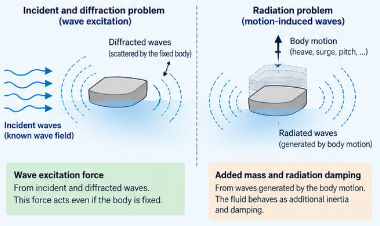

<div class="language-switch">[English](index.qmd) | **한글**</div>

부유식 구조물은 구조물이면서 동시에 물속에서 움직이는 물체다.

파랑은 구조물 표면에 압력을 가하고, 해상풍력터빈이라면 바람도 하중을 가한다. 그런데 문제는 여기서 끝나지 않는다.

구조물이 움직이면 주변 유체의 운동도 달라진다. 그리고 그렇게 변한 유체의 압력이 다시 구조물에 작용한다.

이것이 유체-구조 상호작용(fluid-structure interaction)의 핵심이다.

유연한 부유식 구조물을 생각할 때 공학적으로 가장 중요한 질문은 다음과 같다.

> **구조물의 변형과 주변 유체의 운동은 어떻게 하나의 연성 동적 시스템이 되는가?**

주파수영역 해석은 이 질문에 비교적 명확한 답을 준다. 구조물과 유체의 영향을 우리가 구조동역학에서 익숙하게 보는 네 가지 역할로 나누어 볼 수 있기 때문이다.

- 관성,
- 감쇠,
- 복원강성,
- 가진.

결국 핵심은 이것이다.

> **물은 단순히 외력을 전달하는 매질이 아니다. 구조물이 움직이기 시작하면, 주변 물도 동적 시스템의 일부가 된다.**

## 먼저 보통의 구조동역학에서 시작해 보자

유체를 생각하기 전에 익숙한 구조동역학 방정식부터 보자.

$$
\mathbf{M}\ddot{\mathbf{u}}
+
\mathbf{C}\dot{\mathbf{u}}
+
\mathbf{K}\mathbf{u}
=
\mathbf{f}.
$$

여기서

- $\mathbf{M}$은 구조물의 질량행렬,
- $\mathbf{C}$는 구조감쇠행렬,
- $\mathbf{K}$는 구조강성행렬,
- $\mathbf{f}$는 외력벡터다.

부유식 구조물에서는 젖은 표면(wetted surface)에 작용하는 유체압력이 외력에 포함된다.

가상일의 원리로 쓰면

$$
\delta W_{\mathrm{kin}}
=
\delta W_{\mathrm{ext}}
-
\delta W_{\mathrm{int}}.
$$

관성항은

$$
\delta W_{\mathrm{kin}}
=
\int_\Omega
\rho_s \delta \mathbf{u}\cdot\ddot{\mathbf{u}}
\,d\Omega,
$$

중력과 유체압력을 포함하는 외력의 일은

$$
\delta W_{\mathrm{ext}}
=
-\int_\Omega
\delta\mathbf{u}\cdot\rho_s g\mathbf{e}_3
\,d\Omega
+
\int_{\Gamma_w}
p\,\delta\mathbf{u}\cdot\mathbf{n}
\,d\Gamma,
$$

내력의 일은

$$
\delta W_{\mathrm{int}}
=
\int_\Omega
\delta\boldsymbol{\varepsilon}:
\mathbf{C}:
\boldsymbol{\varepsilon}
\,d\Omega.
$$

공간 이산화를 하면 익숙한 구조동역학 방정식이 나온다.

여기서 중요한 것은 압력 $p$가 일반적으로 미리 주어진 값이 아니라는 점이다.

$p$는 유체가 어떻게 움직이는가에 따라 달라진다.

{#fig-floating-body fig-align="center" width="90%"}

그림 [-@fig-floating-body]가 우리가 풀고자 하는 전체 물리 문제다.

구조물에는 자체 질량과 강성이 있다. 유체에도 자체 동역학이 있다. 둘은 젖은 표면의 압력을 통해 서로 연결된다.

## 왜 모드좌표를 사용하는가?

유연한 구조물의 모든 자유도를 그대로 풀 수도 있다. 하지만 항상 효율적인 방법은 아니다.

구조 고유모드를 이용하면 훨씬 간결하게 표현할 수 있다.

$$
\mathbf{u}(\mathbf{X},t)
=
\sum_\alpha
\mathbf{\Psi}_\alpha(\mathbf{X})
\zeta_\alpha(t).
$$

여기서 $\mathbf{\Psi}_\alpha$는 구조모드 $\alpha$, $\zeta_\alpha$는 그 모드의 진폭이다.

구조행렬을 모드공간으로 투영하면

$$
M^*_{\alpha\beta}
=
\mathbf{\Psi}_\alpha^T
\mathbf{M}
\mathbf{\Psi}_\beta,
$$

$$
K^*_{\alpha\beta}
=
\mathbf{\Psi}_\alpha^T
\mathbf{K}
\mathbf{\Psi}_\beta.
$$

외력도 마찬가지로 모드하중이 된다.

$$
f^*_\alpha
=
\mathbf{\Psi}_\alpha^T
\mathbf{f}.
$$

이 표현이 특히 유용한 이유는 유체동역학 문제도 같은 구조모드를 기준으로 정리할 수 있기 때문이다.

각 구조모드에 대응하는 유체의 방사(radiation) 문제가 하나씩 생긴다.

## 조화운동을 가정하면 미분방정식이 대수방정식이 된다

각진동수 $\omega$의 조화운동을 가정하자.

$$
\zeta_\alpha(t)
=
\xi_\alpha e^{i\omega t}.
$$

그러면

$$
\dot{\zeta}_\alpha
=
i\omega\xi_\alpha e^{i\omega t},
$$

$$
\ddot{\zeta}_\alpha
=
-\omega^2\xi_\alpha e^{i\omega t}.
$$

따라서 구조동역학 방정식은

$$
\left[
-\omega^2\mathbf{M}^*
+
i\omega\mathbf{C}^*
+
\mathbf{K}^*
\right]
\boldsymbol{\xi}
=
\mathbf{f}^*.
$$

시간에 대한 미분방정식이 주파수에 의존하는 선형 대수방정식으로 바뀌었다.

이것이 주파수영역 해석의 기본적인 장점이다. 각 $\omega$마다 복소 선형방정식 하나를 풀면 된다.

## 유체압력은 속도포텐셜에서 나온다

선형 포텐셜 유동이론에서 동압력은 선형화된 Bernoulli 방정식으로부터 구한다.

$$
p
=
-\rho_w
\left(
\frac{\partial\phi}{\partial t}
+
gX_3
\right).
$$

조화운동에서는

$$
\frac{\partial\phi}{\partial t}
=
i\omega\phi,
$$

이므로

$$
p
=
-\rho_w
\left(
i\omega\phi
+
gX_3
\right).
$$

속도포텐셜은 유체영역에서

$$
\nabla^2\phi=0
$$

을 만족한다.

문제는 그 다음이다. $\phi$는 하나의 물리현상만 나타내는 것이 아니라 서로 다른 원인의 유체운동을 함께 포함한다.

## 입사파, 회절파, 방사파는 역할이 다르다

선형 속도포텐셜은 다음과 같이 분해할 수 있다.

$$
\phi
=
\left[
A(\phi_I+\phi_D)
+
\xi_\alpha\phi_\alpha
\right]
e^{i\omega t},
$$

여기서

- $\phi_I$는 입사파(incident wave) 포텐셜,
- $\phi_D$는 회절(diffraction) 포텐셜,
- $\phi_\alpha$는 구조모드 $\alpha$에 대응하는 방사(radiation) 포텐셜,
- $A$는 파진폭,
- $\xi_\alpha$는 구조물의 모드응답이다.

이 분해가 주파수영역 유탄성 해석의 물리적 핵심이다.

{#fig-hydro-decomposition fig-align="center" width="88%"}

그림 [-@fig-hydro-decomposition]에서 두 문제의 차이를 볼 수 있다.

### 입사파와 회절 문제

구조물을 고정해 놓고 파랑만 들어온다고 생각해 보자.

입사파는 구조물 형상 때문에 교란되고 산란 또는 회절파를 만든다. 이때의 압력이 파랑 가진력

$$
\mathbf{f}^{\mathrm{ex}}
$$

을 만든다.

이 힘은 구조물이 전혀 움직이지 않아도 존재한다.

### 방사 문제

이번에는 입사파가 없고 구조물을 강제로 진동시킨다고 생각해 보자.

구조물의 운동은 주변 유체에 파를 만든다. 그리고 그 방사파가 다시 구조물에 반력을 가한다.

이 반력은 구조동역학에서 익숙한 두 효과로 나타난다.

- 부가관성,
- 감쇠.

이들은 단순한 경험적 보정계수가 아니다. 구조물이 주변 유체 일부를 함께 가속하고, 파의 형태로 에너지를 내보내기 때문에 생기는 역학적 결과다.

## 부가질량은 구조물에서 바라본 유체의 관성이다

물속에서 물체를 가속하면 주변 유체의 일부도 함께 가속해야 한다.

따라서 구조물은 마치 건조 상태의 구조질량보다 더 큰 관성을 가진 것처럼 거동한다.

모드공간에서는 이 효과가 부가질량행렬

$$
\mathbf{A}^{\mathrm{hydro}}(\omega)
$$

로 나타난다.

관성항은

$$
-\omega^2
\left(
\mathbf{M}^*
+
\mathbf{A}^{\mathrm{hydro}}
\right)
\boldsymbol{\xi}
$$

가 된다.

여기서 한 가지 중요한 점은 부가질량이 주파수에 따라 달라질 수 있다는 것이다.

즉 유체-구조 연성계의 유효관성이 반드시 상수인 것은 아니다. 부유체의 동역학이 건조 구조물의 동역학과 상당히 달라질 수 있는 이유 중 하나다.

## 방사감쇠는 파가 가져가는 에너지다

진동하는 물체는 파를 방사한다.

그 파는 구조물로부터 에너지를 가지고 멀리 나간다. 구조물의 입장에서는 이것이 감쇠로 보인다.

이에 해당하는 유체동역학적 감쇠행렬이

$$
\mathbf{B}^{\mathrm{hydro}}(\omega)
$$

이고, 방정식에는

$$
i\omega
\mathbf{B}^{\mathrm{hydro}}
\boldsymbol{\xi}
$$

로 들어간다.

물리적 의미는 명확하다.

> **방사감쇠는 진동하는 구조물이 파의 형태로 에너지를 유체에 내보내면서 생기는 저항이다.**

이것은 구조감쇠와 다르다. 구조감쇠는 구조물 내부의 에너지 소산을 나타내지만, 방사감쇠는 구조물의 에너지가 유체파로 전달되는 현상이다.

## 정수압은 복원강성을 만든다

중력과 부력은 부유체의 평형위치를 결정한다.

부유체가 조금 움직이면 잠긴 형상이 변하고 정수압 분포도 달라진다. 이 효과를 평형점 부근에서 선형화하면 정수력 복원행렬

$$
\mathbf{C}^{\mathrm{hydro}}
$$

이 나온다.

방정식에서는 강성과 같은 형태로

$$
\mathbf{C}^{\mathrm{hydro}}
\boldsymbol{\xi}
$$

가 된다.

따라서 물은 관성과 감쇠만 바꾸는 것이 아니다. 복원력도 제공한다.

구조동역학의 언어로 정리하면 다음과 같다.

```text
부유체 주변의 물
      ↓
부가질량          → 관성
방사감쇠          → 감쇠
정수력 복원       → 강성
파랑 회절         → 가진
```

## 연성 주파수영역 방정식

구조물과 유체의 영향을 모두 모으면

$$
\left[
-\omega^2
\left(
\mathbf{M}^*
+
\mathbf{A}^{\mathrm{hydro}}
\right)
+
i\omega
\left(
\mathbf{C}^*
+
\mathbf{B}^{\mathrm{hydro}}
\right)
+
\left(
\mathbf{K}^*
+
\mathbf{C}^{\mathrm{hydro}}
\right)
\right]
\boldsymbol{\xi}
=
A\mathbf{f}^{\mathrm{ex}}.
$$

형태만 보면 보통의 구조동역학 방정식과 같다.

차이는 유체가 주요 동적 성분 모두를 바꾼다는 데 있다.

{#fig-frequency-equation fig-align="center" width="92%"}

그림 [-@fig-frequency-equation]처럼 읽는 것이 이 방정식을 이해하는 가장 좋은 방법이다.

유체동역학 계수 이름부터 외우지 말고, 각 항이 어떤 역학적 역할을 하는지 먼저 보는 것이 중요하다.

## 바람도 같은 틀 안에 들어올 수 있다

부유식 풍력터빈에서는 로터 추력이 바람과 움직이는 구조물 사이의 상대속도에 따라 달라진다.

1차원으로 쓰면

$$
T(t)
=
\frac{1}{2}
\rho_a C_T A
\left[
v_{\mathrm{wind}}(t)
-
\dot{u}(t)
\right]^2.
$$

풍속을 평균성분과 변동성분으로 나누면

$$
v_{\mathrm{wind}}(t)
=
v_0+v_f(t).
$$

풍속 변동과 구조물 속도가 평균풍속에 비해 작다면 추력을 선형화할 수 있다.

$$
T(t)
\approx
T_0
+
T_f(t)
-
T_{\dot u}(t).
$$

세 항의 의미는 서로 다르다.

- $T_0$: 평균 정적 추력,
- $T_f$: 풍속 변동에 의한 가진,
- $T_{\dot u}$: 구조물 운동에 의존하는 공력.

평균항은 정적 평형문제에 들어가고, 운동의존항은 주파수영역 동역학 방정식에서 추가 감쇠와 같은 역할을 한다.

## 파랑과 바람을 함께 고려하면

선형화한 풍하중까지 포함하면 모드방정식은

$$
\left[
-\omega^2
\left(
\mathbf{M}^*
+
\mathbf{A}^{\mathrm{hydro}}
\right)
+
i\omega
\left(
\mathbf{C}^*
+
\mathbf{B}^{\mathrm{hydro}}
+
\mathbf{B}^{\mathrm{wind}}
\right)
+
\left(
\mathbf{K}^*
+
\mathbf{C}^{\mathrm{hydro}}
\right)
\right]
\boldsymbol{\xi}
=
A\mathbf{f}^{\mathrm{ex}}
+
\mathbf{f}^{\mathrm{wind}}.
$$

이 방정식이 유용한 이유는 익숙한 역학적 구조를 그대로 유지하기 때문이다.

### 관성

$$
-\omega^2
\left(
\mathbf{M}^*
+
\mathbf{A}^{\mathrm{hydro}}
\right)
$$

### 감쇠

$$
i\omega
\left(
\mathbf{C}^*
+
\mathbf{B}^{\mathrm{hydro}}
+
\mathbf{B}^{\mathrm{wind}}
\right)
$$

### 복원작용

$$
\mathbf{K}^*
+
\mathbf{C}^{\mathrm{hydro}}
$$

### 가진

$$
A\mathbf{f}^{\mathrm{ex}}
+
\mathbf{f}^{\mathrm{wind}}.
$$

그래서 주파수영역 유체-구조 상호작용은 처음 보이는 것만큼 보통의 구조동역학과 멀리 떨어진 문제가 아니다.

## 복소 응답진폭은 무엇을 의미하는가?

해

$$
\boldsymbol{\xi}(\omega)
$$

는 복소수다.

그 크기는 응답진폭을 나타내고, 위상은 조화 가진에 대한 응답의 지연 또는 선행을 나타낸다.

surge, heave, pitch와 같은 강체운동에서는 이 값으로부터 자연스럽게 응답진폭연산자(response amplitude operator, RAO)를 정의할 수 있다.

유연한 구조물에서는 모드진폭을 다시 물리적 변위장으로 변환할 수 있다.

$$
\mathbf{u}(\mathbf{X},t)
=
\sum_\alpha
\mathbf{\Psi}_\alpha(\mathbf{X})
\xi_\alpha e^{i\omega t}.
$$

따라서 같은 해석 틀에서 강체운동과 구조변형을 모두 다룰 수 있다.

이 때문에 이 문제는 단순한 유체동역학이 아니라 **유탄성(hydroelastic) 문제**라고 부르는 것이 적절하다.

## 왜 물속에서는 공진주파수가 달라지는가?

건조 구조물의 단순화된 모드 공진주파수는 대략

$$
\omega_n
\sim
\sqrt{
\frac{K}{M}
}
$$

으로 생각할 수 있다.

부유식 구조물에서는 이에 대응하는 연성계의 물리적 해석이

$$
\omega_n
\sim
\sqrt{
\frac{
K+ C^{\mathrm{hydro}}
}{
M+A^{\mathrm{hydro}}
}
}
$$

가 된다.

물론 이것은 다차원 고유치문제를 정확하게 표현한 식이라기보다 물리를 보여주기 위한 개략식이다. 하지만 무엇이 달라지는지는 바로 보인다.

주변 물은

- 부가질량으로 유효관성을 증가시키고,
- 정수력으로 복원강성을 바꾸며,
- 파의 방사로 감쇠를 추가한다.

따라서 부유체의 공진은 건조 구조물만의 특성이 아니라 **유체와 구조물이 결합된 시스템 전체의 특성**이다.

## 주파수영역 해석은 왜 효율적인가?

시스템을 선형화할 수 있다면 주파수영역 방법은 매우 효율적이다.

각 파랑주파수에 대해

1. 유체 경계치문제를 풀고,
2. 부가질량, 방사감쇠, 파랑 가진력을 구하고,
3. 연성 동적행렬을 조립하고,
4. 복소 응답진폭을 구한다.

시간영역에서 수많은 진동주기를 직접 적분할 필요가 없다.

그래서 이 방법은 특히

- RAO 계산,
- 매개변수 연구,
- 초기 설계 검토,
- 모드별 응답 해석,
- 주파수별 하중 평가

에 유용하다.

무엇보다 각 항의 역학적 의미가 명확하게 드러난다.

## 하지만 그 효율성은 선형화에서 나온다

주파수영역 해석은 선형화를 전제로 한다.

일반적으로 다음을 가정한다.

- 작은 파진폭,
- 작은 구조물 운동,
- 선형 구조거동,
- 선형화된 정수력,
- 선형 포텐셜 유동,
- 조화성분으로의 분해,
- 운동의존 풍하중의 선형화.

이 가정 덕분에 문제를 선형 대수방정식으로 바꿀 수 있다. 동시에 이 가정들이 해석의 적용범위를 결정한다.

강한 비선형성, 대변위 운동, 강한 계류 비선형성, 슬래밍, 점성 유동박리처럼 시간에 따라 크게 달라지는 현상은 시간영역 해석이 필요할 수 있다.

이 차이는 자연스럽게 다음 글의 주제인 계류선 동역학으로 이어진다.

## 주파수영역 모델에서도 계류 강성이 필요한 이유

평균 또는 변동 수평하중을 받는 부유식 풍력터빈은 정해진 위치를 유지해야 한다.

surge나 sway 방향에서는 정수력 복원만으로 충분한 수평강성을 얻지 못할 수 있다.

그래서 계류시스템이 복원작용을 제공하고 강체 표류를 막는다.

선형 주파수영역 모델에서는 보통 평형위치 부근에서 계류시스템을 등가강성으로 선형화하여 넣는다. 계류 응답을 선형화할 수 있다면 적절한 방법이다.

하지만 실제 계류선에는

- 질량,
- 변화하는 형상,
- 탄성,
- 중력,
- 부력,
- 항력,
- 동적 응답

이 모두 존재한다.

이 효과들이 중요해지면 계류시스템을 단순한 강성행렬 하나로 볼 수 없다.

이 문제는 다음 글에서 다룬다.

## 구조역학과 어떻게 연결되는가?

주파수영역 유탄성 해석을 완전히 별개의 역학 분야로 생각할 필요는 없다.

그 구조는 익숙하다.

$$
\text{관성}
+
\text{감쇠}
+
\text{복원작용}
=
\text{가진}.
$$

유체가 각 항을 수정할 뿐이다.

공학적으로 중요한 것은 각 유체동역학 항이 **왜** 그 위치에 들어가는지를 이해하는 것이다. 계수의 이름을 외우는 것보다 이 역학적 해석이 훨씬 오래 남는다.

## 결국 기억해야 할 것은

부유식 구조물은 건조 구조물에 단순히 파랑하중 하나를 더한 시스템이 아니다.

구조물의 운동이 유체운동을 만들고, 그 유체운동이 다시 구조물에 작용한다.

그 결과 주변 물은

- 부가질량을 통해 관성을,
- 파의 방사를 통해 감쇠를,
- 정수력을 통해 복원작용을,
- 입사파와 회절파를 통해 가진을

제공한다.

따라서 가장 중요한 원리는 다음과 같다.

> **물은 단순한 외력이 아니다. 구조물이 움직이는 순간 주변 물도 동적 시스템의 일부가 된다.**

그리고 주파수영역 방정식을 읽을 때는 이렇게 생각하면 된다.

> **유체동역학 계수의 이름을 외우기보다 관성, 감쇠, 복원작용, 가진이라는 역학적 역할로 읽어라.**

---

## 다음 글

**계류선은 왜 단순한 비선형 스프링이 아닌가?**

다음 글에서는 선형화된 주파수영역 모델을 넘어 시간영역 계류 동역학을 살펴본다. 계류선의 형상, 장력, 항력, 관성이 어떻게 함께 변하는지가 핵심이다.

## Further reading

Newman, J. N. (1994).  
**Wave effects on deformable bodies.**  
*Applied Ocean Research, 16*(1), 47–59.

Huang, L. L., & Riggs, H. R. (2000).  
**The hydrostatic stiffness of flexible floating structures for linear hydroelasticity.**  
*Marine Structures, 13*(2), 91–106.

Pegalajar-Jurado, A., Borg, M., & Bredmose, H. (2018).  
**An efficient frequency-domain model for quick load analysis of floating offshore wind turbines.**  
*Wind Energy Science, 3*, 693–712.  
https://doi.org/10.5194/wes-3-693-2018

Riggs, H. R., Suzuki, H., Ertekin, R. C., Kim, J. W., & Iijima, K. (2008).  
**Comparison of hydroelastic computer codes based on the ISSC VLFS benchmark.**  
*Ocean Engineering, 35*, 589–597.

Belytschko, T., Liu, W. K., & Moran, B. (2000).  
**Nonlinear Finite Elements for Continua and Structures.**  
John Wiley & Sons.
