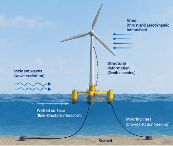
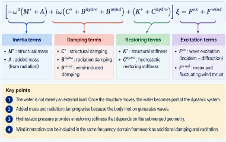

A floating structure is both a structure and a body moving in water.

Waves apply pressure to the structure. Wind may add aerodynamic loading. But the interaction does not stop there.

Once the structure moves, its motion changes the surrounding fluid field. The resulting fluid pressure acts back on the structure.

That is the essence of fluid–structure interaction.

For a flexible floating body, the central engineering question is:

> **How do structural deformation and fluid motion become one coupled dynamic system?**

The frequency-domain formulation provides a particularly clear answer because every contribution can be separated into familiar dynamic roles:

- inertia,
- damping,
- restoring stiffness,
- and excitation.

The key idea is this:

> **The water is not merely an external load. Once the structure moves, the water becomes part of the dynamic system.**

## Start from ordinary structural dynamics

Before considering hydrodynamics, begin with a standard structural dynamic equation,

$$
\mathbf{M}\ddot{\mathbf{u}}
+
\mathbf{C}\dot{\mathbf{u}}
+
\mathbf{K}\mathbf{u}
=
\mathbf{f}.
$$

Here,

- $\mathbf{M}$ is the structural mass matrix,
- $\mathbf{C}$ is the structural damping matrix,
- $\mathbf{K}$ is the structural stiffness matrix,
- and $\mathbf{f}$ is the external force vector.

For a floating structure, the external force includes pressure acting on the wetted surface.

From the principle of virtual work,

$$
\delta W_{\mathrm{kin}}
=
\delta W_{\mathrm{ext}}
-
\delta W_{\mathrm{int}}.
$$

The inertia term is

$$
\delta W_{\mathrm{kin}}
=
\int_\Omega
\rho_s \delta \mathbf{u}\cdot\ddot{\mathbf{u}}
\,d\Omega,
$$

the external work includes gravity and fluid pressure,

$$
\delta W_{\mathrm{ext}}
=
-\int_\Omega
\delta\mathbf{u}\cdot\rho_s g\mathbf{e}_3
\,d\Omega
+
\int_{\Gamma_w}
p\,\delta\mathbf{u}\cdot\mathbf{n}
\,d\Gamma,
$$

and the internal work is

$$
\delta W_{\mathrm{int}}
=
\int_\Omega
\delta\boldsymbol{\varepsilon}:
\mathbf{C}:
\boldsymbol{\varepsilon}
\,d\Omega.
$$

After spatial discretization, the familiar structural equation follows.

The important point is that the pressure $p$ is not generally known in advance.

It depends on the fluid motion.

{#fig-floating-body fig-align="center" width="90%"}

Figure @fig-floating-body shows the full physical problem.

The structure has its own mass and stiffness.

The fluid has its own dynamics.

The coupling occurs through pressure on the wetted surface.

## Why modal coordinates are useful

For a flexible body, solving directly for every structural degree of freedom is possible but not always convenient.

A more compact description is obtained with structural eigenmodes:

$$
\mathbf{u}(\mathbf{X},t)
=
\sum_\alpha
\mathbf{\Psi}_\alpha(\mathbf{X})
\zeta_\alpha(t).
$$

Here,

- $\mathbf{\Psi}_\alpha$ is structural mode $\alpha$,
- $\zeta_\alpha$ is its modal amplitude.

The structural matrices are then projected into modal space:

$$
M^*_{\alpha\beta}
=
\mathbf{\Psi}_\alpha^T
\mathbf{M}
\mathbf{\Psi}_\beta,
$$

$$
K^*_{\alpha\beta}
=
\mathbf{\Psi}_\alpha^T
\mathbf{K}
\mathbf{\Psi}_\beta.
$$

Similarly, the external force becomes a modal force,

$$
f^*_\alpha
=
\mathbf{\Psi}_\alpha^T
\mathbf{f}.
$$

This is useful because the hydrodynamic problem can also be organized around the same structural modes.

Each structural mode has a corresponding fluid radiation problem.

## Harmonic motion turns the problem into algebra

Assume harmonic motion with angular frequency $\omega$,

$$
\zeta_\alpha(t)
=
\xi_\alpha e^{i\omega t}.
$$

Then

$$
\dot{\zeta}_\alpha
=
i\omega\xi_\alpha e^{i\omega t},
$$

and

$$
\ddot{\zeta}_\alpha
=
-\omega^2\xi_\alpha e^{i\omega t}.
$$

The structural dynamic equation becomes

$$
\left[
-\omega^2\mathbf{M}^*
+
i\omega\mathbf{C}^*
+
\mathbf{K}^*
\right]
\boldsymbol{\xi}
=
\mathbf{f}^*.
$$

The time-domain differential equation has become a frequency-dependent linear algebraic equation.

This is the basic advantage of frequency-domain analysis.

For each $\omega$, solve one complex linear system.

## The hydrodynamic pressure comes from a velocity potential

In linear potential-flow theory, the dynamic pressure is obtained from the linearized Bernoulli equation,

$$
p
=
-\rho_w
\left(
\frac{\partial\phi}{\partial t}
+
gX_3
\right).
$$

For harmonic motion,

$$
\frac{\partial\phi}{\partial t}
=
i\omega\phi,
$$

so

$$
p
=
-\rho_w
\left(
i\omega\phi
+
gX_3
\right).
$$

The velocity potential satisfies

$$
\nabla^2\phi=0
$$

in the fluid domain.

The crucial point is that $\phi$ itself contains several different physical contributions.

## Incident, diffraction, and radiation potentials play different roles

The linear potential is decomposed as

$$
\phi
=
\left[
A(\phi_I+\phi_D)
+
\xi_\alpha\phi_\alpha
\right]
e^{i\omega t},
$$

where

- $\phi_I$ is the incident-wave potential,
- $\phi_D$ is the diffraction potential,
- $\phi_\alpha$ is the radiation potential associated with structural mode $\alpha$,
- $A$ is wave amplitude,
- and $\xi_\alpha$ is the structural modal response.

This decomposition is the physical heart of frequency-domain hydroelasticity.

{#fig-hydro-decomposition fig-align="center" width="88%"}

Figure @fig-hydro-decomposition makes the distinction explicit.

### Incident and diffraction problem

Imagine the body is held fixed while waves arrive.

The incident wave is disturbed by the body geometry and produces a scattered or diffracted wave.

The associated pressure produces the wave excitation force,

$$
\mathbf{f}^{\mathrm{ex}}.
$$

This force exists even if the body does not move.

### Radiation problem

Now imagine there is no incident wave, but the body is forced to oscillate.

Its motion generates waves in the surrounding fluid.

Those radiated waves react back on the body.

This reaction produces two familiar dynamic effects:

- added inertia,
- damping.

These are not arbitrary correction terms.

They are the mechanical consequence of the body having to accelerate and radiate part of the surrounding fluid.

## Added mass is fluid inertia seen by the structure

When a body accelerates in water, it must also accelerate some surrounding fluid.

The body therefore behaves as if its inertia were larger than its dry structural mass.

In modal form, this contribution appears as the added-mass matrix,

$$
\mathbf{A}^{\mathrm{hydro}}(\omega).
$$

The inertia term becomes

$$
-\omega^2
\left(
\mathbf{M}^*
+
\mathbf{A}^{\mathrm{hydro}}
\right)
\boldsymbol{\xi}.
$$

An important subtlety is that added mass can depend on frequency.

The effective inertia of the coupled fluid–structure system is therefore not necessarily constant.

This is one reason floating-body dynamics can differ substantially from dry structural dynamics.

## Radiation damping is energy carried away by waves

An oscillating body radiates waves.

Those waves carry energy away from the structure.

To the structural system, that energy loss appears as damping.

The corresponding hydrodynamic damping matrix is

$$
\mathbf{B}^{\mathrm{hydro}}(\omega).
$$

Its contribution is

$$
i\omega
\mathbf{B}^{\mathrm{hydro}}
\boldsymbol{\xi}.
$$

The physical interpretation is simple:

> **Radiation damping is the resistance associated with sending wave energy away from the oscillating body.**

This is distinct from structural damping.

Structural damping represents dissipation inside the structure.

Radiation damping represents energy transfer from structure to fluid waves.

## Hydrostatic pressure provides restoring stiffness

Gravity and buoyancy establish the equilibrium position of the floating body.

A small displacement changes the submerged geometry and therefore changes the hydrostatic pressure distribution.

Linearizing that effect produces a hydrostatic restoring matrix,

$$
\mathbf{C}^{\mathrm{hydro}}.
$$

Its contribution enters like stiffness:

$$
\mathbf{C}^{\mathrm{hydro}}
\boldsymbol{\xi}.
$$

So water contributes not only inertia and damping.

It also contributes restoring action.

That gives a very useful structural interpretation:

```text
water surrounding the body
      ↓
added mass          → inertia
radiation damping   → damping
hydrostatic restoring → stiffness
wave diffraction    → excitation
```

## The coupled frequency-domain equation

Collecting structural and hydrodynamic contributions gives

$$
\left[
-\omega^2
\left(
\mathbf{M}^*
+
\mathbf{A}^{\mathrm{hydro}}
\right)
+
i\omega
\left(
\mathbf{C}^*
+
\mathbf{B}^{\mathrm{hydro}}
\right)
+
\left(
\mathbf{K}^*
+
\mathbf{C}^{\mathrm{hydro}}
\right)
\right]
\boldsymbol{\xi}
=
A\mathbf{f}^{\mathrm{ex}}.
$$

This equation has the same architecture as ordinary structural dynamics.

The difference is that the fluid modifies every major dynamic component.

{#fig-frequency-equation fig-align="center" width="92%"}

Figure @fig-frequency-equation is the most useful way to read the equation.

Do not begin by memorizing hydrodynamic coefficients.

Begin by asking what mechanical role each term plays.

## Wind can enter the same framework

For a floating wind turbine, the rotor thrust depends on the relative velocity between the wind and the moving structure.

In one dimension,

$$
T(t)
=
\frac{1}{2}
\rho_a C_T A
\left[
v_{\mathrm{wind}}(t)
-
\dot{u}(t)
\right]^2.
$$

Decompose the wind speed into a mean and a fluctuation,

$$
v_{\mathrm{wind}}(t)
=
v_0+v_f(t).
$$

If both the fluctuation and structural velocity are small relative to the mean wind speed, the thrust can be linearized:

$$
T(t)
\approx
T_0
+
T_f(t)
-
T_{\dot u}(t).
$$

The three contributions have different meanings:

- $T_0$: mean static thrust,
- $T_f$: excitation from wind fluctuation,
- $T_{\dot u}$: motion-dependent aerodynamic force.

The mean term belongs in the static equilibrium problem.

The motion-dependent term behaves like additional damping in the frequency-domain dynamic equation.

## The full wave–wind system

Including the linearized wind interaction, the modal equation becomes

$$
\left[
-\omega^2
\left(
\mathbf{M}^*
+
\mathbf{A}^{\mathrm{hydro}}
\right)
+
i\omega
\left(
\mathbf{C}^*
+
\mathbf{B}^{\mathrm{hydro}}
+
\mathbf{B}^{\mathrm{wind}}
\right)
+
\left(
\mathbf{K}^*
+
\mathbf{C}^{\mathrm{hydro}}
\right)
\right]
\boldsymbol{\xi}
=
A\mathbf{f}^{\mathrm{ex}}
+
\mathbf{f}^{\mathrm{wind}}.
$$

This equation is useful because it preserves familiar mechanical structure.

### Inertia

$$
-\omega^2
\left(
\mathbf{M}^*
+
\mathbf{A}^{\mathrm{hydro}}
\right)
$$

### Damping

$$
i\omega
\left(
\mathbf{C}^*
+
\mathbf{B}^{\mathrm{hydro}}
+
\mathbf{B}^{\mathrm{wind}}
\right)
$$

### Restoring action

$$
\mathbf{K}^*
+
\mathbf{C}^{\mathrm{hydro}}
$$

### Excitation

$$
A\mathbf{f}^{\mathrm{ex}}
+
\mathbf{f}^{\mathrm{wind}}.
$$

This is why frequency-domain fluid–structure interaction is conceptually much closer to ordinary structural dynamics than it first appears.

## What does the response amplitude mean?

The solution

$$
\boldsymbol{\xi}(\omega)
$$

is complex.

Its magnitude gives the response amplitude.

Its phase gives the lag or lead relative to the harmonic excitation.

For rigid-body motions such as surge, heave, and pitch, these quantities lead naturally to response-amplitude operators.

For flexible structures, modal amplitudes can be transformed back into physical displacement fields through

$$
\mathbf{u}(\mathbf{X},t)
=
\sum_\alpha
\mathbf{\Psi}_\alpha(\mathbf{X})
\xi_\alpha e^{i\omega t}.
$$

So the same framework can describe both rigid-body motion and structural deformation.

That is why the method is properly described as **hydroelastic** rather than purely hydrodynamic.

## Why resonance changes in water

For a dry structure, a simplified modal resonance estimate is

$$
\omega_n
\sim
\sqrt{
\frac{K}{M}
}.
$$

For a floating structure, the analogous coupled interpretation is

$$
\omega_n
\sim
\sqrt{
\frac{
K+ C^{\mathrm{hydro}}
}{
M+A^{\mathrm{hydro}}
}
}.
$$

This is schematic rather than an exact multidimensional eigenvalue expression, but it reveals the physics immediately.

The surrounding water can:

- increase effective inertia through added mass,
- change restoring stiffness through hydrostatics,
- and add damping through wave radiation.

The resonance of the floating system is therefore a property of the **coupled fluid–structure system**, not the dry structure alone.

## Why the frequency domain is so efficient

The frequency-domain method is powerful when the system can be linearized.

For each wave frequency:

1. solve the hydrodynamic boundary-value problem,
2. obtain added mass, radiation damping, and excitation,
3. assemble the coupled dynamic matrix,
4. solve for the complex response amplitude.

There is no need to integrate every oscillation cycle through time.

This makes the method particularly attractive for:

- response-amplitude operators,
- parameter studies,
- design screening,
- modal interpretation,
- frequency-by-frequency load assessment.

The structure of the solution is also highly transparent.

Each term can be interpreted mechanically.

## But the efficiency comes from assumptions

The frequency-domain formulation relies on linearization.

Typically, it assumes:

- small wave amplitude,
- small structural motion,
- linear structural behavior,
- linearized hydrostatics,
- linear potential flow,
- harmonic decomposition,
- and linearization of motion-dependent wind loading.

These assumptions are powerful because they transform the problem into a linear algebraic system.

But they also define the range of applicability.

Strong nonlinearities, large motions, highly nonlinear mooring response, slamming, viscous separation, and other strongly time-dependent effects may require a time-domain treatment.

This distinction leads naturally to the companion article on mooring-line dynamics.

## Why mooring stiffness still matters in a frequency-domain model

A floating wind turbine subjected to mean or fluctuating horizontal loading must remain stationed.

Hydrostatic restoring alone does not necessarily provide sufficient horizontal stiffness in surge or sway.

Mooring systems therefore contribute restoring action and prevent rigid-body drift.

In a linear frequency-domain model, the mooring system is often introduced through an equivalent stiffness around the equilibrium position.

That is appropriate when the mooring response can be linearized.

But a real mooring line has its own:

- mass,
- changing geometry,
- elasticity,
- gravity,
- buoyancy,
- drag,
- and dynamic response.

Once these effects matter, the mooring system is no longer merely a stiffness matrix.

That is the subject of the next article.

## Connection to structural mechanics

The most useful way to understand frequency-domain hydroelasticity is not to treat it as a completely separate branch of mechanics.

Its structure is familiar:

$$
\text{inertia}
+
\text{damping}
+
\text{restoring action}
=
\text{excitation}.
$$

The fluid modifies each category.

The engineering challenge is to understand **why** each hydrodynamic term belongs where it does.

That interpretation is more durable than memorizing coefficient names.

## Engineering takeaway

A floating structure does not respond to waves as a dry structure with a wave force simply attached to it.

Its own motion generates fluid motion, and that fluid motion reacts back on the structure.

The result is a coupled system in which the surrounding water contributes:

- inertia through added mass,
- damping through wave radiation,
- restoring action through hydrostatics,
- and excitation through incident and diffracted waves.

So the principle to remember is:

> **The water is not merely an external load. Once the structure moves, the water becomes part of the dynamic system.**

And the practical interpretation of the frequency-domain equation is:

> **Read hydrodynamic coefficients by their mechanical roles: inertia, damping, restoring action, and excitation.**

---

## Next article

**Why Is a Mooring Line More Than a Nonlinear Spring?**

The companion article moves from the linearized frequency-domain model to time-domain mooring dynamics, where geometry, tension, drag, and line inertia evolve together.

## Further reading

Newman, J. N. (1994).  
**Wave effects on deformable bodies.**  
*Applied Ocean Research, 16*(1), 47–59.

Huang, L. L., & Riggs, H. R. (2000).  
**The hydrostatic stiffness of flexible floating structures for linear hydroelasticity.**  
*Marine Structures, 13*(2), 91–106.

Pegalajar-Jurado, A., Borg, M., & Bredmose, H. (2018).  
**An efficient frequency-domain model for quick load analysis of floating offshore wind turbines.**  
*Wind Energy Science, 3*, 693–712.  
https://doi.org/10.5194/wes-3-693-2018

Riggs, H. R., Suzuki, H., Ertekin, R. C., Kim, J. W., & Iijima, K. (2008).  
**Comparison of hydroelastic computer codes based on the ISSC VLFS benchmark.**  
*Ocean Engineering, 35*, 589–597.

Belytschko, T., Liu, W. K., & Moran, B. (2000).  
**Nonlinear Finite Elements for Continua and Structures.**  
John Wiley & Sons.
