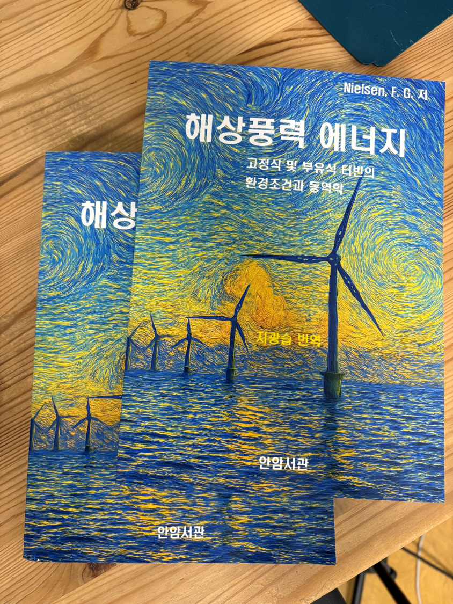
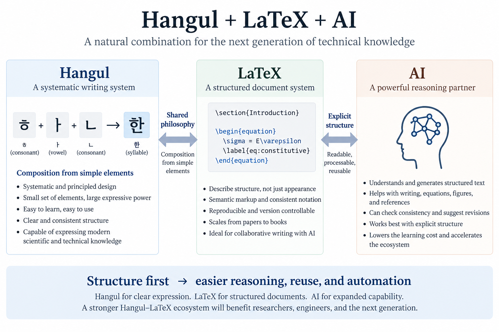

<div class="language-switch">[English](index.qmd) | **한글**</div>

최근 LaTeX로 한글 공학 교재 한 권을 출판했다.

F. G. Nielsen이 2024년 Cambridge University Press에서 출판한 해상풍력 입문서를 번역한 책이다. 공학자를 위한 입문 교재이고, 한글판 ISBN은 **9791199253803**이다.

{#fig-korean-offshore-wind-book fig-align="center" width="75%"}

한글 몇 문장을 LaTeX에서 컴파일해 보는 것과 공학 교재 한 권을 완성하는 것은 전혀 다른 문제다. 교재에는 장과 절, 수식, 그림, 표, 상호참조, 인용, 전문용어가 있고 한글과 영문, 수학기호가 수백 페이지에 걸쳐 일관성을 유지해야 한다.

이 작업을 끝내고 나서 내린 결론은 의외로 간단했다.

> **한글은 LaTeX와 아주 잘 맞는다.**

문제는 이제 LaTeX로 한글을 조판할 수 있느냐가 아니다. 이 방식으로 누구나 쉽게 글을 쓸 수 있을 만큼 충분히 풍부한 **한글-LaTeX 생태계**가 만들어져 있느냐가 문제다.

그런데 AI가 글 쓰는 방식을 바꾸고 있는 지금, 이 문제가 더 흥미로워졌다.

나는 점점 이렇게 생각하게 된다.

> **LaTeX는 AI 이전보다 오히려 AI 시대에 더 좋은 문서 시스템일 수 있다.**

그리고 한글은 그런 환경에 특히 잘 맞는 문자일지도 모른다.

{#fig-hangul-latex-ai fig-align="center" width="100%"}

## 한글은 단순히 글자 모양의 집합이 아니다

나는 늘 한글을 대단한 문자체계라고 생각해 왔다.

하지만 이렇게 말하면 자칫 애국적인 수사처럼 들릴 수 있다. 그래서 무엇이 기술적으로 흥미로운지를 조금 더 구체적으로 볼 필요가 있다.

1446년에 간행된 *훈민정음*에는 새 문자의 반포문뿐 아니라 제자 원리와 용례를 설명한 *해례*가 함께 들어 있다. 이 문헌은 1997년 UNESCO 세계기록유산에 등재되었다.

이 역사적 사실이 중요한 이유가 있다.

한글은 단순히 외워야 할 기호들을 만들어 놓은 것이 아니다. **문자를 어떻게 만들었는지 그 원리가 명시적으로 설명되어 있다.**

예를 들어

$$
\text{한}
$$

이라는 음절은 하나의 분해할 수 없는 그림이 아니다.

$$
\text{ㅎ} + \text{ㅏ} + \text{ㄴ}
$$

으로 구성된다.

따라서 여러 층위의 구조가 있다.

$$
\boxed{
\text{기본 요소}
\rightarrow
\text{글자}
\rightarrow
\text{음절 블록}
\rightarrow
\text{단어}
}
$$

눈에 보이는 음절은 하나의 작은 블록이지만 그 내부의 구성 원리는 체계적이다.

한글은 시각적으로는 블록형이면서 구성 원리로 보면 알파벳적이다.

내가 한글을 놀랄 만큼 현대적인 문자라고 느끼는 이유 중 하나다.

## 규칙으로 만들어지는 문자

여기서 중요한 것은 단순히 한글이 배우기 쉽다는 점이 아니다.

더 근본적인 장점은 **비교적 적은 수의 요소와 규칙으로 매우 넓은 표현공간을 만들어 낸다**는 데 있다.

공학자에게는 익숙한 사고방식이다.

가능한 모든 구조물의 해를 하나씩 외우려 하지 않는다. 몇 가지 지배원리를 알고, 그것으로 여러 구조물의 응답을 만들어 낸다.

역학에서도 예를 들어

$$
\text{평형}
+
\text{적합조건}
+
\text{구성관계}
$$

라는 몇 가지 원리로 엄청나게 다양한 구조계의 응답을 구할 수 있다.

좋은 시스템은 복잡성을 규칙으로 압축한다.

한글도 전혀 다른 차원에서 비슷한 일을 한다.

가능한 모든 음절마다 별도의 기호를 만들어 둘 필요가 없다. 유한한 요소를 규칙에 따라 조합하면 된다.

그래서 한글을 단순히 '편리한 문자'라고 부르는 데에는 조금 아쉬움이 있다.

**한글의 아름다움은 구조에 있다.**

## LaTeX도 놀랄 만큼 비슷한 방식으로 작동한다

이제 LaTeX를 생각해 보자.

일반적인 워드프로세서는 화면에 보이는 문서의 모양을 직접 만지도록 유도한다.

제목을 선택해 글자를 키운다. 어떤 문장은 굵게 만든다. 간격을 조절하고 그림을 옮기고 글꼴을 바꾼다.

수많은 국부적인 서식 결정이 쌓이면서 문서의 모양이 만들어진다.

LaTeX는 생각하는 방식이 다르다.

"이 문장을 18 pt 굵은 글씨로 만들고 위에 간격을 조금 띄워라"라고 하지 않고,

```latex
\section{Introduction}
```

이라고 쓴다.

수식 번호도 직접 붙이는 것이 아니라 이것이 수식이라는 것을 기술한다.

```latex
\begin{equation}
  \sigma = E\varepsilon
\end{equation}
```

인용문헌의 모양도 하나씩 직접 만드는 대신 어떤 문헌인지를 지정하고, 어떻게 보일지는 문서 시스템에 맡긴다.

차이는 근본적이다.

$$
\boxed{
\text{구조를 기술한다}
\neq
\text{보이는 모양을 직접 만든다}
}
$$

따라서 LaTeX는 단순한 조판 도구가 아니다.

**구조화된 문서 시스템(structured document system)**이다.

## 한글과 LaTeX에는 닮은 철학이 있다

내가 흥미롭게 보는 연결점이 여기 있다.

한글과 LaTeX는 완전히 다른 문제를 해결하지만 설계 철학에는 닮은 부분이 있다.

둘 다 **조합(composition)**을 중요하게 사용한다.

한글에서는

$$
\text{요소}
\rightarrow
\text{글자}
\rightarrow
\text{음절}
$$

이고, LaTeX에서는

$$
\text{명령}
\rightarrow
\text{문서 구조}
\rightarrow
\text{완성된 문서}
$$

이다.

물론 이 비유를 너무 멀리 가져가면 안 된다. 한글은 문자체계이고 LaTeX는 문서작성 시스템이다.

하지만 공통된 생각은 분명하다.

> **구조가 먼저이고, 모양은 그 다음이다.**

한글 음절은 하나의 작은 블록으로 보이지만 내부 구조를 가진다.

LaTeX 문서도 독자에게는 잘 조판된 페이지로 보이지만 그 뒤에는 의미를 가진 구조가 있다.

내가 한글과 LaTeX의 조합을 흥미롭게 생각하는 이유다.

## 그런데 LaTeX에는 오랫동안 큰 약점이 있었다

당연한 반론이 있다.

LaTeX가 그렇게 강력했다면 왜 모든 사람이 쓰지 않았을까?

LaTeX는 작성자에게 문서의 구조를 명시적으로 쓰게 한다.

거기에는 비용이 따른다.

명령어를 배워야 한다. 컴파일 오류를 만난다. 패키지를 이해해야 한다. 괄호 하나 빠진 원인을 찾느라 30분을 보내기도 한다.

LaTeX를 제대로 써 본 사람이라면 누구나 아는 경험이다.

워드프로세서는 이런 복잡성의 상당 부분을 그래픽 인터페이스 뒤에 숨긴다.

많은 사람에게는 그것이 결정적인 장점이었다.

전통적인 절충관계를 대략 정리하면 이렇다.

| 일반 워드프로세서 | LaTeX |
|---|---|
| 즉시 사용하기 쉬움 | 명시적인 구조 |
| 화면 중심 편집 | 텍스트 기반 편집 |
| 낮은 초기 학습비용 | 높은 초기 학습비용 |
| 국부적인 서식 변경이 쉬움 | 체계적인 재현성 |

수십 년 동안 LaTeX의 학습비용은 분명한 현실이었다.

그런데 AI가 등장했다.

## AI가 LaTeX의 경제성을 바꾸고 있다

여기서 근본적인 변화가 일어났다고 생각한다.

AI에게 다음과 같이 요청한다고 해보자.

> 선형탄성의 구성방정식을 쓰고 번호를 붙여라. 다음 문단에서 그 식을 참조하고, 유도과정은 부록에 넣어라.

AI가

```latex
\begin{equation}
  \boldsymbol{\sigma}
  =
  \mathbb{C}:\boldsymbol{\varepsilon}
  \label{eq:constitutive}
\end{equation}
```

같은 구조화된 텍스트를 만드는 것은 자연스럽다.

이어

```latex
Equation~\eqref{eq:constitutive}
```

같은 참조를 만들고, 절과 표, 수식, 참고문헌, 목록, 그림 환경의 구조를 바꾸는 것도 가능하다.

결과물은 여전히 **텍스트**다.

이 점이 중요하다.

LaTeX 소스는 사람이 읽을 수 있고, AI가 생성할 수 있고, Git으로 차이를 비교할 수 있고, 스크립트로 수정할 수 있고, 일반적인 텍스트 도구로 검색할 수 있으며, 같은 결과를 재현해서 컴파일할 수 있다.

문서가 하나의 계산 워크플로에 들어오는 것이다.

예전에는 LaTeX의 약점처럼 보였던 것,

> 컴퓨터에게 이 문서가 무엇을 의미하는지 명시적으로 알려줘야 한다.

가 이제는 장점이 되고 있다.

AI가 그 구조를 표현하는 일을 아주 잘 도와줄 수 있기 때문이다.

## AI가 있다고 마크업이 필요 없어지는 것은 아니다

AI가 충분히 발전하면 마크업 언어 자체가 필요 없어질 것이라고 생각할 수도 있다.

그냥

> 이걸 책으로 만들어 줘.

라고 하면 AI가 다 해주는 시대가 올 수도 있다.

분명 점점 쉬워질 것이다.

하지만 그렇다고 명시적인 문서 구조의 가치가 줄어든다고 생각하지 않는다.

오히려 **더 중요해질 수 있다.**

AI가 300페이지짜리 기술서적을 수정한다고 해보자.

나는 무엇을 알고 싶을까?

- 어떤 수식이 바뀌었는가?
- 어떤 참고문헌이 바뀌었는가?
- 절 하나가 삭제되지는 않았는가?
- 그림 번호가 여전히 맞는가?
- 같은 기호가 일관되게 사용되는가?
- 참고문헌 항목이 변경되었는가?
- 내일 다시 같은 문서를 만들 수 있는가?

구조화된 텍스트 표현이 있으면 이런 질문에 훨씬 쉽게 답할 수 있다.

문제는 더 이상

> AI가 예쁜 문서를 만들 수 있는가?

가 아니다. 당연히 만들 수 있다.

더 중요한 질문은 이것이다.

> **사람과 AI가 큰 기술문서를 함께 관리하면서도 그 구조에 대한 통제력을 잃지 않을 수 있는가?**

이것은 전혀 다른 문제다.

그리고 바로 이런 문제에 LaTeX가 잘 맞는다.

## LaTeX 소스가 사람과 AI 사이의 인터페이스가 된다

이렇게 생각하면 20년 전에는 하지 않았던 방식으로 LaTeX를 보게 된다.

`.tex` 파일은 PDF를 만들기 위한 단순한 소스코드가 아니다.

**사람인 저자와 AI 사이의 인터페이스**가 될 수 있다.

사람은 다음과 같이 의미를 지정한다.

> 이것은 정리다.  
> 이것은 수식이다.  
> 이것은 그림이다.  
> 이것은 인용이다.  
> 이것은 장이다.  
> 이 기호는 응력을 뜻한다.

AI는 이렇게 명시된 구조를 대상으로 작업한다.

그리고 컴파일러가 이를 최종 문서로 만든다.

개념적으로는

$$
\boxed{
\text{사람의 사고}
\leftrightarrow
\text{AI}
\leftrightarrow
\text{구조화된 소스}
\rightarrow
\text{LaTeX}
\rightarrow
\text{문서}
}
$$

라고 볼 수 있다.

문서를 페이지 위의 픽셀 집합으로 다루는 것과는 상당히 다른 접근이다.

과학과 공학 글쓰기에서는 이 차이가 중요하다.

## 그렇다면 왜 한글 LaTeX는 아직 어렵게 느껴질까?

기술적으로 한글을 LaTeX로 쓰는 일은 이제 특별한 작업이 아니다.

CTAN에는 `kotex-utf`, `kotex-oblivoir`, `LuaTeXko`, `XeTeXko` 등 상당한 한국어 조판 생태계가 올라와 있다. 예를 들어 `kotex-oblivoir`는 `memoir`를 기반으로 한 한글 문서 클래스이고, 한글로 된 LaTeX 입문 문서도 제공된다.

나도 바로 이 방식으로 한글 책을 출판했다.

그러니 핵심 문제는 이제

> LaTeX로 한글을 출력할 수 있는가?

가 아니다.

할 수 있다.

더 중요한 질문은

> **실제로 사용하려는 사람 주변에 얼마나 많은 기반과 경험이 축적되어 있는가?**

이다.

여기서는 여전히 영문 환경과 한글 환경의 차이가 크다.

영어로 LaTeX의 조금 이상한 문제를 검색하면 누군가 이미 같은 문제를 겪었을 가능성이 높다.

문서가 있을 수도 있고, Stack Exchange 토론, 패키지 예제, 대학 템플릿, 학술지 클래스, GitHub 저장소, 교재, 심지어 20년 전 메일링리스트의 답변이 지금도 문제를 해결해 줄 수 있다.

그렇게 축적된 지식 전체가 생태계다.

한글 LaTeX에는 이미 좋은 기술적 기반이 있다. 이제 그 주변 생태계를 훨씬 풍부하게 만들 수 있다.

## 기술적으로 가능하다는 것과 생태계가 있다는 것은 다르다

이 차이가 중요하다.

기술이 완벽하게 작동한다고 해서 사람들이 쉽게 쓸 수 있는 것은 아니다.

한 대학원생이 LaTeX로 한글 학위논문을 쓰려고 한다고 해보자.

한글 글자가 제대로 출력되는 것만으로는 부족하다.

필요한 것은

- 바로 사용할 수 있는 학위논문 템플릿,
- 한글과 영문 글꼴 설정,
- 참고문헌 예제,
- 그림과 표 작성 관례,
- 한글 색인,
- PDF 북마크,
- 상호참조,
- 수식 작성 규칙,
- 대학별 서식,
- 수정 없이 컴파일되는 예제,
- 문제 해결 자료,
- 그리고 가능하면 한글 설명

이다.

교수가 교재를 쓰면 요구사항이 또 달라진다.

학회가 학술지를 출판하면 다시 달라진다.

엔지니어가 기술보고서를 만들 때도 다르다.

생태계란 이런 문제를 모든 사용자가 매번 처음부터 다시 해결하지 않아도 되는 상태다.

## 한글-LaTeX 생태계에는 무엇이 있어야 할까?

나는 이런 생태계를 의도적으로 만들어야 한다고 생각한다.

거대한 소프트웨어 프로젝트 하나를 만들자는 이야기는 아니다.

작지만 재사용할 수 있는 것들을 많이 만드는 것이다.

### 한글을 처음부터 고려한 템플릿

좋은 템플릿이 필요하다.

- 교재
- 대학 학위논문
- 강의노트
- 기술보고서
- 연구제안서
- 학술논문
- 학술대회 논문집
- 발표자료
- 공학 계산서

단순히 한글이 컴파일된다는 것을 보여주는 템플릿이어서는 안 된다.

**좋은 한글 기술문서 조판이 무엇인지 보여줘야 한다.**

### 그대로 재현되는 예제

좋은 예제는 새 사용자가 내려받아 바로 컴파일할 수 있어야 한다.

이런 식이면 곤란하다.

```text
제 preamble에서 몇 줄 가져왔습니다.
행운을 빕니다.
```

대신

```text
example/
├── main.tex
├── references.bib
├── figures/
└── README.md
```

처럼 어떤 컴파일러를 쓰는지, 어떤 결과가 나오는지까지 분명한 완전한 예제가 필요하다.

### 한글 문서

영문 문서는 언제나 중요하다.

하지만 한국 학생과 엔지니어가 LaTeX를 널리 쓰게 하려면 처음 10분부터 영문 패키지 설명서를 해독해야 하는 상황은 피하는 것이 좋다.

기본적인 작업 흐름 정도는 자연스러운 한글로 설명할 수 있어야 한다.

### 글꼴과 조판에 대한 안내

한글 조판은 라틴 글꼴을 한글 글리프로 바꿔 끼우는 문제가 아니다.

좋은 기본값이 중요하다.

한글과 영문 글꼴이 어떻게 어울리는지, 줄바꿈은 어떻게 동작하는지, 수학기호가 한글 문장 옆에서 어떻게 보이는지, 제목과 캡션을 어떻게 구성하는지를 사용자마다 처음부터 다시 알아낼 필요는 없다.

### AI를 고려한 작업 흐름

이 부분이 새롭다.

AI가 다음 작업을 안전하게 도울 수 있는 실제 예제가 필요하다.

- LaTeX 코드 생성
- 컴파일 오류 수정
- 장과 절의 재구성
- 참고문헌 관리
- 기호 일관성 확인
- 표 생성
- 수식 변환
- 상호참조 점검
- 대형 문서 관리

목표는 AI에게 책 전체를 무작정 다시 쓰게 하는 것이 아니다.

**AI가 한 작업을 사람이 확인할 수 있을 정도로 문서의 구조를 명시적으로 만드는 것**이 목표다.

## 여기에는 양의 피드백이 생긴다

재미있는 점이 있다.

과거에는 생태계를 만들려면 전문가가 문서와 예제, 템플릿, 답변을 만드는 데 상당한 시간을 써야 했다.

AI는 그 비용을 낮춘다.

LaTeX 전문가가 최소한의 템플릿을 만든 뒤 AI의 도움을 받아 문서, 예제, 대안 설정, 초보자 설명, 문제 해결 안내, 번역 등을 훨씬 빠르게 만들 수 있다.

물론 전문가의 검증은 여전히 필요하다.

하지만 만드는 비용은 크게 줄어든다.

그러면 다음과 같은 양의 피드백이 가능하다.

$$
\boxed{
\begin{aligned}
\text{더 나은 한글-LaTeX 생태계}
&\rightarrow
\text{더 많은 사용자} \\
&\rightarrow
\text{더 많은 예제와 지식} \\
&\rightarrow
\text{더 나은 AI 지원} \\
&\rightarrow
\text{더 낮은 진입비용} \\
&\rightarrow
\text{더 많은 사용자}.
\end{aligned}
}
$$

어쩌면 지금이 이 생태계를 만들기에 가장 좋은 시기일 수 있다.

## 소스 자체가 지식이 된다

대학과 연구실의 관점에서는 또 다른 이유가 있다.

잘 구조화된 LaTeX 저장소에는 문장만 들어 있는 것이 아니다.

**관계가 들어 있다.**

예를 들어

```latex
\section{Creep}

\begin{equation}
J(t,t')
=
\cdots
\label{eq:compliance}
\end{equation}
```

이 있고 다른 곳에서

```latex
As shown by Equation~\eqref{eq:compliance}, ...
```

라고 썼다면 수식, 절, 참조 사이의 관계가 소스에 명시되어 있다.

그림, 수식, 참고문헌, 절, 정의, 인용이 서로 연결된다.

따라서 이 소스는 조판보다 훨씬 많은 일에 사용할 수 있다.

- 의미 기반 검색
- 지식 추출
- 자동 일관성 검사
- 교육 콘텐츠 생성
- 문서 비교
- 검색증강생성(RAG)
- 더 나아가 지식그래프 구축

문서는 더 이상 최종 결과물만이 아니다.

**구조화된 소스 자체가 재사용 가능한 지식자산이 된다.**

대학, 연구실, 표준기관, 기술학회에는 상당히 중요한 의미가 있다.

## 한글에도 제대로 된 기술문서 작성 환경이 필요하다

조금 더 넓게 보면 언어의 문제이기도 하다.

내용이 수학적이고 기술적으로 복잡해진다고 해서 영어로 물러날 필요는 없다.

한글로 자연스럽게 설명하면서

$$
\nabla\cdot\boldsymbol{\sigma}+\boldsymbol{b}=0,
$$

를 쓰고,

$$
\delta W
=
\int_V
\boldsymbol{\sigma}:
\delta\boldsymbol{\varepsilon}\,dV,
$$

를 유도하고, 국제 문헌을 인용하고, 컴퓨터 코드를 넣고, 출판 수준의 책을 만들 수 있어야 한다.

한글을 어떻게든 끼워 넣어야 하는 불편한 존재처럼 취급할 이유가 없다.

한글은 복잡한 과학과 공학의 사고를 담는 데 아무 문제가 없다.

그 주변의 문서 환경도 그 수준에 맞아야 한다.

## 한글 책 한 권을 LaTeX로 출판해 보니

한글 책을 LaTeX로 출판하면서 근본적인 기술 문제는 이미 해결되어 있다는 확신이 들었다.

한글과 LaTeX는 잘 작동한다.

남아 있는 것은 주로 생태계의 문제다.

그리고 생태계 문제는 해결할 수 있다.

예제와 템플릿, 관례, 문서, 도구, 커뮤니티가 쌓이면 된다.

개별 기여가 거대할 필요도 없다.

좋은 학위논문 템플릿 하나가 도움이 된다.

믿을 만한 책 템플릿 하나도 도움이 된다.

한글 글꼴 설정을 명확하게 설명한 글 하나도 도움이 된다.

실제로 컴파일되는 GitHub 저장소 하나도 도움이 된다.

어려운 LaTeX 문제에 대한 좋은 한글 답변 하나도 도움이 된다.

실제 기술문서에서 검증한 AI 작업 흐름 하나도 도움이 된다.

하나씩 쌓일 때마다 다음 사람의 비용이 줄어든다.

## 어쩌면 LaTeX가 너무 일찍 등장했는지도 모른다

재미있는 역설이다.

LaTeX는 이미 수십 년 전에 나왔다.

내용과 구조를 표현에서 분리한다는 기본 철학은 처음부터 강력했다.

하지만 일반 사용자가 그 구조를 직접 명시하는 데에는 상당한 노력이 필요했다.

AI가 그 부담의 큰 부분을 없애고 있다.

어쩌면 LaTeX가 낡아진 것이 아닐지도 모른다.

**이제야 주변 환경이 LaTeX의 설계 철학을 따라잡은 것인지도 모른다.**

사람이 모든 명령어를 기억할 필요는 점점 줄어든다.

대신 다음과 같은 질문에 집중할 수 있다.

> 이것은 무엇인가?

> 수식인가, 정의인가, 정리인가, 그림인가, 인용인가, 절인가?

> 전체 논리와 어떤 관계가 있는가?

그 관계를 명시적으로 표현하고 나면 기계적인 작업의 상당 부분은 컴퓨터와 AI가 맡을 수 있다.

바로 이 지점에서 구조화된 문서 시스템의 힘이 커진다.

## AI 시대에는 구조가 더 중요해진다

흔히 AI가 발전하면 문서 시스템의 중요성이 줄어들 것이라고 생각한다.

나는 오히려 반대일 수 있다고 본다.

AI가 더 많은 문장, 수식, 그림, 코드와 더 큰 문서를 생성할수록 **무엇이 생성되고 있는지를 통제하려면 더 강한 구조가 필요하다.**

과학·공학 문서라면 수식, 참조, 레이블, 참고문헌, 절, 그림, 소스 이력이 명시적으로 관리되어야 한다.

LaTeX는 원래부터 이런 방식으로 생각한다.

전혀 다른 역사적 배경에서 나온 한글 역시 글을 구성하는 방식이 매우 체계적이다.

그래서 나는 한글과 LaTeX가 잘 어울린다고 생각한다.

한글이 살아남기 위해 LaTeX가 필요해서가 아니다.

LaTeX가 한글을 필요로 해서도 아니다.

둘 다 우리에게 같은 강력한 원리를 보여주기 때문이다.

> **이해할 수 있는 요소를 명시적인 규칙에 따라 조합하면 복잡성을 다룰 수 있다.**

AI 시대에는 이 원리가 덜 중요해지는 것이 아니라 더 중요해진다.

우리에게는 이미 한글이 있다.

LaTeX도 있다.

AI도 있다.

이제 필요한 것은 **이 셋이 자연스럽게 함께 작동할 수 있는 생태계**다.

## Further reading

- UNESCO, *Hunminjeongum Manuscript*, Memory of the World International Register: <https://www.unesco.org/en/memory-world/hunminjeongum-manuscript>
- CTAN, Korean-language typesetting packages: <https://www.ctan.org/topic/korean>
- CTAN, `kotex-oblivoir`: <https://ctan.org/pkg/kotex-oblivoir>
- CTAN, *The Not So Short Introduction to LaTeX* — Korean edition: <https://ctan.org/pkg/lshort-korean>
