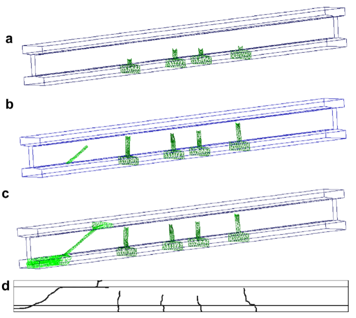
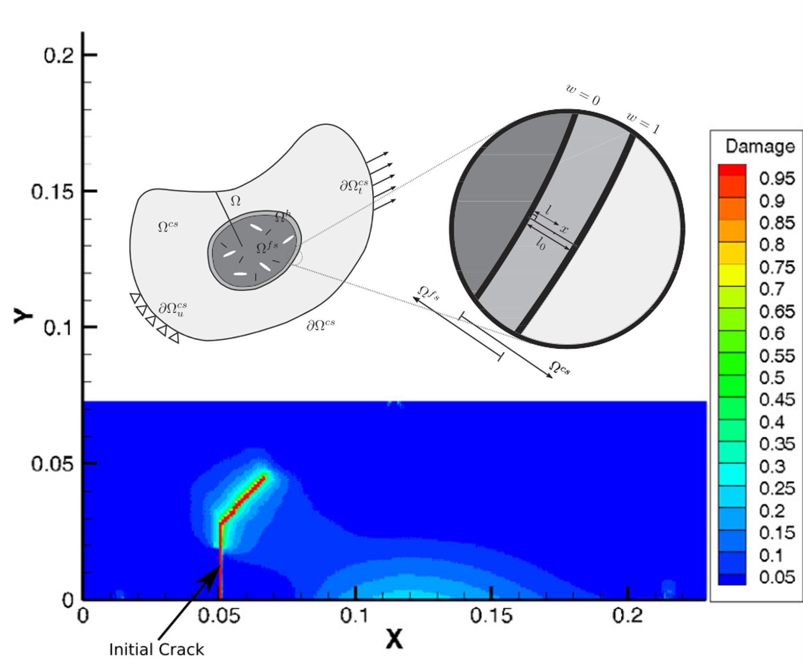
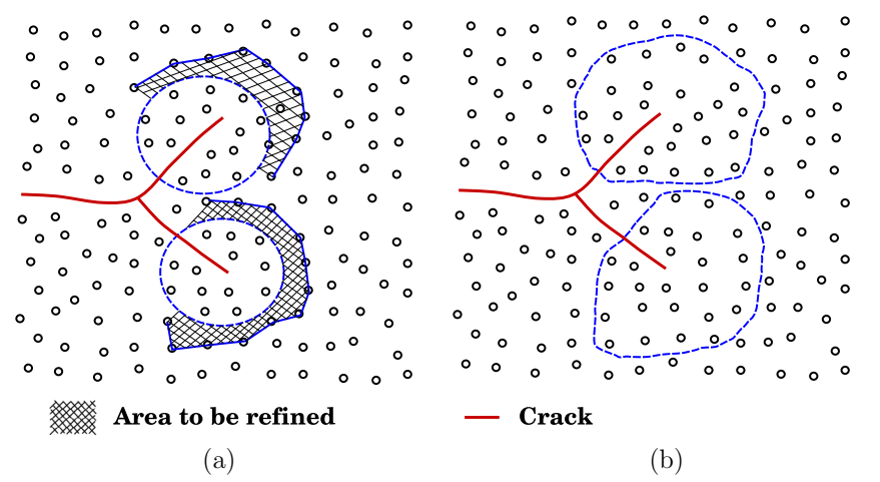

<div class="language-switch">[English](index.qmd) | **한글**</div>

균열은 계산문제를 조금 이상하게 만든다.

구조물에 발생하는 변형 대부분은 비교적 스무스하게 거동하는데, 파괴를 지배하는 현상은 균열선단 주변의 아주 작은 영역에 집중될 수 있다.

그러면 바로 이런 공학적인 질문이 생기게 된다.

> **분석 난이도가 높은 파괴현상은 국부적으로만 존재한다면, 왜 대상 구조물 전체에서 비싼 물리모델을 풀어야 하는가?**

이 질문은 단순히 요소망을 얼마나 잘게 나눌 것인가보다 중요하다.

균열 주변에서는 더 세밀한 연속체 이산화가 필요할 수도 있고, 다른 구성모델이 필요할 수도 있으며, 경우에 따라서는 원자모델까지 필요할 수 있다. 그러나 균열에서 멀리 떨어진 영역에서는 그런 상세한 모델을 사용해도 공학적으로 얻는 정보는 거의 늘지 않으면서 계산비용만 크게 증가할 수 있다.

따라서 다중스케일(multiscale) 파괴해석의 핵심 문제는 단순히

> 요소망을 얼마나 촘촘하게 해야 하는가?

가 아니다.

더 중요한 질문은

> **각 위치에서 어느 정도의 물리현상까지 직접 풀어야 하는가?**

이다.

이 글에서는 이 질문을 철근콘크리트 구조에서 시작하여 연속체-연속체 결합을 거쳐 원자수준의 파괴까지 따라가 본다.

## 균열이 있다고 구조물 전체가 똑같이 어려워지는 것은 아니다

균열이 있는 큰 구조물을 생각해 보자.

균열전면에서 충분히 멀리 떨어지면 변위장과 응력장은 비교적 스무스고 매끄럽게 변한다. 이런 영역은 일반적인 구조해석 모델로도 충분히 표현할 수 있는 경우가 많다.

하지만 균열선단 가까이에서는 여러 현상이 동시에 일어난다.

- 응력과 변형률이 국부화되고,
- 변위의 연속성이 깨질 수 있으며,
- 재료 비선형성이 중요해지고,
- 파괴과정영역(fracture process zone)이 형성되고,
- 균열이 어느 방향으로 진행할지를 결정해야 하며,
- 충분히 작은 스케일에서는 재료의 이산적인 구조 자체가 중요해질 수 있다.

즉 계산의 난이도는 공간적으로 매우 불균일하다.

개념적으로 쓰면

$$
\text{구조물}
=
\text{대부분의 스무스하고 매끄러운 거동}
+
\text{작은 파괴 지배영역}
$$

이다.

그런데 두 영역에 똑같은 해상도와 똑같은 물리모델을 적용하는 것이 과연 효율적일까?

다중스케일 파괴해석은 바로 이 질문에서 시작한다.

## 첫 번째 스케일 문제는 철근콘크리트에서도 확인할 수 있다

철근콘크리트는 좋은 예다. 하나의 구조모델 안에 이미 서로 다른 역학적 표현이 존재하기 때문이다.

콘크리트에는 균열이 생긴다.

철근은 연속성을 유지한다.

그리고 콘크리트와 철근은 부착을 통해 힘을 전달한다.

철근콘크리트 구조의 3차원 점성균열(cohesive crack) 해석에서는 콘크리트를 확장무요소 근사로, 철근을 트러스 또는 보 유한요소로, 두 재료 사이의 상호작용을 부착모델로 표현할 수 있다.

공학적으로 중요한 것은 각각 다른 모델을 썼다는 사실 자체가 아니다.

철근을 주변 콘크리트에 완전히 고정해 버리면 부착슬립에 의한 국부적인 힘의 재분배를 놓치게 된다. 콘크리트에 균열이 생기면 균열 부근에서 철근응력은 증가하고 주변 콘크리트의 응력은 감소한다. 이런 힘의 재분배가 균열간격과 최종적인 균열형상에 영향을 준다.

즉 원자수준까지 내려가지 않더라도 파괴해석은 이미 중요한 사실 하나를 보여준다.

> **같은 구조문제 안에서도 위치와 구성요소에 따라 서로 다른 역학적 표현이 필요할 수 있다.**

{#fig-rc-multiphysics fig-align="center" width="72%"}

그림 [-@fig-rc-multiphysics]에서 보아야 할 점은 철근콘크리트 자체보다 더 일반적이다.

좋은 계산모델이 모든 곳에서 하나의 보편적인 표현을 사용할 필요는 없다.

**응답을 지배하는 역학을 놓치지 않으면 된다.**

## 구조물 전체를 세분화하면 되지 않을까?

균열전면에서 아주 작은 요소가 필요하다고 해 보자.

가장 단순한 방법은 명확하다.

```text
전체 요소망 세분화
→ 균열영역 해상도 확보
→ 구조물 전체에서 상세 계산비용 부담
```

작은 시험체라면 이렇게 해도 괜찮을 수 있다.

하지만 3차원 구조물, 특히 동적해석에서는 계산비용이 급격히 증가한다. 요소를 작게 만들면 자유도만 증가하는 것이 아니다. 명시적(explicit) 시간적분에서는 안정적인 수렴하는 시간간격까지 작아질 수 있다.

그런데 그렇게 증가한 자유도의 대부분은 균열에서 멀리 떨어진 곳에 있을 수도 있어서, 괜히 계산비용만 증가시킬 수 있다.

다른 방법은

```text
구조물 대부분은 저해상도 모델
            ↓
파괴가 중요한 영역만 세밀한 고해상도 모델
```

을 사용하는 것이다.

얼핏 보면 단순한 국부 요소망 세분화처럼 보인다.

하지만 다중스케일 방법은 한 단계 더 나아갈 수 있다.

저해상도 영역과 고해상도 영역을 **서로 다른 모델**로 두고 그 사이에서 역학정보를 주고받게 할 수 있다.

## 연속체와 연속체의 결합: 파괴역학은 유지하면서 해상도만 바꾼다

한 가지 방법은 균열 주변에는 고해상도 연속체 모델을 두고 나머지 영역에는 저해상도 연속체 모델을 사용하는 것이다.

Extended Arlequin 방법에서는 두 모델이 **handshake domain**에서 서로 겹친다. 이 중첩영역에서 가중함수를 사용하여 두 모델의 에너지를 연결한다.

개념적으로

$$
W
=
w(\mathbf X)W^{\mathrm{coarse}}
+
[1-w(\mathbf X)]W^{\mathrm{fine}}
+
W^{\mathrm{coupling}}
$$

와 같이 볼 수 있다.

가중함수는 중첩영역을 따라 점진적으로 변한다.

$$
w=1
\qquad \text{저해상도 모델만 존재하는 영역},
$$

$$
0<w<1
\qquad \text{handshake 영역},
$$

$$
w=0
\qquad \text{고해상도 모델만 존재하는 영역}.
$$

이렇게 점진적으로 바꾸는 것은 특히 동적문제에서 중요하다. 두 모델 사이에 인위적인 급격한 경계를 만들면 응력파가 그 경계에서 반사될 수 있기 때문이다.

따라서 결합은 단순한 기하학 문제가 아니다.

두 모델은 변위, 힘과 에너지를 교환하면서도 두 모델의 경계가 가상의 재료경계처럼 거동하지 않아야 한다.

{#fig-arlequin fig-align="center" width="78%"}

그림 [-@fig-arlequin]에는 또 하나 흥미로운 점이 있다.

균열은 두 연속체 스케일 모두에서 XFEM으로 표현할 수 있다.

변위근사는 개념적으로

$$
\mathbf u^h
=
\mathbf u^{\mathrm{cont}}
+
\mathbf u^{\mathrm{discont}}
$$

로 볼 수 있다.

즉 공간적인 해상도가 달라진다고 해서 균열의 운동학까지 바꿀 필요는 없다.

여기서 흔히 섞여 있는 두 질문을 분리할 수 있다.

1. **균열을 어떻게 표현할 것인가?**
2. **균열 주변에 얼마나 높은 해상도가 필요한가?**

이 둘을 분리해서 생각하는 것이 중요하다.

## 세밀한 영역에는 균열선단이 아니라 필요한 물리가 들어가야 한다

여기서 중요한 공학적인 문제가 하나 있다.

점성파괴를 사용한다면 세밀한 영역은 수학적인 균열선단 바로 주변의 극히 작은 영역만을 의미하지 않는다.

파괴과정영역은 유한한 길이를 가진다.

그 특성길이는 대략

$$
l_{\mathrm{ch}}
\sim
\frac{E G_f}{f_t^2}
$$

와 같은 형태로 생각할 수 있다. 실제 식은 가정한 응력상태 등에 따라 달라질 수 있다.

여기서 $E$는 탄성계수, $G_f$는 파괴에너지, $f_t$는 인장강도다.

이 글에서 식의 정확한 형태보다 중요한 것은 그 공학적 의미다.

> **고해상도 영역은 저해상도 모델이 충분히 표현하지 못하는 물리과정을 포함할 만큼은 커야 한다.**

이것은 다중스케일 모델링의 일반적인 원칙이다.

단지 기하학적인 균열선단이 그곳에 있다는 이유로 고해상도 영역을 정하면 안 된다.

**필요한 물리가 그곳에 있기 때문에 고해상도 영역을 정해야 한다.**

## 그런데 왜 더 고해상도 연속체에서 멈춰야 할까?

연속체 모델은 재료의 거동을 응력과 변형률 같은 연속적인 장으로 표현할 수 있다고 가정한다.

하지만 충분히 작은 스케일로 내려가면 파괴는 결국 재료를 구성하는 입자 사이의 상호작용이 변하는 현상이다.

예를 들어 그래핀의 균열성장은 탄소원자의 운동과 상호작용을 직접 계산하여 연구할 수 있다.

균열이 있는 그래핀의 분자동역학(molecular dynamics) 해석에서는 결합의 신장과 회전, 국부에너지, 온도, 결합파괴 등을 통해 균열성장을 관찰한다.

이 스케일에서는

> 균열은 어디에 있는가?

라는 질문의 수치적인 의미 자체가 달라진다.

연속체에서처럼 변위 불연속을 반드시 별도로 삽입할 필요가 없다.

원자 사이의 연결이 끊어지면서 균열이 나타난다.

그러면 다음과 같은 계층을 생각할 수 있다.

```text
구조 스케일
    응력, 변형, 철근, 전체 평형

연속체 파괴 스케일
    균열면, 점성응력, 파괴과정영역

원자 스케일
    원자 상호작용, 결합변형, 결합파괴
```

어느 하나가 항상 더 "정확한" 모델인 것은 아니다.

서로 다른 스케일에서 서로 다른 질문에 답하는 모델이다.

## 원자모델은 연속체 법칙에서 이미 평균화된 것을 보여준다

연속체 스케일에서 점성법칙은 개념적으로

$$
\mathbf t
=
\mathbf t(\llbracket \mathbf u \rrbracket)
$$

로 쓸 수 있다.

여기서 $\mathbf t$는 파괴과정영역을 통해 전달되는 응력이고, $\llbracket \mathbf u \rrbracket$는 변위점프다.

이 관계는 엄청나게 복잡한 미시적인 현상을 공학적으로 사용할 수 있는 하나의 관계로 압축한 것이다.

원자 스케일로 내려가면 그동안 숨겨져 있던 복잡성의 일부가 직접 나타난다.

그래핀 해석에서는 원자결합의 신장과 회전을 통해 균열성장을 조사했다. 또한 균열전파를 제대로 해석하려면 시간 해상도 자체도 중요하다는 것을 보였다.

그렇다고 원자모델이 점성파괴역학을 대체한다는 뜻은 아니다.

오히려 연속체 파괴법칙을 사용할 때 **무엇을 이미 평균화하여 버렸는가**를 보여준다.

여기서 구분해야 할 것이 있다.

> **고해상도 모델은 공학적으로 그 정보를 필요로 하는 인과관계 때문에 사용해야 한다. 단순히 더 세밀하다는 이유로 사용하는 것이 아니다.**

## 정말 필요한 것은 세밀한 물리가 균열을 따라 같이 움직이게 하는 것이다

원자영역을 한 곳에 고정해 놓으면 또 다른 비효율이 생긴다.

균열은 움직이기 때문이다.

고비용의 원자영역이 고정되어 있으면 처음부터 매우 크게 만들어 놓거나, 균열이 그 영역 밖으로 나가는 문제를 감수해야 한다.

적응형 다중스케일 방법은 고해상도 영역 자체를 균열과 함께 이동시킨다.

Meshless adaptive multiscale formulation에서는 저해상도 영역을 연속체 무요소 모델로 표현하고 균열선단 주변에는 molecular-statistics 영역을 둔다.

균열이 성장하면

```text
균열선단 영역 확인
        ↓
균열 앞쪽 재료를 원자수준 표현으로 세분화
        ↓
고해상도 모델 안에서 균열 전파
        ↓
균열 뒤쪽에서 충분히 멀어진 영역은 다시 조대화
        ↓
균열을 따라 고비용 물리모델의 이동
```

한다.

원자영역이 일종의 **움직이는 계산 현미경**이 되는 셈이다.

{#fig-adaptive-atomistic fig-align="center" width="82%"}

그림 [-@fig-adaptive-atomistic]은 단순한 적응형 요소망 세분화와는 다르다.

균열이 움직이면서 모델이 **얼마나 세밀하게 계산할 것인가뿐 아니라 어떤 물리를 계산할 것인가까지 바꾼다.**

## 스케일 경계를 넘어 정보가 전달되어야 한다

서로 다른 물리모델을 동시에 사용하면 두 모델은 서로 정보를 주고받아야 한다.

연속체-원자 모델에서는 ghost atom이 이 결합을 담당한다.

Ghost atom의 위치는 저해상도 스케일의 변위장으로부터 얻어 고해상도 모델에 부여한다.

개념적으로

$$
\mathbf u^{\mathrm{ghost}}
\leftarrow
\mathbf u^{\mathrm{coarse}}
$$

라고 볼 수 있다.

반대로 고해상도 모델에서 계산된 국부적인 파괴의 변화는 결국 저해상도 모델에도 반영되어야 한다.

따라서 다중스케일 역학에서 어려운 것은 단순히 두 모델을 가지고 있다는 것이 아니다.

**물리적인 제한사항을 만족하면서, 동시에 필요한 정보를 두 모델 사이에 전달하는 것**은 어렵다.

그러면 다음과 같은 질문이 생긴다.

1. 저해상도 모델은 고해상도 모델에서 어떤 정보를 받아야 하는가?
2. 고해상도 모델은 저해상도 모델에서 어떤 경계정보를 받아야 하는가?
3. 에너지와 힘은 결합영역을 어떻게 통과해야 하는가?
4. 어느 시점에 한 영역의 스케일을 바꿀 것인가?
5. 원자수준에서 나타난 균열을 연속체의 균열로 어떻게 넘길 것인가?

얼핏 보면 계산방법에 관한 질문이지만 결국 모두 역학에 관한 질문이다.

## 균질화는 비슷하지만 다른 스케일 문제를 푼다

모든 다중스케일 문제가 균열을 따라 움직이는 고해상도 영역을 필요로 하는 것은 아니다.

미세구조의 불균질성이 큰 스케일에서의 유효 구성거동에 어떤 영향을 주는지를 알고 싶은 경우도 있다.

계산 균질화(computational homogenization)에서는 거시적인 변형률을 대표 미세 셀의 경계변위와 연결하고, 두 스케일 사이의 에너지 일관성을 통해 거시적인 응력을 얻을 수 있다.

개념적으로

$$
\boldsymbol{\varepsilon}^{\mathrm{macro}}
\longrightarrow
\text{미시 경계값 문제}
\longrightarrow
\boldsymbol{\sigma}^{\mathrm{macro}}
$$

이다.

이것은 균열선단을 직접 따라가는 concurrent multiscale coupling과는 다르다.

여기서는 고해상도 모델이 움직이는 균열을 직접 표현하기보다 **큰 스케일에서 사용할 유효 구성정보**를 제공한다.

둘의 차이는 다음과 같이 정리할 수 있다.

```text
균질화
    미세구조가 큰 스케일의 구성거동에 무엇을 의미하는가?

동시 다중스케일 파괴해석
    지금 어느 위치에서 고해상도 물리를 직접 풀어야 하는가?
```

둘 다 일종의 모델 축약이다.

하지만 줄이는 정보가 다르다.

## 작은 균열은 연속체적인 직관의 한계를 드러낼 수 있다

그래핀 연구는 또 하나 중요한 점을 보여준다.

공학적인 스케일의 파괴역학에서는 보통 균열길이, 응력확대계수, 파괴인성 같은 연속체 물리량으로 생각한다.

하지만 나노미터 스케일에서는 격자의 방향과 이산적인 결합구조가 실제 응답에 드러날 수 있다.

본 연구진의 분자동역학 연구에서는 서로 다른 격자방향과 균열크기를 가진 그래핀의 거동을 조사했다. 그 결과 원자수준의 파괴를 단순히 거시적인 연속체 그림을 작게 축소한 것으로만 이해해서는 곤란하다는 것을 볼 수 있다.

물리적으로 생각하면 당연하다.

연속체는 충분히 많은 미시 자유도가 평균화되어 매끄러운 장으로 표현될 수 있다고 가정한다.

균열크기가 재료의 이산적인 구조 스케일에 가까워지면 그 평균화가 충분하지 않을 수 있다.

그러면 질문도

> 균열선단 주변의 연속체장은 무엇인가?

에서

> 어떤 결합이 하중을 전달하고 있으며, 그 결합의 방향은 어떻고, 어떻게 끊어지는가?

로 바뀐다.

이것은 원자모델과 파괴역학이 서로 모순된다는 뜻이 아니다.

**어떤 모델이 그 문제에서 필요한 정보를 어느 스케일까지 담고 있는가**의 문제다.

## 그러면 물리를 어디까지 넣어야 할까?

다음과 같은 계층을 생각할 수 있다.

| 영역 또는 질문 | 가능한 표현 | 유지되는 정보 |
|---|---|---|
| 전체 구조응답 | 저해상도 연속체 | 평형, 강성, 하중경로 |
| 균열 지배 구조영역 | 확충/점성 연속체 | 변위점프, 균열기하, 파괴에너지 |
| 재료 불균질성 | 대표 세부 셀 | 유효 구성거동 |
| 고도로 국부화된 파괴영역 | 고해상도 연속체 | 상세 파괴과정영역 |
| 원자 스케일 파괴 | 원자모델 | 원자결합과 이산 격자효과 |

여기서 중요한 단어는 **가능한**이다.

모든 파괴문제가 이 모든 스케일을 거쳐야 한다는 보편적인 규칙은 없다.

일반적인 보 구조물을 해석하는 데 원자모델까지 사용할 필요는 거의 없다.

반대로 나노스케일 재료를 연구한다면 일반적인 연속체 균열법칙이 오히려 우리가 알고 싶은 정보를 평균화해서 없애 버릴 수 있다.

큰 동적 파괴문제에서 구조물 전체를 아주 고해상도 연속체 요소망으로 해석하면 정확할 수는 있어도 계산적으로 매우 비효율적일 수 있다.

**적절한 모델은 공학적인 질문에 따라 달라진다.**

## 다중스케일 파괴는 결국 정보배분 문제다

이제 더 근본적인 관점에서 볼 수 있다.

계산모델에는 사용할 수 있는 자원이 한정되어 있다.

- 자유도,
- 시간간격,
- 구성모델의 복잡성,
- 기하학적 복잡성,
- 메모리,
- 계산시간.

다중스케일 해석의 목적은 모델을 복잡하게 만드는 것이 아니다.

**물리적으로 중요한 정보가 생성되는 위치에 계산자원을 배분하는 것**이다.

파괴문제에서는

$$
\text{계산노력}
\not\propto
\text{구조물의 체적}
$$

이어야 한다.

이상적으로는

$$
\text{계산노력}
\propto
\text{국부적인 물리현상의 난이도와 중요성}
$$

이어야 한다.

그래서 균열과 함께 움직이는 고해상도 영역을 사용하는 매력적이다.

**계산 해상도가 역학적인 필요성을 따라가게 할 수 있기 때문이다.**

## 에너지와 연결해서 보면

이 문제는 역학적으로 더 직접적으로 볼 수도 있다.

어느 스케일에서든 모델은 역학적으로 일관된 일을 전달해야 한다.

구조 스케일에서 힘과 변위는 에너지 공액이다.

$$
\delta W
=
\mathbf F\cdot\delta\mathbf u.
$$

연속체에서는

$$
\delta W_{\mathrm{int}}
=
\int_\Omega
\boldsymbol{\sigma}:\delta\boldsymbol{\varepsilon}\,d\Omega.
$$

점성균열에서는

$$
\delta W_{\mathrm{coh}}
=
\int_{\Gamma_c}
\mathbf t\cdot
\delta\llbracket\mathbf u\rrbracket
\,d\Gamma.
$$

다중스케일 결합에서도 서로 다른 표현 사이로 정보를 전달하면서 이 역학적인 장부가 맞아야 한다.

그래서 스케일 결합을 한쪽 변위장을 다른 쪽으로 보간하는 문제 정도로 생각하면 곤란하다.

핵심은 그 정보전달이

$$
F \leftrightarrow \sigma \leftrightarrow \varepsilon \leftrightarrow u
$$

를 연결하는 **역학적 일을 보존하는가**이다.

수치적인 표현은 바뀔 수 있다.

**역학은 바뀌지 않는다.**

## 결국 핵심은

> **응답이 단순한 곳에서는 가장 단순한 모델을 사용하고, 파괴 때문에 문제가 어려워지는 곳에만 상세한 고해상도 물리를 사용하자.**

이 원칙은 계산파괴역학에만 해당하지 않는다.

소성영역, 접촉, 재료계면, 국부좌굴, 손상, 부식전면처럼 국부적인 현상이 훨씬 큰 시스템의 응답을 지배하는 문제에도 그대로 적용할 수 있다.

가장 고해상도 모델이 항상 가장 좋은 모델은 아니다.

좋은 공학모델은 질문에 답하는 데 필요한 정보는 남기고, 답에 실질적인 영향을 주지 않는 세부정보는 버린다.

파괴문제에서는 **균열 자체가 어디에 그 정보가 집중되어 있는지를 알려준다.**

---

## 계산파괴역학 시리즈

**이전 글:** [균열을 표현하려면 반드시 변위공간을 부가적으로 확충해야 하는가?](../alternative-crack-representations/index-ko.qmd)

**시리즈 전체 보기:** [계산파괴역학은 왜 어려운가?](../computational-fracture-overview/index-ko.qmd)

**다음 글:** *확충기법은 계산역학에 무엇을 남겼는가?*

---

## Original research

Rabczuk, T., Zi, G., Bordas, S., & Nguyen-Xuan, H. (2008).  
**A geometrically non-linear three-dimensional cohesive crack method for reinforced concrete structures.**  
*Engineering Fracture Mechanics, 75*, 4740–4758.  
https://doi.org/10.1016/j.engfracmech.2008.06.019

Talebi, H., Zi, G., Silani, M., Samaniego, E., & Rabczuk, T. (2012).  
**A Simple Circular Cell Method for Multilevel Finite Element Analysis.**  
*Journal of Applied Mathematics, 2012*, Article 526846.  
https://doi.org/10.1155/2012/526846

Silani, M., Talebi, H., Ziaei-Rad, S., Hamouda, A. M., Zi, G., & Rabczuk, T. (2015).  
**A three dimensional extended Arlequin method for dynamic fracture.**  
*Computational Materials Science, 96*, 425–431.  
https://doi.org/10.1016/j.commatsci.2014.07.039

Yang, S.-W., Budarapu, P. R., Mahapatra, D. R., Bordas, S. P. A., Zi, G., & Rabczuk, T. (2015).  
**A meshless adaptive multiscale method for fracture.**  
*Computational Materials Science, 96*, 382–395.  
https://doi.org/10.1016/j.commatsci.2014.08.054

Budarapu, P. R., Javvaji, B., Sutrakar, V. K., Mahapatra, D. R., Zi, G., & Rabczuk, T. (2015).  
**Crack propagation in graphene.**  
*Journal of Applied Physics, 118*, 064307.  
https://doi.org/10.1063/1.4928316

Budarapu, P. R., Javvaji, B., Sutrakar, V. K., Mahapatra, D. R., Paggi, M., Zi, G., & Rabczuk, T. (2016).  
**Lattice orientation and crack size effect on the mechanical properties of Graphene.**  
*International Journal of Fracture.*  
https://doi.org/10.1007/s10704-016-0115-9
