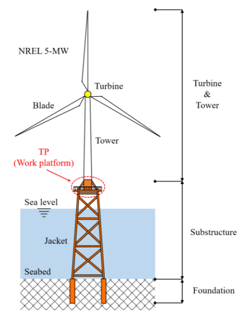
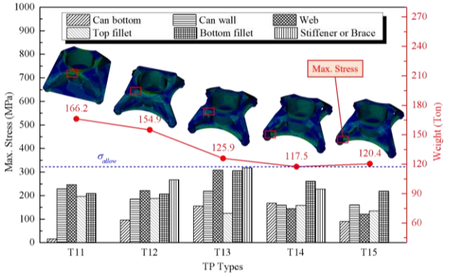
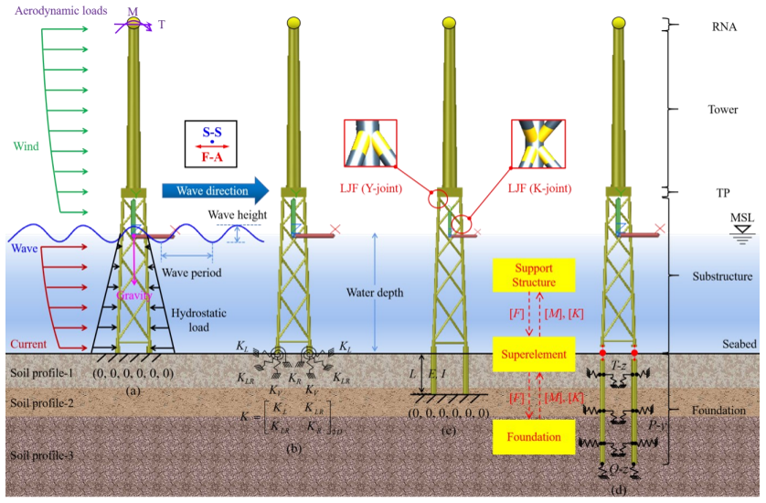
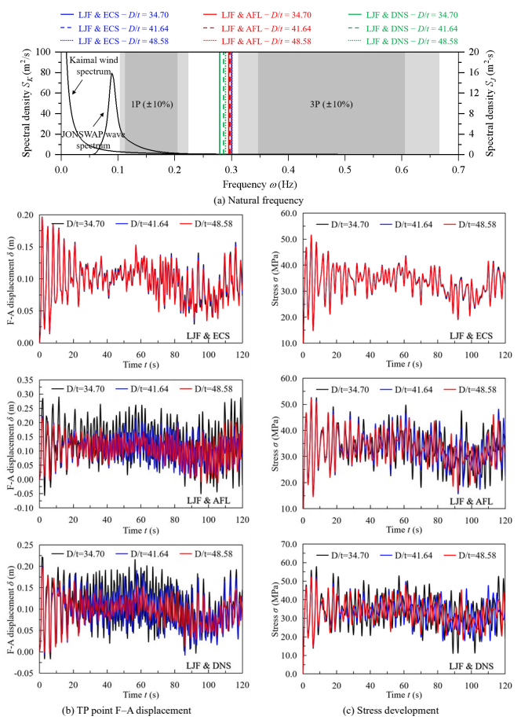

[English](index.qmd) | **한글**

재킷지지 해상풍력터빈을 구조공학자의 눈으로 보면 익숙한 구조처럼 보인다.

위에는 타워가 있고, 그 아래에는 강관 레그와 브레이스로 이루어진 3차원 강재 프레임이 있다. 그리고 그 아래에는 해저지반에 관입된 말뚝이 있다.

그래서 전체 구조를 다음처럼 생각하기 쉽다.

$$
\text{타워}
\rightarrow
\text{프레임 부재}
\rightarrow
\text{고정단}.
$$

그러면 구조물의 강성은 주로 익숙한 부재 강성,

$$
EA
\qquad\text{와}\qquad
EI
$$

에 의해 결정되는 것처럼 보인다.

하지만 실제 재킷지지 해상풍력터빈은 그렇게 단순하지 않다.

타워에서 내려오는 하중은 먼저 **트랜지션 피스(transition piece)**를 통해 재분배되어야 한다. 강관 브레이스가 연결되는 코드(chord)의 벽은 국부적으로 변형한다. 마지막으로 말뚝도 주변 지반과 함께 변형한다.

따라서 실제 구조의 연결고리는 오히려 다음에 가깝다.

$$
\boxed{
\text{타워}
\rightarrow
\text{트랜지션 피스}
\rightarrow
\text{강관 접합부}
\rightarrow
\text{재킷 부재}
\rightarrow
\text{말뚝}
\rightarrow
\text{지반}
}
$$

이 모든 부분이 구조물의 응답에 기여한다.

그렇다면 공학적으로 궁금한 것은 이것이다.

> **재킷지지 해상풍력터빈의 유연성은 실제로 어디에서 오는가?**

우리의 두 연구는 이 질문을 서로 다른 스케일에서 살펴보았다.

첫 번째 연구에서는 트랜지션 피스가 타워의 하중을 재킷으로 어떻게 전달하는지를 조사했다. 두 번째 연구에서는 강관 접합부의 국부 유연성과 말뚝-지반 상호작용이 해상풍력터빈 전체의 동적 응답을 어떻게 변화시키는지 살펴보았다.

두 연구를 함께 놓고 보면 한 가지 구조공학적 원리가 드러난다.

> **부재만이 구조물의 전부는 아니다. 부재와 부재, 구조와 지반을 연결하는 인터페이스도 강성의 일부다.**

---

## 먼저 하중이 어디로 흐르는지 보자

강성을 이야기하기 전에 구조물이 실제로 무엇을 해야 하는지 생각해 보자.

로터와 타워에 작용하는 바람은 힘과 큰 전도모멘트를 만든다. 이 하중은 아래로 전달되어야 한다.

$$
\text{로터}
\rightarrow
\text{타워}
\rightarrow
\text{트랜지션 피스}
\rightarrow
\text{재킷}
\rightarrow
\text{기초}
\rightarrow
\text{지반}.
$$

문제는 타워와 재킷의 형상이 매우 다르다는 데 있다.

타워는 본질적으로 하나의 큰 원통형 쉘이다. 반면 재킷은 공간적으로 떨어진 여러 개의 레그를 브레이스로 연결한 구조다.

따라서 트랜지션 피스는 한 구조계가 전달하던 힘과 모멘트를 다른 구조계가 받아갈 수 있는 형태의 힘으로 바꾸어 주어야 한다.

여기가 첫 번째 중요한 인터페이스다.

{#fig-jacket-system fig-align="center" width="75%"}

---

## 트랜지션 피스는 하중을 분배하는 구조다

모노파일 지지식 터빈과 달리 재킷식 해상풍력터빈에는 타워와 재킷 사이에 별도의 구조 영역이 필요하다.

타워와 재킷의 형상이 크게 다르기 때문에 타워에서 내려오는 하중을 트랜지션 피스에서 재분배해야 한다.

그래서 우리의 트랜지션 피스 연구에서는 **타워의 힘을 얼마나 효과적으로 재분배하여 재킷으로 전달하느냐**를 구조성능을 결정하는 핵심 문제로 보았다.

브레이스형, 박스 거더형, 합성 플레이트형, 단일 웨브형 등 여러 트랜지션 피스 형상을 수치적으로 검토했다.

그런데 여기서 더 흥미로운 것은 어떤 형상이 최적인가 아니다.

**응력분포가 하중의 흐름에 대해 무엇을 말해 주는가**가 더 중요했다.

---

## 높은 응력은 나쁜 하중전달경로를 보여줄 수 있다

일반적인 브레이스형 트랜지션 피스를 생각해 보자.

기본 형상에서 최대응력은 약

$$
329~\text{MPa}
$$

까지 발생했다.

그런데 응력의 크기보다 더 중요한 것은 **어디에서 발생했는가**였다.

최대응력은 브레이스나 데크가 아니라 **타워 캔(tower can)의 쉘**에서 발생했다.

이는 브레이스가 타워 하중을 충분히 재분배하여 아래쪽 재킷으로 전달하지 못하고 있다는 뜻이다. 타워 캔이 여전히 너무 많은 하중을 부담하고 있었다.

그래서 브레이스와 캔의 연결부 부근에 보강 링을 추가했다.

그 결과 캔 벽의 최대응력은 약

$$
329~\text{MPa}
$$

에서

$$
187~\text{MPa}
$$

로 감소했다.

그런데 이번에는 브레이스-캔-보강 링 연결부 주변에 새로운 응력집중이 나타났다.

왜 그런가?

보강으로 **하중전달경로 자체가 바뀌었기 때문**이다.

기존에는 주로 타워 캔을 통해 전달되던 하중의 일부가 이제 브레이스로 전달되기 시작했다.

유한요소해석의 응력 컨투어를 볼 때 이 점이 중요하다.

> **응력집중은 단순히 숫자가 큰 곳을 보여주는 것이 아니다. 하중이 방향을 바꾸거나 한 부재에서 다른 부재로 넘어가는 위치를 보여주는 경우가 많다.**

그림 [-@fig-tp-evolution]에서 보듯이, 보강은 최대응력만 낮춘 것이 아니라 하중이 타워 캔에서 브레이스를 거쳐 재킷 레그로 전달되는 방식 자체를 바꾸었다.

{#fig-tp-evolution fig-align="center" width="95%"}

이후 브레이스와 연결부 형상을 수정하여 아래쪽으로의 하중전달을 개선했다.

한 형상에서는 브레이스와 데크의 최대응력이 각각 약 **19.6%**, **18.4%** 감소했다.

하지만 강관 브레이스를 더 크게 만든다고 해서 개선이 계속되지는 않았다. 더 큰 브레이스 형상에서는 오히려 브레이스 응력이 증가했고 구조물의 중량도 늘어났다.

즉,

$$
\boxed{
\text{재료를 더 많이 사용한다고}
\not\Rightarrow
\text{하중이 더 잘 전달되는 것은 아니다}.
}
$$

중요한 것은 하중이 흐르는 **경로의 형상**이다.

---

## 그런데 하중전달은 시작일 뿐이다

효율적인 트랜지션 피스를 설계했다고 하자.

이제 보요소를 이용하여 재킷 전체의 프레임 모델을 만들 수 있다. 얼핏 보면 문제는 간단해 보인다.

각 부재에는 익숙한 축강성과 휨강성,

$$
EA
\qquad\text{와}\qquad
EI
$$

가 있다.

그런데 여기에는 숨어 있는 가정이 하나 있다.

**강관 부재와 강관 부재가 만나는 곳에서는 실제로 무슨 일이 일어나는가?**

일반적인 프레임 모델에서는 브레이스와 코드를 이상적인 강접합으로 연결하는 경우가 많다. 부재 중심축이 한 점에서 만나고 그 점에서 적합조건을 만족시킨다.

수학적인 접합점 자체는 변형하지 않는다.

실제 강관 접합부는 그렇지 않다.

---

## 강관 접합부는 수학적인 점이 아니다

큰 강관 코드에 브레이스가 용접되어 있다고 생각해 보자.

브레이스의 힘과 모멘트가 코드로 전달되면 코드 벽은 국부적으로 변형한다. 따라서 이 연결부 자체가 유연성을 가진다.

변형 전 부재 사이의 각도를 $\theta_0$라고 하면 이상적인 강접합 모델은 본질적으로

$$
\theta_R=\theta_0
$$

를 유지한다.

반면 실제로 유연한 강관 접합부에서는

$$
\theta_F\neq\theta_0
$$

가 될 수 있다.

이 변형을 **국부 접합부 유연성(local joint flexibility, LJF)**이라고 한다.

2024년 연구에서는 브레이스-코드 접합부를 세 가지 방식으로 모델링했다.

- 강접합(rigid joint)
- 중심선 연결(center-to-center, CTC) 접합
- 국부 접합부 유연성(local joint flexibility, LJF) 모델

그림 [-@fig-joint-models]은 세 모델의 차이를 보여준다.

{#fig-joint-models fig-align="center" width="90%"}

강접합 모델은 코드의 국부 변형을 억제한다.

CTC 모델은 브레이스의 중심축을 코드 중심선까지 연장하지만 실제 강관 접합부의 상세한 유연 거동을 정확히 표현하지는 못한다.

LJF 모델은 실제 브레이스-코드 연결부에서 발생하는 국부 유연성을 구조모델에 포함한다.

얼핏 보면 국부적인 모델링 차이에 불과하다.

문제는 그 영향이 국부적이지 않다는 데 있다.

---

## 국부 유연성이 터빈 전체의 응답을 바꾼다

진동하는 구조물의 고유진동수는 익숙한 고유치 문제

$$
\left(
\mathbf{K}
-
\omega^2\mathbf{M}
\right)\boldsymbol{\phi}
=
\mathbf{0}
$$

에서 결정된다.

여기서 중요한 것은 개별 부재 하나의 강성이 아니다.

**조립된 전체 구조계**의 강성행렬

$$
\mathbf{K}_{\mathrm{system}}
$$

이다.

접합부의 국부 변형을 억제하면 조립된 구조물은 실제보다 뻣뻣해진다.

그러면

$$
\mathbf{K}_{\mathrm{system}}
$$

이 달라지고, 따라서 $\omega$가 달라지며, 결국

$$
f=\frac{\omega}{2\pi}
$$

로 계산되는 고유진동수도 달라진다.

2024년 연구에서 실제로 이런 결과가 나타났다.

강접합 모델의 1차 고유진동수는

$$
0.324~\text{Hz}
$$

였지만 LJF 모델에서는

$$
0.301~\text{Hz}
$$

였다.

LJF 모델과 비교하면 강접합 모델과 CTC 모델은 트랜지션 피스의 최대 전후방향 변위를 각각 **19.79%**, **16.38%** 작게 예측했다.

반면 최대 부재응력은 LJF 모델보다 각각 **54.12%**, **32.08%** 크게 예측했다.

여기서 중요한 것은 접합부 유연성을 무시했을 때 하나의 단순한 '보수적 오차'가 생기는 것이 아니라는 점이다.

응답량에 따라 오차의 방향이 달라진다.

응력에 대해서는 보수적인 모델이 변위에 대해서는 비보수적일 수 있다.

---

## 그 다음 인터페이스는 해저지반이다

강관 접합부를 제대로 모델링했다고 해도 또 하나의 단순화가 남아 있다.

**재킷 구조는 어디에서 끝나는가?**

편리한 구조모델에서는 해저면에 고정 경계조건을 둘 수 있다.

$$
u=0,
\qquad
\theta=0.
$$

하지만 실제 말뚝은 해저면에서 끝나지 않는다. 지반 속으로 계속 들어간다.

횡하중이 작용하면 말뚝이 휘고 주변 지반도 변형한다. 따라서 기초에서도 추가적인 유연성이 발생한다.

이것이 **말뚝-지반 상호작용(pile-soil interaction)**이다.

2024년 연구에서는 네 가지 기초 모델을 비교했다.

- 고정기초(fixed foundation, FF)
- 등가 연성 스프링(equivalent coupled springs, ECS)
- 겉보기 고정길이(apparent fixity length, AFL)
- 분포 비선형 스프링(distributed nonlinear springs, DNS)

DNS 모델은 말뚝을 따라 분포된 비선형 스프링으로 지반저항을 표현하며, 비교를 위한 상대적으로 고충실도 기준모델로 사용했다.

---

## 기초를 어떻게 모델링하느냐에 따라 동적 응답이 달라진다

DNS 모델을 기준으로 보면 고정기초 모델의 1차 고유진동수는

$$
0.304~\text{Hz}
$$

였고 DNS 모델은

$$
0.283~\text{Hz}
$$

였다.

즉 고정기초 모델이 **7.42% 높게** 예측했다. 등가 연성 스프링 모델도 비슷하게 **7.07%** 높게 예측했다.

변위 차이는 더 컸다.

트랜지션 피스의 최대 전후방향 변위는 고정기초 모델에서

$$
0.130~\text{m}
$$

였지만 DNS 모델에서는

$$
0.189~\text{m}
$$

였다.

따라서 고정기초 가정은 DNS에 비해 변위를 **31.36% 작게** 예측했다.

그런데 겉보기 고정길이 모델은 일부 응답에서 반대 방향의 결과를 보였다. 최대변위와 최대 부재응력은 DNS 모델보다 각각 **12.42%**, **10.70%** 높았다.

여기서 또 하나 중요한 점이 나온다.

> **"고정기초는 항상 보수적이다"라고 말할 수 없다.**

어떤 **응답량을 보고 있는가**에 따라 달라진다.

---

## 접합부 유연성과 기초 유연성은 함께 작용한다

두 효과를 동시에 고려하면 차이가 더 분명해진다.

네 가지 모델을 비교했다.

| 모델 | 접합부 | 기초 |
|---|---|---|
| Rigid & FF | 강접합 | 고정 |
| LJF & FF | 유연 | 고정 |
| Rigid & DNS | 강접합 | 유연 |
| LJF & DNS | 유연 | 유연 |

LJF & DNS 모델은 국부 접합부 유연성과 말뚝-지반 유연성을 모두 고려하므로 상대적으로 현상을 충실하게 반영한 기준모델로 사용했다.

그림 [-@fig-combined-flexibility]은 이 두 유연성이 전체 구조응답에 함께 작용하는 모습을 보여준다.

{#fig-combined-flexibility fig-align="center" width="95%"}

결과는 다음과 같다.

| 모델 | 1차 고유진동수 | 최대 TP 변위 | 최대 부재응력 |
|---|---:|---:|---:|
| Rigid & FF | 0.324 Hz | 0.124 m | 67.341 MPa |
| LJF & FF | 0.301 Hz | 0.155 m | 43.694 MPa |
| Rigid & DNS | 0.317 Hz | 0.147 m | 60.032 MPa |
| **LJF & DNS** | **0.279 Hz** | **0.216 m** | **52.848 MPa** |

LJF & DNS와 비교하면 접합부와 기초를 모두 강체화한 Rigid & FF 모델은 1차 고유진동수를 **16.13% 높게**, 트랜지션 피스 최대변위를 **42.30% 낮게** 예측했다.

이 정도 차이를 작은 모델링 세부사항이라고 넘기기는 어렵다.

두 모델은 사실상 상당히 다른 역학계를 표현하고 있는 셈이다.

---

## 작은 유연성들이 왜 이렇게 큰 차이를 만드는가?

재킷을 보요소의 집합으로만 보지 말고, **변형할 수 있는 여러 구조 영역이 복합하여 이어진 시스템**이라고 생각하면 이해하기 쉽다.

아주 개념적으로 쓰면,

$$
\text{타워}
-
\text{TP}
-
\text{접합부}
-
\text{부재}
-
\text{접합부}
-
\text{말뚝}
-
\text{지반}.
$$

일반화된 하중 $F$가 작용할 때 전체 변위를 개념적으로

$$
u_{\mathrm{total}}
=
u_{\mathrm{TP}}
+
u_{\mathrm{members}}
+
u_{\mathrm{joints}}
+
u_{\mathrm{foundation}}
$$

으로 생각할 수 있다.

물론 3차원으로 결합된 실제 재킷 구조의 변위를 문자 그대로 이렇게 분해할 수 있다는 뜻은 아니다. 역학을 이해하기 위한 그림이다.

수치모델에서

$$
u_{\mathrm{joints}}=0
$$

그리고

$$
u_{\mathrm{foundation}}=0
$$

이라고 가정하면 전체 변위는 작아진다.

따라서 등가적인 유효강성

$$
k_{\mathrm{eff}}
\sim
\frac{F}{u_{\mathrm{total}}}
$$

은 커진다.

그리고 개념적으로

$$
f
\propto
\sqrt{\frac{k_{\mathrm{eff}}}{m}}
$$

이므로 고유진동수도 증가하는 방향으로 간다.

고유진동수가 달라지는 이유는 특별히 신비로운 것이 아니다.

단순화된 모델에서 **실제로 존재하는 변형 메커니즘을 제거했기 때문**이다.

---

## 중요한 유연성은 인터페이스에 집중되어 있을 수 있다

재킷을 보면 긴 강관 부재가 가장 먼저 눈에 들어온다.

하지만 가장 중요한 모델링 불확실성이 반드시 그 부재에 있는 것은 아니다.

큰 영향을 주는 변형 메커니즘은 오히려

$$
\boxed{
\text{인터페이스}
}
$$

에 집중될 수 있다.

예를 들면,

- 타워-트랜지션 피스의 하중전달
- 브레이스-코드 접합부
- 말뚝-지반 상호작용

이다.

트랜지션 피스 연구에서는 국부 형상을 바꾸는 것만으로 타워에서 재킷으로 흐르는 하중경로가 크게 달라질 수 있음을 보였다.

이후의 동적 연구에서는 코드의 국부 변형과 말뚝-지반 변형을 허용하면 터빈 전체의 강성과 동적 응답이 달라진다는 것을 보였다.

두 연구는 서로 다른 스케일의 문제를 다루지만 역학적으로는 같은 이야기를 하고 있다.

---

## 국부 역학이 전체 동역학을 지배할 수 있다

두 연구를 연결해서 볼 때 가장 중요한 부분이다.

트랜지션 피스 문제는 처음에는 **국부 문제**처럼 보인다.

> 타워 하중을 재킷으로 어떻게 넣을 것인가?

강관 접합부도 국부 문제처럼 보인다.

> 브레이스가 하중을 코드로 전달할 때 코드 벽은 얼마나 변형하는가?

말뚝-지반 상호작용 역시 기초의 세부 문제처럼 보인다.

> 말뚝과 주변 지반은 함께 어떻게 변형하는가?

하지만 이 국부 메커니즘들은 모두 전체 구조의 유연성에 기여한다.

그리고 전체 유연성은

$$
f_n,
\qquad
u(t),
\qquad
\sigma(t)
$$

와 같은 동적 응답을 결정한다.

결국,

$$
\boxed{
\text{국부 하중전달}
\rightarrow
\text{국부 변형}
\rightarrow
\text{전체 강성}
\rightarrow
\text{전체 동적 응답}
}
$$

으로 이어진다.

접합부나 기초에서의 작은 모델링 선택이 해상풍력터빈 전체의 응답 예측을 바꿀 수 있는 이유다.

---

## 해상풍력터빈에서는 왜 더 중요한가?

일반적인 구조물에서는 고유진동수의 어느 정도 오차가 항상 설계를 지배하는 것은 아니다.

해상풍력터빈은 상황이 다르다.

공력과 유체력에 의한 반복하중을 지속적으로 받는다. 따라서 구조물의 고유진동수는 로터 회전주파수와 블레이드 통과주파수 같은 가진주파수와의 관계 속에서 보아야 한다.

2024년 연구에서 로터 회전주파수 범위는 약

$$
0.115\text{--}0.202~\text{Hz}
$$

였고, 블레이드 통과주파수 범위는 약

$$
0.345\text{--}0.606~\text{Hz}
$$

였다.

강접합 모델의 1차 고유진동수는

$$
0.324~\text{Hz}
$$

로, 해석에서 고려한 블레이드 통과주파수 영역에 가까웠다.

LJF와 DNS를 함께 고려하면 1차 고유진동수는

$$
0.279~\text{Hz}
$$

로 낮아졌다.

즉 유연성을 어떻게 모델링하느냐는 단순히 계산된 변위와 응력만 바꾸는 것이 아니다.

**구조물의 고유진동수와 가진주파수가 얼마나 떨어져 있는가**에 대한 엔지니어의 판단 자체를 바꿀 수 있다.

---

## 단순화 자체가 문제는 아니다

그렇다고 모든 재킷식 해상풍력터빈을 항상 상세 쉘요소, 완전한 3차원 지반 연속체, 고비용 비선형해석으로 모델링해야 한다는 뜻은 아니다.

공학해석에는 이상화가 필요하다.

진짜 질문은 이것이다.

> **어떤 변형 메커니즘은 안전하게 단순화할 수 있고, 어떤 메커니즘은 우리가 관심 있는 응답을 지배하는가?**

프레임 요소는 대형 재킷 구조를 효율적으로 해석할 수 있게 해 주므로 여전히 매우 유용하다. 단순화된 기초모델도 목적에 따라 충분히 적절할 수 있다.

2024년 연구에서도 실무적인 해석에는 단순화가 필요하기 때문에 여러 단순화 모델을 검토했다. 그리고 지반과 말뚝의 강성이 달라지면 각 단순화 모델의 거동도 달라진다는 것을 확인했다.

중요한 것은 **각 단순화가 어떤 변형을 제거하는지 아는 것**이다.

강접합은 코드의 국부 변형을 제거한다.

고정기초는 말뚝-지반 변형을 제거한다.

지나치게 단순화한 트랜지션 피스는 타워 하중이 실제로 재킷 레그로 재분배되는 메커니즘을 제거할 수 있다.

그 변형 메커니즘이 우리가 보고자 하는 응답에 중요하다면, 그 단순화 역시 중요해진다.

---

## 강성은 시스템의 성질이다

구조공학자는 강성을 부재의 성질과 연결해서 생각하는 데 익숙하다.

$$
EA,
\qquad
EI,
\qquad
GJ.
$$

물론 이 값들은 기본적으로 중요하다.

하지만 해상풍력 재킷의 사례가 보여주는 것은 **전체 구조강성은 부재 강성만으로 결정되지 않는다**는 점이다.

개념적으로는 다음과 같이 생각할 수 있다.

$$
\boxed{
\text{전체 구조강성}
=
\text{부재}
+
\text{접합부}
+
\text{하중전달 영역}
+
\text{기초 상호작용}.
}
$$

이 식은 강성을 문자 그대로 더한다는 뜻이 아니다. 구조물의 어느 곳에서 변형이 발생할 수 있는지를 강조하기 위한 개념식이다.

따라서 완전한 강접합과 완전한 고정기초를 사용한 정교한 보 모델보다, 지배적인 유연성 메커니즘을 제대로 포함한 비교적 단순한 모델이 실제 구조를 더 잘 표현할 수도 있다.

---

## 엔지니어는 무엇을 확인해야 하는가?

재킷식 해상풍력터빈 모델을 만들거나 검토할 때 다음 질문을 해볼 필요가 있다.

**타워 하중은 재킷으로 어떻게 들어가는가?**

트랜지션 피스의 형상이 합리적인 하중경로를 만들고 있는가? 아니면 하중이 특정 국부 영역으로 억지로 몰리고 있는가?

**강관 접합부는 정말 강체인가?**

레그 코드(chord)의 국부 변형이 응답에 유의미하게 기여한다면 단순한 강접합 보 모델은 전체 강성을 과대평가할 수 있다.

**기초는 어디에서 고정되어 있다고 가정했는가?**

그 경계조건이 관심 있는 응답을 계산하기에 실제 말뚝-지반 시스템을 충분히 잘 표현하는가?

**어떤 응답량이 중요한가?**

고유진동수, 변위, 부재응력, 피로는 같은 모델링 단순화에 대해서도 서로 다르게 반응할 수 있다.

마지막 질문이 특히 중요하다.

한 응답량에 대해 보수적으로 보이는 가정이 다른 응답량에 대해서는 비보수적일 수 있다.

---

## 연구의 한계

여기서 설명한 결과는 두 개의 특정 수치연구에서 얻은 것으로, 모든 재킷식 해상풍력터빈에 적용할 수 있는 보정계수로 해석해서는 안 된다.

트랜지션 피스 연구는 NREL 5-MW 기준 터빈과 특정 재킷 형상 및 환경조건을 사용했다. 구조성능 비교 역시 해당 연구에서 검토한 트랜지션 피스 형상들에 대한 것이다.

접합부 및 기초 유연성 연구도 특정 5-MW 재킷식 해상풍력터빈, 지반조건, 환경조건, 접합부 모델, 기초모델을 사용했다. 또한 터빈-블레이드-허브 시스템을 집중질량으로 단순화했고 공력하중도 단순화하여 표현했다.

따라서

$$
16.13\%,
\qquad
42.30\%
$$

같은 값을 일반적인 보정계수로 사용해서는 안 된다.

중요한 것은 숫자 자체보다 그 숫자가 보여주는 역학적 의미다.

> **무시한 인터페이스의 유연성이 구조물 전체의 예측 응답을 실질적으로 바꿀 만큼 클 수 있다.**

---

## 결국 무엇이 중요한가?

재킷지지 해상풍력터빈을 그림으로 그리면 프레임 구조다.

하지만 역학적으로 보면 하중전달과 변형 메커니즘이 이어진 하나의 사슬에 가깝다.

$$
\text{타워}
\rightarrow
\text{트랜지션 피스}
\rightarrow
\text{강관 접합부}
\rightarrow
\text{재킷 부재}
\rightarrow
\text{말뚝}
\rightarrow
\text{지반}.
$$

부재는 중요하다.

그러나 부재가 만나는 곳, 하중이 경로를 바꾸는 곳, 구조물이 지반으로 들어가는 곳도 똑같이 중요하다.

결국 핵심은 이것이다.

> **부재만이 구조물의 전부는 아니다. 인터페이스도 강성의 일부다.**

수치모델이 예상보다 지나치게 뻣뻣하게 나온다면 항상 먼저

> **부재가 너무 큰가?**

라고 물을 필요는 없다.

오히려 다음 질문이 더 유용할 수 있다.

> **모델을 구성할때 실제 구조에 존재하는 어떤 변형 메커니즘을 없애 버렸는가?**

---

## 원 논문

**Ma, C., & Zi, G. (2022).**  
*Comparative study on the structural behavior of a transition piece for offshore wind turbine with jacket support.*  
*Steel and Composite Structures*, 43(3), 363–373.  
DOI: 10.12989/scs.2022.43.3.363

**Ma, C., Saghi, H., Choo, Y.-W., Ju, Y. K., Yoo, C., & Zi, G. (2024).**  
*Influence of different foundation models on the dynamic response of jacket offshore wind turbines with local joint flexibility.*  
*Steel and Composite Structures*, 53(5), 629–651.  
DOI: 10.12989/scs.2024.53.5.629
