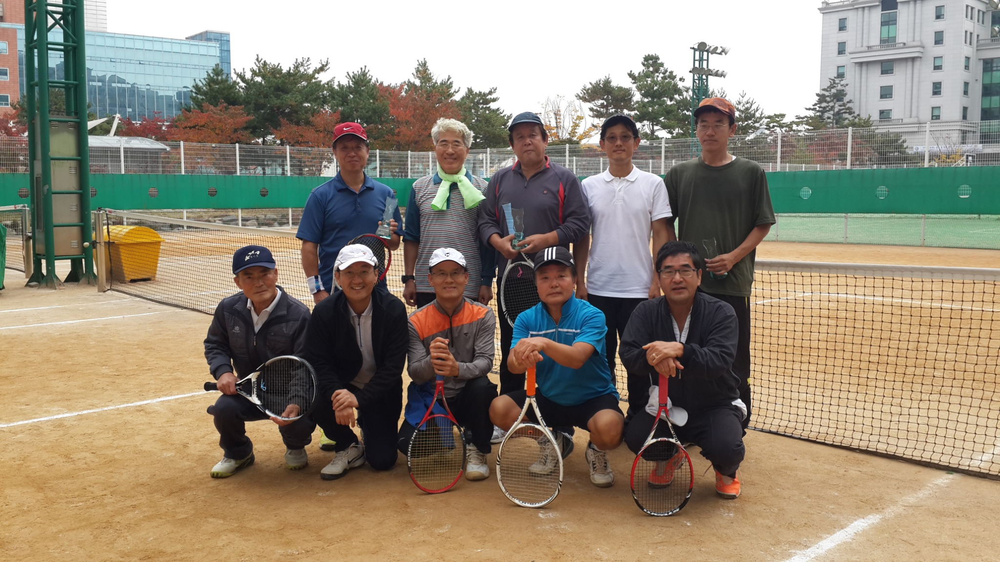
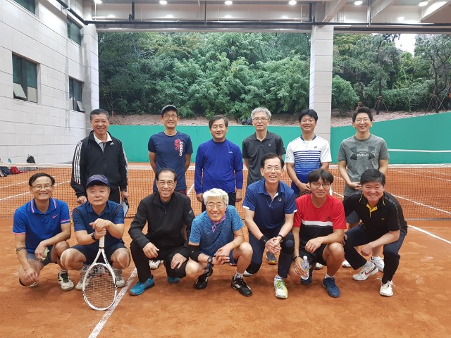
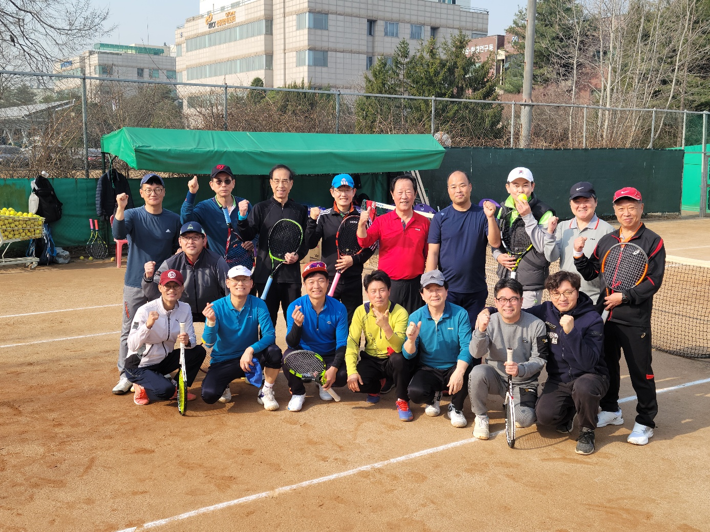
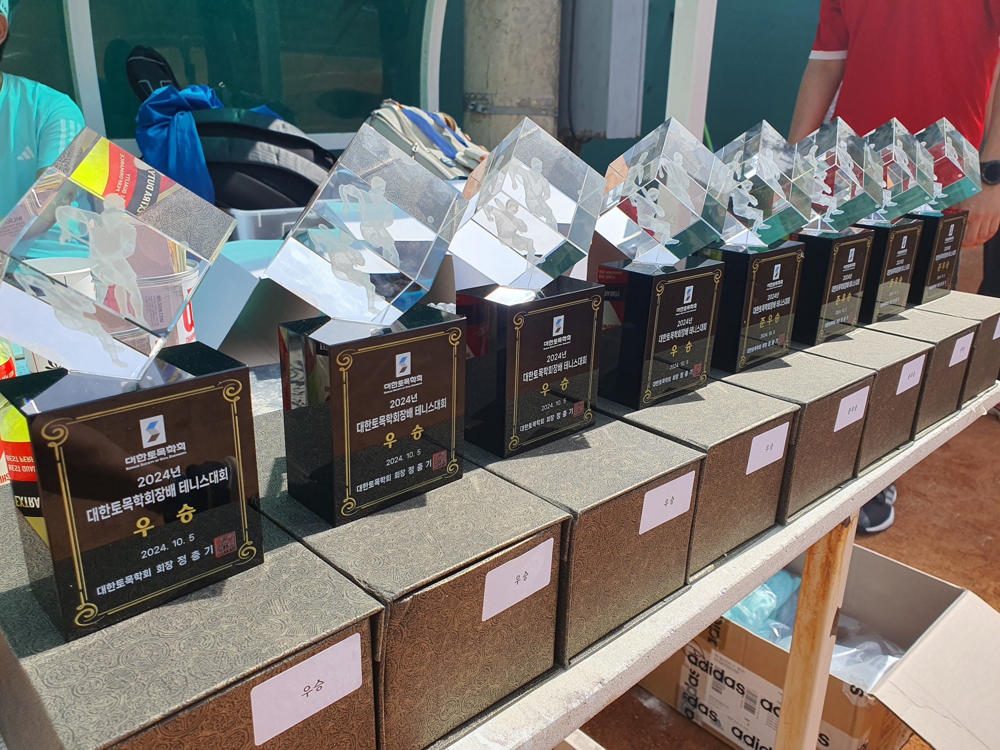
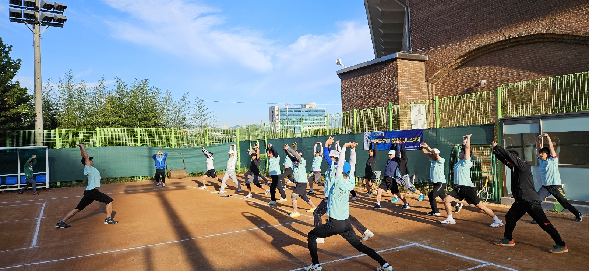
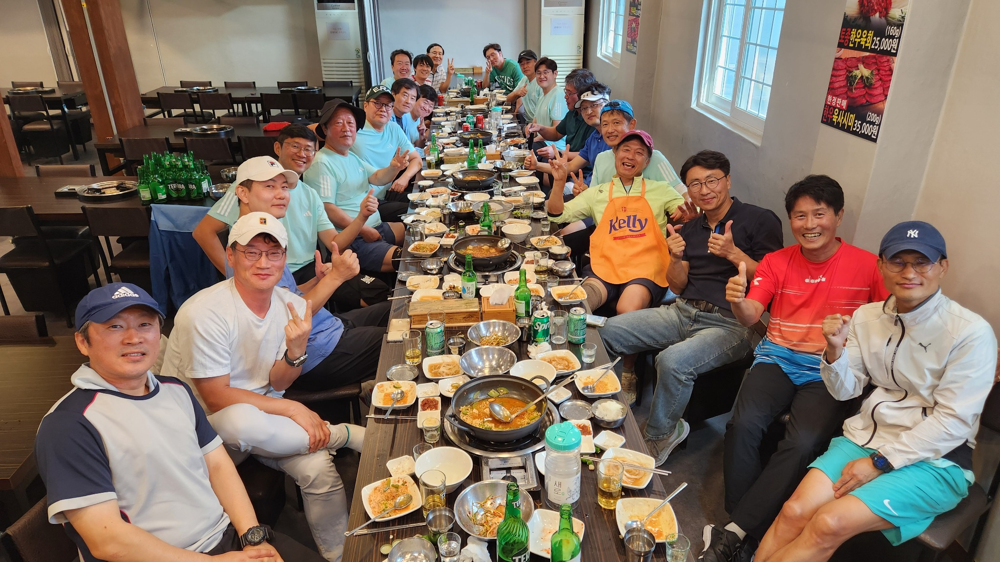
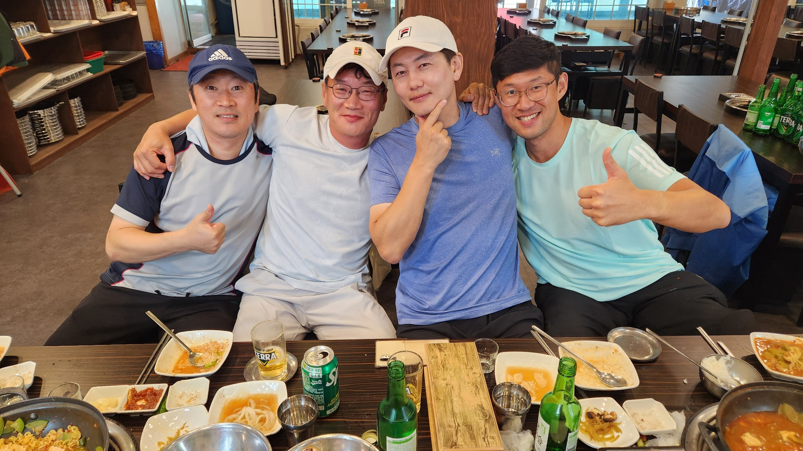
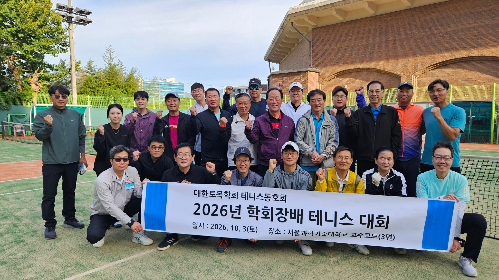
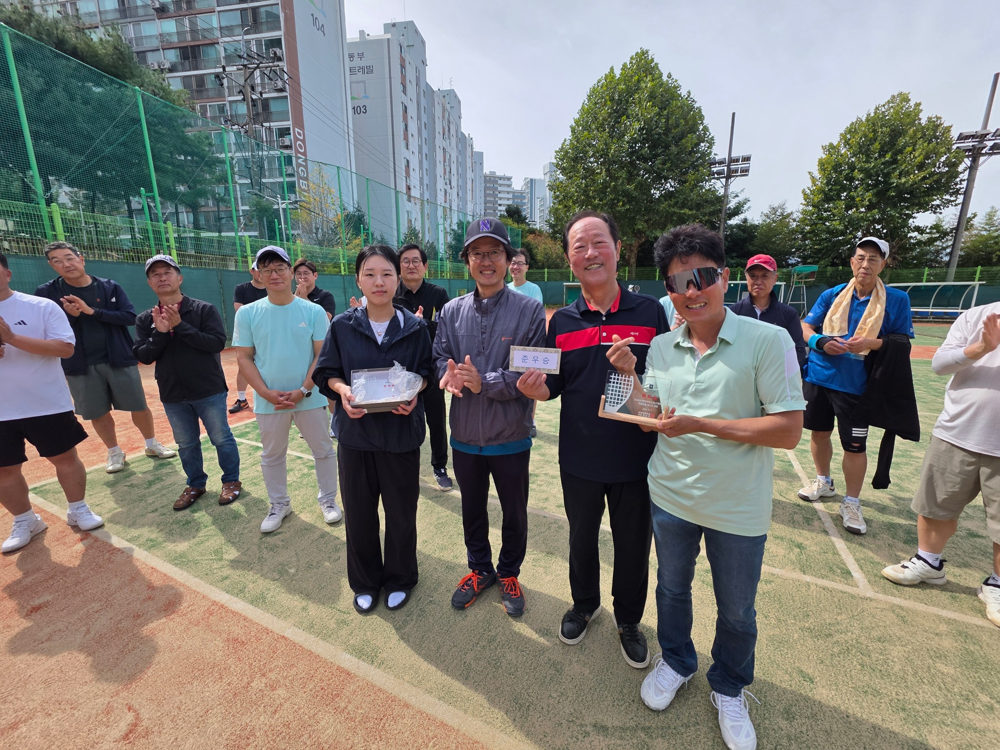
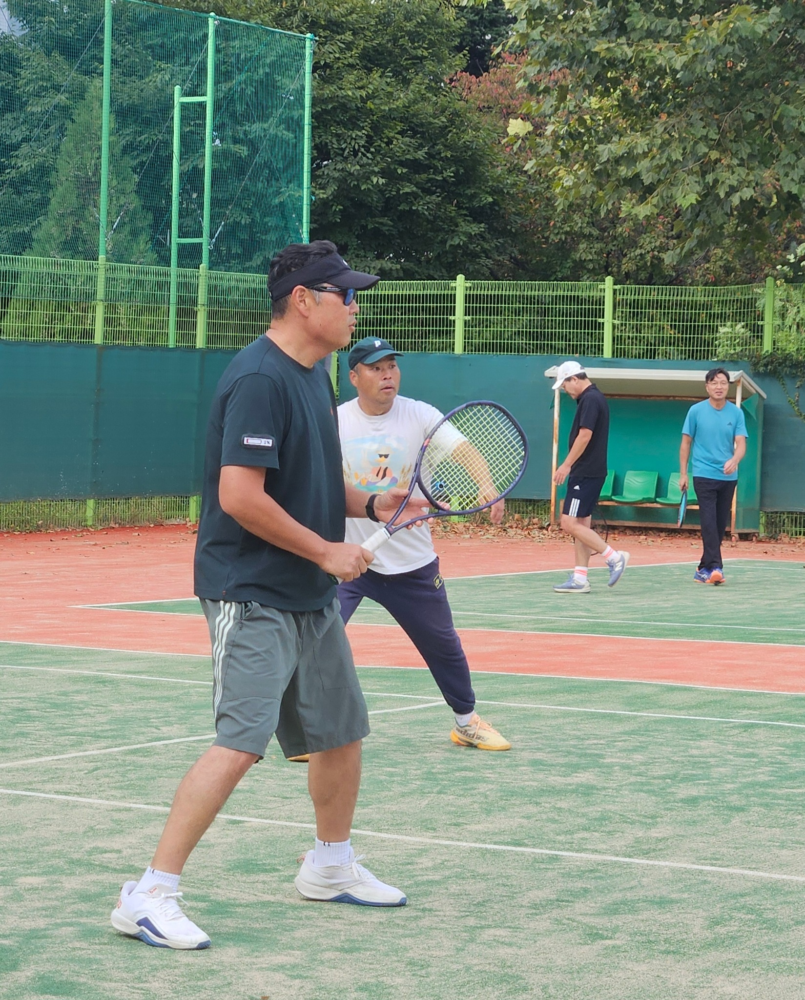

[English](index.qmd) | **한글**

> **테니스로 건강을 나누고, 사람을 만나며, 세대와 직역을 넘어 토목인을 연결한다.**

대한토목학회 테니스회는 2012년에 시작되었다.

당시 서일대학교 한상현 교수가 초대 회장을 맡고 내가 총무를 맡았다. 초기 기록을 찾아보니 2013년 회원이 21명, 2014년에는 등록회원이 31명이었다. 생각보다 빠르게 식구가 늘었다.

2012년부터 2021년까지 한상현 교수와 내가 각각 회장과 총무로 봉사했고, 2022년부터는 내가 회장을, ㈜유신의 곽진이 전무가 총무를 맡아 지금까지 운영해 왔다.

현재는 **34명의 회비 납부 회원**이 함께한다.

그런데 돌이켜보면 회원 수가 늘어난 것보다 더 중요한 변화가 있었다. 15년 가까이 매달 만나고, 시합하고, 밥 먹고, 때로는 다른 기관의 토목인들과 교류하면서 **“우리 테니스회는 어떤 모임인가?”**라는 것이 조금씩 분명해졌다는 점이다.

{#fig-2014}

그림 [-@fig-2014]은 창립 초기의 모습이다. 지금 사진과 비교해 보면 사람도, 분위기도, 세월도 제법 달라졌다.

## 운동을 잘하는 사람보다 함께 운동하고 싶은 사람

테니스 동호회이니 당연히 테니스를 좋아하는 사람들이 모인다.

그런데 오랫동안 동호회를 운영해 보니 좋은 모임을 만드는 데 테니스 실력만큼, 아니 어쩌면 그보다 더 중요한 것이 있었다.

**어떤 사람들이 함께 운동하느냐 하는 것이다.**

우리 회원의 연령은 70대부터 20대까지다. 경기력도 각종 대회 금배부에서 뛰는 고수부터 이제 막 테니스를 시작한 사람까지 다양하다.

직업도 마찬가지다. 공무원, 교수, 공기업 임직원, 엔지니어링사와 시공사의 기술인 등 토목계의 여러 분야 사람들이 함께한다.

이런 구성이 저절로 만들어진 것은 아니다. 내가 회장을 맡은 뒤 특히 중요하게 생각한 것이 **세대, 경기력, 소속기관과 직역 어느 한쪽으로 치우치지 않는 것**이었다.

그렇다고 우리 테니스회의 경기 수준까지 평범한 동호회 수준이라고 생각하면 곤란하다. **전국대회 우승자와 우승자급 동호인, 선수 출신 회원도 다수 포진해 있다.** 웬만한 고수가 찾아와도 함께 제대로 된 게임을 즐길 수 있는 수준은 된다.

중요한 것은 잘 치는 사람만 모으지 않았다는 것이다. 잘 치는 회원이 많으면서도 초보자와 젊은 회원, 원로 회원이 함께 어울릴 수 있는 모임을 만들려고 했다. **실력의 수준과 구성의 다양성은 서로 반대되는 것이 아니다.** 나는 오히려 둘을 함께 유지하는 것이 좋은 테니스회의 모습이라고 생각한다.

{#fig-2018}

코트에서는 직급이 별 의미가 없다.

평소 업무로는 만날 일이 별로 없는 선후배가 같은 편이 되고, 공공기관 직원과 엔지니어링사 기술자가 네트를 사이에 두고 공을 주고받는다. 교수라고 공을 살살 쳐주는 사람도 없다.

몇 시간 같이 뛰고 나서 밥을 먹다 보면 명함을 주고받는 공식적인 자리에서는 만들기 어려운 관계가 자연스럽게 생긴다. 나는 이것이 우리 테니스회가 가진 가장 큰 가치 중 하나라고 생각한다.

{#fig-2023}

## 매월 첫째 토요일, 꾸준함이 만든 모임

우리 테니스회의 중심은 **월례회**다.

혹서기인 8월과 혹한기인 1월을 제외하고 매월 첫째 토요일 오전에 만나는 것을 원칙으로 한다. 여기에 **동호회 회장배, 대한토목학회 회장배, 동호회 고문배** 등의 대회도 개최한다.

특별한 행사를 한두 번 크게 하는 것보다 중요한 것은 꾸준함이다. 매월 첫째 토요일 아침에 코트에 가면 반가운 얼굴을 만날 수 있다는 믿음이 있어야 동호회가 오래간다.

34명이 매번 모두 나올 수는 없다. 출장도 있고 가족행사도 있다. 몇 달 만에 나오는 회원도 있다. 그래도 오랜만에 코트에 나타나면 어제 만난 것처럼 다시 공을 친다.

그게 동호회다.

{#fig-trophy-2024}

그리고 2024년부터 새로운 전통 하나가 생겼다.

**운동 전 단체 체조다.**

홍익대학교 안승준 교수가 체조 담당이다. 그런데 체조 동작이 매번 바뀐다. 본인은 회원들의 몸을 골고루 풀어주기 위해 **“다양하게 구성한다”**고 설명한다.

글쎄다.

회원들이 모두 그렇게 생각하는지는 잘 모르겠다.

어쨌든 이제는 안 교수의 구령에 맞춰 함께 몸을 푸는 것으로 우리의 월례회와 대회가 시작된다.

{#fig-warmup}

## 테니스만 치고 헤어지면 조금 섭섭하다

운동이 끝났다고 월례회가 끝나는 것은 아니다. 어쩌면 그다음이 더 중요할지도 모른다.

{#fig-afterparty}

같이 운동하고 식사를 하다 보면 자연스럽게 이야기가 길어진다. 학교 이야기, 회사 이야기, 토목 이야기, 사는 이야기까지 나온다. 운동할 때는 몰랐던 사람의 다른 면도 알게 된다.

이런 관계는 학술대회나 공식 회의에서 만들어지는 네트워크와는 조금 다르다. **일 때문에 만나는 것이 아니라, 좋아하는 운동 때문에 먼저 만난 관계**이기 때문이다.

## 세 번 같이 운동한 뒤 회원이 되는 이유

우리 테니스회에 들어오고 싶다고 바로 회원이 되는 것은 아니다.

먼저 게스트로 월례회에 **최소 세 번 이상 참가**해야 한다. 이후 기존 회원 2인 이상의 추천을 받고 운영위원회에서 3분의 2 이상의 동의를 얻어야 정식 회원이 된다.

조금 까다롭게 보일 수도 있다. 그런데 이유가 있다.

세 번 정도 같이 운동해 보면 새로 오신 분도 우리 모임이 자신에게 맞는지 알 수 있다. 기존 회원들도 같이 운동하고 밥을 먹으면서 그 사람을 자연스럽게 알게 된다.

테니스 실력도 보지만 그것만 보는 것은 아니다. **인성과 배려, 그리고 기존 회원들과 건강한 관계를 만들어 갈 수 있는가를 더 중요하게 생각한다.**

금배부 선수들만 모으면 강한 테니스팀은 만들 수 있을지 모른다. 그러나 그것은 우리가 만들고 싶은 대한토목학회 테니스회와는 조금 다르다.

고수와 초보가 같이 즐길 수 있어야 하고, 70대 회원과 20대 회원이 자연스럽게 한 팀이 될 수 있어야 한다. 교수만 많아져도 안 되고, 특정 회사나 기관 사람들이 대부분을 차지해도 곤란하다.

다양한 사람들이 편안하게 섞이는 것. 나는 그것 자체가 동호회를 운영하는 중요한 일이라고 생각한다.

그런데 요즘 들어오는 젊은 회원들을 보면 한 가지 조건이 더 있는 것 아니냐는 이야기도 나온다.

**“인물도 보는 것 아니냐?”**

물론 회칙에는 없다.

{#fig-newmembers}

## 테니스를 통한 기관 간 교류

최근 특히 중요하게 생각하는 활동은 **기관 간 교류전**이다.

전남지역 토목 테니스인들과의 교류를 비롯해 여러 기관의 테니스 동호회와 친선경기를 확대하고 있다. 2026년 6월에는 한국도로공사 본사 테니스 코트에서 한국도로공사 테니스회와 교류전을 가졌다. 우리 쪽에서도 대학뿐 아니라 엔지니어링사, 시공사, 공공기관 등 여러 분야의 회원들이 참가했고, 도로공사에서도 여러 부서의 토목인들이 함께했다.

기관교류전에서 승패가 중요하지 않다고 하면 거짓말이다. 코트에 들어가면 누구나 이기고 싶다.

**문제는 경기가 끝난 다음이다.**

악수하고, 같이 밥을 먹고, 이야기하다 보면 승패보다 더 오래 남는 것이 생긴다.

사람을 알게 되는 것이다.

토목계에는 학술대회, 기술위원회, 발주·설계·시공 업무 등을 통해 형성되는 공식적인 네트워크가 많다. 테니스는 조금 다른 연결을 만들어 준다.

운동하면서 먼저 사람을 알게 되고, 그다음에 그 사람이 어느 학교 교수인지, 어느 회사 임원인지, 어느 기관에서 일하는지를 알게 된다.

나는 이런 **자연스럽고 건전한 토목인 네트워크**가 우리 테니스회의 중요한 역할이라고 생각한다.

## 회장과 총무의 모임에서 함께 운영하는 모임으로

회원이 늘어나면서 운영방식도 바뀌었다.

초창기에는 회장과 총무가 대부분의 일을 했다. 하지만 회원이 30명을 넘고 행사와 교류전이 많아지면서 회장과 총무 두 사람이 모든 일을 하는 방식으로는 오래가기 어렵다고 생각했다.

그래서 내가 회장을 맡은 뒤 **운영위원회 중심의 운영체계**를 강화했다. 회장과 총무 외에도 여러 회원이 홍보, 대외교류, 회원관리 등의 역할을 나누어 맡고 중요한 일을 함께 논의한다.

단순히 일을 나누기 위해서만은 아니다.

특정 회장이나 총무가 열심히 해야만 굴러가는 모임이라면 그 사람이 그만두는 순간 흔들린다.

**사람이 바뀌어도 문화가 남는 조직이어야 한다.**

## 그리고 2026년

2026년 10월 3일, 서울과학기술대학교 교수코트에서 대한토목학회 회장배 테니스대회를 열었다.

{#fig-presidents-cup-2026}

물론 친목만 하는 것은 아니다. 경기가 시작되면 다들 진지해진다.

{#fig-awards-2026}

그리고 테니스에는 아주 중요한 기본기가 하나 있다.

**공을 끝까지 보는 것이다.**

{#fig-watch-ball}

## 다음 세대의 KSCE FIRE DRAGONS를 기대하며

우리 테니스회의 별칭은 **KSCE FIRE DRAGONS**다.

2012년 몇 사람이 모여 시작했던 모임이 이제 34명의 회비 납부 회원이 함께하는 동호회가 되었다.

하지만 나는 회원 숫자가 우리 모임의 성장을 보여주는 가장 중요한 지표라고 생각하지 않는다.

지난 15년 가까운 시간 동안 우리가 얻은 가장 큰 자산은 결국 **사람**이다.

나이와 직급을 넘어 함께 운동할 수 있는 사람. 자기보다 실력이 낮은 파트너를 배려할 줄 아는 사람. 서로 다른 기관에서 일하면서도 토목이라는 공통점을 가지고 편안하게 만날 수 있는 사람.

그런 사람들이 하나둘 모여 지금의 테니스회를 만들었다.

2022년부터 회장을 맡으면서 나는 우리 모임의 성격을 조금 더 분명하게 만들고 싶었다.

> **세대와 경기력의 다양성, 여러 직역과 기관의 균형, 인성과 배려를 중시하는 회원 문화, 운영위원회를 통한 공동 운영, 그리고 기관교류를 통한 건전한 토목인 네트워크.**

이제 내 회장 임기는 끝나간다.

회장은 바뀌어도 이런 문화는 남았으면 좋겠다.

테니스공 하나가 네트를 넘나드는 동안 사람과 사람이 가까워진다. 그렇게 만들어진 관계가 다시 우리 토목계를 연결한다.

앞으로도 **KSCE FIRE DRAGONS**가 경기의 승패를 넘어 선후배와 세대를 잇고, 대학·공공기관·엔지니어링사·시공사를 잇고, 지역과 기관을 연결하는 즐겁고 건강한 모임으로 오래 이어지기를 기대한다.

---

**검색어:** 대한토목학회 테니스회, 토목인 테니스 동호회, KSCE FIRE DRAGONS, 대한토목학회 회장배 테니스, 토목인 교류
