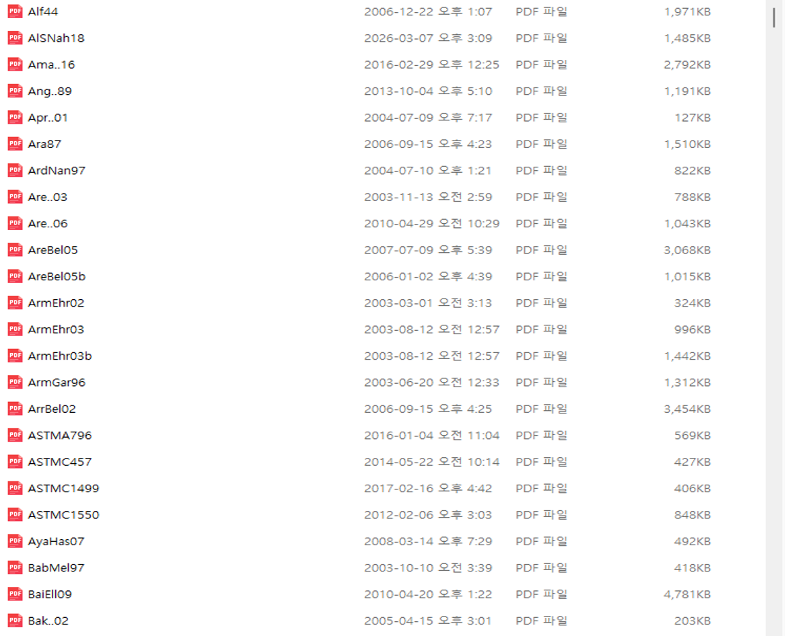

<div class="language-switch">[English](index.qmd) | **한글**</div>

나에게 LaTeX는 단순한 조판 프로그램이 아니다.

**연구 글쓰기의 인프라**다.

오랫동안 논문, 수식, 보고서, 강의자료와 발표자료를 만들면서 특정 학술지나 문서 형식이 요구하는 서식과 과학기술 콘텐츠를 분리하는 시스템을 조금씩 만들어 왔다.

기본 생각은 간단하다.

> **기술적 내용은 안정된 시스템 안에서 작성하고, 목적이 달라질 때 표현 형식만 바꾼다.**

논문은 하나 쓰고 끝나고, 학술지마다 형식이 다르며, 발표자료의 스타일도 계속 바뀐다. 하지만 그 밑에 있는 연구 내용은 다시 사용할 수 있어야 한다. 그래서 이 구분이 갈수록 중요해졌다.

내 시스템에는 몇 가지 지속적으로 유지되는 구성요소가 있다.

```text
template.tex
      ↓
zipackage.tex + zicommand.tex
      ↓
논문별 원고
      ↓
그림과 수식
      ↓
BibTeX 인용
      ↓
reference.bib
      ↓
동일한 key로 관리되는 원문 PDF
```

같은 기술적 내용을 나중에 출판사의 학술지 형식으로 바꿀 수도 있고, 다른 논문에서 다시 사용할 수도 있으며, Beamer 발표자료로 재구성할 수도 있다.

중요한 것은 각각의 파일이 아니다.

**그 파일들을 연결하는 시스템**이다.

## 왜 학술지 템플릿에서 시작하지 않는가?

연구논문을 시작할 때 나는 보통 목표 학술지의 서식에 내 생각을 먼저 맞추지 않는다.

대신 내가 사용하는 `template.tex`에서 시작한다.

그러면 익숙하고 안정적인 환경에서 글을 쓸 수 있다. 원고는 출판사의 시각적 형식이 아니라 연구 질문, 수식, 그림, 참고문헌, 결과와 고찰을 중심으로 발전한다.

이렇게 하면 중요한 구분이 하나 생긴다.

```text
과학기술 글쓰기
        ≠
학술지 서식 맞추기
```

먼저 과학기술 문서로서 논문이 정확하고, 일관되고, 완결되어야 한다.

그 다음에 목표 학술지의 형식에 맞춘다.

이 과정에서 바뀌는 것은 예를 들면 다음과 같다.

- document class
- front matter
- 제목과 저자 형식
- 절의 스타일
- 참고문헌 스타일
- 그림 배치 규칙
- 표 형식
- supplementary material 규칙
- 출판사 전용 명령어

학술지가 바뀌었다고 연구 내용 자체를 다시 만들 필요는 없어야 한다.

이것이 내가 개인 LaTeX 글쓰기 환경을 선호하는 가장 큰 이유 가운데 하나다.

> **논문 원고는 논문마다 바뀐다. 연구 글쓰기 인프라는 바뀌지 않는다.**

## 출발점: `template.tex`

새 논문은 항상 재사용 가능한 템플릿에서 시작한다.

`template.tex`의 목적은 특정 논문의 과학적 내용을 담는 것이 아니다. 그 내용을 작성할 **환경을 미리 만들어 두는 것**이다.

일반적인 시작 구조에서는 공통 자원의 위치를 정의하고, 공용 패키지와 명령어를 불러오고, 해당 논문의 그림 폴더를 지정하고, master bibliography와 연결한다.

개념적으로는 다음과 같다.

```latex
% common paths
\newcommand{\rootpath}{...}
\newcommand{\commonpath}{...}

% shared infrastructure
\input{\commonpath/zipackage.tex}
\input{\commonpath/zicommand.tex}

% local figures
\graphicspath{{./}}

% manuscript begins here
\begin{document}

...

\bibliography{.../reference}

\end{document}
```

컴퓨터나 폴더 구조에 따라 실제 path 정의는 달라질 수 있다. 하지만 원칙은 같다.

새 논문을 쓸 때마다 LaTeX 환경 전체를 다시 구축해서는 안 된다.

이미 만들어진 인프라 위에서 시작하고 연구 자체에 집중한다.

새 프로젝트를 시작할 때 어디서부터 시작해야 할지도 훨씬 명확해진다. 수식, 그림, 참고문헌, 명령어와 공통 설정이 어디에 있어야 하는지 이미 알고 있기 때문이다.

## 공용 패키지: `zipackage.tex`

기술논문을 쓰다 보면 같은 종류의 LaTeX 기능이 계속 필요하다.

수학, 그림, 표, 참고문헌, 알고리즘, 기호 목록, TikZ, theorem 환경 등은 특정 논문 하나만의 요구사항이 아니다. 여러 프로젝트에서 반복해서 사용한다.

그래서 자주 사용하는 패키지를 `zipackage.tex`라는 공용 파일에 모아 둔다.

대표적으로 다음과 같은 패키지가 들어 있다.

```latex
\usepackage{amsmath}
\usepackage{amssymb}
\usepackage{multirow}
\usepackage{appendix}
\usepackage[noprefix]{nomencl}
\usepackage[comma,numbers,sort&compress]{natbib}

\usepackage{tikz}
\usepackage{pgfplots}

\usepackage{algorithmicx}
\usepackage{algpseudocode}
```

이 파일은 실제로 내가 작성해 온 기술문서의 필요에 따라 오랜 시간에 걸쳐 커졌다.

반복해서 사용하는 기능은 대략 다음과 같다.

- 수학 표기
- 기호
- 그래픽과 PDF 그래픽
- hyperlink
- 표
- 부록
- nomenclature
- 참고문헌 관리
- TikZ 그림
- PGFPlots
- theorem 계열 환경
- 알고리즘
- 그 밖의 기술 글쓰기 기능

장점은 많은 패키지를 한꺼번에 불러올 수 있다는 것 자체가 아니다.

진짜 장점은 **반복되는 기술 설정에 하나의 기준 파일이 생긴다는 것**이다.

반복적으로 사용하는 설정을 수정하거나 개선해야 할 때 여러 논문을 하나씩 고치는 대신 공통 인프라 한 곳을 바꾸면 된다.

소프트웨어 개발과 비슷하다. 반복되는 기능을 모든 프로젝트에 계속 복사해 넣을 필요가 없다.

그렇다고 다른 연구자에게 큰 패키지 파일 하나를 그대로 복사해서 모든 것을 불러오라고 권하고 싶지는 않다.

좋은 공용 패키지 파일은 실제 글쓰기의 필요에 따라 조금씩 자라는 것이 좋다.

내 파일에는 오랜 기간 역학과 공학 분야의 글을 써 온 흔적이 들어 있다.

## 공용 명령어: `zicommand.tex`

두 번째 공용 파일인 `zicommand.tex`는 훨씬 더 개인적이다.

처음 보면 사용자 정의 명령은 단순한 타이핑 단축키처럼 보일 수 있다.

예를 들면 다음과 같다.

```latex
\newcommand{\sig}{\sigma}
\newcommand{\eps}{\epsilon}
\newcommand{\veps}{\varepsilon}
\newcommand{\del}{\delta}
\newcommand{\Del}{\Delta}
\newcommand{\la}{\lambda}
\newcommand{\om}{\omega}
```

하지만 여러 해 사용하다 보면 이 명령어 집합은 단순한 약어 모음 이상의 것이 된다.

**나만의 기술적 어휘 체계**가 된다.

내 명령어 파일에는 공학역학에서 반복적으로 사용하는 표기와 서식이 축적되어 있다. 예를 들면

- 텐서
- 굵은 기호
- jump notation
- 단위
- 상호참조
- 표 서식
- TikZ 치수 표기
- 가설과 theorem 계열 구조
- 수정 표시
- 여러 연구 프로젝트에서 축적된 기술 표기

등이다.

예를 들어 수정 표시 명령도 한 번만 정의할 수 있다.

```latex
\newcommand{\chgI}[1]{{\color{DarkRed}{#1}}}
\newcommand{\chgII}[1]{{\color{DarkBlue}{#1}}}
```

그러면 원고 전체에서 같은 방식으로 수정 내용을 표시할 수 있다.

여기에는 조금 더 중요한 원칙이 있다.

> **명령어는 단순히 키 입력을 줄이는 것이 아니라 개념을 표현해야 한다.**

관계는 다음과 같다.

```text
물리적 개념 또는 글쓰기 개념
        ↓
개인 LaTeX 명령어
        ↓
문서에 출력되는 표기
```

이렇게 하면 일관성을 유지하기 쉽다.

어떤 물리량의 표기 방법을 바꾸기로 했다면 긴 원고에서 모든 위치를 찾아 일일이 수정하는 대신 명령어 정의를 바꾸면 되는 경우가 많다.

기술 글쓰기에서는 특히 중요하다. 표기 자체가 논증의 일부이기 때문이다. 논문 중간에서 같은 기호의 의미나 표현이 조용히 바뀌어서는 안 된다.

이것은 내가 논문 글쓰기에서 사용하는 CCC 원칙 가운데 하나인 **Consistency**, 즉 일관성과 직접 연결된다.

## 하나의 master bibliography: `reference.bib`

논문을 쓸 때마다 참고문헌 데이터베이스를 처음부터 새로 만들지 않는다.

오랫동안 하나의 큰 BibTeX 데이터베이스인 `reference.bib`를 유지해 왔다.

처음에는 일반적인 서지정보를 담는 파일이었지만 시간이 지나면서 단순히 참고문헌 목록을 만드는 도구 이상의 것이 되었다.

데이터베이스에는 다음과 같은 정보가 들어 있다.

- 저자
- 제목
- 학술지
- 연도
- 권과 페이지
- 가능한 경우 DOI와 URL
- 학술지 약어
- 주제 keyword
- 일부 항목의 추가 note나 abstract

반복해서 사용하는 학술지 약어에는 `@STRING` 정의도 사용한다.

```text
CMAME
IJNME
IJSS
JEM
JSE
OE
...
```

연구 분야에 따라 축적해 온 subject code도 있다.

```text
FR    fracture mechanics
PL    plasticity
XF    XFEM
FS    floating structures / hydromechanics
FAT   fatigue
HE    hydroelasticity
...
```

데이터베이스가 커질수록 이것은 내 연구 경력과 함께 축적된 문헌의 기록이 된다.

그래서 이제 `reference.bib`를 단순한 bibliography generator라고 생각하지 않는다.

> **개인 연구 기억의 데이터베이스다.**

## 인용, 서지정보, PDF를 하나의 식별자로 연결한다

내 참고문헌 시스템에서 가장 중요한 부분은 BibTeX와 원문 PDF의 관계다.

원문 논문 자체도 큰 참고문헌 archive에 보관한다.

규칙은 간단하다.

> **PDF 파일명을 BibTeX key와 정확히 같게 한다.**

예를 들어 어떤 논문에

```text
AlSNah18
```

이라는 key를 부여했다고 하자.

LaTeX에서는

```latex
\cite{AlSNah18}
```

로 인용한다.

`reference.bib`의 해당 항목은

```bibtex
@article{AlSNah18,
  ...
}
```

로 시작한다.

그리고 원문 논문은

```text
AlSNah18.pdf
```

라는 이름으로 저장한다.

따라서 하나의 식별자가 서로 다른 세 가지를 연결한다.

```text
\cite{AlSNah18}
        ↕
@article{AlSNah18,...}
        ↕
AlSNah18.pdf
```

더 일반적으로 쓰면

```text
인용
   ↕
서지 메타데이터
   ↕
원문 문서
```

가 된다.

내가 만든 습관 가운데 가장 유용한 것 중 하나다.

{#fig-reference-archive fig-align="center" width="95%"}

그림 [-@fig-reference-archive]은 실제 archive의 일부다.

파일명은 논문을 설명하기 위해 임의로 붙인 이름이 아니다. BibTeX에서 사용하는 식별자와 동일하다.

따라서 오래된 원고에서 citation key를 발견하면 해당 원문 PDF를 바로 찾을 수 있다.

즉, key는 단순한 citation label이 아니다.

내 연구 시스템 안에서 그 참고문헌의 **영구적인 식별자**다.

> **모든 참고문헌에 하나의 식별자를 부여하고, 어디에서든 같은 식별자를 사용한다.**

## 새 참고문헌을 추가하는 방법

새 논문을 얻으면 항상 비슷한 순서로 시스템에 넣는다.

```text
1. 논문 원문을 확보한다
2. BibTeX 메타데이터를 확인하거나 만든다
3. BibTeX key를 부여한다
4. PDF 파일명을 정확히 같은 key로 바꾼다
5. PDF를 reference archive에 저장한다
6. 같은 key로 논문에서 인용한다
```

예를 들면 다음과 같다.

```text
BibTeX key      AlSNah18
BibTeX record   @article{AlSNah18,...}
PDF file        AlSNah18.pdf
LaTeX citation  \cite{AlSNah18}
```

서로 다른 명명 체계 사이를 변환할 필요가 없다.

archive에 수백 편, 수천 편의 논문이 쌓이면 이 차이가 커진다.

논문을 처음 다운로드했을 때는 설명식 파일명이 이해하기 쉬울 수 있다. 하지만 몇 년 뒤에는 어떤 이름으로 저장했는지 기억하기 어렵다.

영구적인 citation key가 이 문제를 해결한다.

원고 자체가 원문 논문을 어떻게 찾아야 하는지 알려주는 셈이다.

## 새 논문을 시작하는 방법

지속적인 인프라가 이미 만들어져 있으므로 새 연구논문을 시작하는 과정도 체계적이다.

대략 다음과 같다.

```text
1. template.tex에서 시작한다
2. root path와 common path를 정의한다
3. zipackage.tex를 불러온다
4. zicommand.tex를 불러온다
5. 해당 논문의 figure directory를 지정한다
6. 논문별 원고를 작성한다
7. 그림은 원고와 함께 저장한다
8. reference.bib의 key를 이용해 문헌을 인용한다
9. 같은 key로 원문 PDF를 찾는다
10. 안정된 환경에서 compile하고 수정한다
11. 완성된 원고를 목표 학술지 template에 맞춘다
```

여기서 중요한 것은 **특정 논문에 속하는 것**과 **연구 글쓰기 인프라에 속하는 것**을 구분하는 일이다.

논문별 자료에는 다음이 들어간다.

```text
manuscript
figures
tables
calculations
results
journal-specific files
```

지속적으로 유지하는 계층에는 다음이 있다.

```text
template.tex
zipackage.tex
zicommand.tex
reference.bib
References/*.pdf
```

이 분리가 있기 때문에 전체 workflow를 재사용할 수 있다.

## 학술지 템플릿은 나중에 적용한다

결국 원고는 특정 학술지의 요구사항을 만족해야 한다.

그 단계가 되면 과학기술 내용을 출판사의 class file이나 template으로 옮겨야 할 수도 있다.

하지만 그때는 이미 핵심적인 지적 작업이 끝나 있다.

수식이 있다.

그림이 있다.

참고문헌이 있다.

표기가 일관되어 있다.

논리가 만들어져 있다.

따라서 변환 작업은 연구논문을 처음부터 다시 만드는 것이라기보다 주로 **표현 방식과 제출 구조를 바꾸는 일**이 된다.

개념적으로는 다음과 같다.

```text
나의 안정된 원고
        ↓
과학기술 내용 완성
        ↓
목표 학술지 선정
        ↓
출판사 class/template 적용
        ↓
최종 투고
```

출판 과정에서 목표 학술지가 바뀌는 경우에는 이 방식이 특히 유용하다.

연구 내용이 처음 고려했던 학술지의 시각적 형식에 묶여 있을 이유는 없다.

## LaTeX 콘텐츠는 논문 밖에서도 재사용할 수 있다

이 시스템의 또 다른 중요한 장점은 LaTeX 콘텐츠가 하나의 학술논문에만 갇히지 않는다는 것이다.

하나의 연구 프로젝트에서는 재사용할 수 있는 여러 요소가 만들어진다.

- 수식
- 기호
- 유도과정
- 그림
- TikZ 도면
- 표
- 참고문헌
- 설명
- 기술 용어

이들이 구조화된 source로 저장되어 있기 때문에 다른 목적에 맞게 다시 구성할 수 있다.

가장 분명한 예가 **Beamer**다.

논문을 위해 만든 자료를 나중에 발표자료에서 다시 사용할 수 있다.

```text
연구 아이디어
      ↓
LaTeX 수식 + 그림 + 참고문헌
      ↓
학술논문
      │
      ├──→ 다른 학술지 형식
      │
      ├──→ 학술대회 논문
      │
      ├──→ Beamer 발표자료
      │
      ├──→ 강의자료
      │
      └──→ 이후의 기술 글쓰기
```

중요한 것은 Beamer로 발표 슬라이드를 만들 수 있다는 사실 자체가 아니다.

더 중요한 것은 **같은 기술적 source를 여러 의사소통 목적에 사용할 수 있다는 것**이다.

논문을 위해 정성스럽게 작성한 수식을 PowerPoint에서 다시 만들 필요가 없다.

TikZ 그림도 그대로 재사용할 수 있는 경우가 많다.

기술 표기도 유지된다.

서지 key도 그대로다.

따라서 중복 작업을 크게 줄이면서 연구 내용을 한 문서 형식에서 다른 형식으로 옮길 수 있다.

여기서 LaTeX는 단순한 조판 도구를 넘어선다.

**기술 지식을 재사용 가능한 형태로 표현하는 수단**이 된다.

## 시간이 지날수록 시스템의 가치가 커진다

첫 논문을 쓸 때는 이런 방식의 장점이 그리 크지 않아 보일 수 있다.

하지만 논문이 쌓일수록 가치가 커진다.

처음에는 공용 명령어 파일이 몇 번의 키 입력만 줄여줄 수도 있다.

여러 해가 지나면 그 안에는 자신이 사용하는 기술 표기의 상당 부분이 축적된다.

처음에는 BibTeX 데이터베이스에 참고문헌이 몇십 개뿐일 수 있다.

수십 년이 지나면 연구 경력 전체에서 만난 문헌의 지도가 된다.

처음에는 PDF 파일명을 정하는 엄격한 규칙이 불필요해 보일 수도 있다.

수천 개의 문헌을 인용하고 나면 오래된 원고와 원문을 직접 연결해 주는 장치가 된다.

이 지점에서 일반적인 문서 정리와 연구 인프라의 차이가 생긴다.

```text
개별 논문은 일시적이다
연구 인프라는 지속된다
```

새 프로젝트는 기존 인프라를 사용하지만 동시에 인프라를 더 키운다.

새 명령어가 추가될 수 있다.

새 패키지가 필요해질 수 있다.

새 참고문헌이 bibliography와 PDF archive에 들어온다.

새 그림과 설명은 나중에 강의자료가 될 수도 있다.

시스템이 연구와 함께 성장하는 것이다.

## 미래의 연구 지식 시스템을 위한 기반

AI 기반 연구도구가 발전하면서 이 구조가 갖는 또 다른 가능성이 점점 흥미로워지고 있다.

citation key는 이미 여러 형태의 정보를 연결한다.

```text
BibTeX metadata
      +
source PDF
      +
topic keywords
      +
manuscript citations
```

이 구조는 앞으로 다음과 같은 도구의 기반이 될 수 있다.

- 의미 기반 문헌검색
- 인용 검증
- 주제별 clustering
- 문헌 지도
- retrieval-augmented generation
- 출처에 근거한 AI 글쓰기
- 자신의 연구 이력 재구성

물론 이것이 처음부터 이 시스템을 유지한 주된 이유는 아니다.

훨씬 기본적인 문제를 해결하기 위해 만든 것이다. **오랜 기간 기술 연구를 어떻게 효율적이고 일관되게 작성할 것인가?**

하지만 잘 구조화된 연구 archive는 LaTeX를 넘어서는 효과를 갖는다.

참고문헌, 원문 문서, 기술 표기와 원고가 이미 지속적인 식별자와 관계를 가지고 있다면 새로운 계산 도구나 AI 시스템과 연결하기도 훨씬 쉽다.

## 결국 핵심은 시스템이다

돌이켜보면 내 LaTeX workflow에서 가장 중요한 것은 특정 패키지나 명령어, 템플릿, bibliography style이 아니다.

연구 글쓰기를 서로 고립된 문서들의 연속이 아니라 **지속적으로 축적되는 하나의 시스템**으로 보기로 한 것이 가장 중요하다.

논문은 바뀐다.

연구 주제도 변한다.

학술지 형식도 바뀐다.

발표 형식도 달라진다.

하지만 그 밑에 있는 인프라는 계속 남고, 시간이 지날수록 가치가 축적된다.

그래서 이 전체 workflow를 하나의 원칙으로 정리한다면 이렇게 말하고 싶다.

> **연구를 개별 문서를 중심으로 정리하지 말자. 개별 문서가 만들어져 나오는 지속적인 글쓰기 시스템을 구축하자.**
