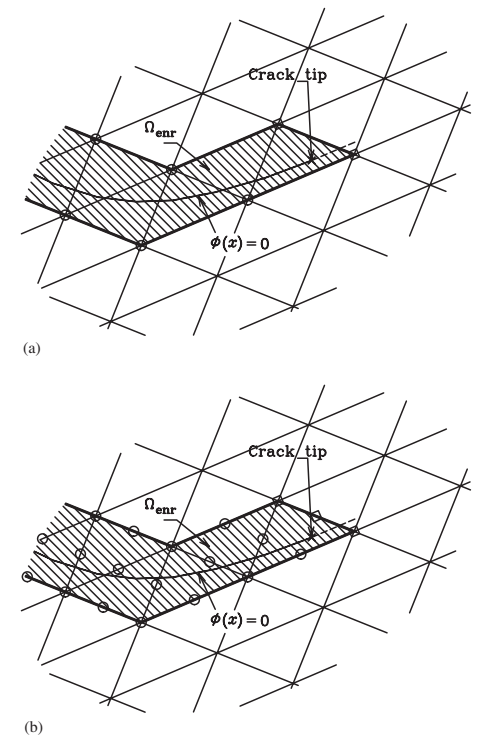
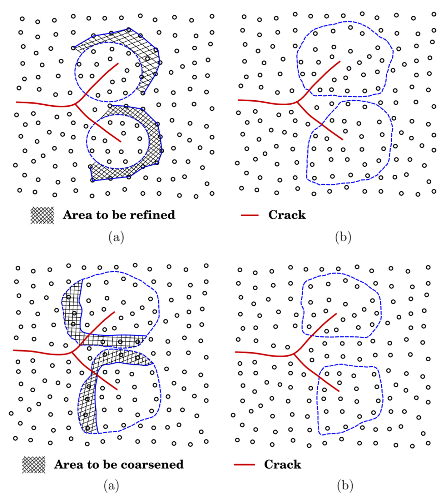

<div class="language-switch">[English](index.qmd) | **한글**</div>

균열은 물리적인 불연속이다.

유한요소망은 수치해석을 위해 만든 구조물이다.

그런데 오랫동안 이 두 기하형상은 지나치게 강하게 묶여 있었다. 균열이 움직이면 요소망도 따라 움직여야 했고, 여러 균열이 생기면 요소망도 점점 복잡해지는 균열의 위상을 따라가야 했다.

이 시리즈에서 다룬 확충기법(enriched method)은 얼핏 보면 단순한 질문에서 시작했다.

> **물리적인 불연속이 왜 수치해석을 위해 만든 요소망을 따라가야 하는가?**

처음 목적은 균열해석이었다.

하지만 이 과정에서 얻은 교훈은 계산파괴역학보다 훨씬 넓다.

XFEM, 확장무요소법, phantom node, cracking particle, phase field, peridynamics, 그리고 다중스케일 결합까지 따라가 보면 같은 원리가 반복해서 나타난다.

> **물리를 이산화에 억지로 맞추지 말자. 물리를 담을 수 있도록 수치적인 표현을 설계하자.**

이 글에서는 개별 파괴해석 알고리즘에서 한 걸음 물러나 이 원리가 계산역학 전체에서 무엇을 의미하는지 생각해 본다.

## 균열은 기존 근사공간의 약점을 그대로 드러냈다

일반적인 유한요소 근사를 생각해 보자.

$$
\mathbf{u}^h(\mathbf{x})
=
\sum_I N_I(\mathbf{x})\mathbf{u}_I.
$$

하나의 요소 내부에서 이 근사는 연속이다.

실제 변위장도 연속이라면 아무 문제가 없다.

하지만 균열이 생기면

$$
\llbracket \mathbf{u} \rrbracket \neq \mathbf{0}
$$

이 된다.

문제는 유한요소법 자체가 틀렸다는 것이 아니다.

**선택한 근사공간 안에 실제 해의 중요한 특성이 들어 있지 않다는 것**이 문제다.

전통적인 방법은 불연속면이 요소경계와 일치하도록 요소망을 바꾸는 것이었다.

확충기법은 다른 답을 제시했다.

> **요소망을 실제 해의 기하형상에 억지로 맞추기보다 근사공간을 바꾸자.**

이 생각의 전환이 특정한 확충함수 하나보다 더 중요하다.

## 교훈 1 — 이산화는 물리가 아니다

균열의 위치와 방향은 역학이 결정한다.

요소경계의 위치와 방향은 이산화가 결정한다.

둘이 일치해야 할 물리적인 이유는 없다.

초기의 확충 파괴해석은 이 둘을 명확하게 분리했다. 배경 요소망은 그대로 둔 채 균열이 요소 내부를 통과할 수 있게 했다.

{#fig-independent-geometry fig-align="center" width="78%"}

그림 [-@fig-independent-geometry]에는 이 시리즈 전체를 관통하는 중요한 생각이 들어 있다.

물론 요소망은 여전히 중요하다.

근사의 정확도, 수치적분, 조건수, 계산비용에 영향을 준다.

하지만 실제 해에 존재하는 모든 중요한 기하학적 특징을 요소망이 그대로 복사할 필요는 없다.

이 구분은 계산역학 전체에서 중요하다.

이산화는 **물리를 표현하기 위한 도구**다.

이산화 자체가 물리를 제약해서는 안 된다.

## 교훈 2 — 현재 근사공간에 어떤 정보가 빠져 있는지를 먼저 묻자

균열문제에서 일반적인 근사공간에 빠져 있는 것은 변위점프다.

XFEM은 이 정보를 명시적으로 추가한다. 단순화해서 쓰면

$$
\mathbf{u}^h(\mathbf{x})
=
\sum_I N_I(\mathbf{x})\mathbf{u}_I
+
\sum_{J\in\mathcal N_{\mathrm{enr}}}
N_J(\mathbf{x})H(\mathbf{x})\mathbf{a}_J.
$$

Heaviside 형태의 함수가 불연속 정보를 담는다.

하지만 여기서 얻어야 할 일반적인 교훈은

> Heaviside 함수를 사용하자.

가 아니다.

> **기존 근사가 표현하지 못하는 특성이 무엇인지 찾아내고, 빠져 있는 정보를 의도적으로 추가하자.**

이다.

다른 문제에서는 빠져 있는 정보가 전혀 다를 수 있다.

- 특이장,
- 경계층,
- 계면에서의 점프,
- 국부화된 변형모드,
- 빠르게 진동하는 미세구조,
- 또는 서로 다른 물리적 스케일.

따라서 확충이라는 생각은 결국 근사공간을 어떻게 설계할 것인가의 문제다.

무작정 자유도를 늘리기 전에 먼저 물어야 한다.

> 현재의 근사공간에는 예상되는 해의 어떤 특성이 빠져 있는가?

때로는 이 질문이 요소망을 얼마나 세분화할 것인가보다 훨씬 중요하다.

## 자유도가 많다고 필요한 정보가 더 잘 들어가는 것은 아니다

균일한 요소망 세분화는 해상도를 높인다.

확충은 필요한 정보를 선택해서 추가한다.

둘은 같은 작업이 아니다.

변위장에 불연속이 있다고 해 보자. 연속적인 근사공간을 균열 주변에서 계속 세분화하면 일부 수치오차는 줄어들 수 있다. 하지만 요소망의 위상을 적절히 바꾸지 않는 한 근사 자체는 여전히 연속이다.

확충은 수치해를 찾는 수학적인 공간 자체를 바꾼다.

개념적으로는

```text
요소망 세분화:
같은 종류의 근사를 더 많이 사용

근사공간의 확충:
기존에 빠져 있던 해의 특성을 포함하는 다른 근사공간 사용
```

으로 볼 수 있다.

그래서 확충기법은 파괴문제에 특히 잘 맞았다.

문제는 단순히 공간해상도가 부족한 것이 아니었다.

**근사공간의 위상과 실제 해의 위상이 서로 맞지 않았던 것**이다.

## 교훈 3 — 기하형상과 근사공간을 분리할 수 있다

균열이 더 이상 요소경계와 일치할 필요가 없어지면 새로운 가능성이 열린다.

균열을 독립적인 기하학적 객체로 진화시킬 수 있다.

배경 이산화는 상당 부분 그대로 유지할 수 있다.

이 차이는 다음과 같은 문제에서 특히 중요해진다.

- 곡선균열,
- 다중균열,
- 균열 분기,
- 균열 접합,
- 균열 합체,
- 3차원 균열면.

이 시리즈의 4번째 글에서 왜 이것이 중요한지를 살펴보았다.

다중균열 문제는 단일균열 해석을 여러 번 반복하는 문제가 아니다. 각각의 균열이 성장하면서 다른 균열이 경험하는 응력장을 바꾼다. 어떤 균열은 빨리 성장하고, 어떤 균열은 차폐되며, 방향을 바꾸거나 다른 균열과 합쳐지기도 한다.

실제 균열의 위상은 계속 변한다.

그렇다고 배경 수치모델의 위상까지 반드시 따라 변해야 하는 것은 아니다.

이 분리가 기하형상 독립적인 파괴해석법이 가져온 중요한 성과 중 하나다.

## 그렇다고 배경 이산화가 중요하지 않은 것은 아니다

독립적이라는 말과 중요하지 않다는 말은 다르다.

균열기하가 요소망과 독립적이더라도 수치해는 여전히 다음의 영향을 받는다.

- 이산화 밀도,
- 수치적분,
- support 크기,
- 확충전략,
- 균열성장 증분,
- 구성모델의 매개변수,
- 파괴과정영역의 해상도.

따라서 기하형상의 독립성이 의미하는 것은

> **균열이 요소경계를 따라가도록 인위적으로 제한되지 않는다.**

는 것이다.

> 이산화가 해의 정확도에 영향을 주지 않는다.

는 뜻이 아니다.

공학적으로 이 구분은 매우 중요하다.

하나의 수치기법이 특정한 편향을 없앴다고 해서 수렴성 검토와 물리적인 보정까지 필요 없어지는 것은 아니다.

## 교훈 4 — 배경 이산화는 scaffold다

XFEM에서 확장무요소법으로 넘어가면서 이 점은 더 분명해졌다.

XFEM에서는 유한요소망이 배경 scaffold다.

XEFG 계열에서는 무요소 support domain으로 근사공간을 만든다.

하지만 두 방법 모두 단위의 분할(partition of unity)을 이용해 불연속 정보를 근사공간에 담을 수 있다.

{#fig-scaffold fig-align="center" width="80%"}

그림 [-@fig-scaffold]에서 중요한 질문은

> 어떤 배경 이산화가 더 우수한가?

가 아니다.

> **선택한 근사공간이 균열이 요구하는 운동학을 표현할 수 있는가?**

이다.

앞의 글에서 다음 원칙을 이야기한 이유다.

> 수치적인 scaffold는 편의에 따라 선택하되, 근사공간은 물리에 맞추어 설계하자.

이 원칙은 XFEM과 무요소법의 비교를 훨씬 넘어선다.

## 교훈 5 — 같은 물리정보를 수치모델의 서로 다른 곳에 저장할 수 있다

5번째 글에서는 이 생각을 한 단계 더 밀어붙였다.

파괴가 일어나면서 연속성이 사라져야 한다고 하자.

이 정보를 수치모델의 어디에 저장해야 할까?

방법에 따라 답이 다르다.

| 방법 | 파괴정보가 주로 저장되는 곳 |
|---|---|
| XFEM / XEFG | 확충된 근사공간 |
| Phantom node | 중첩된 이산영역 |
| Cracking particle | 변화하는 particle support / visibility |
| Peridynamics | 진화하는 비국소 상호작용 |
| Phase field | 정규화된 파괴장 |

이 표가 보여주는 것은 분명하다.

**같은 물리적 사건이라고 해서 하나의 수치적 표현만 가능한 것은 아니다.**

변위 불연속을 직접 표현할 수도 있다.

분리된 이산영역에서 자연스럽게 나타나게 할 수도 있다.

입자 사이의 상호작용을 바꾸어 그 효과를 나타낼 수도 있다.

또는 날카로운 불연속을 같은 파괴에너지 정보를 담는 diffuse field로 바꿀 수도 있다.

따라서 더 근본적인 계산역학의 질문은

> 확충을 할 것인가, 하지 않을 것인가?

가 아니다.

> **물리가 요구하는 정보를 수치모델의 어디에 저장할 것인가?**

이다.

훨씬 일반적인 모델 설계 문제다.

## 수치기법은 정보구조다

이 관점에서 계산역학을 보면 조금 다르게 보인다.

수치기법은 단순히 방정식을 푸는 절차가 아니다.

하나의 **정보구조(information structure)**다.

수치기법은 다음을 결정한다.

- 어떤 장(field)을 표현할 것인가,
- 각 장은 어떤 연속성을 가질 것인가,
- 추가 자유도를 어디에 둘 것인가,
- 기하형상을 어떻게 저장할 것인가,
- 어떤 구성정보를 유지할 것인가,
- 서로 다른 영역은 어떤 정보를 주고받을 것인가,
- 어떤 물리적인 세부정보를 버릴 것인가.

두 수치모델이 같은 평형방정식을 만족하더라도 이 정보를 어떻게 조직하느냐에 따라 전혀 다른 방법이 될 수 있다.

균열은 불연속을 숨기기 어렵기 때문에 이 사실을 아주 선명하게 보여준다.

하지만 기본 근사공간이 실제 해의 구조를 제대로 담지 못하는 모든 문제에서 같은 문제가 생긴다.

## 교훈 6 — 복잡성은 물리를 따라가야 한다

6번째 글에서는 이 논리를 근사공간에서 공간적·물리적 해상도 문제로 확장했다.

상세한 파괴현상이 구조물의 작은 영역에만 존재한다면 왜 구조물 전체에서 비싼 미세스케일 모델을 사용해야 할까?

동시 다중스케일(concurrent multiscale) 해석에서는 구조물 대부분을 거친 모델로 유지하고 파괴가 진행되는 주변에만 세밀한 해상도를 둘 수 있다.

적응형 연속체-원자 모델은 한 단계 더 나아간다.

위치에 따라 사용하는 물리적인 표현 자체가 달라진다.

균열이 움직이면 세밀한 원자영역도 균열과 함께 움직일 수 있다.

{#fig-follow-physics fig-align="center" width="82%"}

그림 [-@fig-follow-physics]까지 오면 이 시리즈의 흐름이 하나로 연결된다.

처음에는

> 균열이 요소망의 어디를 지나갈 수 있게 할 것인가?

를 물었다.

나중에는

> 상세한 물리를 구조물의 어디에서 직접 풀 것인가?

를 묻게 되었다.

둘의 바탕에 있는 생각은 놀랄 만큼 비슷하다.

고정된 이산화의 편의에 따라 계산복잡도를 배분하지 말자.

**역학이 요구하는 정보에 따라 계산복잡도를 배분하자.**

## 확충은 특수한 함수를 추가하는 것보다 넓은 생각이다

역사적으로 *enrichment*는 근사공간에 함수를 추가한다는 의미로 사용되었다.

XFEM과 단위의 분할을 이용하는 관련 방법에서는 이것이 정확한 수학적 의미다.

하지만 계산파괴역학의 발전과정을 보면 더 넓은 관점에서도 생각할 수 있다.

모델에 다음과 같은 정보를 선택적으로 추가할 수 있다.

- 빠져 있는 운동학,
- 국부적인 해상도,
- 추가적인 물리장,
- 미세스케일 구성정보,
- 특정 영역에서만 사용하는 더 상세한 물리모델.

물론 이 모든 방법이 수학적으로 같은 방법이라는 뜻은 아니다.

그렇지 않다.

공통점은 하나다.

**단순한 표현에는 없지만 실제 해가 요구하는 정보를 넣기 위해 필요한 곳에만 모델의 복잡성을 추가한다.**

## 수치기법을 선택하기 전에 엔지니어는 무엇을 물어야 할까?

계산파괴역학의 발전과정에서 다음과 같은 순서를 생각해 볼 수 있다.

### 1. 이 문제를 지배하는 물리적인 특성은 무엇인가?

변위 불연속인가?

파괴과정영역인가?

재료계면인가?

격자의 방향인가?

비선형 구성거동인가?

### 2. 일반적인 근사공간이 그것을 표현할 수 있는가?

가능하다면 요소망 세분화만으로 충분할 수 있다.

그렇지 않다면 같은 종류의 근사를 더 많이 추가하는 것은 비효율적이거나 개념적으로 잘못된 접근일 수 있다.

### 3. 빠져 있는 정보를 어디에 넣을 것인가?

가능한 위치는 여러 곳이다.

- 근사공간,
- 기하형상의 표현,
- 내부장,
- 상호작용 법칙,
- 국부적인 미세스케일 영역,
- 구성모델.

### 4. 어려운 물리는 얼마나 국부적인가?

중요한 현상이 매우 국부적이라면 비싼 물리모델도 그 영역에 집중시키는 것이 자연스럽다.

### 5. 서로 다른 표현 사이에서 어떤 정보가 일관되어야 하는가?

최소한

- 평형,
- 필요한 경우 적합조건,
- 구성거동,
- 에너지 전달

은 일관되어야 한다.

이 질문들은 특정 수치기법의 이름보다 오래 남는다.

## Z Diagram에서 보면 변하지 않는 것은 역학이다

이 시리즈를 따라오는 동안 수치적인 표현은 계속 바뀌었다.

그 아래의 역학은 바뀌지 않았다.

Z Diagram은 연속체역학의 연결을

$$
F
\leftrightarrow
\sigma
\leftrightarrow
\varepsilon
\leftrightarrow
u
$$

로 정리한다.

평형은 외력과 내부응력을 연결한다.

구성거동은 응력과 변형률을 연결한다.

적합조건은 변형률과 변위를 연결한다.

파괴가 일어나면 변위가 불연속이 될 수 있고 추가적인 내부변수나 균열면의 물리량이 필요해지기 때문에 이 구조가 확장된다.

예를 들어 점성균열에서는 일률에 다음과 같은 에너지 공액쌍이 들어간다.

$$
\mathbf t
\cdot
\llbracket \dot{\mathbf u}\rrbracket.
$$

Phase-field 모델은 파괴정보를 다른 방식으로 저장한다.

원자모델은 또 다른 정보를 저장한다.

하지만 어떤 수치적 표현을 사용하든 필요한 역학적 일과 에너지 전달은 보존되어야 한다.

그래서 서로 다른 계산기법을 비교할 때 다음 질문이 유용하다.

> **수치적인 장부를 기록하는 방법만 바꾼 것인가, 아니면 역학 자체를 의도하지 않게 바꾸어 버린 것인가?**

전자는 필요할 수 있다.

후자는 설명이 필요하다.

## 균열은 수치모델과 실제 물체를 혼동하지 말라고 가르쳐 주었다

수치해석을 하다 보면 한 가지 위험이 있다.

요소망을 만들고 나면 어느 순간 요소망을 실제 구조물처럼 생각하기 쉽다.

변수를 정하고 나면 그 변수로 표현할 수 있는 것만 생각하기 쉽다.

알고리즘을 구현하고 나면 알고리즘이 편하게 표현할 수 있는 방식으로 물리현상을 해석하기 쉽다.

균열은 이런 습관을 잘 허용하지 않는다.

균열은 역학이 보내는 방향으로 움직인다.

국부적인 상태가 분기에 유리하면 갈라진다.

다른 균열과의 상호작용이 그 경로를 만들면 합쳐진다.

우리의 요소경계가 어디 있는지는 균열이 알 바가 아니다.

그래서 파괴문제는 계산역학을 배우기에 아주 좋은 문제다.

## 균열 표현에서 모델 설계로

이 시리즈의 일곱 글은 결국 하나의 논리로 연결된다.

```text
일반적인 연속 근사로는 균열을 표현하기 어렵다.
                         ↓
근사공간에 빠져 있는 불연속 정보를 넣는다.
                         ↓
균열기하를 배경 요소망과 독립시킨다.
                         ↓
이산화를 다시 만들지 않고 여러 균열을 성장시킨다.
                         ↓
파괴정보를 여러 방식으로 저장할 수 있음을 알게 된다.
                         ↓
상세한 물리모델은 파괴가 요구하는 곳에만 둔다.
                         ↓
역학이 요구하는 정보를 중심으로 수치모델을 설계한다.
```

마지막 단계가 가장 일반적이다.

파괴역학을 훨씬 넘어서는 원리다.

## 결국 핵심은

계산파괴역학은 매우 현실적인 문제에서 출발했다.

> 요소망을 계속 다시 만들지 않고 균열을 어떻게 성장시킬 것인가?

그 질문을 따라가다 보니 더 일반적인 원리에 도달했다.

> **물리를 이산화에 억지로 맞추지 말자. 물리를 표현할 수 있도록 근사공간을 설계하자.**

그리고 한 단계 더 나아가면

> **어떻게 이산화할지를 결정하기 전에 실제 해가 어떤 정보를 필요로 하는지 먼저 이해하자.**

가 된다.

이것이 확충 계산역학(enriched computational mechanics)이 남긴 가장 중요한 교훈일지 모른다.

요소망은 역학이 아니다.

알고리즘은 물리가 아니다.

둘 다 실제 물리문제가 요구하는 정보를 담기 위해 우리가 만든 구조물이다.

---

## 계산파괴역학 시리즈

1. [**계산파괴역학은 왜 어려운가?**](../computational-fracture-overview/index-ko.qmd)
2. [**XFEM은 어떻게 균열이 요소망을 가로질러 지나가게 하는가?**](../xfem-crack-through-mesh/index-ko.qmd)
3. [**왜 XFEM을 무요소법으로 확장하는가?**](../xefg-why-meshfree/index-ko.qmd)
4. **다중균열은 어떻게 분기하고 합쳐져 파괴 네트워크를 만드는가?**
5. [**균열을 표현하려면 반드시 변위공간을 부가적으로 확충(enrichment)해야 하는가?**](../alternative-crack-representations/index-ko.qmd)
6. [**균열에는 얼마나 여러 종류의 물리적 요소가 필요한가?**](../how-much-physics-does-a-crack-need/index-ko.qmd)
7. **확충기법은 계산역학에 무엇을 남겼는가?** — 이 글

## Original research

Zi, G., & Belytschko, T. (2003).  
**New crack-tip elements for XFEM and applications to cohesive cracks.**  
*International Journal for Numerical Methods in Engineering, 57*, 2221–2240.  
https://doi.org/10.1002/nme.849

Belytschko, T., Chen, H., Xu, J., & Zi, G. (2003).  
**Dynamic crack propagation based on loss of hyperbolicity and a new discontinuous enrichment.**  
*International Journal for Numerical Methods in Engineering, 58*, 1873–1905.  
https://doi.org/10.1002/nme.941

Zi, G., Song, J.-H., Budyn, E., Lee, S.-H., & Belytschko, T. (2004).  
**A method for growing multiple cracks without remeshing and its application to fatigue crack growth.**  
*Modelling and Simulation in Materials Science and Engineering, 12*, 901–915.  
https://doi.org/10.1088/0965-0393/12/5/009

Rabczuk, T., & Zi, G. (2007).  
**A meshfree method based on the local partition of unity for cohesive cracks.**  
*Computational Mechanics, 39*, 743–760.  
https://doi.org/10.1007/s00466-006-0067-4

Rabczuk, T., Zi, G., Gerstenberger, A., & Wall, W. A. (2008).  
**A new crack tip element for the phantom-node method with arbitrary cohesive cracks.**  
*International Journal for Numerical Methods in Engineering, 75*, 577–599.  
https://doi.org/10.1002/nme.2273

Rabczuk, T., Bordas, S. P. A., & Zi, G. (2010).  
**On three-dimensional modelling of crack growth using partition of unity methods.**  
*Computers & Structures, 88*, 1391–1411.

Rabczuk, T., Bordas, S. P. A., & Zi, G. (2014).  
**Computational Methods for Fracture.**  
*Mathematical Problems in Engineering, 2014*, Article 593041.  
https://doi.org/10.1155/2014/593041

Yang, S.-W., Budarapu, P. R., Mahapatra, D. R., Bordas, S. P. A., Zi, G., & Rabczuk, T. (2015).  
**A meshless adaptive multiscale method for fracture.**  
*Computational Materials Science, 96*, 382–395.  
https://doi.org/10.1016/j.commatsci.2014.08.054
