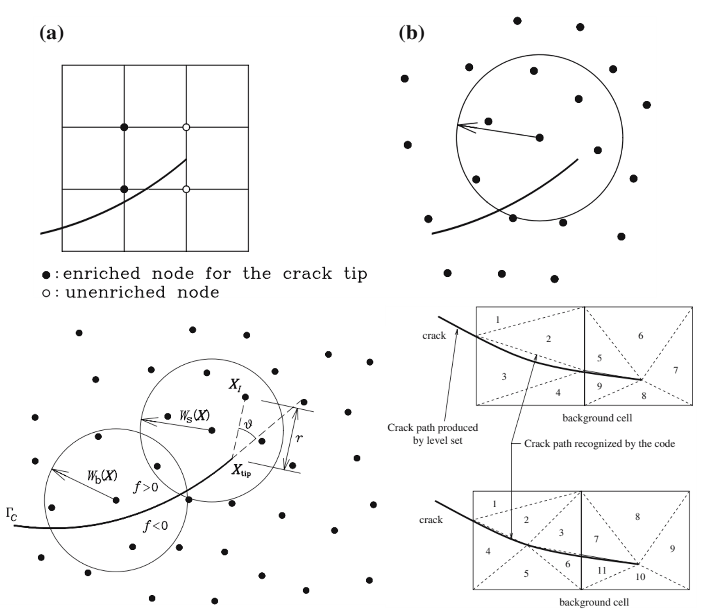

A crack is a physical discontinuity.

A finite element mesh is a numerical construction.

For a long time, those two geometries were too tightly connected. If the crack moved, the mesh often had to move with it. If several cracks appeared, the discretization had to accommodate increasingly complicated topology.

The enriched-method developments discussed throughout this series began from a deceptively simple question:

> **Why should a physical discontinuity have to follow a numerical discretization?**

The immediate objective was fracture.

But the deeper lessons are about computational mechanics itself.

Across XFEM, extended meshfree methods, phantom nodes, cracking particles, phase field, peridynamics, and multiscale coupling, the same principle repeatedly appears:

> **Do not force the physics to conform to the discretization. Design the numerical representation so that it can contain the physics.**

This final article steps back from individual fracture algorithms and asks what that principle means more generally.

## The crack exposed a weakness in the ordinary approximation

Consider a standard finite element approximation,

$$
\mathbf{u}^h(\mathbf{x})
=
\sum_I N_I(\mathbf{x})\mathbf{u}_I.
$$

Within an element, this approximation is continuous.

That is perfectly appropriate when the physical displacement field is continuous.

But a crack introduces

$$
\llbracket \mathbf{u} \rrbracket \neq \mathbf{0}.
$$

The problem is therefore not that the finite element method is somehow incorrect.

The problem is that the chosen approximation space does not contain an important feature of the solution.

One traditional response is to modify the mesh until the discontinuity lies on element boundaries.

Enriched methods suggest another response:

> **Modify the approximation rather than forcing the discretization to imitate the solution geometry.**

That conceptual shift is more important than any particular enrichment function.

## Lesson 1 — The discretization is not the physics

A crack has a location and direction determined by mechanics.

An element edge has a location and direction determined by discretization.

There is no physical reason those two should coincide.

Early enriched fracture formulations made that separation explicit: cracks could pass through elements while the background mesh remained unchanged.

{#fig-independent-geometry fig-align="center" width="78%"}

Figure @fig-independent-geometry contains one of the most important ideas in the whole series.

The mesh still matters.

It controls approximation quality, integration, conditioning, and computational cost.

But it no longer has to be a geometrical copy of every important feature in the solution.

This distinction appears throughout computational mechanics.

A discretization is a **representation tool**.

It should not become an artificial constraint on the physics.

## Lesson 2 — Ask what information the approximation is missing

For a cracked body, the ordinary approximation is missing the displacement jump.

XFEM adds that information explicitly. A simplified enriched form is

$$
\mathbf{u}^h(\mathbf{x})
=
\sum_I N_I(\mathbf{x})\mathbf{u}_I
+
\sum_{J\in\mathcal N_{\mathrm{enr}}}
N_J(\mathbf{x})H(\mathbf{x})\mathbf{a}_J.
$$

The Heaviside-type function carries the discontinuity.

But the general lesson is not

> use a Heaviside function.

It is

> **identify the feature that the ordinary approximation cannot represent, and introduce the missing information deliberately.**

For another problem, the missing information may be different:

- a singular field,
- a boundary layer,
- an interface jump,
- a localized deformation mode,
- a rapidly oscillating microstructure,
- or a different physical scale.

The enrichment philosophy is therefore a way of thinking about approximation spaces.

Before adding degrees of freedom indiscriminately, ask:

> What feature of the expected solution is absent from the present approximation?

That question can be more useful than asking how much the mesh should be refined.

## More degrees of freedom are not the same as better information

Uniform refinement adds resolution.

Enrichment adds selected information.

Those are not equivalent operations.

Suppose a displacement field contains a discontinuity. Refining a continuous approximation around it may reduce some numerical error, but the approximation remains continuous unless the mesh topology itself is changed appropriately.

Enrichment instead changes the mathematical space in which the numerical solution is sought.

Conceptually,

```text
mesh refinement:
more of the same approximation

enrichment:
a different approximation containing a missing solution feature
```

This is why enriched methods were particularly natural for fracture.

The difficulty was not merely insufficient spatial resolution.

It was a mismatch between the topology of the approximation and the topology of the physical solution.

## Lesson 3 — Geometry and approximation can be separated

Once crack geometry no longer has to coincide with element edges, another possibility appears.

The crack can evolve as its own geometrical object.

The background discretization can remain largely independent.

This becomes increasingly important for:

- curved cracks,
- multiple cracks,
- crack branching,
- crack junctions,
- crack coalescence,
- and three-dimensional crack surfaces.

Article 4 showed why this matters.

A multiple-crack problem is not simply a single-crack calculation repeated many times. Each growing crack changes the stress field experienced by the others. Some cracks accelerate, others are shielded, some turn, and some join.

The physical topology evolves.

The background numerical topology does not necessarily have to follow it.

That separation is one of the central achievements of geometry-independent fracture methods.

## But the background still matters

Independence should not be confused with irrelevance.

A crack may be independent of the mesh geometry while the numerical solution still depends on:

- discretization density,
- numerical integration,
- support size,
- enrichment strategy,
- crack-growth increments,
- constitutive parameters,
- and resolution of the fracture process zone.

Geometry independence therefore means

> **the crack is not artificially constrained to element boundaries.**

It does not mean

> the discretization has no influence on accuracy.

This distinction is essential in engineering use.

A numerical method can remove one source of bias without removing the need for convergence studies and physical calibration.

## Lesson 4 — The background discretization is a scaffold

The move from XFEM to extended meshfree methods made this lesson particularly visible.

In XFEM, the background scaffold is a finite element mesh.

In XEFG-type methods, the approximation is built from meshfree support domains.

Yet both can carry discontinuity information through partition-of-unity concepts.

{#fig-scaffold fig-align="center" width="80%"}

The important question in Figure @fig-scaffold is not

> Which background is superior?

It is

> **Can the chosen approximation represent the kinematics required by the crack?**

That led us earlier to the principle:

> Choose the numerical scaffold for convenience; design the approximation around the physics.

This principle survives well beyond the original XFEM-versus-meshfree discussion.

## Lesson 5 — The same physical information can live in different numerical places

Article 5 pushed the argument further.

Suppose the physical requirement is the loss of continuity caused by fracture.

Where should that information be stored?

Different methods give different answers:

| Method | Where fracture information primarily lives |
|---|---|
| XFEM / XEFG | enriched approximation space |
| Phantom node | overlapping discrete domains |
| Cracking particle | changing particle support / visibility |
| Peridynamics | evolving nonlocal interactions |
| Phase field | regularized fracture field |

This comparison reveals something fundamental.

The physical event does not uniquely determine the numerical representation.

A displacement discontinuity can be represented explicitly.

It can emerge from separated discrete domains.

Its effect can be introduced through changing interactions.

Or a sharp discontinuity can be replaced by a diffuse field carrying equivalent fracture-energy information.

So the deeper computational question is not simply

> enrichment or no enrichment?

It is

> **Where should the information required by the physics live?**

That is a much more general design question.

## Numerical methods are information structures

This perspective suggests a useful way to think about computational mechanics.

A numerical method is not merely a procedure for solving equations.

It is an **information structure**.

It decides:

- which fields are represented,
- what continuity they possess,
- where additional degrees of freedom are introduced,
- how geometry is stored,
- what constitutive information is retained,
- how different regions communicate,
- and which physical details are discarded.

Two formulations can satisfy the same balance laws and still differ greatly because they organize this information differently.

Fracture makes this particularly obvious because a discontinuity is difficult to hide.

But the same issue appears whenever the solution contains structure that is poorly represented by the default approximation.

## Lesson 6 — Complexity should follow the physics

Article 6 extended the same argument from approximation spaces to spatial and physical resolution.

Why use an expensive fine-scale model throughout an entire structure when detailed fracture physics occupies only a small region?

A concurrent multiscale formulation can retain a coarse model over most of the domain and place fine resolution near the fracture process.

An adaptive continuum–atomistic formulation goes further.

The physical description itself changes with location.

As the crack moves, the fine atomistic region can move with it.

{#fig-follow-physics fig-align="center" width="82%"}

Figure @fig-follow-physics completes the conceptual progression of the series.

At first we asked:

> Where should the crack be allowed to pass through the mesh?

Eventually we were asking:

> Where should the detailed physics itself be solved?

The underlying philosophy is remarkably similar.

Do not distribute computational complexity according to the convenience of a fixed discretization.

Distribute it according to the information required by the mechanics.

## Enrichment is therefore broader than adding special functions

Historically, the word *enrichment* is associated with adding functions to an approximation space.

That remains its precise mathematical meaning in XFEM and related partition-of-unity methods.

But the development of computational fracture suggests a broader conceptual interpretation.

We can enrich a model by adding:

- missing kinematics,
- local resolution,
- additional physical fields,
- fine-scale constitutive information,
- or a more detailed physical description in selected regions.

This broader use is conceptual rather than a claim that all these methods are mathematically identical.

They are not.

The common principle is that **model complexity is introduced selectively because the solution requires information absent from the simpler representation.**

## What should an engineer ask before choosing a method?

The history of computational fracture suggests a useful sequence.

### 1. What physical feature controls the problem?

Is it a displacement discontinuity?

A fracture process zone?

A material interface?

A lattice orientation?

A nonlinear constitutive mechanism?

### 2. Can the ordinary approximation represent it?

If yes, refinement may be sufficient.

If no, simply adding more of the same approximation may be inefficient or conceptually wrong.

### 3. Where should the missing information be introduced?

Possible answers include:

- the approximation space,
- the geometry representation,
- an internal field,
- an interaction law,
- a local fine-scale domain,
- or the constitutive model.

### 4. How local is the difficult physics?

If the important phenomenon is highly localized, the expensive description should probably be localized as well.

### 5. What information must remain consistent across representations?

At minimum:

- equilibrium,
- compatibility where appropriate,
- constitutive behavior,
- and energy transfer.

These questions are more durable than the name of any particular numerical method.

## The Z Diagram provides the invariant mechanics

Throughout the series, numerical representations changed repeatedly.

The mechanics underneath them did not.

The Z Diagram organizes the continuum chain as

$$
F
\leftrightarrow
\sigma
\leftrightarrow
\varepsilon
\leftrightarrow
u.
$$

Equilibrium connects external forces to internal stress.

Constitutive behavior connects stress and strain.

Compatibility connects strain and displacement.

Fracture modifies this structure because displacement may become discontinuous and additional internal variables or surface quantities may be required.

For a cohesive crack, for example, the work contribution contains the energy-conjugate pair

$$
\mathbf t
\cdot
\llbracket \dot{\mathbf u}\rrbracket.
$$

A phase-field model stores fracture differently.

An atomistic model stores still different information.

But a credible numerical representation must preserve the relevant mechanical work and energy transfer.

That provides a useful test when comparing computational methods:

> **Does the representation change the bookkeeping, or does it accidentally change the mechanics?**

The first may be desirable.

The second requires justification.

## A crack taught us not to confuse the model with reality

There is a broader philosophical danger in numerical analysis.

Once a mesh has been generated, it is easy to begin reasoning as if the mesh were the structure.

Once variables have been chosen, it is easy to think only in terms of those variables.

Once an algorithm has been implemented, it is easy to interpret physical behavior through what the algorithm happens to represent conveniently.

Fracture resists this habit.

A crack moves where the mechanics sends it.

It branches when the local state favors branching.

It joins another crack when interaction produces that path.

It does not know where our element boundaries are.

That makes fracture an unusually good teacher of computational mechanics.

## From crack representation to model design

The seven articles in this series can now be read as one continuous argument.

```text
A crack cannot be represented by an ordinary continuous approximation.
                         ↓
Give the approximation the missing discontinuity information.
                         ↓
Let crack geometry become independent of the background mesh.
                         ↓
Allow multiple cracks to evolve without rebuilding the discretization.
                         ↓
Recognize that fracture information can be stored in different ways.
                         ↓
Place detailed physical resolution only where fracture requires it.
                         ↓
Design numerical information around the mechanics.
```

The final step is the most general.

It applies far beyond fracture.

## Engineering takeaway

The computational-fracture story began with a practical problem:

> How can a crack grow through a numerical model without continuously remeshing it?

But it led to a broader principle:

> **Do not force the physics to conform to the discretization. Design the approximation so that it can represent the physics.**

And, at an even more general level:

> **Understand the information structure of the solution before choosing how to discretize it.**

That may be the most durable lesson of enriched computational mechanics.

The mesh is not the mechanics.

The algorithm is not the physics.

They are structures we construct to carry the information that the physical problem requires.

---

## Computational fracture series

1. [**Why Is Computational Fracture So Difficult?**](../computational-fracture-overview/)
2. [**How Does XFEM Let a Crack Cut Through the Mesh?**](../xfem-crack-through-mesh/)
3. [**Why Extend XFEM into a Meshfree Method?**](../xefg-why-meshfree/)
4. **How Do Multiple Cracks Branch, Join, and Form a Fracture Network?**
5. [**Is Enrichment the Only Way to Represent a Crack?**](../alternative-crack-representations/)
6. [**How Much Physics Does a Crack Really Need?**](../how-much-physics-does-a-crack-need/)
7. **What Did Enriched Methods Teach Us About Computational Mechanics?** — this article

## Original research

Zi, G., & Belytschko, T. (2003).  
**New crack-tip elements for XFEM and applications to cohesive cracks.**  
*International Journal for Numerical Methods in Engineering, 57*, 2221–2240.  
https://doi.org/10.1002/nme.849

Belytschko, T., Chen, H., Xu, J., & Zi, G. (2003).  
**Dynamic crack propagation based on loss of hyperbolicity and a new discontinuous enrichment.**  
*International Journal for Numerical Methods in Engineering, 58*, 1873–1905.  
https://doi.org/10.1002/nme.941

Zi, G., Song, J.-H., Budyn, E., Lee, S.-H., & Belytschko, T. (2004).  
**A method for growing multiple cracks without remeshing and its application to fatigue crack growth.**  
*Modelling and Simulation in Materials Science and Engineering, 12*, 901–915.  
https://doi.org/10.1088/0965-0393/12/5/009

Rabczuk, T., & Zi, G. (2007).  
**A meshfree method based on the local partition of unity for cohesive cracks.**  
*Computational Mechanics, 39*, 743–760.  
https://doi.org/10.1007/s00466-006-0067-4

Rabczuk, T., Zi, G., Gerstenberger, A., & Wall, W. A. (2008).  
**A new crack tip element for the phantom-node method with arbitrary cohesive cracks.**  
*International Journal for Numerical Methods in Engineering, 75*, 577–599.  
https://doi.org/10.1002/nme.2273

Rabczuk, T., Bordas, S. P. A., & Zi, G. (2010).  
**On three-dimensional modelling of crack growth using partition of unity methods.**  
*Computers & Structures, 88*, 1391–1411.

Rabczuk, T., Bordas, S. P. A., & Zi, G. (2014).  
**Computational Methods for Fracture.**  
*Mathematical Problems in Engineering, 2014*, Article 593041.  
https://doi.org/10.1155/2014/593041

Yang, S.-W., Budarapu, P. R., Mahapatra, D. R., Bordas, S. P. A., Zi, G., & Rabczuk, T. (2015).  
**A meshless adaptive multiscale method for fracture.**  
*Computational Materials Science, 96*, 382–395.  
https://doi.org/10.1016/j.commatsci.2014.08.054
