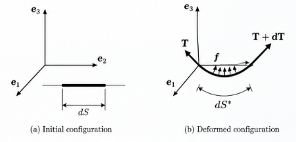
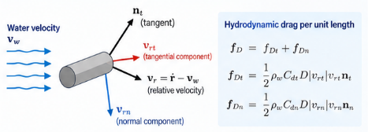
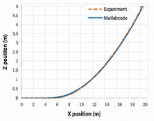
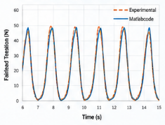

Mooring lines keep floating structures in position.

In a simplified floating-body model, a mooring system is often represented by an equivalent stiffness. Around an equilibrium configuration, that approximation can be extremely useful.

But what is hidden inside that stiffness?

A real mooring line has mass. Its geometry changes. Its tension depends on deformation. It is subjected to gravity and buoyancy. It moves relative to the surrounding water and therefore experiences hydrodynamic drag.

So the force at the fairlead is not determined by displacement alone.

The central engineering question is:

> **When does a mooring line stop behaving like a restoring spring and have to be treated as a dynamic structure of its own?**

The key principle is:

> **A mooring line does not merely provide restoring stiffness. Its own mass, deformation, fluid interaction, and motion determine the force transmitted to the floating structure.**

## What is lost when a mooring line becomes a spring?

Suppose the fairlead displacement is $u$.

A simple linearized model might write

$$
F_m = k_m u,
$$

where $k_m$ is an equivalent mooring stiffness.

A nonlinear quasi-static model may improve this to

$$
F_m = F_m(u).
$$

These models can describe how the equilibrium restoring force changes with fairlead position.

But a dynamic mooring line contains additional state information.

At a given instant, its force can depend on

- its current configuration,
- its axial strain,
- its velocity,
- the surrounding water velocity,
- inertia of the line,
- gravity,
- buoyancy,
- and hydrodynamic drag.

Therefore, two states with the same fairlead position do not necessarily have the same fairlead tension.

That is the fundamental reason a dynamic line cannot, in general, be reduced to a displacement-only spring.

## Start with a small segment

The cleanest way to understand the dynamics is to isolate a small segment.

Let $S$ denote the coordinate in the initial configuration. A segment of initial length $dS$ deforms to a current length $dS^*$.

{#fig-segment fig-align="center" width="82%"}

Force equilibrium in the deformed configuration gives

$$
\rho^* \ddot{\mathbf r}\,dS^*
=
d\mathbf T
+
\mathbf f\,dS^*,
$$

where

- $\rho^*$ is mass per unit current length,
- $\mathbf r$ is the current position,
- $\mathbf T$ is the internal tensile-force vector,
- and $\mathbf f$ is distributed external force per unit current length.

The external force may contain gravity, buoyancy, and hydrodynamic drag.

For a highly slender mooring line, the formulation considered here neglects diffraction and radiation effects and treats the surrounding-fluid contribution through distributed forces such as buoyancy and drag.

## Why write the equation in the initial configuration?

The geometry is changing, so $dS^*$ is not constant.

Compatibility gives

$$
dS^*
=
(1+\varepsilon)dS,
$$

where $\varepsilon$ is the axial strain measure used in the formulation.

Mass conservation gives

$$
\rho^*dS^*
=
\rho dS,
$$

where $\rho$ is mass per unit initial length.

Using these relations, equilibrium can be written with respect to the fixed initial coordinate $S$:

$$
\rho\ddot{\mathbf r}
=
\frac{\partial\mathbf T}{\partial S}
+
(1+\varepsilon)\mathbf f.
$$

This transformation is computationally useful.

The line moves through space, but the material coordinate used for discretization remains attached to the initial line.

## Geometry and tension are coupled

For an elastic line, the tensile-force vector is

$$
\mathbf T
=
E\varepsilon A\mathbf n_t,
$$

where

- $E$ is Young's modulus,
- $A$ is the reference cross-sectional area,
- and $\mathbf n_t$ is the unit tangent to the current line.

Because

$$
\mathbf n_t
=
\frac{\partial\mathbf r}{\partial S^*},
$$

and

$$
dS^*
=
(1+\varepsilon)dS,
$$

we obtain

$$
\mathbf T
=
EA
\frac{\varepsilon}{1+\varepsilon}
\frac{\partial\mathbf r}{\partial S}.
$$

Substituting this into equilibrium gives the governing equation

$$
\rho\ddot{\mathbf r}
=
\frac{\partial}{\partial S}
\left[
EA
\frac{\varepsilon}{1+\varepsilon}
\frac{\partial\mathbf r}{\partial S}
\right]
+
(1+\varepsilon)\mathbf f.
$$

This equation already explains why the line is nonlinear.

The internal-force direction changes with geometry, while the strain and tension change with deformation.

The geometry determines the force.

The force changes the geometry.

That feedback is the essence of geometric nonlinearity in a mooring line.

## The same mechanics can be written through virtual work

For the line, the virtual-work statement can be written as

$$
\delta W_{\mathrm{kin}}
=
\delta W_{\mathrm{ext}}
-
\delta W_{\mathrm{int}}.
$$

The terms are

$$
\delta W_{\mathrm{kin}}
=
\int_L
\rho\,\delta\mathbf r\cdot\ddot{\mathbf r}\,dS,
$$

$$
\delta W_{\mathrm{ext}}
=
\int_L
\delta\mathbf r\cdot(1+\varepsilon)\mathbf f\,dS,
$$

and

$$
\delta W_{\mathrm{int}}
=
\int_L
\frac{\partial\delta\mathbf r}{\partial S}
\cdot\mathbf T\,dS.
$$

This form is useful because it leads directly to a finite-element discretization.

## From a continuous line to finite elements

Interpolate the position by one-dimensional shape functions,

$$
\mathbf r(S,t)
=
N_J(S)\mathbf r_J(t),
$$

and similarly,

$$
\delta\mathbf r(S,t)
=
N_I(S)\delta\mathbf r_I(t).
$$

The discrete equation becomes

$$
\mathbf M\ddot{\mathbf r}
+
\mathbf C\dot{\mathbf r}
+
\mathbf K\mathbf r
=
\mathbf f^{\mathrm{ext}}.
$$

This looks deceptively similar to an ordinary linear structural-dynamics equation.

But here the stiffness and external force depend on the evolving state of the line.

For an element,

$$
M_{IJ}^{e}
=
\int_{L_e}
\rho N_I N_J\,dS,
$$

while the stiffness contribution takes the form

$$
K_{IJ}^{e}
=
\int_{L_e}
\frac{dN_I}{dS}
EA\frac{\varepsilon}{1+\varepsilon}
\frac{dN_J}{dS}
\,dS.
$$

The distributed external force is

$$
f_I^{e,\mathrm{ext}}
=
\int_{L_e}
N_I(1+\varepsilon)\mathbf f\,dS,
$$

with concentrated nodal forces added where required.

The matrices are assembled in the usual finite-element manner.

So the numerical framework is familiar.

The nonlinear physics enters through the current geometry, strain, and fluid-relative velocity.

## Gravity and buoyancy act together

The gravity force per unit current length is

$$
\mathbf f_g
=
-\frac{\rho g}{1+\varepsilon}\mathbf e_3.
$$

The buoyancy force acts upward.

With the density definitions used in the source formulation, the combined gravity and buoyancy contribution becomes

$$
\mathbf f_g+\mathbf f_b
=
\frac{\rho_w-\rho_c}{\rho_c}
\frac{\rho g}{1+\varepsilon}
\mathbf e_3,
$$

where $\rho_w$ is water density and $\rho_c$ is the nominal material density of the cable.

This term determines the submerged weight that strongly influences the equilibrium configuration.

For a heavy line, gravity dominates.

As buoyancy increases, the effective submerged weight decreases.

The static shape is therefore already a fluid–structure problem even before dynamic drag is introduced.

## Drag depends on relative velocity, not line velocity alone

This is one of the most important points in the formulation.

The relevant velocity is

$$
\mathbf v_r
=
\dot{\mathbf r}
-
\mathbf v_w,
$$

where $\dot{\mathbf r}$ is line velocity and $\mathbf v_w$ is water velocity.

The fluid does not care how fast the line moves relative to the seabed.

It responds to how fast the line moves **relative to the surrounding water**.

{#fig-relative-velocity fig-align="center" width="82%"}

The current unit tangent is $\mathbf n_t$.

The tangential relative velocity is obtained by projection,

$$
\mathbf v_{rt}
=
(\mathbf n_t\otimes\mathbf n_t)\cdot\mathbf v_r.
$$

The normal component follows from

$$
\mathbf v_{rn}
=
\mathbf v_r-\mathbf v_{rt},
$$

or

$$
\mathbf v_{rn}
=
(\mathbf I-\mathbf n_t\otimes\mathbf n_t)\cdot\mathbf v_r.
$$

There is a subtle mechanical point here.

The **tangential direction** comes from the current geometry of the cable.

But the direction of the normal relative motion cannot be determined from cable geometry alone. It depends on the relative-velocity vector.

That is why vector decomposition is preferable to assigning a single geometrical "normal" to a three-dimensional cable.

## Normal and tangential drag are different

Different drag coefficients may be used in the normal and tangential directions.

In the source formulation,

$$
\mathbf f_d
=
\mathbf f_{dn}
+
\mathbf f_{dt},
$$

with

$$
\mathbf f_{dn}
=
-
\frac{B_{wn}(\varepsilon)}{1+\varepsilon}
\sqrt{\mathbf v_{rn}\cdot\mathbf v_{rn}}\,
\mathbf v_{rn},
$$

and

$$
\mathbf f_{dt}
=
-
\frac{B_{wt}(\varepsilon)}{1+\varepsilon}
\sqrt{\mathbf v_{rt}\cdot\mathbf v_{rt}}\,
\mathbf v_{rt}.
$$

The drag is therefore nonlinear in relative velocity.

This immediately explains why a purely frequency-domain representation of the complete mooring-line dynamics is not as straightforward as the linearized floating-body formulation in the companion article.

The line configuration changes.

The velocity direction changes.

The drag changes quadratically with relative velocity.

And all three evolve together.

## The external force must be updated along the line

The element external-force vector combines concentrated loads with gravity, buoyancy, and drag:

$$
\mathbf f_I^{e,\mathrm{ext}}
=
\mathbf I_{IK}\mathbf F_K
+
\frac{L_e}{2}
\int_{-1}^{+1}
N_I
\left(
\mathbf f_g
+
\mathbf f_b
+
\mathbf f_{dn}
+
\mathbf f_{dt}
\right)d\xi.
$$

For the two-node linear element used in the note, strain is constant within an element.

Drag, however, depends on interpolated velocity and therefore must be evaluated at the integration points.

This is another reason dynamic analysis is an evolving state problem rather than a single static force–displacement calculation.

## Why solve the problem in time?

The previous article showed the great advantage of frequency-domain analysis:

a harmonic linear system becomes a complex algebraic equation.

For the mooring line, the situation is different.

At every time step,

```text
current position
      ↓
current geometry
      ↓
strain and tension
      ↓
relative velocity
      ↓
hydrodynamic drag
      ↓
acceleration
      ↓
new position
```

The state changes the forces, and the forces change the state.

A time-marching method follows this feedback directly.

## Newmark-$\beta$ time integration

The source note uses the Newmark-$\beta$ method.

Given the state at time step $k$, predictors for velocity and position are

$$
\widetilde{\dot{\mathbf r}}_{k+1}
=
\dot{\mathbf r}_k
+
(1-\gamma)\Delta t\,\ddot{\mathbf r}_k,
$$

and

$$
\widetilde{\mathbf r}_{k+1}
=
\mathbf r_k
+
\Delta t\,\dot{\mathbf r}_k
+
\left(
\frac{1}{2}-\beta
\right)
\Delta t^2\ddot{\mathbf r}_k.
$$

The mass, stiffness, strain, relative velocity, and external forces are then evaluated using the predicted state.

The discrete equilibrium equation provides the new acceleration.

Finally,

$$
\dot{\mathbf r}_{k+1}
=
\widetilde{\dot{\mathbf r}}_{k+1}
+
\gamma\Delta t\,\ddot{\mathbf r}_{k+1},
$$

and

$$
\mathbf r_{k+1}
=
\widetilde{\mathbf r}_{k+1}
+
\beta\Delta t^2\ddot{\mathbf r}_{k+1}.
$$

The source note identifies $\beta=1/4$ and $\gamma=1/2$ for the implicit average-acceleration form, $\beta=1/6$ and $\gamma=1/2$ for the linear-acceleration method, and $\beta=0$ and $\gamma=1/2$ for the central-difference form.

The important point for this article is not the particular integration scheme.

It is what must be updated during integration.

> **The dynamic state of the line must be reconstructed repeatedly because geometry, tension, and hydrodynamic loading depend on that state.**

## First verification: can the line find its static equilibrium?

A dynamic formulation should first recover a sensible equilibrium when dynamic excitation is absent.

The source example uses

- 30 nodes,
- initial line length $L=21$ m,
- initial diameter $D=0.0034$ m,
- Young's modulus $E=37.45$ GPa,
- tangential drag coefficient $C_{dt}=0.67$,
- normal drag coefficient $C_{dn}=1.4$.

With gravity and buoyancy and no wave loading, the line converges toward its equilibrium configuration.

{#fig-static-verification fig-align="center" width="82%"}

The experimental fairlead tension reported in the note is

$$
T_{\mathrm{exp}}=14.8\ \mathrm{N},
$$

while the simulation gives

$$
T_{\mathrm{sim}}=14.48\ \mathrm{N}.
$$

The reported relative error is

$$
2.2\%.
$$

This verification is important because the dynamic model must reproduce the equilibrium balance among elasticity, geometry, gravity, and buoyancy before its transient response is trusted.

## Second verification: move the fairlead

The more revealing test is dynamic.

In the source example, the fairlead is moved periodically with

$$
T=1.58\ \mathrm{s}
$$

and displacement amplitude

$$
A=0.25\ \mathrm{m}.
$$

The resulting fairlead tension is compared with the experimental history.

{#fig-dynamic-verification fig-align="center" width="86%"}

Figure @fig-dynamic-verification demonstrates something that the static force–displacement curve cannot show.

The fairlead force is an evolving dynamic response.

It emerges from the combined effects of

- line inertia,
- changing geometry,
- elastic tension,
- gravity and buoyancy,
- and velocity-dependent drag.

This is precisely what is lost when the entire line is represented by a single spring.

## What does this mean for a floating structure?

The mooring line and floating body interact through the fairlead.

The body motion becomes a boundary condition for the line.

The line dynamics determine the fairlead force.

That force then acts back on the floating body.

Conceptually,

```text
floating-body motion
        ↓
fairlead motion
        ↓
mooring-line dynamics
        ↓
fairlead tension
        ↓
floating-body force
```

This is another fluid–structure interaction loop.

The line is itself a structure interacting with water, and it is simultaneously coupled to the global floating structure.

## When is an equivalent mooring stiffness enough?

The detailed dynamic model does not mean that equivalent stiffness should never be used.

A linearized stiffness can be very effective when

- motion remains close to an equilibrium configuration,
- the main interest is global floating-body response,
- line inertia is secondary,
- velocity-dependent drag is not important,
- and dynamic tension amplification is not the quantity of interest.

That is why equivalent mooring stiffness fits naturally into a linear frequency-domain floating-body model.

But the approximation should be recognized for what it is.

It replaces the evolving internal mechanics of the line by a local relation between fairlead displacement and restoring force.

When line dynamics matter, the internal state must return to the model.

## Frequency domain and time domain answer different questions

The companion frequency-domain article described a linearized floating system in terms of

$$
\text{inertia}
+
\text{damping}
+
\text{restoring action}
=
\text{excitation}.
$$

That representation is efficient because the relevant effects can be linearized around an equilibrium state.

The present mooring-line formulation instead follows

$$
\text{configuration}
\rightarrow
\text{strain}
\rightarrow
\text{tension}
\rightarrow
\text{fluid-relative velocity}
\rightarrow
\text{drag}
\rightarrow
\text{motion}.
$$

The distinction is not simply a choice between two numerical methods.

It reflects the structure of the mechanics.

> **Use a frequency-domain representation when linearization preserves the physics you need. Follow the system in time when the evolving state itself controls the forces.**

## Engineering takeaway

A mooring line may look simple because it is slender and carries primarily tension.

Its dynamics are not simple.

The line's restoring force is generated by an evolving mechanical system involving geometry, elasticity, inertia, submerged weight, and fluid drag.

So the principle to remember is:

> **A mooring line does not merely provide restoring stiffness. Its own mass, deformation, fluid interaction, and motion determine the force transmitted to the floating structure.**

Or, more compactly:

> **A mooring line is a dynamic structure, not just a nonlinear spring.**

---

## Previous article

**How Does a Flexible Floating Structure Respond to Waves in the Frequency Domain?**

The previous article explains how structural mass and stiffness combine with hydrodynamic added mass, radiation damping, hydrostatic restoring stiffness, and wave excitation in a linear frequency-domain formulation.

## Source note and further reading

This article is developed from the author's working note, **Fluid-structure interaction for a floating body** (September 4, 2026), particularly its section on mooring-line dynamics in the time domain.

Belytschko, T., Liu, W. K., & Moran, B. (2000).  
**Nonlinear Finite Elements for Continua and Structures.**  
John Wiley & Sons.

**Verification-source note.** The working note compares the static and dynamic calculations with experimental data, but reference [1] in the current draft is incomplete. The experimental source should be identified before the verification figures are attributed to an external publication.
