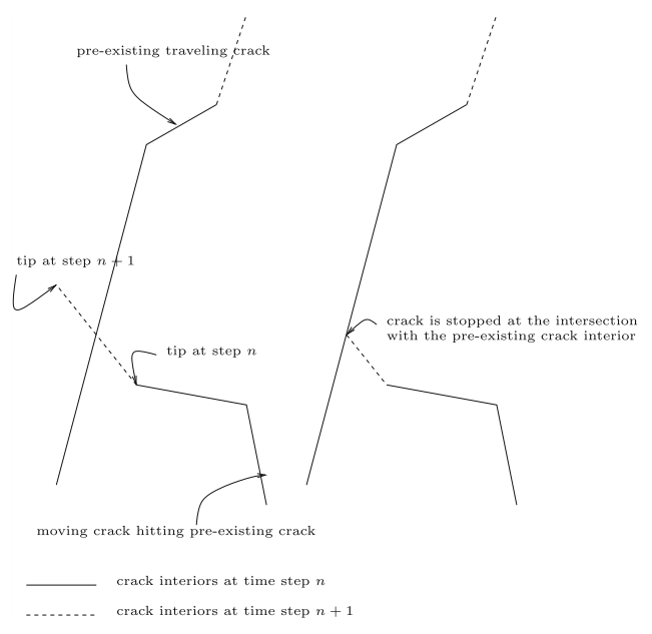

<div class="language-switch">[English](index.qmd) | **한글**</div>

**계산파괴역학 시리즈:** [← 전체 보기](../computational-fracture-overview/index-ko.qmd) · [← XFEM](../xfem-crack-through-mesh/index-ko.qmd) · [← XEFG](../xefg-why-meshfree/index-ko.qmd) · 7편 중 4편

균열 하나도 수치적으로 다루기 쉽지 않다.

변위 불연속이 생기고, 균열선단 또는 균열전면이 생기며, 균열은 배경 요소망과는 독립적으로 영역 내에서 전개된다.

그런데 여러 균열이 동시에 성장하기 시작하면 문제의 성격이 달라진다.

더 이상

> 이 균열은 다음에 어디로 갈 것인가?

만 묻는 것으로 충분하지 않다.

이제는

> **여러 균열이 서로 상호작용하고, 경쟁하고, 합쳐지고, 분기하면서 결국 어떻게 하나의 연결된 균열의 파괴 네트워크를 만드는가?**

를 물어야 한다.

어떤 균열은 다른 균열과 합쳐지는 차폐(shielding) 작용으로 인해  멈출 수 있다. 어떤 균열은 주변 응력장이 증폭되면서 더 빨리 성장할 수 있다. 두 균열이 서로 접근하여 합체할 수도 있고, 하나의 균열이 둘로 분기할 수도 있다.

3차원에서는 선이 면이 되고, 균열선단은 균열전면이 된다.

기하형상도 바뀐다.

하지만 더 중요한 것은 **위상(topology)이 바뀐다는 것**이다.

> **다중균열 해석은 단일균열 문제를 여러 번 반복해서 푸는 문제가 아니다. 변화하는 불연속 네트워크의 위상을 수치적으로 진화시키는 문제다.**

## 하나의 균열에서 여러 균열로

물체 안에 여러 균열이 있다고 하자.

$$
\Gamma
=
\bigcup_{\alpha=1}^{n_c}\Gamma_\alpha
$$

여기서 각 $\Gamma_\alpha$는 하나의 균열이다.

균열들이 정지해 있다면 기존 균열들이 구조물의 강성이나 응력확대계수에 어떤 영향을 주는지를 계산하면 된다. 하지만 균열이 성장하면 이야기가 달라진다. 어느 한 균열이 조금만 성장해도 전체 응력장이 바뀌고, 그 결과 다른 모든 균열선단의 구동력도 바뀐다.

```text
현재의 균열 네트워크
        ↓
전체 응력장
        ↓
모든 활성 균열선단의 구동력
        ↓
서로 다른 성장량과 성장방향
        ↓
새로운 균열 네트워크
        ↓
새로운 응력장
        ↺
```

균열은 서로 독립적인 대상이 아니다.

**응력장을 통해 서로 상호작용한다.**

## 균열 파괴 네트워크를 만드는 것은 균열 사이의 상호작용이다

서로 멀리 떨어진 두 균열은 각각 자기 균열선단의 국부적인 구동력을 가진다. 하지만 서로 가까워지면 두 균열의 응력장이 겹친다.

균열의 방향과 상대적인 위치에 따라 한 균열은 다른 균열의 구동력을 증폭시키거나 차폐할 수 있고, 성장방향을 바꾸거나 합체가 유리한 상태를 만들 수도 있다.

여기서 중요한 것은 최종 파괴형상이 초기 균열배치만으로 결정되지 않는다는 점이다.

**반복되는 역학적 상호작용의 결과로 최종 네트워크가 나타난다.**

그래서 여러 균열을 각각 독립적으로 성장시킨 뒤 마지막에 결과를 합치는 방식으로는 일반적으로 다중균열 문제를 풀 수 없다. 네트워크가 바뀔 때마다 전체 응력장을 다시 계산해야 한다.

## 피로에서는 균열 사이의 경쟁이 서서히 드러난다

다중균열 피로문제는 이 현상을 이해하기에 특히 유용하다.

2004년 연구에서는 선형탄성파괴역학과 Paris 법칙을 사용하여 피로균열 성장을 모델링했다.

$$
\frac{da}{dN}
=
C(\Delta K)^m
$$

여기서 $a$는 균열길이, $N$은 반복횟수, $\Delta K$는 응력확대계수 범위이며, $C$와 $m$은 재료상수다.

혼합모드에서는 등가 응력확대계수를 사용하고 최대의 인장응력이 형성되는 방향으로 균열방향을 결정했다.

수치적으로 중요한 점은 **모든 활성 균열선단에 같은 반복횟수 $\Delta N$가 적용되어야 한다**는 것이다. 하지만 각 균열선단의 $\Delta K$는 서로 다르다.

```text
모든 활성 균열선단에서 ΔK 계산
        ↓
가장 활발한 균열선단 선택
        ↓
그 선단에서 적절한 성장량 설정
        ↓
그 성장량에 대응하는 ΔN 계산
        ↓
나머지 균열선단은 각자의 ΔK에 따라 성장
        ↓
전체 응력장 재계산
```

어떤 균열선단은 빠르게 성장하고, 어떤 균열선단은 거의 움직이지 않으며, 어떤 균열선단은 주변 응력장이 바뀌면서 사실상 비활성 상태가 된다.

최종 파괴형상은 미리 정해져 있지 않다.

상호작용의 결과로 나타난다.

## 다중균열에서는 메시 독립성이 더 중요하다

균열 하나에서도 요소망의 편향은 바람직하지 않다.

여러 균열에서는 문제가 훨씬 심각해진다.

모든 균열이 요소경계를 따라가야 한다면 요소망 자체가 보이지 않는 파괴경로망을 제공하게 된다. 그러면 실제 역학이 아니라 **수치적인 위상**이 균열 합체 경로를 결정할 수 있다.

다중균열 XFEM 연구에서는 균열기하를 확충함수와 level-set 정보로 표현하여 유한요소망과 독립적으로 유지했다. 따라서 재요소망 생성 없이 균열이 성장하고 서로 연결될 수 있었다.

이것은 단순한 구현상의 편의가 아니다.

균열경로가 초기 요소망보다 파괴역학의 지배를 더 많이 받게 하려면 필요한 조건이었다.

{#fig-fatigue-mesh fig-align="center" width="82%"}

그림 [-@fig-fatigue-mesh]은 일종의 수치적 신뢰도 검토로 읽는 것이 좋다. 균열형상은 복잡하지만 요소망을 세분화하면 전체적인 파괴 네트워크가 안정된다.

## 균열 접합은 단순히 두 균열이 닿는 것이 아니다

한 균열이 다른 균열에 도달하면 국부적인 기하형상이 바뀐다.

하지만 더 중요한 변화는 위상이다.

합체 전에는 두 개의 독립적인 불연속이 있다.

```text
균열 A     균열 B
```

합체 후에는 하나의 연결된 불연속 네트워크가 된다.

```text
균열 A ─┐
        ├── 연결된 네트워크
균열 B ─┘
```

2004년 XFEM 방법에서는 특별한 junction enrichment를 추가하지 않았다. 두 균열의 step enrichment를 조합하고 접근하는 균열의 signed-distance 표현을 수정하여 접합을 표현할 수 있었다.

계산적으로 중요한 점은 이것이다.

> **균열 네트워크의 위상은 변하지만 요소망의 위상은 그대로 유지된다.**

확충 파괴해석의 가장 강력한 장점 중 하나다.

## 합체는 구조물의 강성저하를 급격하게 만들 수 있다

균열성장을 구조물 강성이 천천히 감소하는 과정으로 생각하기 쉽다.

다중균열에서는 반드시 그렇지 않다.

무작위로 배치된 여러 균열을 가진 셀의 피로해석에서는 일부 균열은 방향이나 국부적인 응력장이 균열 성장에 불리해서 거의 성장하지 않았다. 반면 다른 균열은 계속 성장하여 주변 균열과 연결되었다.

{#fig-fifty-cracks fig-align="center" width="68%"}

그림 [-@fig-fifty-cracks]은 단일균열 해석으로는 볼 수 없는 것을 보여준다.

구조적인 영향은 단순히 전체 균열길이가 얼마나 늘어났는가에만 달려 있지 않다.

**균열들이 서로 연결되었는가가 매우 중요하다.**

서로 연결된 중간 길이의 균열 두 개가 서로 떨어진 더 긴 균열 두 개보다 구조적으로 더 위험할 수 있다.

> **다중균열 시스템에서는 개별 균열길이의 합보다 연결성이 더 중요할 수 있다.**

그래서 파괴 네트워크는 본질적으로 위상적인 대상이다.

## 균열은 왜 비스듬히 만나기도 하는가?

50개 균열의 피로해석에서는 작은 균열이 큰 균열에 접근할 때 거의 직각에 가까운 방향으로 합체하는 경우도 나타났다.

단순한 기하학적 우연은 아니다.

균열선단이 큰 균열의 응력장에 들어가면 국부적인 혼합모드 상태가 바뀌고 그 결과 성장방향도 바뀐다.

균열은 인접한 균열이 기하학적으로 어디 있는지 알아서 그렇게 거동하는 것이 아니다.

**그 균열이 만들어 놓은 응력장에 반응한다.**

최종 균열 네트워크의 형상은 역학적 상호작용의 이력을 기록한 결과라고 볼 수 있다.

## 분기와 합체는 다르다

합체는 두 균열이 만나면서 독립적인 균열전면의 수를 줄인다.

분기는 반대다.

하나의 균열전면이 두 개 이상의 새로운 균열전면을 만든다.

그래서 분기는 계산적으로 더 까다로운 경우가 많다. 해석 도중 새로운 불연속 기하형상을 만들어야 하기 때문이다.

동적하중에서는 국부적인 파괴상태가 불안정해지고 두 개 이상의 물리적으로 가능한 성장방향이 생길 때 분기가 나타날 수 있다.

3차원 확장무요소 연구에서는 균열전면 앞쪽의 재료안정성을 검사하여 분기여부를 판단했다.

```text
국부 불안정
        ↓
여러 가능한 성장방향
        ↓
새로운 균열분기
        ↓
새로운 균열전면
        ↓
새로운 전체 응력장
```

새로운 기하형상을 만들면서도 균열면의 연속성을 유지해야 한다.

## 3차원에서는 문제가 완전히 달라진다

2차원에서 균열 네트워크는 여러 선분과 균열선단으로 이루어진다.

3차원에서는 각 균열이 면이 되고, 그 경계가 균열전면이 된다.

이제 균열 합체는 선 두 개를 잇는 것이 아니라 면 두 개를 연결하는 문제다. 분기는 새로운 균열면을 만든다.

```text
2차원
여러 균열선
+ 균열선단
+ 접합점

        ↓

3차원
여러 균열면
+ 움직이는 균열전면
+ 균열면 접합
+ 분기하는 균열면
```

단순히 2차원 문제에 한 차원을 더한 것이 아니다.

**비선형 파괴역학 안에 계산기하학 문제가 들어온다.**

3차원 XEFG 연구에서 균열경로의 연속성을 중요하게 다룬 이유다.

## 균열전면의 연속성도 물리적인 요구조건이다

수치적으로 만들어진 균열면이 배경 셀마다 약간 다른 성장방향을 계산했다는 이유로 변위 공간에 임의의 틈이 생기거나 비현실적으로 접히게 되는 것을 허용할 수는 없다.

3차원 무요소 해석에서는 국부화 해석으로 얻은 균열면 법선을 smoothing하여 더 일관된 균열성장면을 만들었다. 균열전면 주변의 adaptive refinement도 기하형상의 해상도를 높이기 위해 사용했다.

> **국부적인 파괴기준만으로는 충분하지 않다. 진화하는 균열의 기하형상도 전체적으로 물리적으로 가능한 상태를 유지해야 한다.**

균열방향은 국부적으로 정할 수 있다.

하지만 균열면은 전체적으로 연속이어야 한다.

## 3차원 균열 접합은 특히 어렵다

3차원에서 두 균열이 만나면 면 두 개가 교차하고 연결된다.

그 위치에서는 일부 균열전면이 사라지거나 형태가 바뀐다.

수치적인 표현은 다음을 결정해야 한다.

- 두 균열면은 어디에서 만나는가?
- 어느 균열전면이 계속 활성상태로 남는가?
- signed-distance 또는 기하표현은 어떻게 갱신되는가?
- 확충정보는 어떻게 바뀌는가?
- 비물리적인 중첩균열은 어떻게 막을 것인가?

3차원 XEFG에서는 배경 적분 셀 안에서 이런 균열접합을 직접 다루었다. 성장하는 균열이 기존 균열과 만나는 지점에서 멈추도록 하여 비물리적인 중첩균열이 생기지 않도록 했다.

{#fig-3d-junction fig-align="center" width="76%"}

그림 [-@fig-3d-junction]을 보면 파괴 네트워크에 왜 명시적인 위상관리가 필요한지 알 수 있다.

**어떤 균열기하가 물리적으로 가능한 연결상태인지까지 관리해야 한다.**

## 파괴 네트워크를 연속체 안에 들어 있는 그래프로 볼 수도 있다

다중균열 시스템을 개념적으로 그래프처럼 생각해 볼 수 있다.

```text
균열선 / 균열면
        ↓
edge

균열선단 / 균열전면
        ↓
active boundary

접합점 / 접합선
        ↓
network node
```

물론 실제 파괴문제가 그래프 이론과 완전히 같은 것은 아니다. 균열은 여전히 연속체 안에 존재하고 그 진화는 역학에 의해 결정된다.

하지만 이 비유는 위상이 왜 중요한지를 잘 보여준다.

균열이 성장하는 동안 활성 균열전면은 기존 edge를 연장하고, 합체는 새로운 junction node를 만들며, 분기는 새로운 edge와 균열전면을 만든다. 어떤 균열전면은 비활성화되고, 결국 하나의 연결경로가 구조물을 관통할 수도 있다.

따라서 시스템의 상태를 균열길이 하나만으로는 설명할 수 없다.

**네트워크의 구조에 대한 정보가 필요하다.**

## 준취성 재료에서 왜 중요한가?

이 관점은 콘크리트, 암석, 세라믹, 불균질 복합재와 같은 준취성 재료에서 특히 중요하다.

파괴가 처음부터 하나의 완전히 독립적인 균열에 의해 지배되는 경우는 드물다.

대신 분산된 결함과 미세균열이 서로 상호작용하면서 점차 국부화된다.

```text
분산균열
→ 선택적 성장
→ 상호작용
→ 합체
→ 국부화
→ 연결된 파괴경로
```

그래서 다중균열 해석은 단순히 교과서의 단일균열 시험편을 복잡하게 만든 문제가 아니다.

**국부적인 파괴역학과 거시적인 구조파괴를 연결하는 문제다.**

## 피로파괴와 단조파괴는 네트워크 문제의 다른 부분을 강조한다

피로하중에서는 균열이 여러 반복횟수에 걸쳐 천천히 성장할 수 있다.

그래서 균열 사이의 상호작용과 합체가 비교적 서서히 진행된다.

반대로 동적파괴나 강한 비선형 단조파괴에서는 균열의 발생, 성장, 분기와 접합이 매우 짧은 시간에 일어날 수 있다.

피로에서는 Paris 법칙과 같은 성장식이 균열증분을 결정할 수 있고, 비선형 또는 동적 파괴에서는 재료안정성 기준이나 점성균열 기준이 균열발생과 성장을 지배할 수 있다.

하지만 두 경우 모두 기하학적인 질문은 같다.

> **여러 개의 서로 상호작용하는 불연속을 전체 이산화를 다시 만들지 않으면서 어떻게 갱신할 것인가?**

이것이 XFEM과 XEFG 연구를 연결하는 공통된 문제다.

## 2차원에서 3차원으로 가면서 무엇을 배웠는가?

초기의 다중균열 XFEM부터 이후의 3차원 XEFG까지를 보면 난이도가 세 단계로 증가한다.

### 1단계: 균열 전파

기존 균열이 요소망과 독립적으로 성장할 수 있는가?

### 2단계: 균열 상호작용과 위상변화

여러 균열이 재요소망 생성 없이 성장하고 서로 만나 새로운 접합을 만들 수 있는가?

### 3단계: 진화하는 3차원 균열면

비선형 또는 동적 조건에서 임의의 3차원 균열면이 발생하고, 분기하고, 서로 만나면서도 전체적인 연속성을 유지할 수 있는가?

각 단계에서는 단순히 자유도 수가 늘어나는 것이 아니다.

**파괴해석에서 관리해야 할 정보의 종류가 늘어난다.**

## 수치적인 자유도에는 반드시 물리적인 규칙이 따라야 한다

임의의 균열을 자유롭게 만들 수 있는 수치기법은 파괴기준이 잘못되면 임의의 엉터리 균열도 만들 수 있다.

기하형상을 요소망으로부터 독립시켰다고 해서 역학의 중요성이 줄어드는 것은 아니다.

오히려 더 중요해진다.

균열경로가 요소망에 의해 제한되지 않으면 그 경로는 물리적으로 타당한 균열발생 기준, 균열성장 법칙, 응력확대계수 또는 재료안정성 정보, 필요한 경우 점성 구성법칙, 그리고 분기와 접합에 대한 일관된 규칙으로 결정되어야 한다.

요소망을 따라가는 균열에서는 수치기하가 균열경로를 너무 많이 결정할 수 있다.

반대로 기하형상과 독립적인 균열에서는 **파괴모델이 더 많은 것을 결정해야 한다.**

바람직한 방향이다.

단, 역학이 제대로 되어 있어야 한다.

## 결국 핵심은

다중균열 해석에서 중요한 것은 컴퓨터가 복잡한 균열그림을 그릴 수 있다는 것이 아니다.

균열들이 서로 상호작용하기 시작하면 **파괴 자체의 성격이 달라진다**는 점이다.

단일균열에서는

> 균열이 어디로 성장하는가?

를 묻는다.

다중균열 네트워크에서는

> 어떤 균열이 성장하고, 어떤 균열이 멈추며, 어떤 균열이 서로 상호작용하고, 어디에서 합체하고 분기하며, 언제 연결된 파괴경로가 만들어지는가?

를 물어야 한다.

> **균열 사이의 상호작용이 파괴경로의 위상을 바꾸기 시작하면 파괴는 네트워크 문제가 된다.**

계산적으로는 한 문장으로 더 줄일 수 있다.

> **균열의 성장량만 추적하지 말고 균열 사이의 연결성이 어떻게 변하는지 추적하자.**

최종 파괴경로는 개별균열을 단순히 더한 것이 아니다.

**균열들의 상호작용으로 만들어진 새로운 구조다.**

---

## 시리즈 계속 읽기

[← **이전: 왜 XFEM을 무요소법으로 확장하는가?**](../xefg-why-meshfree/index-ko.qmd)

[**시리즈 전체: 계산파괴역학은 왜 어려운가?**](../computational-fracture-overview/index-ko.qmd)

[**다음 — 5편: 균열을 표현하려면 반드시 변위공간을 부가적으로 확충(enrichment)해야 하는가?**](../alternative-crack-representations/index-ko.qmd)

## Original research

Zi, G., Song, J.-H., Budyn, E., Lee, S.-H., & Belytschko, T. (2004).  
**A method for growing multiple cracks without remeshing and its application to fatigue crack growth.**  
*Modelling and Simulation in Materials Science and Engineering, 12*, 901–915.  
https://doi.org/10.1088/0965-0393/12/5/009

Budyn, E., Zi, G., Moës, N., & Belytschko, T. (2004).  
**A method for multiple crack growth in brittle materials without remeshing.**  
*International Journal for Numerical Methods in Engineering, 61*, 1741–1770.  
https://doi.org/10.1002/nme.1130

Belytschko, T., Chen, H., Xu, J., & Zi, G. (2003).  
**Dynamic crack propagation based on loss of hyperbolicity and a new discontinuous enrichment.**  
*International Journal for Numerical Methods in Engineering, 58*, 1873–1905.  
https://doi.org/10.1002/nme.941

Rabczuk, T., Bordas, S., & Zi, G. (2007).  
**A three-dimensional meshfree method for continuous multiple-crack initiation, propagation and junction in statics and dynamics.**  
*Computational Mechanics, 40*, 473–495.  
https://doi.org/10.1007/s00466-006-0122-1

Bordas, S., Rabczuk, T., & Zi, G. (2008).  
**Three-dimensional crack initiation, propagation, branching and junction in non-linear materials by an extended meshfree method without asymptotic enrichment.**  
*Engineering Fracture Mechanics, 75*, 943–960.  
https://doi.org/10.1016/j.engfracmech.2007.05.010

Rabczuk, T., Bordas, S., & Zi, G. (2010).  
**On three-dimensional modelling of crack growth using partition of unity methods.**  
*Computers & Structures, 88*, 1391–1411.
