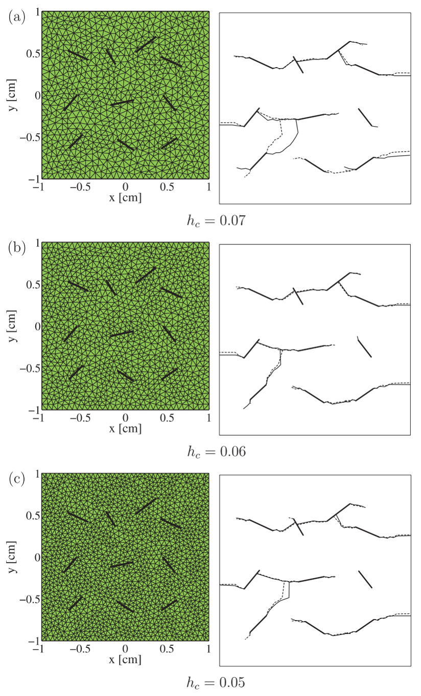
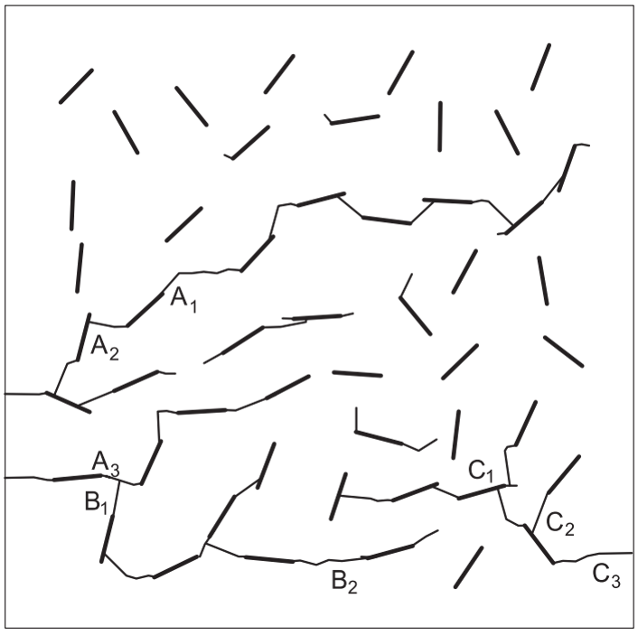

**Computational Fracture Series:** [← Overview](../computational-fracture-overview/) · [← XFEM](../xfem-crack-through-mesh/) · [← XEFG](../xefg-why-meshfree/) · Article 4 of 7

A single crack is already a difficult numerical object.

It introduces a displacement discontinuity, creates a crack tip or crack front, and moves through a body independently of the background discretization.

But once several cracks are allowed to grow at the same time, the nature of the problem changes.

The difficulty is no longer simply

> Where will this crack go next?

It becomes

> **How does an evolving population of cracks interact, compete, join, branch, and eventually create a connected fracture network?**

That is a different class of problem.

A crack may stop because another crack shields it.

Another may accelerate because the stress field is amplified.

Two cracks may approach each other and coalesce.

A single crack may branch.

Several cracks may form a connected path across the body.

In three dimensions, lines become surfaces and tips become crack fronts.

The geometry changes.

More importantly, the **topology changes**.

This is the central idea of this article:

> **Multiple-fracture simulation is not merely the repeated solution of a single-crack problem. It is the numerical evolution of a changing discontinuity network.**

## From one crack to many cracks

Suppose the body contains a set of cracks

$$
\Gamma
=
\bigcup_{\alpha=1}^{n_c}\Gamma_\alpha,
$$

where each $\Gamma_\alpha$ represents one crack.

For a stationary array of cracks, we can ask how the existing cracks affect stiffness or stress intensity factors.

For growing cracks, the situation is much harder because every propagation step changes the stress field experienced by all the other crack tips.

Conceptually,

```text
current crack network
        ↓
stress field
        ↓
driving force at every active tip
        ↓
different growth increments and directions
        ↓
new crack network
        ↓
new stress field
        ↺
```

The cracks are therefore not independent objects.

They communicate through the mechanical field.

## Crack interaction is the mechanics behind the network

For two isolated cracks, each crack tip has its own local driving force.

As the cracks approach one another, their stress fields overlap.

Depending on orientation and position, one crack may:

- amplify the driving force at another tip,
- shield another tip,
- change its propagation direction,
- or make a junction energetically favorable.

The important point is that the final fracture pattern is not determined by the initial crack geometry alone.

It is an **emergent result of repeated mechanical interaction**.

This is why multiple cracks cannot generally be propagated by solving each crack independently and then combining the answers afterward.

The global field must be updated as the network evolves.

## Fatigue makes the competition gradual

Multiple-crack fatigue is particularly instructive because crack evolution occurs over many loading cycles.

In our 2004 work, the crack-growth period was modeled with linear elastic fracture mechanics and the Paris law,

$$
\frac{da}{dN}
=
C(\Delta K)^m,
$$

where $a$ is crack length, $N$ is the number of cycles, $\Delta K$ is the stress-intensity-factor range, and $C$ and $m$ are material parameters.

For mixed-mode growth, an equivalent stress-intensity measure was used, and the direction was determined from a maximum-hoop-stress criterion.

The important numerical issue is that the same number of fatigue cycles must be applied to **all active crack tips**, even though their driving forces are different.

A useful propagation sequence is therefore:

```text
evaluate ΔK at every active crack tip
        ↓
identify the most active tip
        ↓
choose a controlled increment there
        ↓
calculate the corresponding ΔN
        ↓
advance every other tip according to its own ΔK
        ↓
recompute the global field
```

This immediately creates crack competition.

Some tips grow rapidly.

Some barely move.

Some eventually become inactive because the local field changes.

The fracture pattern evolves from interaction, not from a prescribed network.

## Why mesh independence matters more for multiple cracks

For one crack, mesh bias is already undesirable.

For many cracks, it can become catastrophic.

If every crack must follow element boundaries, then the mesh provides a hidden network of preferred fracture paths.

The predicted coalescence pattern can then reflect numerical topology rather than mechanics.

The attraction of XFEM in our multiple-crack work was that the crack geometry was described independently of the finite element mesh through enrichment and level-set information.

Cracks could therefore grow and interconnect without remeshing.

This was not only a convenience.

It was necessary if we wanted the evolving crack pattern to be governed primarily by the fracture mechanics rather than by the initial mesh.

{#fig-fatigue-mesh fig-align="center" width="82%"}

Figure @fig-fatigue-mesh should be read as a numerical credibility check.

The crack geometry is complicated, yet the qualitative network becomes stable with mesh refinement.

That is precisely the behavior we want from a geometry-independent crack representation.

## Junction is not just two cracks touching

When one crack reaches another crack, the geometry changes locally.

But the more important change is topological.

Before coalescence, we have two discontinuities:

```text
crack A     crack B
```

After coalescence, they form one connected discontinuity network:

```text
crack A ─┐
         ├── connected network
crack B ─┘
```

In the 2004 XFEM formulation, a special junction enrichment was not required. The junction could be represented by combining the step enrichments associated with the two cracks and modifying the signed-distance description of the approaching crack.

This is a subtle but important computational point.

The network topology changed, but the background finite element connectivity did not have to be rebuilt.

> **The crack network changed its topology while the mesh retained its topology.**

That separation is one of the most powerful consequences of enriched fracture methods.

## Coalescence can control structural degradation

Crack growth is often imagined as a smooth reduction in stiffness.

Multiple-crack interaction shows that this need not be true.

In the cell containing many randomly oriented cracks studied in our fatigue work, some cracks barely grew because their orientation and local fields were unfavorable. Others propagated and eventually joined neighboring cracks.

As fatigue progressed, these junctions created increasingly long connected cracks.

{#fig-fifty-cracks fig-align="center" width="68%"}

Figure @fig-fifty-cracks demonstrates something that a single-crack calculation cannot show.

The structural consequence depends not only on how much total crack length is produced.

It depends strongly on **connectivity**.

Two moderate cracks that join may be more damaging than two longer cracks that remain isolated.

In the example reported in that study, crack junctions were associated with rapid drops in the calculated elastic stiffness. The final connected pattern represented a percolating failure path through the cell.

This suggests a broader engineering interpretation:

> **In a multiple-crack system, connectivity may matter more than the sum of individual crack lengths.**

That is one reason fracture networks are naturally topological objects.

## Why cracks often join at an angle

The 50-crack fatigue example also showed that a smaller crack approaching a larger crack could join it at an angle close to a right angle.

This is not simply a geometric coincidence.

As a crack tip approaches the stress field of a larger crack, its local mixed-mode state changes. The propagation direction responds to that altered field.

The resulting junction geometry is therefore a consequence of crack interaction.

This is an important example of the site's central question:

> Why does the result make engineering sense?

The crack does not know where the neighboring crack is geometrically.

It responds to the **stress field produced by that crack**.

The network geometry is a record of the mechanical interaction history.

## Branching is different from coalescence

Coalescence decreases the number of independent crack fronts when two cracks connect.

Branching does the opposite.

A single advancing crack front produces two or more new fronts.

This makes branching particularly difficult computationally because the algorithm must create new discontinuity geometry during the analysis.

Under dynamic loading, branching may occur when the local fracture state becomes unstable and more than one physically admissible propagation direction develops.

In our three-dimensional extended meshfree work, crack branching was incorporated by checking the material stability condition ahead of the front. When sufficiently different failure-plane normals occurred locally, a branch could be introduced.

The mechanics and topology are therefore coupled:

```text
local instability
        ↓
multiple admissible directions
        ↓
new crack branches
        ↓
new crack fronts
        ↓
new global stress field
```

The method must create the new geometry without losing crack continuity.

## Three dimensions change everything

In two dimensions, a crack network consists of line segments and crack-tip points.

In three dimensions, each crack becomes a surface and each active boundary becomes a crack front.

Now coalescence requires the joining of surfaces.

Branching creates new surfaces.

An advancing crack front may be curved, and different locations along the front may have different propagation directions.

The problem becomes

```text
2D
multiple lines
+ tips
+ junction points

        ↓

3D
multiple surfaces
+ moving fronts
+ surface junctions
+ branching surfaces
```

This is not a minor extension of the 2D problem.

It is a computational-geometry problem embedded inside nonlinear fracture mechanics.

The three-dimensional XEFG work therefore placed strong emphasis on **crack-path continuity**. A crack front represented inconsistently from one background cell to the next could create artificial kinks or disconnected surfaces.

## Crack-front continuity is a physical requirement

A numerically generated crack surface should not develop arbitrary gaps or impossible folds simply because different integration cells produce slightly different propagation directions.

In the 3D meshfree formulation, crack normals obtained from the localization analysis were smoothed to maintain a more consistent propagation surface.

Adaptive refinement near the crack front was also used to improve geometric resolution.

This highlights an important modeling principle:

> **A local fracture criterion is not enough. The evolving geometry must also remain globally admissible.**

The crack direction may be decided locally.

The crack surface must remain globally continuous.

These are different requirements.

## Junctions in three dimensions are especially difficult

When two three-dimensional cracks intersect, we are not joining two lines.

We are connecting two surfaces.

The corresponding crack fronts disappear or are modified where the surfaces meet.

The numerical representation must decide:

- where the intersection occurs,
- which front remains active,
- how the signed-distance or geometric representation changes,
- how enrichment is updated,
- and how artificial overlapping discontinuities are avoided.

The 3D XEFG formulation explicitly addressed crack junctions within the background integration cells.

A moving crack was stopped at its intersection with an existing crack so that nonphysical overlapping configurations were not permitted.

{#fig-3d-junction fig-align="center" width="76%"}

Figure @fig-3d-junction shows why a crack network requires explicit topology management.

The calculation is no longer only about evaluating stresses and moving a front.

It must also enforce what constitutes a physically meaningful connected crack geometry.

## A fracture network is an evolving graph embedded in a continuum

There is a useful conceptual analogy.

A multiple-crack system can be viewed as a graph:

```text
crack segments / surfaces
        ↓
edges

crack tips / fronts
        ↓
active boundaries

junctions
        ↓
network nodes
```

This analogy is conceptual, not mathematically identical to graph theory.

The cracks still live inside a continuum and their evolution is controlled by mechanics.

But the analogy clarifies why topology matters.

During propagation:

- an active front may extend an existing edge,
- coalescence may create a junction node,
- branching may create new edges and fronts,
- a front may become inactive,
- and a connected path may span the body.

The state of the system cannot therefore be characterized fully by one crack length.

It requires information about the **network structure**.

## Why this matters for quasibrittle materials

This perspective is particularly relevant to quasibrittle materials such as concrete, rock, ceramics, and many heterogeneous composites.

Failure is rarely controlled by one perfectly isolated crack from the beginning.

Instead, distributed defects and microcracks interact and progressively localize.

The eventual macroscopic fracture may emerge through

```text
distributed cracks
→ selective growth
→ interaction
→ coalescence
→ localization
→ connected failure path
```

This is why multiple-crack simulations are more than complicated versions of textbook fracture specimens.

They provide a bridge between local fracture mechanics and macroscopic failure.

## Fatigue and monotonic fracture emphasize different parts of the network problem

Under fatigue loading, cracks can grow slowly while the global structure remains nominally stable.

This allows interaction and coalescence to develop gradually over many cycles.

Under dynamic or strongly nonlinear monotonic loading, crack initiation, growth, branching, and junction may occur over very short time scales.

The numerical framework must therefore distinguish the physical evolution law from the geometric machinery.

For fatigue, a Paris-type law may govern growth increments.

For nonlinear or dynamic fracture, a material-stability or cohesive criterion may govern initiation and propagation.

But in both cases, the geometric problem remains:

> How do we update an arbitrary number of interacting discontinuities without losing physical continuity or rebuilding the entire discretization?

That is the common thread connecting the XFEM and XEFG work.

## What did we learn from moving from 2D to 3D?

The progression from the early multiple-crack XFEM calculations to later 3D XEFG work suggests three increasingly difficult levels.

### Level 1: propagation

Can an existing crack advance independently of the mesh?

### Level 2: interaction and topology

Can several cracks grow, meet, and form new junctions without remeshing?

### Level 3: evolving surfaces

Can arbitrary three-dimensional crack surfaces initiate, branch, meet, and remain continuous while the material is nonlinear or dynamic?

Each level adds something qualitatively new.

The progression is not simply an increase in the number of degrees of freedom.

It is an increase in the **information that the fracture representation must manage**.

## Numerical freedom still requires physical rules

A method capable of creating arbitrary cracks can also create arbitrary nonsense if the fracture rules are poor.

Geometry independence therefore does not reduce the importance of mechanics.

It increases it.

When the crack is no longer forced to follow the mesh, the path must be determined by:

- a physically meaningful crack-initiation criterion,
- a propagation law,
- stress-intensity or material-stability information,
- a cohesive constitutive law where appropriate,
- and consistent rules for branching and junction.

This is an important inversion.

With a mesh-constrained crack, numerical geometry may determine too much.

With a geometry-independent crack, the **fracture model must determine more**.

That is desirable—but only if the mechanics is sound.

## Engineering takeaway

The main lesson from multiple-crack simulation is not that a computer can draw complicated crack patterns.

It is that failure changes character when discontinuities begin to interact.

A single crack asks:

> Where does the crack propagate?

A crack network asks:

> Which cracks grow, which stop, which interact, which join, where does branching occur, and when does a connected failure path emerge?

That leads to the principle I would keep from this article:

> **Fracture becomes a network problem when crack interaction changes the topology of the failure path.**

And computationally:

> **Do not track only crack growth. Track the evolution of crack connectivity.**

That distinction matters because structural degradation can accelerate when previously separate cracks connect.

The final failure path is therefore not merely the sum of individual cracks.

It is an emergent structure created by their interaction.

---

## Continue the series

[← **Previous: Why Extend XFEM into a Meshfree Method?**](../xefg-why-meshfree/)

[**Series overview: Why Is Computational Fracture So Difficult?**](../computational-fracture-overview/)

**Coming next — Article 5:** *Is Enrichment the Only Way to Represent a Crack?*

## Original research

Zi, G., Song, J.-H., Budyn, E., Lee, S.-H., & Belytschko, T. (2004).  
**A method for growing multiple cracks without remeshing and its application to fatigue crack growth.**  
*Modelling and Simulation in Materials Science and Engineering, 12*, 901–915.  
https://doi.org/10.1088/0965-0393/12/5/009

Budyn, E., Zi, G., Moës, N., & Belytschko, T. (2004).  
**A method for multiple crack growth in brittle materials without remeshing.**  
*International Journal for Numerical Methods in Engineering, 61*, 1741–1770.  
https://doi.org/10.1002/nme.1130

Belytschko, T., Chen, H., Xu, J., & Zi, G. (2003).  
**Dynamic crack propagation based on loss of hyperbolicity and a new discontinuous enrichment.**  
*International Journal for Numerical Methods in Engineering, 58*, 1873–1905.  
https://doi.org/10.1002/nme.941

Rabczuk, T., Bordas, S., & Zi, G. (2007).  
**A three-dimensional meshfree method for continuous multiple-crack initiation, propagation and junction in statics and dynamics.**  
*Computational Mechanics, 40*, 473–495.  
https://doi.org/10.1007/s00466-006-0122-1

Bordas, S., Rabczuk, T., & Zi, G. (2008).  
**Three-dimensional crack initiation, propagation, branching and junction in non-linear materials by an extended meshfree method without asymptotic enrichment.**  
*Engineering Fracture Mechanics, 75*, 943–960.  
https://doi.org/10.1016/j.engfracmech.2007.05.010

Rabczuk, T., Bordas, S., & Zi, G. (2010).  
**On three-dimensional modelling of crack growth using partition of unity methods.**  
*Computers & Structures, 88*, 1391–1411.
