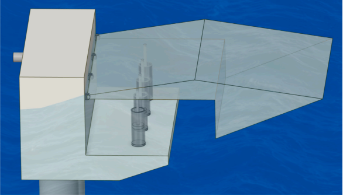
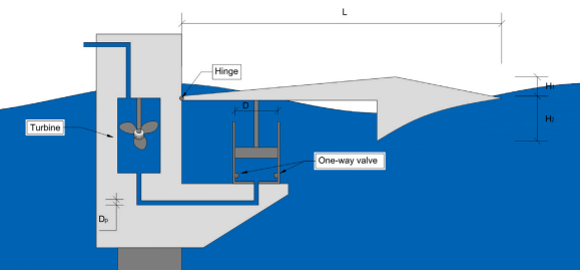
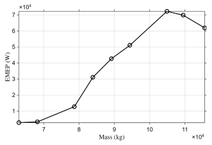
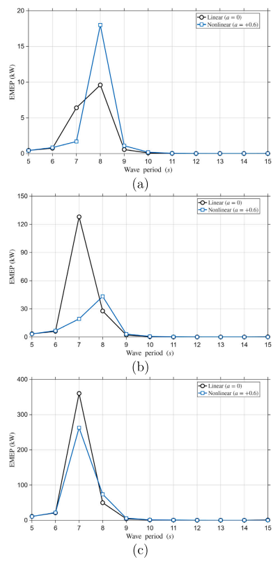

[English](index.qmd) | **한글**

파도에는 에너지가 있다.

말은 간단하다.

그 에너지를 쓸 수 있는 전력으로 바꾸는 일은 간단하지 않다.

물 위에 부유체를 띄우면 파도에 따라 움직인다. 하지만 움직인다고 전기가 만들어지는 것은 아니다. **동력인출장치(power take-off system, PTO)**가 기계적 에너지를 뽑아낼 수 있는 위치에서, 뽑아내기 좋은 형태의 운동이 생겨야 한다.

그래서 질문을 조금 더 정확하게 바꿔야 한다.

> **파랑에 의한 여러 운동 가운데 실제로 무엇을 증폭해야 하는가?**

우리가 최근 연구한 연안 진동암형 파력발전장치(nearshore oscillating-arm wave energy converter)는 여기에 꽤 중요한 답을 준다.

> **부유체 전체의 운동을 무조건 크게 만들 것이 아니라, PTO가 에너지를 뽑아내는 위치에서 유용한 운동을 만들어야 한다.**

이 차이를 이해하면 파도의 운동이 어떻게 전력으로 이어지는지가 훨씬 명확해진다.

---

## 먼저 에너지의 경로를 보자

제안한 시스템의 개념은 단순하다.

부유 암(floating arm)을 힌지로 연안의 고정 구조물에 연결한다. 파도가 이 부유 암을 흔들면, 움직이는 암과 고정 지지부 사이에 설치된 유압 실린더가 상대운동을 유체의 흐름으로 바꾼다 [-@fig-wec-concept].

{#fig-wec-concept fig-align="center" width="90%"}

전체 에너지 전달경로는 다음처럼 쓸 수 있다.

$$
\boxed{
\text{파랑}
\rightarrow
\text{암의 운동}
\rightarrow
\text{PTO 위치의 국부 운동}
\rightarrow
\text{피스톤 운동}
\rightarrow
\text{유압 유량}
\rightarrow
\text{전력}
}
$$

여기서는 화살표 하나하나가 중요하다.

부유체 전체는 크게 움직이는데 피스톤 운동은 작다면 좋은 에너지 변환장치라고 하기 어렵다. 반대로 어떤 전역 응답량이 최대가 아니더라도 PTO가 설치된 위치에서 유리한 운동이 생기면 좋은 설계가 될 수 있다.

그래서 **국부 응답(local response)**을 봐야 한다.

---

## PTO는 부유체의 전역 운동을 직접 보지 않는다

부유 암을 병진과 회전을 하는 강체라고 생각해 보자.

PTO 연결점의 변위는 부유체 무게중심의 변위와 같지 않다. 그 위치의 운동은

- 병진운동,
- 회전운동,
- 형상,
- 힌지로부터의 거리

에 의해 함께 결정된다.

작은 회전각 $\theta$에 대해 PTO 위치의 수직운동을 개념적으로 쓰면

$$
h_{\mathrm{PTO}}
\approx
h_0+r\theta,
$$

여기서 $h_0$는 병진운동의 기여이고 $r$은 적절한 기하학적 레버암이다.

이 식은 연구에서 사용한 실제 수치해석식을 그대로 나타낸 것은 아니다. 여기서 중요한 것은 물리적 의미다.

> **PTO를 어디에 연결하느냐에 따라 에너지 추출에 사용할 수 있는 운동이 달라진다.**

따라서 전역 heave나 pitch만 보면 실제 에너지 변환계를 구동하는 양을 놓칠 수 있다.

---

## 국부 운동에서 피스톤 운동으로

축약모델에서는 피스톤 변위를 PTO 위치의 국부 heave 변위로 근사하였다.

$$
d_i(t)\approx h_i(t),
$$

따라서

$$
\dot d_i(t)\approx \dot h_i(t).
$$

피스톤 속도가 유압 유량을 만든다. 피스톤 면적이 $A_c$인 실린더라면

$$
Q_i(t)=A_c\dot d_i(t)\approx A_c\dot h_i(t).
$$

이 식은 중요한 공학적 의미를 가진다.

전력생산은 변위 그 자체보다 **속도**와 직접 연결된다.

아주 크게 움직이더라도 천천히 움직이면, 조금 작게 움직이면서 빠르게 움직이는 경우보다 유압 유량이 작을 수 있다. 따라서

$$
\boxed{
\text{최대 변위}
\neq
\text{최대 유효 전력}
}
$$

이다.

---

## 왕복운동을 어떻게 한 방향의 유량으로 바꾸는가

부유 암은 앞뒤로 왕복한다. 반면 터빈에는 일정한 방향으로 흐르는 유량이 유리하다.

그래서 유압회로에서는 체크밸브를 사용해 실린더의 왕복 유량을 정류한다 [-@fig-hydraulic-pto].

{#fig-hydraulic-pto fig-align="center" width="90%"}

$i$번째 PTO의 정류된 유량은 축약모델에서

$$
Q_i^*(t)=A_c\left|\dot h_i(t)\right|
$$

로 나타낸다.

PTO가 여러 개라면

$$
Q_T(t)=\sum_{i=1}^{N_{\mathrm{PTO}}}Q_i^*(t)
$$

처럼 합한다.

결국 여러 실린더의 왕복운동이 하나의 유용한 단방향 유압 흐름으로 바뀐다.

---

## 유압 유량에서 추정 전력으로

총 유량으로부터 유효 터빈 유입속도를

$$
U_T(t)=\frac{Q_T(t)}{A_T}
$$

로 정의한다. 여기서 $A_T$는 유효 터빈 유로면적이다.

이 연구에서 사용한 전력 추정식은

$$
P_{\mathrm{el}}(t)
\approx
\eta_{\mathrm{PTO}}
\frac{1}{2}\rho_w A_T U_T^3(t),
$$

또는

$$
P_{\mathrm{el}}(t)
\approx
\eta_{\mathrm{PTO}}
\frac{\rho_w}{2A_T^2}Q_T^3(t)
$$

이다.

그리고 응답의 준정상 구간에서 추정 평균 전력(estimated mean electrical power, EMEP)을 평가하였다.

이 식을 상세한 터빈-발전기 모델로 해석해서는 안 된다. 이 설계대안을 일관성 있게 비교하기 위한 간단한 지표이다.

그러나 에너지 전달경로는 아주 분명하게 보여준다.

$$
\boxed{
\dot h_{\mathrm{PTO}}
\rightarrow
Q
\rightarrow
P
}
$$

즉, PTO가 설치된 위치의 국부 속도가 일반적인 부유체 운동량보다 실제 에너지 변환 메커니즘에 훨씬 가깝다.

---

## 먼저 운동의 형태를 만들어야 한다

유압계를 세밀하게 조정하기 전에 부유 암의 형상부터 조정하였다.

상부와 하부 형상을 체계적으로 변화시킨 목적은 단순히 가장 큰 부유체를 만드는 것이 아니었다. 파랑에 의해 발생한 운동을 PTO 위치까지 효과적으로 전달하는 형상을 찾는 것이었다.

파랑은 젖은 표면 전체에 작용하지만 PTO는 특정 위치에서 작동한다. 형상이 이 둘을 연결한다.

$$
\text{파압 분포}
\rightarrow
\text{힘과 모멘트}
\rightarrow
\text{암의 운동}
\rightarrow
\text{PTO 위치의 국부 운동}
$$

따라서 암의 형상을 바꾸면 입사파에서 에너지 추출점까지 이어지는 기계적 전달과정 전체가 달라진다.

---

## 곡률을 키우면 운동은 커졌다. 그런데 전력도 커졌을까?

특히 흥미로운 결과는 파랑과 접촉하는 경사면을 직선에서 곡선으로 바꾸었을 때 나타났다.

2차 곡선을

$$
y=ax^2+bx+c
$$

로 두었고, $a$가 곡률을 조절한다.

형상 선별에 사용한 대표 조건에서는

$$
a=+0.6
$$

인 경우가 가장 큰 국부 최대 heave와 가장 큰 응답범위를 보였다.

최대 heave는 약

$$
1.824~\mathrm{m}
$$

로, 선형 형상의

$$
1.646~\mathrm{m}
$$

보다 약 10.8% 컸다.

목표가 단순히 "운동을 최대로" 하는 것이라면 비선형 곡면이 가장 좋아 보인다.

문제는 그 다음이다.

더 넓은 파주기 범위에서 추정 전력을 비교하자 선형 형상이 더 매끄럽고 안정적인 성능을 보였다.

이 결과가 이 논문에서 가장 중요한 메시지 중 하나다.

> **한 파랑조건에서 국부 응답을 최대로 만드는 형상이 실제 운용범위 전체에서 유용한 에너지 성능까지 최대로 만드는 것은 아니다.**

---

## 왜 최대 운동이 최대 전력으로 이어지지 않는가

이 장치는 단순한 부유체가 아니라 **유체동역학-기계-유압이 결합된 시스템**이기 때문이다.

형상을 바꾸면

- 파랑 가진력,
- 부가질량,
- 방사감쇠,
- 암의 관성,
- 국부 변위,
- 국부 속도,
- PTO 임피던스와의 상호작용

이 함께 바뀐다.

PTO 자체도 등가 강성과 감쇠를 더한다. 주파수영역 지배방정식은

$$
\left[
-\omega^2(\mathbf M+\mathbf A)
+i\omega(\mathbf B+\mathbf C_{\mathrm{PTO}})
+(\mathbf K_h+\mathbf K_{\mathrm{PTO}})
\right]
\boldsymbol{\xi}
=
\mathbf F_{\mathrm{exc}}
$$

로 쓸 수 있다.

즉 PTO는 유체동역학 응답을 다 계산한 다음에 붙이는 부속품이 아니다. 시스템 동역학의 일부다.

에너지를 뽑아내는 행위 자체가 그 에너지를 만들어내는 운동을 바꾼다.

---

## PTO를 늘리면 유량은 늘지만, 증가효과는 줄어든다

그렇다면 PTO 실린더를 가능한 한 많이 달면 되지 않을까?

연구에서는 PTO를 1개에서 5개까지 검토했다. 예상대로 PTO가 늘어나면 총 유압 유량도 증가했다. 하지만 PTO 수에 비례해서 증가하지는 않았다.

PTO 하나당 유량 기여도는 PTO 수가 늘어날수록 감소했다.

4-PTO 구성은 5-PTO 구성에서 얻은 유압 유량의 약

$$
74\%-84\%
$$

를 유지하면서 PTO 하나를 줄일 수 있었다.

전형적인 공학 최적화 문제다.

$$
\text{추가 부품}\rightarrow\text{추가 이득},
$$

하지만

$$
\frac{\text{추가 이득}}{\text{추가 부품}}\downarrow.
$$

장비가 많다고 유용한 에너지가 그만큼 비례해서 늘어나는 것은 아니다.

따라서 축약모델 평가에서는 4-PTO 구성을 유압 처리량과 시스템 단순성 사이의 유리한 균형점으로 선택했다.

---

## 유압계도 동적으로 맞아야 한다

그 다음에는 실린더 직경, 유압관 직경, PTO 위치를 변화시켰다.

이 매개변수들은 단순히 유량 용량만 바꾸지 않는다. 부유 암이 느끼는 등가 유압 강성과 감쇠도 바꾼다.

예를 들어 실린더 면적은

$$
A_c=\frac{\pi D_c^2}{4}
$$

이다.

실린더가 크면 같은 피스톤 속도에서 더 큰 유량을 만들 수 있다. 하지만 실린더 크기는 등가 PTO 임피던스도 바꾼다. 유압관 직경을 바꾸면 유압 저항도 달라진다.

따라서

$$
\text{최대 유량 용량}
$$

이나

$$
\text{최소 저항}
$$

만으로 최적 시스템을 정할 수 없다.

유체동역학 응답과 유압 PTO 사이에 적절한 균형이 생겨야 한다. 결국 이것도 **동적 정합(dynamic matching)** 문제다.

---

## 무겁다고 항상 나쁜 것도, 좋은 것도 아니다

형상과 선택된 PTO 구성은 그대로 두고 부유체 질량도 변화시켰다.

얼핏 보면

$$
\text{질량 증가}\rightarrow\text{운동 감소}\rightarrow\text{전력 감소}
$$

라고 생각하기 쉽다.

하지만 결합 동역학계는 그렇게 단순하지 않다.

질량을 바꾸면 진동하는 암의 관성이 달라지고, 따라서 파랑 가진 및 PTO 임피던스와의 관계도 달라진다. 실제 에너지 응답은 단조적이지 않았다 [-@fig-mass-power].

{#fig-mass-power fig-align="center" width="85%"}

구조동역학적으로 중요한 결과다.

질량은 단지 가속도를 방해하는 양이 아니다. **주파수축의 어느 위치에서 동적 응답이 크게 나타나는가**를 결정하는 시스템 변수다.

그래서 중간 정도의 질량이 더 가벼운 경우와 더 무거운 경우보다 오히려 좋은 성능을 낼 수 있다.

---

## 파고가 큰 것보다 파주기가 맞는 것이 중요할 수 있다

시스템을 조정한 뒤

$$
T=5\text{--}15~\mathrm{s}
$$

의 파주기와

$$
H=1,\ 2,\ 3~\mathrm{m}
$$

의 입사파고에 대해 성능을 평가했다.

분명한 패턴이 나타났다.

파고를 바꾸면 응답의 크기는 크게 변했다. 하지만 유리한 파주기 범위는 비슷한 영역에 집중되었다.

즉,

$$
H\rightarrow\text{응답의 세기},
$$

반면

$$
T\rightarrow\text{동적 정합}
$$

으로 볼 수 있다.

파고가 크면 파랑에너지는 많다. 그러나 시스템의 동특성이 그 파랑으로부터 PTO 위치에 유용한 운동을 만들어낼 수 있어야 그 에너지를 효과적으로 이용할 수 있다.

---

## 파력발전장치에도 잘 작동하는 주기 영역이 있다

검토한 구성에서 개선된 시스템은 제한된 파주기 범위, 특히 대략

$$
T=7\text{--}8~\mathrm{s}
$$

부근에서 가장 강한 에너지 변환 거동을 보였다 [-@fig-period-power].

{#fig-period-power fig-align="center" width="90%"}

구조동역학에서 익숙한 공진과 주파수응답 개념과 밀접하다.

단순 진동계

$$
m\ddot x+c\dot x+kx=F(t)
$$

도 $F$의 크기만으로 응답이 결정되지 않는다. 가진주파수와 시스템의 동특성 사이의 관계가 중요하다.

이 WEC도 마찬가지다. 다만 실제 시스템에는 유체 부가질량, 방사감쇠, 정수력 복원, 힌지 운동, PTO 임피던스까지 들어간다.

따라서 올바른 질문은

> 파도의 에너지가 얼마나 큰가?

가 아니라

> **그 파도가 에너지 변환 시스템과 동적으로 얼마나 잘 맞는가?**

이다.

---

## 왜 연안 설치가 흥미로운가

제안한 장치는 연안 또는 해안 구조물을 따라 모듈식으로 설치하는 것을 개념적으로 염두에 두었다.

하나의 거대한 해상 WEC 대신 여러 모듈을 해안보호 구조물 같은 인프라를 따라 반복 배치할 가능성이 있다.

접근성, 설치, 유지관리, 모듈화, 전력수요처와의 거리 측면에서 장점이 있을 수 있고, 장기적으로는 파력에너지 이용과 해안보호를 함께 생각할 가능성도 있다.

그러나 **이 논문이 그러한 배열 수준 또는 해안 통합 효과를 입증한 것은 아니다.**

분석대상은 단일 모듈이다. 여러 장치 사이의 유체동역학적 상호작용, 배치 간격 최적화, 해안 구조물과의 간섭, 파랑감쇠 성능은 연구범위 밖이다.

이 구분은 중요하다.

---

## 전력 수치는 조심해서 읽어야 한다

채택한 축약모델과 규칙파 조건에서 개선된 구성의 추정 평균 전력은 파랑조건에 따라 수 kW에서 수백 kW까지 나타났다.

이 값을 상업적으로 실제 공급 가능한 발전량의 예측치로 해석해서는 안 된다.

모델은 에너지 변환 사슬을 의도적으로 단순화했다. 다음 효과를 모두 명시적으로 해석한 것은 아니다.

- 과도 유압회로,
- 밸브 손실,
- 누유,
- 축압기 동역학,
- 터빈 성능곡선,
- 발전기 동역학,
- 제어시스템,
- 상세 전기기계 손실.

따라서 EMEP는 **예비설계 단계의 비교 지표**로 이해하는 것이 맞다.

설계안 A와 B를 같은 기준으로 비교할 수는 있지만, 실제 발전기 출력을 보증하는 값은 아니다.

---

## 불규칙파에서는 어떻게 되는가

실제 바다는 완벽한 하나의 정현파로 이루어져 있지 않다.

그래서 추가적으로 JONSWAP 불규칙파를 사용하여

$$
H_s=3~\mathrm{m},\qquad T_p=7~\mathrm{s}
$$

조건에서 서로 다른 스펙트럼 첨두증대계수에 대한 평가를 수행했다.

목적은 완전한 확률론적 성능을 확립하는 것이 아니었다. 규칙파에서 확인한 주요 설계 경향이 파랑에너지가 스펙트럼에 분산된 경우에도 의미가 있는지를 보는 것이었다.

검토한 불규칙파 조건에서는 주요 경향이 대체로 유지된다는 보조적인 근거를 얻었다.

그러나 상업적 성능을 평가하려면 훨씬 더 많은 검증이 필요하다.

---

## 더 근본적인 역학: 유용한 운동은 국부적이다

이 연구에서 얻을 수 있는 가장 일반적인 생각은 파력발전에만 해당하지 않는다.

우리는 흔히 시스템을

- 질량중심 변위,
- 전역 회전,
- 최대 구조변위,
- 전체 응답진폭

같은 전역량으로 표현한다.

물론 모두 유용한 값이다. 하지만 장치는 **국부적인 위치에서 기능을 수행한다.**

댐퍼는 연결된 위치에서 일한다. 받침은 구조물과 접촉하는 위치에서 하중을 전달한다. 터빈은 유체가 통과하는 위치에서 에너지를 뽑아낸다. 유압 PTO 역시 피스톤의 상대운동에서 에너지를 추출한다.

이 WEC에서는

$$
\boxed{
\text{전역 운동}\neq\text{국부 유효 운동}
}
$$

이다.

따라서 국부 PTO 응답은 단순한 출력변수 하나가 아니다. 유체동역학과 에너지 변환을 연결하는 **기계적 다리**다.

---

## 파도에서 전기까지

처음 질문으로 돌아가 보자.

연안의 파도 움직임을 어떻게 유용한 전력으로 바꿀 수 있을까?

에너지가 큰 파도 속에 부유체 하나를 넣는 것만으로는 안 된다.

변환에는 다음의 연쇄과정이 필요하다.

$$
\boxed{
\begin{aligned}
\text{파랑 가진}
&\rightarrow\text{유체동역학 응답}\\
&\rightarrow\text{PTO 위치의 국부 운동}\\
&\rightarrow\text{피스톤 속도}\\
&\rightarrow\text{정류된 유압 유량}\\
&\rightarrow\text{터빈 유입}\\
&\rightarrow\text{전력}.
\end{aligned}
}
$$

각 단계가 다음 단계를 제한할 수 있다.

그래서 형상, 관성, PTO 개수, PTO 위치, 유압 매개변수, 파주기를 따로따로 설계할 수 없다. 모두 하나의 에너지 변환 시스템에 속한다.

---

## 한계

이 연구는 축약된 예비설계 프레임워크다.

유체동역학 해석은 주로 선형 포텐셜유동 가정에 기반하며, 에너지가 큰 연안 조건에서 중요해질 수 있는 강한 점성효과, 슬래밍, 월파, 대진폭 운동 등의 비선형 현상을 모두 명시적으로 고려하지 않는다.

유압 PTO는 완전한 과도 유압회로가 아니라 등가 강성과 감쇠로 표현하였다. 전력 계산 역시 특정 터빈과 발전기의 상세 예측이 아니라 비교를 위한 추정 지표다.

또한 단일 WEC 모듈만 평가하였다. 다중 모듈 상호작용, 장치 간격, 해안 구조물과의 통합, 구조적 생존성, 피로, 힌지 내구성, 부식, 해양생물 부착, 유지관리, 기술경제성, 실험검증은 앞으로 검토해야 할 중요한 문제다.

따라서 제시한 유리한 구성은 **검토한 매개변수 범위와 모델링 가정 안에서** 해석해야 한다.

---

## 결국 중요한 것은 어디에서 어떻게 움직이는가이다

파력에너지 이용은 부유체 운동을 최대한 크게 만드는 경쟁이 아니다.

중요한 것은 파랑 가진이 **필요한 위치에서 필요한 운동**을 만들어내는지, 그리고 PTO가 그 운동을 효율적으로 에너지로 바꿀 수 있는지다.

더 많이 움직이는 형상이 반드시 더 좋은 것은 아니다. PTO를 더 많이 설치한다고 성능이 비례해서 좋아지는 것도 아니다. 파고가 더 크더라도 파주기가 시스템과 맞지 않으면 반드시 유리하지 않다. 질량을 바꾸는 것도 동적 정합에 따라 성능을 높이거나 낮출 수 있다.

결국 핵심은 이것이다.

> **파랑에 의한 운동 자체를 무조건 키우지 말고, 에너지를 뽑아내는 위치에서 필요한 운동을 만들어야 한다.**

---

## 원 논문

**Saghi, H., Jo, Y., Seyyedabadi, Y., & Zi, G. (2026).**  
*Local PTO response-based framework for a nearshore oscillating-arm wave energy converter.*  
*Energy, 360*, 141910.  
https://doi.org/10.1016/j.energy.2026.141910
