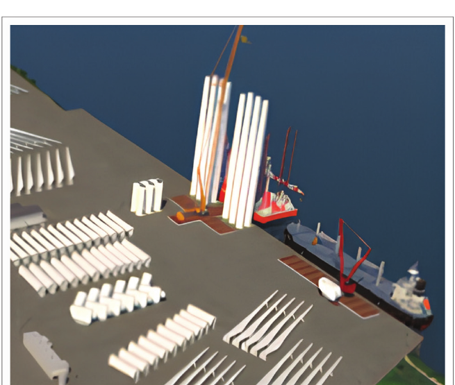
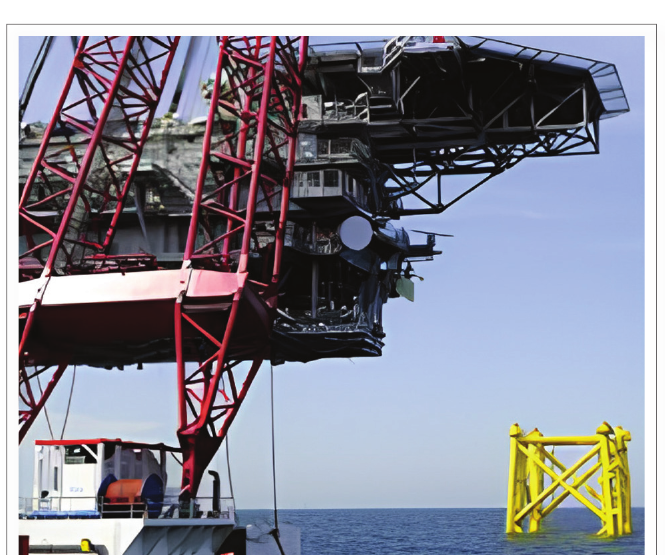
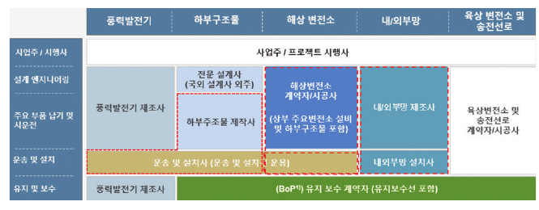

[English](index.qmd) | **한글**

해상풍력단지를 보면 가장 먼저 눈에 들어오는 것은 터빈이다.

당연하다. 바람을 전기로 바꾸는 장치가 터빈이고, 바다 위에서 가장 눈에 띄는 것도 터빈이다.

그런데 터빈이 잘 작동한다고 해서 해상풍력 사업이 성공하는 것은 아니다.

터빈은 해저지반 위에 서거나 바다에 떠 있어야 한다. 파랑, 조류, 태풍, 부식과 반복하중을 견뎌야 한다. 수백에서 수천 톤에 이르는 부품을 보관하고, 운반하고, 들어 올리고, 조립해서 바다에 설치해야 한다. 설치가 끝난 뒤에는 검사와 유지보수를 위해 다시 접근할 수 있어야 한다. 항만, 선박, 기초, 지지구조물, 케이블, 인허가와 인증 체계가 모두 연결되어야 한다.

그래서 해상풍력을 조금 다르게 볼 필요가 있다.

> **해상풍력은 해양 인프라 위에 세워지는 에너지 산업이다.**

토목기술자에게 이 관점은 중요하다. 어디서부터가 우리의 공학 문제이고 어디까지가 우리의 역할인가를 다시 생각하게 하기 때문이다.

이 글은 2025년 9월 대한토목학회지에 게재한 「토목건설인을 위한 해상풍력 시장 내비게이션」의 내용을 바탕으로 그 공학적 의미를 다시 풀어본 것이다.

## 터빈이 육지를 떠나는 순간 공학 문제가 달라진다

육상 구조물도 불확실한 지반과 시공조건, 환경하중을 받는다. 바다에서는 여기에 몇 가지 조건이 동시에 더해진다.

해저지반은 약하거나 공간적으로 크게 달라질 수 있다. 구조물은 파랑, 조류, 폭풍해일, 염수와 해양생물의 영향을 받는다. 시공과 유지관리는 기상과 작업 가능 시간에 제약을 받는다. 현장에 접근해서 작업하는 것 자체가 특수선박과 대형 인양장비를 필요로 한다.

따라서 해상풍력을 발전설비에 기초 하나를 붙이는 문제로 보면 곤란하다.

지지구조물, 기초, 해양환경, 설치방법, 항만 물류와 유지관리 전략은 처음부터 서로 영향을 준다.

구조적으로 효율적이어도 제작이나 설치가 어려우면 경제적인 구조가 아닐 수 있다. 해석상 성능이 좋은 기초라도 필요한 설치선박을 확보할 수 없다면 현실적인 대안이 아니다. 운전 성능이 좋은 터빈도 유지관리 접근성이 나쁘면 실제 가동률이 떨어질 수 있다.

결국 우리가 설계해야 할 대상은 터빈 하나가 아니다.

**해상풍력 전체 시스템**이다.

## 고정식과 부유식은 토목공학의 문제 자체를 바꾼다

원문에서는 해상풍력 지지구조를 크게 고정식과 부유식으로 나누었다.

비교적 얕은 수심에서는 모노파일, 재킷, 중력식 기초와 같은 고정식 지지구조가 주로 검토된다. 원문에서는 논의를 위한 실무적 기준으로 약 50 m의 수심을 사용했지만, 이것을 보편적인 경계로 보아서는 안 된다.

고정식에서는 해저지반 조사와 지반특성 평가, 기초 설계, 말뚝 항타와 기초 시공, 구조동역학, 파랑-구조물 상호작용, 피로와 반복하중, 세굴과 해저지반 거동, 운송 및 설치계획 등이 중요하다.

수심이 깊어지면 스파, 반잠수식, 인장각식 플랫폼과 같은 부유식 구조가 대안이 된다. 이때는 부력, 계류, 연성운동, 유체동역학 응답과 과도하중이 더욱 중요해진다.

여기서 중요한 것은 고정식과 부유식의 차이가 단순히 수심의 차이가 아니라는 점이다. **전체 시스템의 역학이 바뀐다.**

고정식에서는 해저지반과 기초가 구조물을 주로 구속한다. 부유식에서는 부력, 정수력 복원력과 계류시스템이 위치를 유지하고 플랫폼 자체는 움직일 수 있다.

구조물이 뜬다고 해서 토목공학이 사라지는 것이 아니다.

**역학이 달라질 뿐이다.**

## 해상풍력에서는 따로 배운 분야들이 한 문제 안에서 만난다

토목공학 교육은 구조, 지반, 수리, 시공, 교통 등으로 나누어 배운다. 기본 원리를 배우기에는 좋은 방법이다.

문제는 해상풍력은 그다지 이런 구분을 따라가지는 않는다는 것이다.

$$
\boxed{
\text{지반}+\text{구조}+\text{파랑}+\text{동역학}+\text{시공}+\text{운영}
}
$$

기초 강성이 변하면 구조물의 고유진동수가 변한다. 고유진동수는 동적 응답과 피로에 영향을 준다. 설치방법은 구조 형상과 제작방법을 제한한다. 유체력은 수중 구조물의 형상에 따라 달라진다. 유지관리 전략은 접근성과 선박 운용조건에 영향을 받는다.

각 전문분야는 여전히 존재한다. 그러나 **공학적 의사결정은 서로 연결되어 있다.**

## 항만도 해상풍력 구조시스템의 일부다

해상풍력이 해안선에서 시작한다고 생각하기 쉽다. 실제로는 가장 까다로운 시공 문제 중 상당수가 항만에서 시작된다.

{#fig-port fig-align="center" width="82%"}

[-@fig-port]를 보면 안벽과 야드의 지지력, 대형 부품의 이동동선, 사전조립 공간, 대형 운송장비의 회전공간, 설치선박 접안을 위한 수심과 인양공간이 모두 설계조건이 된다.

결국 항만은 공학 시스템 바깥의 물류시설이 아니라 **시스템 안에 있는 인프라**다.

## 설치를 생각하면 '좋은 구조'의 의미도 달라진다

구조공학에서는 최종 설치상태를 중심으로 구조물을 생각하기 쉽다. 해상시공에서는 그것만으로 부족하다.

지지구조물은 최종 위치에 도달하기 전에 인양, 운송, 세우기, 하강, 항타, 임시지지, 연결 등의 단계를 거친다. 경우에 따라서는 이러한 과도단계가 설계를 지배하기도 한다.

{#fig-installation fig-align="center" width="78%"}

[-@fig-installation]가 보여주는 공학적 의미는 간단하다.

> **시공성은 구조설계가 끝난 뒤 확인하는 조건이 아니다. 처음부터 설계조건의 하나다.**

## 설치가 끝나도 프로젝트는 끝나지 않는다

해상풍력의 인프라 문제는 운영과 유지관리까지 이어진다.

검사와 보수를 하려면 먼 바다에 있는 구조물에 접근해야 한다. 작업선, 서비스 선박, 유지관리 항만, 접안시설, 예비부품 물류와 기상조건이 모두 가동률에 영향을 준다.

토목기술자의 역할은 설계하중에 견디는 구조물을 만드는 것으로 끝나지 않는다.

구조물은 수명 동안 **검사할 수 있고, 유지관리할 수 있고, 운영할 수 있어야 한다.**

이는 단순한 구조성능이 아니라 생애주기 성능의 문제다.

## 제도 역시 공학의 인터페이스다

2025년 9월의 원문에서는 2025년 3월 공포된 해상풍력 특별법을 중요한 제도 변화로 다루었다. 개발사업자가 개별적으로 입지를 발굴하던 방식에서 정부의 계획입지, 경쟁적 사업자 선정과 인허가 조정의 역할이 커지는 방향을 설명했다.

다만 법과 제도는 시간에 따라 변한다. 따라서 이 내용은 **2025년 원문에서 설명한 당시 제도의 스냅샷**으로 보아야 하며, 2026년 현재 모든 세부내용이 그대로라는 의미는 아니다.

공학적으로 중요한 것은 행정절차 그 자체가 아니다. 제도적 경계에 따라 누가 구조물을 검토하는지, 어떤 기준을 적용하는지, 언제 승인을 받아야 하는지, 안전성을 어떤 자료로 입증해야 하는지가 달라진다.

## 감리와 인증은 같은 일이 아니다

감리와 인증은 모두 품질과 안전을 확보하기 위한 활동이므로 얼핏 보면 비슷해 보인다. 그러나 질문이 다르다.

$$
\begin{aligned}
\text{감리:} &\quad \text{제대로 시공했는가?} \\
\text{인증:} &\quad \text{설계와 시스템이 요구기준을 만족하는가?}
\end{aligned}
$$

감리는 현장의 시공과 계약·법적 요구사항을 확인하는 데 초점이 있다. 인증은 IEC나 DNV와 같은 국제표준 및 인증체계를 활용하여 설계와 시스템이 정해진 기술기준을 만족하는지 독립적으로 검증한다.

둘 다 필요하지만 역할이 불명확하면 중복이 생길 수 있다. 국내 건설품질관리 체계와 국제 인증체계 사이의 인터페이스가 공학관리 문제이기도 한 이유다.

## 시장은 지지구조물보다 훨씬 크다

{#fig-industry-chain fig-align="center" width="95%"}

[-@fig-industry-chain]에서 중요한 것은 토목기술자가 자신의 역할을 너무 좁게 정의할 필요가 없다는 점이다.

시장을 '기초를 설계하는 일'로만 정의하면 기회가 작아 보인다. 반대로 공학 대상을 **해상 인프라의 전체 생애주기**로 보면 입지와 해저지반 조사, 지지구조물과 기초, 해상변전소, 항만과 조립장, 운송과 설치, 품질관리, BIM, 구조성능 평가, 검사와 유지관리, 해체까지 범위가 넓어진다.

토목기술자가 모든 일을 해야 한다는 뜻은 아니다. 핵심은 **육상 토목과 닮은 일만을 골라서 스스로 시장의 경계를 좁히지 말자는 것**이다.

## 어떤 역량이 달라져야 하는가?

기존 토목공학 지식을 버리는 것이 아니다. 구조역학, 지반공학, 시공, 재료, 수치해석과 인프라 계획은 여전히 핵심이다.

다만 해양환경과 유체-구조 상호작용, 해상시공 리스크, BIM·FEM·시뮬레이션을 포함한 디지털 설계와 시공, 국제 설계기준과 인증절차에 대한 이해가 확장되어야 한다.

이들을 관통하는 요구조건은 하나다.

> **토목기술자는 자신이 맡은 부품만이 아니라 시스템을 이해해야 한다.**

국부적으로 완벽한 설계도 설치, 공급망, 인증, 유지관리 또는 인접 시스템과의 인터페이스를 무시하면 프로젝트 전체로는 좋지 않은 결정이 될 수 있다.

## 토목공학 교육은 무엇을 달리해야 할까?

전통적인 토목공학 과목을 버리고 완전히 새로운 교육과정을 만들자는 이야기는 아니다.

학생들은 여전히 역학, 구조해석, 지반공학, 유체역학, 시공, 재료와 수치해석을 배워야 한다.

문제는 그 과목들 사이의 **연결**이다.

$$
\text{파랑환경}
\rightarrow
\text{유체력}
\rightarrow
\text{구조응답}
\rightarrow
\text{기초 요구성능}
\rightarrow
\text{설치 및 피로 영향}.
$$

모든 토목기술자를 모든 분야의 전문가로 만들자는 것이 아니다. 각 분야 전문가들이 **같은 물리적 시스템과 같은 프로젝트 안에서 의사결정을 할 수 있을 정도의 교차영역 이해**를 갖추자는 것이다.

## 공학의 경계는 해안선이 아니라 프로젝트를 따라가야 한다

토목공학이 육상 중심으로 느껴지는 데에는 역사적 이유가 있다. 우리가 지금까지 만든 인프라의 대부분이 육상에 있었기 때문이다.

하지만 토목공학이 해안선에서 끝나야 할 역학적 이유는 없다.

해상풍력에는 기초, 구조물, 항만, 중량물 시공, 지반공학, 환경하중, 검사, 자산관리와 인프라 계획이 필요하다. 새로운 점은 이 문제들을 해양공학, 에너지 시스템, 인증, 공급망과 해상운영까지 연결해야 한다는 것이다.

그래서 질문은 '해상풍력이 토목공학의 영역인가?'가 아니다.

> **토목기술자는 해상풍력 프로젝트의 어디까지 책임질 준비가 되어 있는가?**

전기를 만드는 것은 터빈이다. 그러나 그 터빈을 제작하고, 설치하고, 운영하고, 유지관리하고, 언젠가 교체하거나 철거할 수 있게 만드는 것은 주변 인프라다.

그래서 해상풍력은 에너지 산업인 동시에 **새로운 토목·해양 인프라 산업**으로 보아야 한다.

## 원문

이 글은 다음 글을 바탕으로 작성했다.

지광습 (2025). **「토목건설인을 위한 해상풍력 시장 내비게이션」**, 『대한토목학회지』, 제73권 제9호, 2025년 9월, pp. 14-16.

위의 제도 관련 내용은 2025년 9월 원문의 시간적 맥락을 그대로 유지한 것이며, 2026년 현재의 법·제도 업데이트를 의미하지 않는다.
