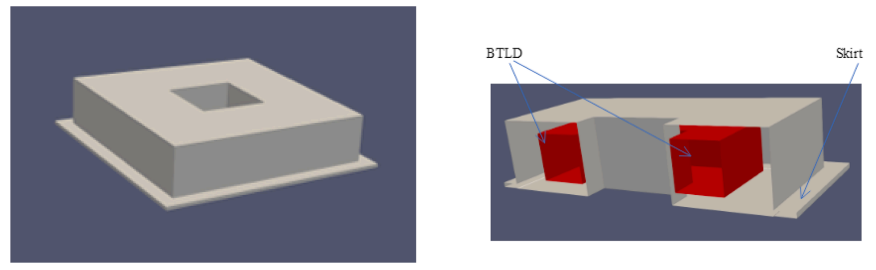
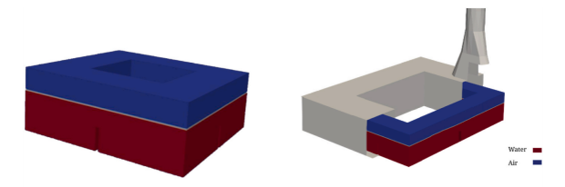
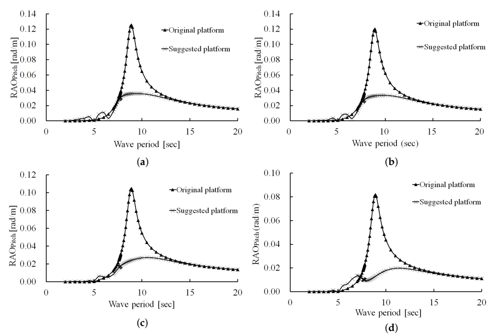
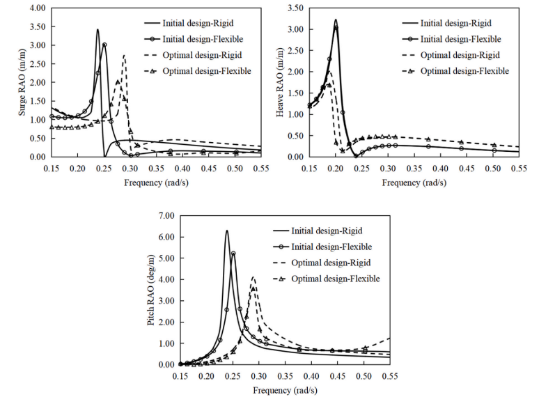
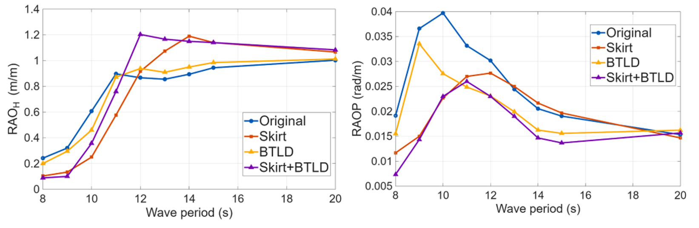

[English](index.qmd) | **한글**

부유식 해상풍력터빈의 운동을 줄이는 방법을 생각하면 보통 능동제어를 먼저 떠올리기 쉽다.

센서를 달고 운동을 측정한 뒤 액추에이터를 구동해서 반대 방향의 힘을 만드는 방식이다.

그런데 바다에서는 이야기가 조금 달라진다.

센서, 액추에이터, 전원, 제어장치와 구동부가 늘어나면 유지관리해야 할 대상도 늘어난다. 해상에서 유지관리는 곧 비용이다.

그래서 자연스럽게 이런 질문이 생긴다.

> **구동장치 없이도 부유체의 운동을 줄일 수 있을까?**

가능하다.

핵심은 운동을 직접 억지로 막는 것이 아니라 **부유체 전체의 동역학을 바꾸는 것**이다.

주파수영역 운동방정식을 간단히 쓰면

$$
\left[
-\omega^2(\mathbf{M}+\mathbf{A})
+i\omega\mathbf{B}
+\mathbf{C}
\right]
\boldsymbol{\xi}
=
\mathbf{F}_{\mathrm{wave}}
$$

이다.

여기서 $\mathbf{M}$은 구조물 질량, $\mathbf{A}$는 부가질량, $\mathbf{B}$는 감쇠, $\mathbf{C}$는 복원강성, $\mathbf{F}_{\mathrm{wave}}$는 파랑 가진력이다.

패시브 제어장치는 파랑을 직접 상쇄할 필요가 없다.

대신

$$
\mathbf{A},
\qquad
\mathbf{B},
\qquad
\mathbf{C}
$$

를 바꾸거나, 부유체와 상호작용하는 새로운 동적 시스템을 하나 더 만들 수 있다.

결국 패시브 운동제어에는 여러 경로가 있다.

{#fig-overview fig-align="center" width="85%"}

## 전략 1: 다른 질량이 움직이게 한다

가장 익숙한 패시브제어 개념은 구조진동제어에서 온다.

구조물의 일반화 변위를 $x$라고 하자.

구조물에 대해 상대적으로 움직일 수 있는 보조 질량을 두면 그 질량의 관성력이 구조물 운동을 반대하는 방향으로 작용할 수 있다.

동조질량감쇠기(TMD)는 고체 질량을 사용한다.

**동조액체감쇠기(TLD)** 는 물을 사용한다.

플랫폼이 움직이면 액체가 출렁인다.

액체운동이 잘 조율되어 있다면 그 운동이 만드는 힘 또는 모멘트가 플랫폼 운동과 유리한 위상관계를 갖게 된다.

즉,

$$
\text{플랫폼 피치}
\rightarrow
\text{액체 슬로싱}
\rightarrow
\text{반대방향 모멘트}
$$

가 된다.

제어력은 외부 액추에이터가 아니라 액체 자체에서 나온다.

## 왜 기계식 질량 대신 액체를 쓰는가?

액체는 해상환경에서 몇 가지 장점이 있다.

별도의 구동장치 없이도

- 관성,
- 중력에 의한 복원력,
- 점성에 의한 에너지 소산,
- 충돌 및 슬로싱 손실

을 동시에 활용할 수 있다.

우리 연구에서는 두 수평방향으로 액체가 움직일 수 있는 **양방향 동조액체감쇠기(BTLD)** 를 검토했다.

{#fig-btld fig-align="center" width="80%"}

[-@fig-btld]에서 중요한 단어는 **동조**다.

액체가 그냥 움직이면 되는 것이 아니다.

줄이고 싶은 플랫폼 운동과 액체의 고유 슬로싱 거동이 적절히 상호작용해야 한다.

## 핵심은 단순한 감쇠가 아니라 위상이다

패시브 운동제어를 흔히 “감쇠를 더하는 것”이라고 설명한다.

하지만 동조시스템에서는 **위상관계**가 핵심이다.

플랫폼 피치가

$$
\theta(t)=\Theta\sin\omega t
$$

라고 하자.

액체가 만드는 모멘트를

$$
M_{\mathrm{liq}}(t)=M_0\sin(\omega t-\phi)
$$

라고 하면, 위상차 $\phi$가 적절할 때 액체가 만드는 모멘트가 피치를 유발하는 가진을 반대하는 방향으로 작용할 수 있다.

그래서 액체 깊이, 탱크 크기, 내부 배플의 설계가 중요하다.

초기 BTLD 연구에서는 파주기와 설정조건에 따라 최적화된 BTLD가 피치운동을 약 **10–30%** 줄였다.

이후 BTLD와 양방향 동조액주감쇠기(BTLCD), 그리고 플랫폼 형상을 함께 비교한 연구에서는 최적 조합에서 약 **20–40%**의 운동저감이 나타났다.

중요한 것은 숫자 자체가 아니다.

**플랫폼과 감쇠기를 하나의 연성 동적 시스템으로 봐야 한다는 점**이 핵심이다.

## 전략 2: 부유체 자체를 바꾼다

별도의 감쇠장치를 추가하지 않고도 운동을 줄이는 방법이 있다.

> **부유체의 형상을 바꾸는 것이다.**

가장 순수한 형태의 패시브 운동제어라고 볼 수 있다.

형상이 바뀌면

- 배수체적,
- 수선면 형상,
- 부심,
- 질량분포,
- 관성모멘트,
- 정수력 복원특성,
- 부가질량,
- 방사감쇠,
- 파랑 회절

이 달라진다.

즉,

$$
\text{형상}
\rightarrow
\text{유체동역학 계수}
\rightarrow
\text{동적 응답}
$$

이다.

구조물 자체가 제어장치가 되는 셈이다.

## 바지형 부유체가 반드시 단순한 상자일 필요는 없다

바지형 부유식 플랫폼은 형상이 단순하고 흘수가 비교적 얕다는 장점이 있다.

하지만 단순한 직육면체가 유체동역학적으로 최적이라는 뜻은 아니다.

그래서 우리는 다음과 같은 형상변화를 검토했다.

- 팔각형 문풀,
- 수평 스커트,
- 사다리꼴 외벽.

여기서 중요한 조건은 기준 플랫폼의 질량을 유지했다는 점이다.

그렇지 않으면 운동저감이 단순히 재료를 더 넣은 결과인지 구분하기 어렵기 때문이다.

질문은 이것이었다.

> **같은 정도의 구조 자원을 더 영리하게 배치할 수 있는가?**

## 스커트는 플랫폼과 함께 움직여야 하는 물을 바꾼다

부유체에 수평 스커트를 붙여보자.

플랫폼이 움직이면 스커트는 주변의 더 많은 물을 함께 가속시켜야 한다.

플랫폼 입장에서는 이것이 추가적인 관성처럼 보인다.

운동방정식에서는 **부가질량 증가**로 나타난다.

$$
\mathbf{M}_{\mathrm{eff}}
=
\mathbf{M}
+
\mathbf{A}
$$

$\mathbf{A}$가 커지면 시스템의 동특성이 바뀐다.

스커트는 방사와 회절특성도 바꾼다.

점성유동에서는 스커트 끝단에서

- 유동박리,
- 와류방출,
- 점성에너지 소산

도 발생할 수 있다.

따라서 스커트는 단순히 구조면적을 추가하는 것이 아니다.

**유체-구조 상호작용 자체를 바꾼다.**

## 스커트는 크다고 무조건 좋은 것이 아니다

연구에서 흥미로운 결과 중 하나는 스커트 크기를 계속 키워도 효과가 비례해서 증가하지 않는다는 점이었다.

공학적으로 자연스럽다.

목표는

> **스커트를 가능한 크게 만드는 것**

이 아니라,

> **필요한 유체동역학 효과를 만들 만큼 충분히 크게 만드는 것**

이다.

지배 메커니즘이 포화되면 재료를 더 넣어도 추가효과는 점점 줄어든다.

스커트의 **위치** 역시 중요했다.

바지형 플랫폼 연구에서는 스커트 위치만 바꾸어도 운동응답이 크게 달라질 수 있었다.

즉 형상설계는 구조상세가 아니라 유체동역학과 함께 결정해야 한다.

## 문풀 안의 물도 하나의 동적 시스템이다

문풀 내부의 물도 플랫폼에 대해 상대적으로 움직일 수 있다.

이 내부 유체는

- 피스톤형 수직운동,
- 슬로싱형 수평운동

과 같은 고유 거동을 갖는다.

여기서도 다시 위상이 중요하다.

내부 유체운동이 구조물 운동과 유리한 위상관계를 가지면 운동저감에 기여할 수 있다.

반대로 두 시스템이 불리한 공진관계에 가까워지면 운동이 증폭될 수도 있다.

즉,

$$
\boxed{
\text{패시브장치는 운동을 줄일 수도 있고 키울 수도 있다}
}
$$

이는 패시브제어의 근본적인 한계다.

## 형상만 바꾸어도 운동은 크게 달라졌다

스커트, 문풀, 사다리꼴 플랫폼 형상을 함께 최적화한 결과, 최적화된 바지형 플랫폼은 원래의 직사각형 플랫폼보다 운동이 크게 줄었다.

연구에서는 조사한 조건에서 대략

- **히브 약 20% 감소**,
- **피치 최대 70% 감소**

를 보고했다.

문풀 면적을 약

$$
400~\mathrm{m^2}
$$

까지, 즉 플랫폼 표면적의 약 10% 정도까지 늘렸을 때도 추가적인 운동저감이 나타났으며 이후에는 효과가 점차 포화되었다.

{#fig-barge-geometry fig-align="center" width="90%"}

[-@fig-barge-geometry]의 공학적 의미는 분명하다.

> **부유체 형상은 하중을 전달하는 껍데기만이 아니다. 파랑과 어떤 유체동역학 시스템을 만드는지를 결정한다.**

## 전략 3: 질량분포와 복원특성을 최적화한다

같은 원리는 전혀 다른 부유체인 스파에도 적용된다.

스파는 깊은 흘수와 낮은 무게중심으로 피치 안정성을 확보한다.

따라서 운동은

- 직경,
- 흘수,
- 밸러스트 분포,
- 무게중심,
- 세장비

에 민감하다.

OC3 스파 최적화 연구에서는 총 부유체 질량과 배수체적을 고정한 채 형상변수만 바꾸었다.

그래서 비교가 깔끔하다.

$$
\text{같은 질량}
\quad+\quad
\text{다른 형상}
\quad\Rightarrow\quad
\text{다른 동역학}
$$

## 스파에서는 질량 자체보다 어디에 놓느냐가 더 중요할 수 있다

최적화 과정에서는 하부 원통 직경, 흘수, 벽두께, 밸러스트 배치를 바꾸었다.

최종 설계에서는 하부 직경이 약

$$
9.4~\mathrm{m}
$$

에서

$$
12.0~\mathrm{m}
$$

로 증가하고, 흘수는

$$
120~\mathrm{m}
$$

에서 약

$$
76.9~\mathrm{m}
$$

로 감소했다.

조사한 파랑조건에서 최적화된 강체모델의 RAO 피크는 약

- **surge 20.45% 감소**,
- **heave 37.44% 감소**,
- **pitch 34.57% 감소**

를 보였다.

유연체 모델에서는 약

- **surge 33.10% 감소**,
- **heave 44.35% 감소**,
- **pitch 31.85% 감소**

였다.

{#fig-spar fig-align="center" width="90%"}

[-@fig-spar]가 보여주는 또 하나의 원리는 이렇다.

> **패시브제어는 꼭 무언가를 추가하는 일이 아니다. 이미 있는 질량과 부력을 더 좋은 위치에 배치하는 것일 수도 있다.**

## 구조 유연성도 에너지를 흡수한다. 그러나 공짜는 아니다

스파 연구에서는 강체운동뿐 아니라 유탄성 응답도 검토했다.

흥미롭게도 유연체 모델은 대응되는 강체모델보다 강체운동이 다소 작게 나타나는 경향을 보였다.

하나의 물리적 해석은 파랑에너지가 모두 강체운동으로 가지 않고 일부가 구조변형으로 들어간다는 것이다.

그러나 이것을 공짜 감쇠라고 보면 안 된다.

구조변형으로 들어간 에너지는

- 응력,
- 피로손상,
- 국부 구조수요

를 만들 수 있다.

따라서

$$
\text{강체운동 감소}
\not\Rightarrow
\text{구조성능 자동 개선}
$$

이다.

대형 부유구조물의 최적화에서는 운동저감과 구조건전성, 피로를 결국 함께 봐야 한다.

## 전략 4: 서로 다른 패시브 메커니즘을 결합한다

자연스럽게 다음 질문이 나온다.

> **서로 다른 패시브 메커니즘을 함께 쓰면 어떨까?**

최근 연구에서는

1. 내부 BTLD,
2. 외부 수평 스커트

를 결합했다.

두 장치는 작동 원리가 다르다.

BTLD는 주로

$$
\text{내부 유체동역학}
+
\text{위상제어된 반대방향 모멘트}
+
\text{에너지 소산}
$$

을 통해 작동한다.

스커트는 주로

$$
\text{부가질량}
+
\text{변화된 회절/방사}
+
\text{점성 유동효과}
$$

를 통해 작동한다.

따라서 둘은 상호보완적일 수 있다.

## 내부제어와 외부제어는 역학적으로 다르다

### 플랫폼 내부

BTLD는 물이 구조물에 대해 상대운동을 하도록 하여 동역학을 바꾼다.

에너지는 내부 액체운동으로 전달되고 슬로싱과 점성효과를 통해 소산된다.

### 플랫폼 외부

스커트는 주변 바닷물이 구조물과 함께 또는 구조물 주위에서 어떻게 움직여야 하는지를 바꾼다.

부가질량, 방사, 회절, 유동박리와 와류방출이 달라진다.

즉 하나의 운동에 대해 두 개의 다른 물리적 경로를 동시에 건드리는 것이다.

$$
\boxed{
\text{내부 슬로싱}
+
\text{외부 유체동역학}
}
$$

## 결합효과는 특히 피치에서 컸다

BTLD-스커트 결합 연구에서는 네 가지 구성을 비교했다.

- 기본 플랫폼,
- BTLD만 적용,
- 스커트만 적용,
- BTLD + 스커트.

설계된 스커트는

$$
L=4~\mathrm{m}
$$

이고 잠김깊이는

$$
d=10~\mathrm{m}
$$

였다.

결합시스템은 조사한 파주기 범위에서 매우 작은 피치 RAO를 보였다.

최소 피치 RAO는 파주기 8 s에서 약

$$
0.007
$$

이었고, 전체 분석범위에서 피치 RAO는 대략 0.026 이하를 유지했다.

{#fig-combined fig-align="center" width="95%"}

[-@fig-combined]는 이 연구 시리즈에서 패시브 운동제어 효과를 가장 분명하게 보여준다.

하지만 동시에 중요한 한계도 보여준다.

## 한 운동을 줄이면 다른 운동이 커질 수도 있다

히브 응답은 피치처럼 단순하게 감소하지 않았다.

스커트는 짧거나 중간 정도의 파주기에서는 히브를 줄였다.

하지만 대략

$$
T=12\text{--}14~\mathrm{s}
$$

부근에서는 스커트 및 결합구성이 기본 플랫폼보다 더 큰 히브응답을 만들기도 했다.

긴 주기에서는 BTLD가 히브에 미치는 영향이 작았다.

이 결과는 매우 중요하다.

패시브장치는 운동을 단순히 빼는 장치가 아니다.

**시스템의 동역학을 바꾸는 장치다.**

부가질량, 감쇠, 복원력 또는 내부 공진을 바꾸면 전체 주파수응답이 달라진다.

따라서

> **어떤 운동 하나를 크게 줄이는 장치가 다른 주파수영역의 다른 운동을 키울 수도 있다.**

그래서 패시브제어 설계는 반드시 주파수 의존성을 보아야 한다.

## 패시브제어는 결국 공진 문제다

단자유도 시스템을 생각해 보자.

$$
m\ddot{x}
+
c\dot{x}
+
kx
=
F_0\sin\omega t
$$

응답은 가진주파수 $\omega$와 고유진동수

$$
\omega_n=\sqrt{\frac{k}{m}}
$$

의 관계에 크게 좌우된다.

패시브적인 형상변경이나 부가장치는

$$
m,
\qquad
c,
\qquad
k
$$

를 바꾸거나 새로운 고유진동수를 추가한다.

따라서

- 공진피크를 낮추고,
- 공진 위치를 이동시키고,
- 응답대역을 넓히고,
- 새로운 연성모드를 만들고,
- 주파수영역별로 서로 다른 효과

를 만들 수 있다.

그러므로

> “운동을 줄이는가?”

만 묻는 것은 부족하다.

더 좋은 질문은

> **어떤 운동을, 어떤 주파수에서, 어떤 물리적 메커니즘으로 줄이는가?**

이다.

## 세 가지 패시브 설계 철학

여러 연구를 역학적으로 정리하면 세 가지 전략으로 볼 수 있다.

### 1. 주구조를 바꾼다

예:

- 스파 직경,
- 흘수,
- 밸러스트 분포,
- 바지 외벽 경사,
- 문풀 크기.

부유체 자체의 고유 동역학을 바꾼다.

### 2. 보조 동적 시스템을 추가한다

예:

- BTLD,
- BTLCD.

보조시스템이 플랫폼에 대해 상대운동을 하면서 유리한 동적 반력을 만든다.

### 3. 유체-구조 상호작용을 바꾼다

예:

- 스커트,
- 유체동역학 부가물.

주변 물이 운동에 참여하는 방식과 정도를 바꾼다.

BTLD-스커트 결합개념은 두 번째와 세 번째 전략을 동시에 사용한 경우다.

## 공통된 메커니즘은 에너지 재분배다

형상은 매우 다르다.

깊은 흘수의 스파와 액체가 출렁이는 탱크는 전혀 닮지 않았다.

스커트와 밸러스트도 다르다.

그러나 역학적으로 보면 하나의 공통개념으로 묶을 수 있다.

파랑은 부유시스템에 에너지를 공급한다.

운동제어가 없으면 그 에너지의 상당부분이 플랫폼 운동으로 나타난다.

$$
E_{\mathrm{wave}}
\rightarrow
E_{\mathrm{platform\ motion}}
$$

패시브설계는 에너지의 경로를 바꾼다.

$$
E_{\mathrm{wave}}
\rightarrow
\begin{cases}
E_{\mathrm{rigid\ motion}}\\
E_{\mathrm{internal\ liquid}}\\
E_{\mathrm{radiated\ waves}}\\
E_{\mathrm{viscous\ dissipation}}\\
E_{\mathrm{elastic\ deformation}}
\end{cases}
$$

들어오는 파랑에너지를 없애는 것이 아니다.

터빈 성능에 가장 문제가 되는 운동으로 너무 많은 에너지가 가지 않도록 다른 경로를 설계하는 것이다.

## 왜 해상에서는 패시브제어가 매력적인가?

해상에서는 검사와 보수가 비싸다.

다음과 같은 시스템은 유지관리 대상이 늘어난다.

- 센서,
- 액추에이터,
- 상시 전원,
- 제어전자장치,
- 복잡한 기계식 구동부.

패시브시스템은 제어 메커니즘을

- 형상,
- 유체운동,
- 밸러스트,
- 유체동역학 상호작용

안에 포함시킬 수 있다.

물론 패시브시스템이 설계하기 쉽다는 뜻은 아니다.

오히려 주파수, 형상과 환경조건에 민감할 수 있다.

다만 잘 설계되면 지속적인 능동 개입 없이 작동한다는 장점이 있다.

## 이 연구들이 아직 증명하지 않은 것

이 결과들을 모든 부유식 해상풍력터빈에 적용되는 보편적인 성능값으로 해석해서는 안 된다.

각 연구는 서로 다른 수치모델과 단순화 가정을 사용했다.

초기 BTLD 연구는 주로 규칙파를 사용했고 플랫폼 유체동역학에 초점을 두었다.

스커트-사다리꼴 플랫폼 연구는 등가감쇠를 포함한 선형 회절해석을 사용했고 주로 플랫폼 응답을 평가했다.

스파 최적화 연구에서는 터빈과 계류시스템의 일부를 단순화했고 응력 및 피로를 포함한 완전한 최적화는 수행하지 않았다.

가장 최근의 BTLD-스커트 연구는 고정밀 CFD와 불규칙 JONSWAP 조건도 검토했지만 풍하중과 완전한 공력탄성 연성은 범위 밖이었다.

따라서

$$
70\%
$$

의 피치감소나

$$
20\text{--}40\%
$$

의 운동저감 같은 수치는 각 연구대상의 조건에서 얻어진 결과이지 보편적인 설계 보장값이 아니다.

더 일반적인 것은 그 아래의 역학이다.

## 결국 무엇을 설계하는가?

부유식 해상풍력터빈의 운동을 줄이기 위해 반드시 능동 액추에이터가 필요한 것은 아니다.

다음과 같은 것을 설계해도 운동은 달라진다.

- **무엇이 움직일 것인가,**
- **질량을 어디에 둘 것인가,**
- **내부 물이 어떻게 움직일 것인가,**
- **주변 바닷물이 어떻게 움직일 것인가,**
- **에너지가 어디에서 소산될 것인가.**

그래서 패시브 운동제어는 단순히 감쇠를 추가하는 문제가 아니다.

**부유시스템 전체의 동역학을 설계하는 문제**다.

결국 핵심은 이것이다.

> **운동을 억지로 막으려고만 하지 말고, 파랑에너지가 더 나은 곳으로 가게 만들어라.**

## Original research

**Saghi, H., & Zi, G. (2024).**  
*Pitch motion reduction of a barge-type floating offshore wind turbine substructure using a bidirectional tuned liquid damper.*  
*Ocean Engineering, 304*, 117717.  
https://doi.org/10.1016/j.oceaneng.2024.117717

**Saghi, H., Ma, C., & Zi, G. (2024).**  
*Bidirectional tuned liquid dampers for stabilizing floating offshore wind turbine substructures.*  
*Ocean Engineering, 309*, 118553.  
https://doi.org/10.1016/j.oceaneng.2024.118553

**Kim, H., Saghi, H., Jeon, I., & Zi, G. (2025).**  
*Stabilization of floating offshore wind turbines with a passive stability-enhancing skirted trapezoidal platform.*  
*Journal of Marine Science and Engineering, 13*, 1658.  
https://doi.org/10.3390/jmse13091658

**Ma, C., Lee, S., Zhu, X., & Zi, G. (2025).**  
*Design optimization of OC3 spar floater based on rigid motion and hydroelastic response.*  
*Ocean Engineering, 334*, 121543.  
https://doi.org/10.1016/j.oceaneng.2025.121543

**Kim, H., Saghi, H., & Zi, G. (2026).**  
*Numerical investigation of motion control of a barge-type floating offshore wind turbine using a bidirectional tuned liquid damper and a horizontal skirt.*  
*Ocean Engineering, 355*, 125130.  
https://doi.org/10.1016/j.oceaneng.2026.125130
