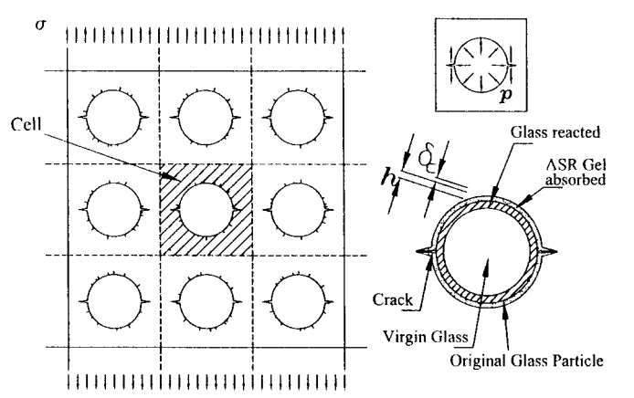
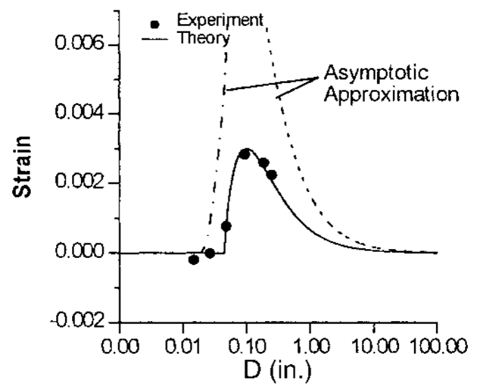
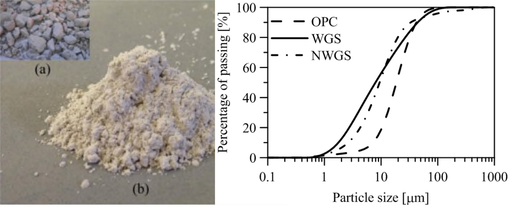
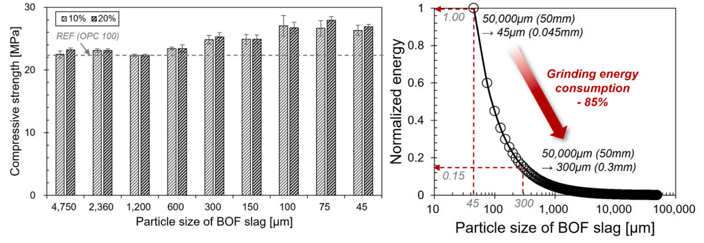

[English](index.qmd) | **한글**

폐기물에 화학적 반응성이 있다는 것은 얼핏 보면 좋은 일이다.

그런데 바로 그 반응성 때문에 콘크리트가 파괴될 수도 있다.

이 모순처럼 보이는 문제가 20년이 넘도록 내 연구의 한 흐름을 이어왔다.

시작은 2000년 무렵 폐유리에 관한 아주 단순한 질문이었다.

> **왜 반응성 폐유리 입자의 크기에 따라 콘크리트가 균열되기도 하고 그렇지 않기도 할까?**

당시 문제는 알칼리-실리카 반응(alkali-silica reaction, ASR)이었다. 골재로 사용한 폐유리가 콘크리트의 알칼리성 공극수와 반응하면 팽창성 반응생성물이 만들어지고 균열이 발생할 수 있다.

그런데 실험결과는 단순한

$$
\text{유리}
\rightarrow
\text{ASR}
\rightarrow
\text{손상}
$$

으로 설명되지 않았다.

입자크기가 결과를 바꾸었다.

유리 입자를 작게 만들자 처음에는 팽창에 의한 손상이 오히려 증가했다. 그런데 일정 크기 이하로 더 작아지자 경향이 반대로 바뀌었다. 충분히 미세해지면 결국 유해한 거시적 팽창이 사라졌다.

이 관찰을 계기로 Zdeněk P. Bažant, Christian Meyer 교수와 나는 이 문제를 파괴역학으로 살펴보았다.

그리고 20여 년이 지난 뒤, 놀랍게도 같은 역학이 **전로슬래그(basic oxygen furnace slag, BOF slag)** 연구에서 다시 나타났다.

화학반응은 달랐다. 폐기물도 달랐다.

하지만 핵심적인 역학 질문은 거의 같았다.

> **국부적인 팽창성 화학반응은 언제 거시적인 균열로 발전하는가?**

두 경우 모두 답을 좌우하는 중요한 변수는 **입자크기**였다.

---

## 이야기는 균열에서 시작했다

시멘트계 재료 속에 반응성 입자 하나가 들어 있다고 생각해 보자.

화학반응으로 입자 주위에 팽창성 생성물이 만들어지면 주변 재료를 밀어내는 압력이 생긴다.

과정은 다음과 같다.

$$
\text{화학반응}
\rightarrow
\text{팽창}
\rightarrow
\text{압력}
\rightarrow
\text{응력}
\rightarrow
\text{균열}.
$$

화학이 과정을 시작하지만, 실제 콘크리트에 균열이 생기는지는 역학이 결정한다.

{#fig-glass-fracture fig-align="center" width="85%"}

그림 [-@fig-glass-fracture]의 2000년 연구에서는 유리 입자를 모르타르로 둘러싸인 팽창 개재물(expanding inclusion)로 이상화하였다.

유리 표면 부근에서 ASR이 진행되고 팽창성 겔이 주변 시멘트계 재료에 압력을 가한다. 입자 주변에 이미 존재하던 결함은 이 압력 때문에 균열로 성장할 수 있다.

여기서 질문이 달라진다.

> 반응생성물이 얼마나 많이 만들어지는가?

만으로는 충분하지 않다.

> **그 반응으로 생긴 압력이 균열을 성장시킬 수 있는가?**

를 물어야 한다.

입자크기 효과를 이해하려면 이 구분이 핵심이다.

---

## 왜 입자크기가 중요한가?

처음에는 단순하게 생각할 수 있다.

입자가 작아지면 단위 질량당 표면적이 증가한다. 표면적이 증가하면 반응도 활발해질 것이다.

따라서

$$
\text{작은 입자}
\rightarrow
\text{더 많은 반응}
\rightarrow
\text{더 큰 팽창}
$$

이라고 예상하기 쉽다.

그런데 실험은 그렇게 나오지 않았다.

입자크기와 ASR 손상의 관계는 **비단조적(non-monotonic)**이었다.

유리 입자를 작게 만들수록 처음에는 팽창이 증가했다. 중간 크기에서 최대값이 나타났는데, 이것이 이른바 **pessimum size**다. 그런데 입자를 더 작게 만들자 팽창은 다시 감소했다.

2000년 연구의 촉진시험에서는 pessimum size가 대략 mm 규모에서 나타났고, 유리 입자가 충분히 미세해지면 유해한 팽창을 더 이상 관찰할 수 없었다.

{#fig-pessimum-size fig-align="center" width="85%"}

그림 [-@fig-pessimum-size]이 첫 번째 중요한 단서를 보여준다.

> **화학적 반응성과 구조적 손상은 같은 것이 아니다.**

---

## 서로 경쟁하는 두 가지 크기효과

입자가 작아지면 더 잘 반응할 수 있는데, 왜 충분히 작아지면 오히려 손상이 감소할까?

두 가지 메커니즘이 서로 경쟁하기 때문이다.

첫 번째는 화학적 효과다.

입자크기가 작아지면 반응 가능한 표면적이 증가한다.

$$
d\downarrow
\quad\Rightarrow\quad
\frac{A}{V}\uparrow
\quad\Rightarrow\quad
\text{반응 가능성}\uparrow.
$$

이 효과만 보면 반응은 증가한다.

하지만 두 번째 메커니즘이 있다.

균열이 성장하려면 팽창하는 입자로부터 충분한 에너지를 받아야 한다.

입자의 특성길이가 작아지면 팽창반응이 작용하는 공간적 크기도 작아진다. 따라서 개별 입자가 거시적 균열을 만들고 성장시키는 능력도 달라진다.

파괴역학적으로 보면 팽창에서 공급되는 에너지가 균열성장에 필요한 저항을 극복할 수 있는가의 문제다.

결국 입자크기는 동시에

$$
\boxed{\text{반응}}
$$

과

$$
\boxed{\text{파괴}}
$$

를 바꾼다.

그런데 이 두 효과의 크기 의존성이 같지 않다.

그래서 pessimum size가 존재할 수 있다.

---

## 반응이 많다고 손상이 큰 것은 아니다

이것이 오랫동안 기억에 남은 개념적인 결과였다.

반응성 입자의 크기를 줄이면 노출되는 표면이 많아져 화학반응은 더 활발해질 수 있다.

하지만 같은 양의 재료가 훨씬 많은 작은 입자로 나뉘면서 반응도 공간적으로 분산된다.

몇 개의 강한 국부 팽창원이 존재하던 상태가

$$
\boxed{\text{큰 입자}}
\rightarrow
\text{국부 팽창}
\rightarrow
\text{큰 국부 균열구동력}
$$

에서

$$
\boxed{\text{많은 미세입자}}
\rightarrow
\text{분산된 반응}
\rightarrow
\text{분산된 변형}
$$

으로 바뀔 수 있다.

화학반응이 사라진 것이 아니다.

달라진 것은 **그 화학반응이 재료의 역학에 들어오는 방식**이다.

이 차이가 결국 공학적 질문 자체를 바꾸었다.

---

## 유리를 충분히 미세하게 만들면 무엇이 달라질까?

유리 입자가 아주 작아지면 더 이상 이를 골재라고만 볼 필요가 없다.

분말처럼 거동하기 시작한다.

그러면 역할도 달라질 수 있다.

유리는 많은 양의 실리카를 포함하고 있으며 그 상당 부분이 비정질 상태다. 따라서 충분히 미세한 유리는 포졸란 반응에 참여할 수 있다.

이제 질문은

> 폐유리가 콘크리트를 손상시키지 않게 하려면 어떻게 해야 할까?

에서

> **이 반응성을 오히려 유용하게 사용할 수 없을까?**

로 바뀐다.

같은 재료가

$$
\text{유해할 수 있는 반응성 골재}
$$

에서

$$
\text{유용할 수 있는 시멘트계 혼화재}
$$

로 바뀌는 것이다.

그 경계를 좌우하는 중요한 변수가 바로 입자크기다.

---

## 폐유리 골재에서 폐유리 분말로

이후의 연구에서는 서로 다른 폐유리를 대상으로 이 아이디어를 반복해서 살펴보았다.

한 예가 유리 제조과정에서 발생하는 폐유리 슬러지다.

유리를 절단하고 연마할 때 생기는 미세한 유리분진은 물과 함께 씻겨 나간다. 폐수처리 과정에서는 유리입자를 분리하기 위해 침전첨가제를 사용하고, 그 결과 슬러지 케이크가 만들어진다.

이를 건조하고 분쇄하면 산업폐기물이 미세분말로 바뀐다.

{#fig-glass-sludge fig-align="center" width="85%"}

2016년 연구에서는 침전첨가제를 사용해 만든 폐유리 슬러지와 이러한 첨가제 없이 준비한 유리 슬러지를 비교했다.

예상하지 못했던 결과가 나왔다.

침전첨가제가 포함된 슬러지의 **포졸란 반응성이 더 높았다.**

폐수처리 과정은 단순히 유리를 분리한 것이 아니었다. 이후 재료의 거동까지 바꾸어 놓았다.

특히 폐수처리에 사용된 가성소다는 알칼리 활성화와도 관련된다.

콘크리트 성능과 무관해 보이던 산업공정의 이력이 결국 재료의 반응성 일부가 된 것이다.

여기서 또 하나의 중요한 점을 볼 수 있다.

> **폐기물의 성질은 현재의 화학조성만으로 정해지지 않는다. 그 폐기물이 지금까지 어떤 공정을 거쳐왔는지도 중요하다.**

2016년 연구는 이러한 내용을 초기 입자크기 연구와 연결했다. 폐유리를 콘크리트 혼화재로 유용하게 사용할 수 있는지를 좌우하는 핵심 변수 중 하나가 분말도였기 때문이다.

---

## 그 다음은 LCD 유리였다

이후 연구는 액정표시장치(LCD) 폐유리 분말로 이어졌다.

여기서도 핵심 질문은 비슷했다.

폐유리를 충분히 미세하게 만들었을 때 더 이상 유해한 반응성 골재가 아니라 콘크리트 성능에 기여하는 분말재료로 사용할 수 있는가?

연구는 포장용 콘크리트의 내구성, 초고성능 콘크리트(UHPC)의 역학적 성능과 인장거동, 그리고 알칼리 활성 재료까지 확장되었다.

중요한 것은 특정 폐유리 하나가 아니다.

연구의 흐름은

$$
\text{반응성 폐유리 골재}
\rightarrow
\text{입자크기 제어}
\rightarrow
\text{미세 반응성 분말}
\rightarrow
\text{유용한 결합재 성분}
$$

으로 바뀌었다.

처음에는 반응성을 억제하려 했다.

나중에는 그 반응성을 이용하려 했다.

---

## 20여 년 뒤, 같은 문제가 BOF 슬래그에서 다시 나타났다

BOF 슬래그는 폐유리와 화학적으로 전혀 다르다.

여기서 주요 팽창원은 ASR이 아니라 유리 산화칼슘(free CaO)의 수화반응이다.

$$
\mathrm{CaO + H_2O \rightarrow Ca(OH)_2}.
$$

이 반응은 고체 체적을 증가시키고, 구속된 시멘트계 재료 내부에서는 압력을 발생시켜 균열이나 파괴로 이어질 수 있다.

그런데 공학적으로 보면 익숙한 문제였다.

> 반응성 입자의 국부 팽창이 언제 균열을 만들 수 있는가?

다시 입자크기가 중요한 변수가 되었다.

큰 BOF 슬래그 입자는 국부적인 팽창원으로 작용할 수 있다. 반면 입자를 충분히 작게 만들면 반응과 변형이 더 넓게 분산되고 국부적인 균열구동력이 감소할 수 있다.

화학은 달랐지만 역학적 구조는 폐유리 연구와 놀랄 만큼 비슷했다.

---

## BOF 슬래그에서도 임계 입자크기가 나타났다

후속 BOF 슬래그 연구에서는 여러 입도 구간과 혼입률을 체계적으로 조사했다.

입자가 너무 크면 팽창과 균열, 팝아웃, 심한 경우 파괴가 발생했다.

입자크기를 줄이면 거동이 달라졌다.

특히 조사한 조건에서 낮은 혼입률에서는 약

$$
300~\mu\mathrm{m}
$$

이하의 범위에서 팽창손상을 훨씬 쉽게 제어할 수 있었다.

여기서 중요한 것은 300 $\mu$m라는 숫자 자체가 아니다.

**입자크기를 바꾸자 손상 메커니즘이 바뀌었다**는 점이다.

---

## 입자를 작게 만들면 강도에도 이점이 있었다

BOF 연구는 특히 유용한 비교를 제공했다.

입자크기가 감소할수록 28일 압축강도는 전반적으로 증가했고, 약 300 $\mu$m 이하에서 뚜렷한 향상이 나타났다.

이 범위는 낮은 혼입률에서 팽창이 안정화된 범위와도 대체로 일치했다.

하지만 목표 입자크기가 작아질수록 분쇄에너지는 급격히 증가한다.

Bond 법칙을 사용하면 상대적인 분쇄에너지는

$$
W
\propto
\frac{1}{\sqrt{d_p}}
-
\frac{1}{\sqrt{d_f}},
$$

로 나타낼 수 있다. 여기서 $d_f$는 투입입자의 크기, $d_p$는 목표 입자크기다.

{#fig-grinding-energy fig-align="center" width="90%"}

그림 [-@fig-grinding-energy]에서 보듯 연구에서 사용한 가정 아래 BOF 슬래그를 약

$$
300~\mu\mathrm{m}
$$

까지 분쇄하는 데 필요한 에너지는 45 $\mu$m까지 분쇄하는 데 필요한 추정에너지의 약 **15%**였다.

즉 초미분말 영역까지 더 분쇄하려면 불균형적으로 큰 추가 에너지가 필요하다.

역학적인 문제가 이미 제어되었다면 그 추가 분쇄가 공학적으로 큰 의미가 없을 수도 있다.

---

## 임계 입자크기는 슬래그 혼입률에 따라 달라진다

여기에는 중요한 조건이 하나 있다.

BOF 슬래그가 어떤 입자크기 이하이면 무조건 안전하다는 보편적인 기준은 없다.

입자크기와 혼입률이 서로 영향을 주기 때문이다.

슬래그 함량이 높으면 더 많은 반응성 입자가 동시에 존재하고, 반응생성물을 받아줄 주변 공극공간은 상대적으로 줄어든다.

따라서 같은 크기의 입자도 BOF 슬래그의 혼입률이 높아지면 더 큰 손상을 일으킬 수 있다.

2026년 연구에서 조사한 조건에서는 약 10% 혼입률에서

$$
300~\mu\mathrm{m}
$$

이하가 적절했지만, 혼입률이 20%에 가까워지면 약

$$
75~\mu\mathrm{m}
$$

정도까지 더 미세하게 분쇄할 필요가 있었다.

이 숫자들은 보편적인 설계한계가 아니다.

배합, 슬래그 특성, 유리 CaO 함량, 노출조건에 따라 달라진다.

하지만 더 일반적인 원칙 하나는 분명하다.

> **입자크기는 반응성 재료의 사용량과 함께 설계해야 한다.**

---

## 25년 동안 같은 질문을 하고 있었다

돌이켜보면 흥미로운 것은 연구가 폐유리에서 시작해 BOF 슬래그까지 왔다는 사실 자체가 아니다.

같은 질문이 형태만 바꾸어 계속 나타났다는 점이다.

2000년 무렵에는 이렇게 물었다.

> 왜 폐유리의 입자크기에 따라 ASR의 pessimum 거동이 나타나는가?

파괴역학은 화학반응만으로는 이 현상을 설명할 수 없다는 것을 보여주었다.

그 다음 질문은

> 충분히 미세한 폐유리를 단순히 허용하는 것을 넘어 유용하게 사용할 수 있을까?

로 바뀌었다.

그 질문은 폐유리 슬러지, LCD 유리분말, 내구성, UHPC, 알칼리 활성 결합재 연구로 이어졌다.

그리고 BOF 슬래그에서 다시 팽창성 입자 문제로 돌아왔다.

> 반응성 슬래그 입자를 얼마나 작게 만들어야 팽창이 더 이상 유해한 균열을 만들지 않을까?

마지막에는 이렇게 묻게 되었다.

> **그 변화를 만들기 위해 실제로 어느 정도까지 분쇄해야 할까?**

25년에 걸친 연구의 흐름을 정리하면 다음과 같다.

$$
\boxed{
\begin{aligned}
\text{반응성 입자}
&\rightarrow
\text{파괴역학}
\\
&\rightarrow
\text{입자크기 효과}
\\
&\rightarrow
\text{미세 반응성 분말}
\\
&\rightarrow
\text{유용한 시멘트계 재료}
\\
&\rightarrow
\text{입자크기 설계}.
\end{aligned}
}
$$

---

## 진짜 변수는 단순히 입자크기가 아니다

입자크기는 우리가 측정하고 제어할 수 있는 변수다.

하지만 역학적으로 보면 그보다 더 깊은 변화가 일어난다.

입자크기를 바꾸면 **화학반응의 공간적 분포**가 달라진다.

반응의 공간적 분포가 바뀌면 팽창의 분포가 달라진다.

팽창의 분포가 바뀌면 응력장이 달라진다.

그리고 응력장이 달라지면 균열이 발생하고 성장할 수 있는 조건이 달라진다.

결국 더 근본적인 연결은

$$
\boxed{
\text{입자크기}
\rightarrow
\text{반응의 국부화}
\rightarrow
\text{팽창의 국부화}
\rightarrow
\text{응력의 국부화}
\rightarrow
\text{파괴}.
}
$$

이다.

입자크기를 제어함으로써 유해한 재료를 유용한 재료로 바꿀 수 있는 이유가 여기에 있다.

---

## 폐기물 활용도 재료역학의 문제다

콘크리트에서 폐기물을 재활용한다고 하면 흔히 다음을 먼저 본다.

- 화학조성
- 치환율
- 압축강도
- 탄소저감
- 폐기물 처리량

모두 중요하다.

하지만 반응성 산업폐기물은 **역학 문제**이기도 하다.

어떤 재료에 화학적으로 불안정한 상이 들어 있다고 해서 그 재료를 사용할 수 없다는 뜻은 아니다.

공학적으로 물어야 할 것은 다음과 같다.

- 얼마나 빨리 반응하는가?
- 얼마나 팽창하는가?
- 반응은 어느 공간적 크기에서 일어나는가?
- 그 팽창이 어떤 응력장을 만드는가?
- 주변 매트릭스가 이를 받아낼 수 있는가?
- 그 반응이 균열을 성장시킬 수 있는가?
- 안정한 영역으로 이동시키려면 어느 정도의 가공이 필요한가?

여기서 재료화학과 파괴역학이 만난다.

---

## 가장 미세한 분말이 반드시 가장 좋은 분말은 아니다

혼화재 연구에서는 흔히 입자가 미세할수록 성능이 좋아진다고 생각한다.

어느 정도는 맞다.

미세한 입자는 표면적이 크고 충전효과를 높이거나 반응을 촉진할 수 있다.

하지만 공학적 최적화에서 질문은

$$
\text{얼마나 미세하게 만들 수 있는가?}
$$

가 아니다.

$$
\boxed{
\text{얼마나 미세하게 만들어야 하는가?}
}
$$

여야 한다.

유해한 손상 메커니즘을 억제할 수 있는 임계크기 아래로 내려갔다면, 그 이후의 추가 분쇄는 추가 에너지와 비용을 정당화할 만큼의 효과가 있어야 한다.

폐기물 활용의 목적이 지속가능성이라면 이 구분은 더욱 중요하다.

산업부산물을 사용한다고 자동으로 지속가능한 것은 아니다. 사용하기 위해 불필요하게 많은 가공에너지를 써야 한다면 이야기가 달라진다.

---

## 연구의 한계

여기서 언급한 수치적 임계값을 한 폐기물이나 배합에서 다른 재료로 그대로 옮겨서는 안 된다.

2000년 폐유리 결과는 특정 촉진시험 조건과 특정 유리-콘크리트 시스템의 ASR을 대상으로 했다.

후속 폐유리 연구들도 서로 다른 유리 원료, 가공이력, 입자크기, 결합재 시스템, 양생조건을 사용했다.

BOF 슬래그 연구 역시 특정 슬래그를 사용했고, 정해진 촉진팽창 조건에서 혼입률 10%와 20%를 평가했다.

따라서 그 입자크기 임계값은 BOF 슬래그 전체에 적용되는 보편적인 한계값이 아니라 조사한 시스템의 결과다.

분쇄에너지 비교 역시 완전한 산업 규모의 전과정평가나 경제성 분석이 아니라 이상화한 Bond 법칙에 기반한 추정이다.

그래서 더 일반적인 결론은

$$
300~\mu\mathrm{m}
$$

이라는 숫자가 아니다.

그 숫자를 만들어낸 **역학**이다.

---

## 결국 핵심은

반응성 폐기물 입자는 반응이 충분히 국부화되어 균열을 성장시킬 수 있을 때 유해하다.

같은 재료도 충분히 미세해지면 반응이 더 작은 공간 규모에 분산되고 시멘트계 시스템의 유용한 구성재료가 될 수 있다.

그래서

$$
\text{폐기물 골재}
\rightarrow
\text{반응성 분말}
$$

이라는 변화가 공학적 성능을 완전히 바꿀 수 있다.

폐유리에서 얻은 교훈은 결국 BOF 슬래그를 이해하는 데도 유용했다.

실용적인 결론은

> 반응성 폐기물을 가능한 한 미세하게 분쇄하라.

가 아니다.

> **국부 손상을 분산된 반응으로 바꾸는 데 필요한 만큼만 분쇄하라.**

이다.

BOF 슬래그에 대해서는 더 간단하게 말할 수 있다.

> **BOF 슬래그를 가능한 한 곱게 갈 필요는 없다. 필요한 만큼만 갈면 된다.**

---

## Original research

**Bažant, Z. P., Zi, G., & Meyer, C. (2000).**  
*Fracture mechanics of ASR in concretes with waste glass particles of different sizes.*  
*Journal of Engineering Mechanics, 126*(3), 226–232.  
DOI: 10.1061/(ASCE)0733-9399(2000)126:3(226)

**You, I., Choi, J., Lange, D. A., & Zi, G. (2016).**  
*Pozzolanic reaction of the waste glass sludge incorporating precipitation additives.*  
*Computers and Concrete, 17*(2), 255–269.  
DOI: 10.12989/cac.2016.17.2.255

**You, I., Zi, G., Yoo, D.-Y., & Lange, D. A. (2019).**  
*Durability of concrete containing liquid crystal display glass powder for pavement.*  
*ACI Materials Journal, 116*(6), 87–97.  
DOI: 10.14359/51716814

**Yoo, D.-Y., You, I., & Zi, G. (2021).**  
*Effects of waste liquid-crystal display glass powder and fiber geometry on the mechanical properties of ultra-high-performance concrete.*  
*Construction and Building Materials, 266*, 120938.

**You, I., Lee, Y., Yoo, D.-Y., & Zi, G. (2022).**  
*Influence of liquid crystal display glass powder on the tensile performance of ultra-high-performance fiber-reinforced concrete.*  
*Journal of Building Engineering, 57*, 104901.  
DOI: 10.1016/j.jobe.2022.104901

**You, I., Yoo, D.-Y., Lee, S.-J., Lee, Y., & Zi, G. (2023).**  
*A combination of liquid-crystal display glass powder and slag in alkali-activated material.*  
*Construction and Building Materials, 369*, 130527.  
DOI: 10.1016/j.conbuildmat.2023.130527

**Lee, Y., Seo, S., Yi, C., Lee, S.-H., & Zi, G. (2026).**  
*Governing role of particle size in expansion of cement composites incorporating basic oxygen furnace slag.*  
*Case Studies in Construction Materials, 25*, e06428.  
DOI: 10.1016/j.cscm.2026.e06428
