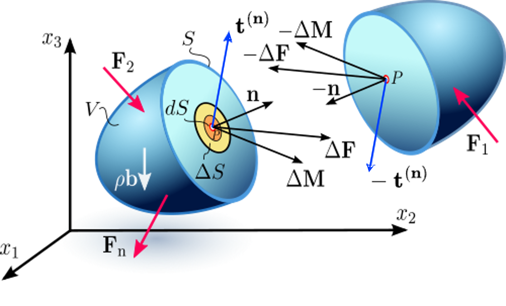
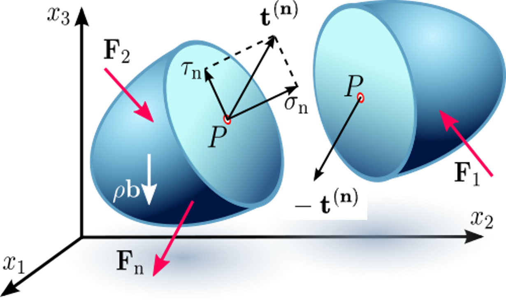
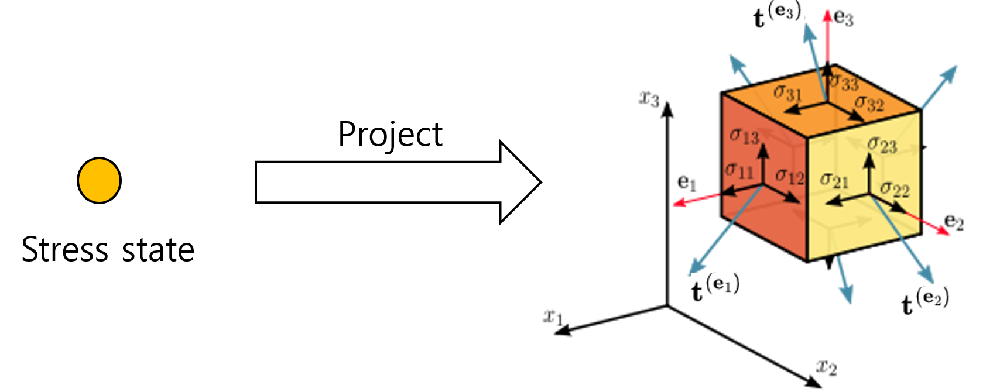
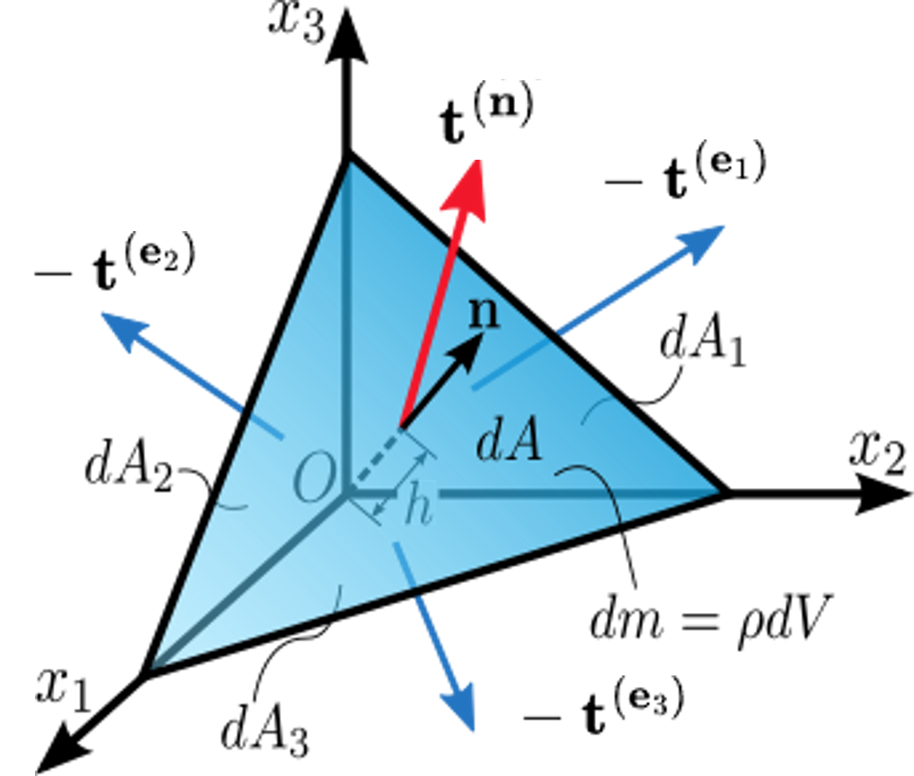

## Stress is more than force divided by area

One of the first equations encountered in mechanics of materials is

$$
\sigma = \frac{F}{A}.
$$

This equation is useful, but it can also leave an incomplete picture of what **stress** really means.

At a point inside a three-dimensional body, there is no single stress value that can describe the forces acting across every possible internal surface.

To understand stress properly, we should begin not with the stress tensor itself, but with a simple physical operation:

**Imagine cutting the body.**

---

## Make an internal cut

Consider a point $P$ inside a body.

Imagine a small internal surface passing through $P$. Let its area be $\Delta S$ and let its orientation be specified by the unit normal vector $\mathbf n$.

The material on one side of the cut exerts a force $\Delta \mathbf F$ on the material on the other side.

As the surface becomes infinitesimally small, we define the **traction vector**

$$
\mathbf t^{(\mathbf n)}(P)
=
\lim_{\Delta S\rightarrow 0}
\frac{\Delta \mathbf F}{\Delta S}.
$$

{fig-align="center" width="75%"}

Traction therefore represents **force per unit area acting across an oriented internal surface**.

The word *oriented* is important.

If we examine the same internal interface from the opposite side, the outward normal changes from $\mathbf n$ to $-\mathbf n$. Local equilibrium requires

$$
\mathbf t^{(-\mathbf n)}
=
-\mathbf t^{(\mathbf n)}.
$$

This is simply action and reaction expressed locally.

---

## The same point, but a different cut

Now keep the material point $P$ fixed, but change the orientation of the imaginary cutting plane.

The traction vector changes.

{fig-align="center" width="70%"}

This observation is fundamental.

The vector

$$
\mathbf t^{(\mathbf n)}
$$

is not associated with the point $P$ alone. It is associated with the pair

$$
(P,\mathbf n).
$$

At the same material point, different surface orientations generally produce different traction vectors.

This raises the central question:

> **Can we find one object at $P$ that generates the traction vector for every possible surface orientation?**

In other words, can we find a local rule

$$
\mathbf n
\longmapsto
\mathbf t^{(\mathbf n)}?
$$

That object is the **Cauchy stress tensor**.

---

## Start with three coordinate planes

Before considering every possible orientation, consider three particular surfaces through the point.

Let their outward normals be the Cartesian basis vectors

$$
\mathbf e_1,\qquad
\mathbf e_2,\qquad
\mathbf e_3.
$$

The corresponding traction vectors are

$$
\mathbf t^{(\mathbf e_1)},\qquad
\mathbf t^{(\mathbf e_2)},\qquad
\mathbf t^{(\mathbf e_3)}.
$$

{fig-align="center" width="75%"}

Each traction vector has three Cartesian components.

Using the convention

$$
\mathbf t^{(\mathbf e_j)}
=
\sigma_{1j}\mathbf e_1
+
\sigma_{2j}\mathbf e_2
+
\sigma_{3j}\mathbf e_3,
$$

the three traction vectors can be assembled as the columns of a matrix:

$$
\boldsymbol{\sigma}
=
\begin{bmatrix}
| & | & |\\
\mathbf t^{(\mathbf e_1)}
&
\mathbf t^{(\mathbf e_2)}
&
\mathbf t^{(\mathbf e_3)}
\\
| & | & |
\end{bmatrix}.
$$

Thus,

$$
\boldsymbol{\sigma}
=
\begin{bmatrix}
\sigma_{11} & \sigma_{12} & \sigma_{13}\\
\sigma_{21} & \sigma_{22} & \sigma_{23}\\
\sigma_{31} & \sigma_{32} & \sigma_{33}
\end{bmatrix}.
$$

Here,

$$
\sigma_{ij}
$$

is the component in the $\mathbf e_i$ direction of the traction acting on the surface whose normal is $\mathbf e_j$.

Therefore,

- $i=j$: normal stress component,
- $i\ne j$: shear stress component.

The nine components describe the three traction vectors acting on the three coordinate planes.

But this leads to another question.

We know the tractions on three particular planes. How can we determine the traction on a plane having an **arbitrary orientation**?

The answer comes from equilibrium.

---

## Cauchy’s tetrahedron

Consider an infinitesimal tetrahedron surrounding the material point.

Its oblique face has area $dA$ and outward unit normal

$$
\mathbf n
=
n_1\mathbf e_1
+
n_2\mathbf e_2
+
n_3\mathbf e_3.
$$

The other three faces are aligned with the coordinate planes and have outward normals

$$
-\mathbf e_1,\qquad
-\mathbf e_2,\qquad
-\mathbf e_3.
$$

{fig-align="center" width="65%"}

From the geometry of the tetrahedron, the areas of the three coordinate faces are

$$
dA_1=n_1dA,
$$

$$
dA_2=n_2dA,
$$

and

$$
dA_3=n_3dA.
$$

Now apply equilibrium.

For a tetrahedron with characteristic dimension $h$, the surface forces are of order

$$
O(h^2),
$$

whereas body forces and inertia are of order

$$
O(h^3).
$$

After dividing the equilibrium equation by $dA$ and letting $h\rightarrow0$, the surface-force balance becomes

$$
\mathbf t^{(\mathbf n)}dA
+
\mathbf t^{(-\mathbf e_1)}dA_1
+
\mathbf t^{(-\mathbf e_2)}dA_2
+
\mathbf t^{(-\mathbf e_3)}dA_3
=
0.
$$

Using the action--reaction relation

$$
\mathbf t^{(-\mathbf m)}
=
-\mathbf t^{(\mathbf m)}
$$

and the geometric relations

$$
dA_i=n_i dA,
$$

we obtain

$$
\mathbf t^{(\mathbf n)}
=
\mathbf t^{(\mathbf e_1)}n_1
+
\mathbf t^{(\mathbf e_2)}n_2
+
\mathbf t^{(\mathbf e_3)}n_3.
$$

This is the crucial result.

---

## Cauchy’s stress formula

Recall that

$$
\mathbf t^{(\mathbf e_1)},\qquad
\mathbf t^{(\mathbf e_2)},\qquad
\mathbf t^{(\mathbf e_3)}
$$

are precisely the three columns of the stress tensor.

Therefore,

$$
\boxed{
\mathbf t^{(\mathbf n)}
=
\boldsymbol{\sigma}\mathbf n
}
$$

or, in component notation,

$$
t_i^{(\mathbf n)}
=
\sigma_{ij}n_j,
\qquad i,j=1,2,3.
$$

This is **Cauchy’s stress formula**.

It answers the question posed earlier.

At a given material point, the Cauchy stress tensor is the operator that determines the traction vector acting on **any oriented surface through that point**.

In this sense,

$$
\boxed{
\text{surface orientation}
\quad\longrightarrow\quad
\text{traction vector}
}
$$

is the essential meaning of the stress tensor.

More explicitly,

$$
\boxed{
\mathbf n
\quad\xrightarrow{\;\boldsymbol{\sigma}\;}
\quad
\mathbf t^{(\mathbf n)}
}
$$

The stress tensor is therefore much more than a $3\times3$ collection of stress components.

It is a **linear mapping from the orientation of an internal surface to the traction acting on that surface**.

---

## Normal and shear stresses on an arbitrary plane

Once $\boldsymbol{\sigma}$ is known, the traction vector on a surface with unit normal $\mathbf n$ follows immediately:

$$
\mathbf t^{(\mathbf n)}
=
\boldsymbol{\sigma}\mathbf n.
$$

We can now decompose this traction into normal and tangential parts.

The normal stress on the oriented surface is

$$
\sigma_n
=
\mathbf t^{(\mathbf n)}\cdot\mathbf n.
$$

Using Cauchy's stress formula,

$$
\boxed{
\sigma_n
=
\mathbf n\cdot\boldsymbol{\sigma}\mathbf n
}
$$

The tangential or shear traction is then

$$
\boldsymbol{\tau}
=
\mathbf t^{(\mathbf n)}
-
\sigma_n\mathbf n,
$$

or

$$
\boxed{
\boldsymbol{\tau}
=
\boldsymbol{\sigma}\mathbf n
-
(\mathbf n\cdot\boldsymbol{\sigma}\mathbf n)\mathbf n
}
$$

Thus, normal stress and shear stress on an arbitrary plane are not separate stress quantities that must be independently specified.

They are simply the normal and tangential components of the traction vector generated by the stress tensor for that particular surface orientation.

---

## What does the stress tensor really represent?

It is tempting to identify the stress tensor with its nine Cartesian components,

$$
\sigma_{11},\sigma_{12},\ldots,\sigma_{33}.
$$

But those numbers are the **components of the tensor in a chosen coordinate system**.

The deeper physical object is the rule that determines how internal force is transmitted across an arbitrary oriented surface.

At a material point,

$$
\boxed{
\text{stress tensor}
=
\text{local rule: surface orientation}
\rightarrow
\text{traction vector}
}
$$

This interpretation makes the meaning of a second-order tensor much less mysterious.

We do not introduce the stress tensor simply because three-dimensional mechanics requires nine numbers.

We introduce it because the internal force transmitted across a surface depends on the orientation of that surface, and a single mathematical object is needed to describe that dependence.

---

## Connection to the Z Diagram

This interpretation also clarifies one of the fundamental connections in the **Z Diagram**:

$$
F
\longleftrightarrow
\sigma.
$$

At the structural scale, loading and equilibrium are often described in terms of forces.

At the material-point scale, internal force transmission is described by traction and the stress tensor.

The connection between these descriptions is **equilibrium**.

Cauchy's tetrahedron provides a particularly clear local demonstration of this principle.

Starting from the equilibrium of forces acting on an infinitesimal body, we arrive at

$$
\mathbf t^{(\mathbf n)}
=
\boldsymbol{\sigma}\mathbf n.
$$

The stress tensor can therefore be understood as the local representation of internal force transmission within a continuum.

---

## Watch the lecture

This topic is also discussed in my Mechanics of Materials lecture.



---

## Takeaway

If there is one idea to remember, it is not merely the formula

$$
\mathbf t^{(\mathbf n)}
=
\boldsymbol{\sigma}\mathbf n.
$$

Instead, remember how we arrived at it.

**Make an internal cut.**

The cut exposes a traction vector.

Change the orientation of the cut, and the traction changes.

The three coordinate-plane tractions define the components of the stress tensor.

Equilibrium of Cauchy's tetrahedron then shows that this one tensor generates the traction vector on every possible oriented surface:

$$
\boxed{
\mathbf t^{(\mathbf n)}
=
\boldsymbol{\sigma}\mathbf n
}
$$

That is what the stress tensor really represents.
