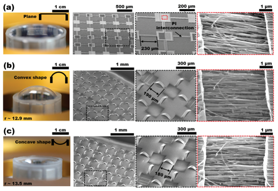

  <a href="index.html">English</a> | <strong>한글</strong>

내가 이 연구를 시작한 것은 반도체나 배터리, 웨어러블 전자소자를 연구하고 있었기 때문이 아니다.

내 전공은 구조공학과 역학이다.

2010년 무렵 고려대학교 화공생명공학과 하정숙 교수 연구팀은 크게 변형되면서도 전기적 기능을 유지할 수 있는 전자소자를 개발하고 있었다. 구부리고, 접고, 비틀고, 잡아당겨도 작동하는 전자소자였다.

그런데 여기에는 아주 분명한 역학 문제가 있었다.

전자소자를 구성하는 많은 기능성 재료는 큰 변형률을 견디지 못한다. 반면 완성된 디바이스는 수십 퍼센트까지 변형되어야 할 수도 있다.

하 교수님이 이 문제에 함께 참여해 달라고 요청했다.

구조역학을 하는 내 눈에는 이 문제가 의외로 익숙해 보였다.

> **구조물 전체는 크게 변형되면서도, 변형에 취약한 부품에는 큰 국부 변형률이 전달되지 않게 할 수 있을까?**

이 질문에서 시작한 공동연구는 10년 이상 이어졌고, 변형 가능한 반도체, 논리회로, 센서, 에너지 저장장치, 통합 웨어러블 시스템, 스트레처블 디스플레이 등에 관한 약 15편의 공동논문으로 이어졌다.

전자기술은 계속 바뀌었다.

**하지만 역학의 질문은 거의 바뀌지 않았다.**

지금은 폴더블폰과 변형 가능한 전자기기가 익숙하다. 우리가 연구를 시작했을 때만 해도 이런 장치는 상당 부분 연구실의 개념에 가까웠다.

지금 돌아보면 내게 더 흥미로운 것은 단순히 전자소자가 늘어날 수 있게 되었다는 사실이 아니다.

**역학이 그것을 어떻게 가능하게 했는가**이다.

---

## 스트레처블 전자소자 뒤에 있는 역학 문제

전자소자가 기판에 붙어 있고, 기판 전체에 거시적인 인장변형률이 가해진다고 하자.

$$
\varepsilon_\mathrm{global}
=
\frac{L-L_0}{L_0}.
$$

모든 부분이 똑같이 변형된다면 시스템 전체를 30% 늘렸을 때 기능성 소자에도 대략 30%의 변형률이 생긴다.

많은 전자재료에는 받아들이기 어려운 수준이다.

하지만 역학적으로는 다른 가능성이 있다.

변형률이 반드시 균일해야 할 이유는 없다.

적합조건은 연결된 구조가 연속적으로 변형되어야 한다고 요구한다. **모든 재료점의 변형률이 같아야 한다고 요구하지는 않는다.**

그러면 질문 자체가 달라진다.

> 반도체가 30% 변형률을 견디게 만들 수 있을까?

가 아니라,

> **전체 디바이스는 30% 늘어나면서도 반도체의 변형률은 허용값 이하로 유지할 수 있을까?**

라고 물을 수 있다.

이것은 구조역학 문제다.

---

## Stretchable하다는 것이 모든 부품이 늘어난다는 뜻은 아니다

여기서 중요한 것은 전체 변형과 재료의 국부 변형률을 구분하는 것이다.

시스템 전체 치수는 크게 변해도 개별 부품의 재료 변형률은 작게 유지될 수 있다.

구조공학에서는 낯선 개념이 아니다.

스프링은 크게 늘어나지만 와이어 자체의 변형률은 상대적으로 작다. 케이블은 재료가 크게 늘어나기보다 형상이 변한다. 신축이음은 움직임을 자신이 받아 주변 구조물이 그 변형을 받지 않도록 한다. 면진장치는 지진 변형을 의도적으로 유연하게 만든 층에 집중시킨다.

전자소자에도 같은 생각을 적용할 수 있다.

목표는

$$
\varepsilon_\mathrm{device}
=
\varepsilon_\mathrm{global}
$$

이 아니다. 우리가 원하는 것은

$$
\boxed{
\varepsilon_\mathrm{device}
\ll
\varepsilon_\mathrm{global}
}
$$

이다.

결국 문제는 **변형률을 어떻게 관리할 것인가**가 된다.

---

## 첫 번째 방법: 재료 대신 형상이 변형을 받게 한다

초기 공동연구에서 사용한 방법 가운데 하나는 미리 늘여 놓은 탄성 기판 위에 얇은 연결부를 만드는 것이었다.

기판의 프리스트레인을 풀면 연결부는 평면 밖으로 좌굴하면서 굽은 형상을 만든다.

{#fig-buckled-interconnect fig-align="center" width="90%"}

이렇게 만들어진 형상은 이후 인장변형을 받아들이는 또 하나의 자유도를 제공한다.

개념적으로는

$$
\Delta L_\mathrm{system}
=
\Delta L_\mathrm{material}
+
\Delta L_\mathrm{geometry}
$$

라고 생각할 수 있다.

이 식을 일반적인 유한변형 공식으로 받아들이면 안 된다. 여기서는 물리적인 그림을 보여 주기 위한 표현이다.

전체 변위의 상당 부분을 형상 변화가 받아 준다면 재료 자체의 변형률은 작게 유지할 수 있다.

스프링, 주름판, 벨로즈, 서펜타인 배선, 케이블, 컴플라이언트 메커니즘에서도 같은 원리를 볼 수 있다.

스트레처블 전자소자는 이 원리를 훨씬 작은 스케일에서 이용할 뿐이다.

---

## 전체 변형과 국부 변형률은 다른 양이다

공동연구가 진행될수록 이 구분은 더 중요해졌다.

예를 들어 스트레처블 단일벽 탄소나노튜브 논리소자에서는 시스템 전체가 상당히 늘어나더라도 중요한 채널과 전극 부위의 계산된 국부 변형률은 훨씬 작게 유지될 수 있었다.

반도체가 갑자기 전체 거시변형을 그대로 견딜 수 있는 재료가 된 것이 아니다.

구조적 설계가 전체 변형의 대부분이 취약한 영역에 도달하지 못하게 한 것이다.

여기서 더 일반적인 설계 원리가 나온다.

> **취약한 부품에 중요한 것은 시스템 전체가 얼마나 변형되었는가가 아니라, 그 부품에 실제로 얼마의 국부 변형률이 도달했는가이다.**

전자소자뿐 아니라 교량, 해양구조물, 기계시스템에서도 마찬가지다.

---

## 그 다음에는 질문을 바꾸었다

형상을 이용하면 변형률을 줄일 수 있다.

하지만 더 강력한 질문은 이것이었다.

> **변형률이 어디로 갈지를 우리가 의도적으로 정할 수 있을까?**

변형 가능한 기판 안에 강성이 매우 다른 영역을 만든다고 하자.

기능성 전자소자가 놓이는 부분은 의도적으로 단단하게 만들고, 그 사이 영역은 매우 부드럽게 둔다.

전체 기판을 잡아당기면 변형률은 균일하게 분포하지 않는다.

부드러운 부분이 대부분의 변형을 받아들이고 단단한 영역은 거의 변형되지 않는다.

{#fig-stiff-soft-substrate fig-align="center" width="90%"}

이것은 중요한 관점의 변화였다.

전자부품 하나를 더 유연하게 만드는 것이 아니라 **시스템 전체의 변형장을 설계**하기 시작한 것이다.

---

## 왜 강성 차이가 변형의 경로를 바꾸는가?

1차원 직렬 시스템을 생각하면 원리가 쉽게 보인다.

두 영역의 전체 신장은

$$
\Delta=\Delta_1+\Delta_2
$$

이다.

같은 축력 $F$가 흐르는 이상화된 시스템이라면

$$
\Delta_i=\frac{F L_i}{E_i A_i}
$$

이므로

$$
\frac{\Delta_1}{\Delta_2}
=
\frac{L_1/(E_1A_1)}{L_2/(E_2A_2)}.
$$

영역 1이 영역 2보다 훨씬 단단해서

$$
E_1A_1\gg E_2A_2
$$

라면 대부분의 변위는 영역 2에서 발생한다.

실제 스트레처블 기판은 다차원 유한변형 문제이므로 이 1차원 모델은 개념적 비유일 뿐이다.

그러나 물리적 원리는 분명하다.

> **변형이 가기 쉬운 장소를 의도적으로 만들어 준다.**

이 원리가 이후 스트레처블 디바이스 설계의 중심이 되었다.

---

## 유한요소해석은 변형률이 어디로 갔는지를 보여 주었다

여기서 구조역학을 해 온 내 배경이 특히 유용했다.

대상은 전자소자이지만

> 변형률은 어디로 가는가?

라는 질문은 계산역학이 원래 잘 다루는 질문이다.

유한요소해석을 사용하면 전체 인장률만 보고 stretchability를 추측하는 대신 실제 변형률장을 볼 수 있다.

{#fig-fe-strain-field fig-align="center" width="90%"}

스트레처블 마이크로 슈퍼커패시터 시스템의 한 예에서는 기능성 소자를 단단한 island 위에 두고, 이웃 island 사이를 훨씬 부드러운 고분자 영역으로 연결했다.

큰 전체 변형을 가해도 단단한 island의 계산 변형률은 작게 유지되는 반면 유연한 영역에는 매우 큰 변형이 발생했다.

변형이 사라진 것이 아니다.

**재분배된 것이다.**

이것이 핵심 역학이다.

---

## 이 문제에서는 변형률 집중이 오히려 필요할 수 있다

구조공학자는 응력집중과 변형률 집중을 경계하도록 배운다. 대개는 그래야 한다. 심한 집중은 항복, 파괴, 피로, 박리를 시작시킬 수 있다.

그런데 스트레처블 디바이스에서는 이 상식이 흥미롭게 뒤집힌다.

강하게 불균일한 변형률장이 바로 우리가 원하는 것일 수 있다.

$$
\varepsilon_\mathrm{device}
\ll
\varepsilon_\mathrm{system}
$$

을 만들기 위해

$$
\varepsilon_\mathrm{soft}
\gg
\varepsilon_\mathrm{device}
$$

를 의도할 수 있다.

물론 큰 변형률을 받는 영역은 그 변형을 견딜 수 있는 재료와 형상으로 만들어야 한다.

따라서 목표는 모든 곳에서 변형률 집중을 없애는 것이 아니다.

> **어디에서는 변형률 집중을 허용하고, 어디에서는 허용하지 않을 것인가?**

이것이 더 일반적인 역학의 질문이다.

---

## 다른 곳에 변형을 허용해서 디바이스를 보호한다

이 생각은 구조공학에서도 익숙하다. 대표적인 예가 면진이다.

구조부재 자체를 더 강하고 단단하게 만들어 지진변형을 버티는 대신, 의도적으로 유연한 영역을 만들어 상당한 변형이 그곳에서 발생하도록 한다.

수학적으로 같은 문제라는 뜻은 아니다. 하지만 설계 철학은 놀랄 만큼 비슷하다.

> **기능적으로 중요한 영역을 보호하려면 변형이 더 안전하게 갈 수 있는 곳을 만들어 준다.**

스트레처블 전자소자에서는 소프트 폴리머, 기하학적 연결부, stiff island 등의 수단으로 이 일을 한다.

---

## 강성 대비를 더 적극적으로 사용하다

연구가 진행되면서 보호영역과 변형영역 사이의 강성 대비를 더 의도적으로 만들게 되었다.

후기의 마이크로 슈퍼커패시터 시스템에서는 매우 부드러운 엘라스토머 기판 내부에 단단한 고분자 필름을 국부적으로 삽입할 수 있었다. 기능성 디바이스는 이 역학적으로 보호된 영역에 놓였다.

큰 단축 또는 이축 인장을 가해도 유한요소해석에서는 보호된 디바이스 영역의 변형률이 매우 작고 주변 엘라스토머가 큰 변형을 받는 것으로 나타났다.

얼핏 보면 이상하다.

> 중요한 부분은 거의 늘어나지 않는데 시스템 전체는 어떻게 그렇게 많이 늘어날 수 있을까?

모순이 아니다.

시스템이 크게 늘어날 수 있는 이유가 바로 **변형이 불균일하기 때문**이다.

---

## 인터커넥트에는 또 다른 역학 문제가 있다

기능성 디바이스를 거의 강체처럼 거동하는 island 위에 올리면 새로운 문제가 생긴다.

island끼리는 서로 상대운동을 하지만 전기적으로는 계속 연결되어야 한다.

직선 금속 배선은 큰 상대변위를 견디기 어렵다. 따라서 연결부 자체도 역학적으로 설계해야 한다.

우리 연구에서는 두 가지 전략을 반복해서 사용했다.

하나는 길고 가느다란 **서펜타인(serpentine) 금속 인터커넥트**다. 이 형상은 전체 인장을 굽힘, 회전, 면외운동으로 바꾸어 받아들인다.

다른 하나는 소프트 폴리머 안에 넣은 **액체금속 인터커넥트**다. 액체 도체는 일반적인 고체 금속선처럼 재료 변형률을 축적하지 않고 주변 채널의 형상 변화에 따라 움직일 수 있다.

따라서 전체 시스템은 역학적으로 서로 다른 역할을 가진 요소들의 조합이 된다.

$$
\boxed{
\begin{aligned}
\text{stiff islands}
&\rightarrow
\text{기능성 디바이스 보호},\\
\text{soft substrate}
&\rightarrow
\text{변형 수용},\\
\text{compliant interconnections}
&\rightarrow
\text{전기적 연결 유지}.
\end{aligned}
}
$$

결국 stretchability는 재료 하나의 성질이 아니라 **시스템 아키텍처의 성질**이다.

---

## 디바이스는 바뀌었지만 역학은 그대로였다

10년이 넘는 공동연구 동안 하정숙 교수 연구팀의 디바이스는 계속 발전했다.

나노와이어 전자소자, 논리소자, 마이크로 슈퍼커패시터, 압력 및 변형률 센서, 가스센서, 에너지 저장-센싱 통합 시스템, 웨어러블 디바이스, 스트레처블 디스플레이까지 대상은 다양했다.

재료도 바뀌고 제조법도 바뀌고 전자기능도 바뀌었다.

그런데 역학의 질문은 거의 그대로였다.

$$
\boxed{
\text{변형은 어디로 가야 하는가?}
}
$$

돌아보면 이 점이 가장 흥미롭다.

이 역학은 특정 반도체나 센서, 배터리에만 해당하는 것이 아니었다. 큰 변형이 필요한 시스템 안에 역학적으로 취약한 기능성 부품을 넣기 위한 일반적인 설계 원리였다.

---

## 통합 시스템이 되면서 역학은 더 중요해졌다

스트레처블 부품 하나도 어렵지만 완전한 시스템은 더 어렵다.

센서, 에너지 저장장치, 전기 연결부, 에너지 하베스팅 장치가 하나의 웨어러블 시스템에 들어간다고 생각해 보자.

각 부품의 허용 변형률도 다르고 강성도 다르며 파괴 메커니즘도 다르다.

따라서 통합 시스템에서는 기판 자체가 하나의 **역학적 아키텍처**가 되어야 했다.

예를 들어 그래핀 가스센서와 마이크로 슈퍼커패시터를 통합한 시스템에서는 민감한 기능성 부품 아래에 단단한 SU-8 플랫폼을 넣고, 긴 서펜타인 연결부가 주변 변형을 받아들이게 했다.

중요한 것은 단순히 몇 퍼센트까지 늘어났느냐가 아니다.

**서로 다른 부품이 하나의 변형 가능한 기판에서 함께 작동하도록 변형률장을 어떻게 설계했는가**이다.

---

## 결국 디스플레이까지 갔다

후기의 인상적인 결과 가운데 하나는 quantum-dot light-emitting diode(QD-LED)의 스트레처블 배열이었다.

{#fig-stretchable-display fig-align="center" width="90%"}

응용은 초기 나노와이어 소자와 매우 달라 보인다.

하지만 역학적 아키텍처는 낯설지 않다.

기능성 요소는 보호영역에 둔다. 부드러운 주변 재료가 거시적 변형을 받아들인다. 유연한 연결부는 서로 움직이는 영역 사이의 연결을 유지한다.

개별 전자부품을 보호하기 위해 시작한 원리가 통합 스트레처블 디스플레이의 아키텍처로 발전한 것이다.

---

## 이제 폴더블 전자기기는 일상이 되었다

2010년 무렵 이 공동연구를 시작했을 때 크게 변형되는 전자소자는 미래 기술처럼 느껴졌다.

2026년인 지금 폴더블 스마트폰은 흔한 소비자 제품이 되었다. 스트레처블 디스플레이, 전자피부, 웨어러블 건강 모니터링, 변형 가능한 에너지 저장장치는 여전히 활발한 연구개발 분야다.

우리 연구가 오늘날 상용 폴더블폰으로 직접 이어졌다는 뜻은 아니다. 상용 제품에는 훨씬 다양한 재료, 아키텍처, 제조기술과 많은 연구자들의 기여가 들어 있다.

다만 그 아래의 역학 문제는 매우 비슷하다.

$$
\text{큰 디바이스 스케일 변형}
$$

과

$$
\text{취약한 부품의 작은 허용 변형률}
$$

을 동시에 만족시켜야 한다.

처음부터 우리가 다루었던 문제가 바로 이것이었다.

---

## 구조역학은 무엇을 기여했는가?

이 공동연구는 다학제 연구에서 역학이 어떤 역할을 할 수 있는지에 대한 내 생각도 바꾸었다.

디바이스를 만든 뒤 역학을 사용할 수도 있다.

> 변형률을 계산한다.
>
> 응력을 계산한다.
>
> 왜 파손되었는지 설명한다.

하지만 그것만이 역학의 역할은 아니다.

제작하기 전에 물을 수도 있다.

> 단단한 재료는 어디에 놓아야 하는가?
>
> 부드러운 재료는 어디에 놓아야 하는가?
>
> 어떤 형상이 변형을 받아야 하는가?
>
> 디바이스는 어디에 놓아야 하는가?
>
> 이웃 island는 어떻게 연결해야 하는가?
>
> 우리가 원하는 변형률장은 무엇인가?

이렇게 되면 역학은 단순한 해석도구가 아니다.

**설계도구**가 된다.

내가 보기에 이것이 구조역학이 이 공동연구에 기여한 가장 중요한 부분 가운데 하나였다.

---

## 다음 질문: 변형률장 자체를 설계할 수 있을까?

기존 유한요소해석은 주로 정방향 문제를 풀었다.

> 이 형상과 재료가 주어지면 변형률은 어디로 갈까?

이제는 더 야심찬 역문제를 생각할 수 있다.

> **원하는 변형률장이 주어졌을 때 어떤 구조를 만들어야 할까?**

활성 전자소자 영역을 $\Omega_d$라 하면 한 가지 역학적 목적함수는

$$
\min
\left[
\max_{\mathbf{x}\in\Omega_d}
\varepsilon_\mathrm{eq}(\mathbf{x})
\right]
$$

로 둘 수 있다. 물론 전체 시스템은 정해진 거시변형을 만족해야 한다.

설계변수에는 island 형상과 간격, 기판의 국부 두께, 재료강성, 인터커넥트 형상, 계면형상, 공간적 강성분포 등이 들어갈 수 있다.

이렇게 보면 스트레처블 전자소자는 자연스럽게 **위상최적화와 역구조설계** 문제로 연결된다.

---

## 앞으로는 유한변형 역학이 더 중요하다

단순한 단축인장은 시작에 불과하다.

실제 디바이스에는 인장, 굽힘, 비틀림, 이축변형, 접촉, 주름, 반복 접힘이 복합적으로 발생한다.

특히 피부에 붙이는 웨어러블 디바이스는 계속 변하는 다축 변형장을 경험한다.

따라서 앞으로의 역학 모델은

$$
\text{대변형}
+
\text{재료 비선형}
+
\text{접촉}
+
\text{다축하중}
$$

을 함께 다루어야 한다.

비선형 고체역학에서는 익숙한 주제들이다. 변형 가능한 전자소자에 적용하면 아직 풀 문제가 많다.

---

## 한 번 버티는 것으로는 부족하다

큰 인장을 한 번 견딘다는 것은 가능성을 보여 줄 뿐이다.

상용 디바이스라면 수천 번, 수백만 번의 변형 사이클을 견뎌야 할 수도 있다.

그러면 문제는 탄성에서 피로, 파괴, 계면박리, 층간분리, 점진적 손상, 반복열화로 확장된다.

특히 stiff island의 가장자리가 중요할 수 있다. island 내부의 변형률을 낮추는 대신 soft/stiff 전이부에는 큰 변형률 구배가 생길 수 있기 때문이다.

한 영역을 보호하면 역학 문제가 다른 곳으로 이동할 수 있다.

따라서 앞으로의 설계는

$$
\varepsilon_\mathrm{device}
$$

뿐 아니라 **계면 내구성(interface durability)**도 함께 보아야 한다.

---

## 결국 역학과 디바이스 물리를 직접 연결해야 한다

궁극적인 설계량은 변형률 자체가 아닐 수도 있다.

기능성 재료마다 기계적 변형에 대한 반응이 다르다. 어떤 반도체에서는 변형률이 이동도를 바꾸고, 다른 소자에서는 접촉저항을 바꿀 수 있다. 배터리에서는 반복변형이 계면을 손상시키거나 수송경로를 바꿀 수 있다. 디스플레이에서는 광학적 또는 전기적 성능이 달라질 수 있다.

따라서 더 완전한 설계 연결고리는

$$
\boxed{
\text{전체 변형}
\rightarrow
\text{국부 역학}
\rightarrow
\text{디바이스 물리}
\rightarrow
\text{기능 성능}
}
$$

이다.

앞으로의 계산설계에서는 기계적 변형률을 독립적인 출력값으로만 보지 말고 이 단계들을 직접 연결할 필요가 있다.

---

## 유한요소해석에서 mechanics-informed AI로

AI를 이용한 설계에도 흥미로운 가능성이 있다.

일반적인 유한요소모델은

$$
\text{설계}
\rightarrow
\text{응답}
$$

을 계산한다.

하지만 island 형상, 강성분포, 인터커넥트 형상의 후보가 수천, 수백만 개라면 시행착오 방식은 비효율적이다.

축소모델, surrogate model, 위상최적화, 머신러닝을 이용하면 반대로

$$
\text{원하는 응답}
\rightarrow
\text{설계}
$$

를 찾는 데 도움을 받을 수 있다.

여기서 중요한 것은 AI가 역학을 대체하는 것이 아니라는 점이다.

평형, 적합조건, 구성관계, 허용 가능한 변형모드, 파괴제약조건, 의미 있는 설계변수는 역학이 정의한다. AI는 그 위에서 거대한 설계공간을 효율적으로 탐색할 수 있다.

이 조합은 경험적인 strain isolation에서 한 단계 더 나아가 **체계적인 변형장 설계**로 이어질 수 있다.

---

## 역학은 스케일을 가리지 않는다

이 공동연구에서 개인적으로 가장 흥미로웠던 점은 역학이 물체의 크기에 별로 관심이 없다는 것이다.

토목공학자는 보통 교량, 건물, 해양플랫폼, 콘크리트 구조물처럼 큰 구조를 생각한다.

스트레처블 전자소자는 밀리미터 또는 마이크로미터 크기일 수 있다.

그래도 질문은 익숙하다.

$$
F
\rightarrow
\sigma
\rightarrow
\varepsilon
\rightarrow
u.
$$

변형은 어디에서 발생하는가?

무엇이 변형률장을 결정하는가?

강성이 하중전달에 어떤 영향을 주는가?

손상은 어디에서 시작되는가?

취약한 부품을 어떻게 역학적으로 보호할 것인가?

크기와 재료는 달라진다.

**역학은 달라지지 않는다.**

---

## 결국 핵심은

스트레처블 전자시스템을 만들기 위해 모든 부품을 stretchable하게 만들 필요는 없다.

필요한 것은 변형장을 이해하고 **변형이 어디에서 일어날지를 의도적으로 제어하는 것**이다.

형상은 변위를 받아들일 수 있다.

강성 대비는 변형률을 다른 곳으로 보낼 수 있다.

부드러운 영역은 단단한 기능성 부품을 보호할 수 있다.

유연한 인터커넥트는 이 부품들이 서로 움직이는 동안에도 연결을 유지한다.

10년이 넘는 공동연구에서 반복해서 나타난 원리는 아주 간단하게 정리할 수 있다.

> **스트레처블 구조라고 해서 모든 부품이 늘어나야 하는 것은 아니다. 변형이 올바른 곳에서 일어나게 해야 한다.**

그리고 다음 세대의 연구에서는 한 걸음 더 나아가 이런 질문을 할 수 있을 것이다.

> **변형률이 어디로 가는지를 계산하는 데서 그치지 않고, 우리가 원하는 곳으로 가도록 설계할 수 있을까?**

---

## Original research

이 글은 고려대학교 하정숙 교수 연구팀과 장기간 수행한 공동연구를 바탕으로 한다. 아래 논문들은 이 글에서 설명한 역학 개념이 어떻게 발전했는지를 보여 주는 대표적인 연구들이다.

Shin, G., Bae, M. Y., Lee, H. J., Hong, S. K., Yoon, C. H., Zi, G., Rogers, J. A., & Ha, J. S. (2011).  
**SnO2 Nanowire Logic Devices on Deformable Nonplanar Substrates.**  
*ACS Nano, 5*(12), 10009–10016.  
DOI: 10.1021/nn203790a

Yoon, J., Shin, G., Kim, J., Moon, Y. S., Lee, S.-J., Zi, G., & Ha, J. S. (2014).  
**Fabrication of Stretchable Single-Walled Carbon Nanotube Logic Devices.**  
*Small, 10*(14), 2910–2917.  
DOI: 10.1002/smll.201303779

Yoon, J., Hong, S. Y., Lim, Y., Lee, S.-J., Zi, G., & Ha, J. S. (2014).  
**Design and Fabrication of Novel Stretchable Device Arrays on a Deformable Polymer Substrate with Embedded Liquid-Metal Interconnections.**  
*Advanced Materials, 26*, 6580–6586.  
DOI: 10.1002/adma.201402588

Lim, Y., Yoon, J., Yun, J., Kim, D., Hong, S. Y., Lee, S.-J., Zi, G., & Ha, J. S. (2014).  
**Biaxially Stretchable, Integrated Array of High Performance Microsupercapacitors.**  
*ACS Nano, 8*(11), 11639–11650.  
DOI: 10.1021/nn504925s

Yun, J., Lim, Y., Jang, G. N., Kim, D., Lee, S.-J., Park, H., Hong, S. Y., Lee, G., Zi, G., & Ha, J. S. (2016).  
**Stretchable Patterned Graphene Gas Sensor Driven by Integrated Micro-Supercapacitor Array.**  
*Nano Energy, 19*, 401–414.  
DOI: 10.1016/j.nanoen.2015.11.023

Kim, H., Yoon, J., Lee, G., Paik, S.-H., Choi, G., Kim, D., Kim, B.-M., Zi, G., & Ha, J. S. (2016).  
**Encapsulated, High-Performance, Stretchable Array of Stacked Planar Micro-Supercapacitors as Waterproof Wearable Energy Storage Devices.**  
*ACS Applied Materials & Interfaces, 8*, 16016–16025.  
DOI: 10.1021/acsami.6b03504

Yun, J., Song, C., Lee, H., Park, H., Jeong, Y. R., Kim, J. W., Jin, S. W., Oh, S. Y., Sun, L., Zi, G., & Ha, J. S. (2018).  
**Stretchable Array of High-Performance Micro-Supercapacitors Charged with Solar Cells for Wireless Powering of an Integrated Strain Sensor.**  
*Nano Energy, 49*, 644–654.  
DOI: 10.1016/j.nanoen.2018.05.017

Lee, Y., Kim, D. S., Jin, S. W., Lee, H., Jeong, Y. R., You, I., Zi, G., & Ha, J. S. (2022).  
**Stretchable Array of CdSe/ZnS Quantum-Dot Light Emitting Diodes for Visual Display of Bio-Signals.**  
*Chemical Engineering Journal, 427*, 130858.  
DOI: 10.1016/j.cej.2021.130858
