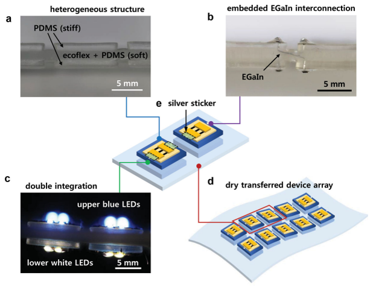
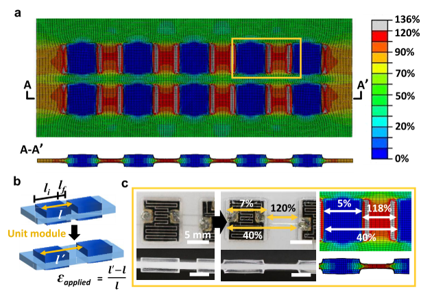
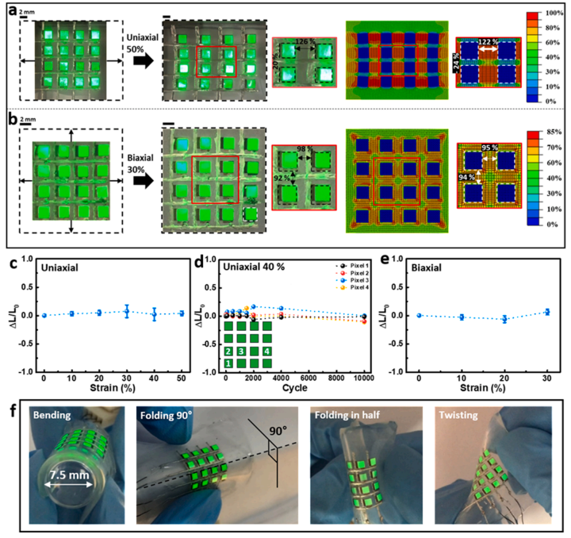

I did not start this research because I was working on semiconductors, batteries, or wearable electronics.

My background is structural engineering and mechanics.

Around 2010, Prof. Jeong Sook Ha in the Department of Chemical Engineering at Korea University was developing highly deformable electronic devices. Her group was interested in electronics that could bend, fold, twist, or stretch while maintaining their electrical function.

That created a mechanics problem.

Many of the functional materials used in electronic devices can tolerate only small strains. Yet the complete device may need to deform by tens of percent.

Prof. Ha invited me to collaborate on this question.

From my perspective, the problem looked surprisingly familiar:

> **How can a structure undergo large global deformation while protecting vulnerable components from large local strain?**

That question began a collaboration that continued for more than a decade and led to around fifteen coauthored papers on deformable semiconductors, logic circuits, sensors, energy-storage devices, integrated wearable systems, and stretchable displays.

The electronic technologies changed.

**The mechanics question did not.**

Today, foldable phones and deformable electronic devices are familiar consumer technologies. When we began this work, however, such devices were still largely research concepts.

Looking back, what interests me most is not simply that the devices became stretchable.

It is **how mechanics made that possible**.

---

## The mechanics problem behind stretchable electronics

Suppose an electronic device is attached to a substrate subjected to a macroscopic tensile strain

$$
\varepsilon_\mathrm{global}
=
\frac{L-L_0}{L_0}.
$$

If every part of the system followed that deformation uniformly, a 30% extension of the complete device would imply approximately 30% strain in its functional components.

For many electronic materials, that would be unacceptable.

But mechanics gives us another possibility.

There is no requirement that strain must be uniform.

Compatibility requires a connected structure to deform continuously. It does **not** require every material point to experience the same strain.

This distinction changes the engineering question.

Instead of asking

> How can we make a semiconductor survive 30% strain?

we can ask

> **How can the complete device stretch by 30% while keeping the semiconductor strain below its allowable level?**

That is a structural-mechanics problem.

---

## Stretchability does not mean that everything stretches

This distinction is fundamental.

A system can undergo a large change in overall dimensions while individual components experience only small material strains.

Structural engineers encounter this idea routinely.

A spring extends substantially even though the strain in the wire remains relatively small.

A cable changes configuration primarily through geometry.

An expansion joint accommodates movement so that the neighboring structure does not have to.

A base-isolation system concentrates earthquake deformation in a deliberately compliant layer.

The same philosophy can be applied to electronics.

The objective is not

$$
\varepsilon_\mathrm{device}
=
\varepsilon_\mathrm{global}.
$$

We want

$$
\boxed{
\varepsilon_\mathrm{device}
\ll
\varepsilon_\mathrm{global}.
}
$$

The problem therefore becomes one of **strain management**.

---

## Our first approach: let geometry take the deformation

One of the early strategies in our collaboration was to use thin interconnections on a prestrained elastomeric substrate.

When the prestrain was released, the interconnections developed nonplanar, buckled configurations.

{fig-align="center" width="90%"}

This immediately provided another way to accommodate subsequent stretching.

Instead of requiring the material itself to elongate by the full imposed displacement, the interconnection could change its geometry.

Conceptually,

$$
\Delta L_\mathrm{system}
=
\Delta L_\mathrm{material}
+
\Delta L_\mathrm{geometry}.
$$

This is not intended as a general finite-deformation identity.

It is a mechanical picture.

If geometric reconfiguration accounts for a large part of the imposed displacement, material strain can remain comparatively small.

The same principle appears in

- springs,
- corrugated sheets,
- bellows,
- serpentine traces,
- cables,
- and compliant mechanisms.

Stretchable electronics simply use it at a much smaller scale.

---

## Global deformation and local strain are different quantities

This distinction became increasingly important as our work progressed.

For example, in stretchable single-walled carbon nanotube logic devices, the complete system could accommodate substantial macroscopic stretching while the calculated local strains in critical channel and electrode regions remained much smaller.

The device did not survive because the semiconductor suddenly became capable of sustaining the complete global deformation.

It survived because the architecture prevented most of that deformation from reaching the vulnerable region.

That led us toward a broader design principle:

> **What matters to a vulnerable component is not how much the whole system deforms, but how much local strain reaches that component.**

This is just as true for an electronic device as it is for a bridge, offshore structure, or mechanical system.

---

## Then we changed the question

Geometry can relieve strain.

But we eventually arrived at a more powerful question:

> **Can we deliberately decide where the strain should go?**

Suppose a deformable substrate contains regions with very different stiffnesses.

Some regions are deliberately made stiff and carry the functional electronic components.

The regions between them remain very soft.

When the complete substrate is stretched, the strain does not distribute uniformly.

The soft material accepts most of the deformation.

The stiff regions remain comparatively undeformed.

{fig-align="center" width="90%"}

This was an important conceptual transition.

We were no longer merely making an electronic component more flexible.

We were **designing the deformation field of the complete system**.

---

## Why stiffness contrast redirects deformation

A simple one-dimensional analogy helps explain the mechanism.

Consider two regions connected in series.

Their total elongation is

$$
\Delta
=
\Delta_1+\Delta_2.
$$

For an idealized axial system carrying the same force $F$,

$$
\Delta_i
=
\frac{F L_i}{E_i A_i}.
$$

Therefore,

$$
\frac{\Delta_1}{\Delta_2}
=
\frac{L_1/(E_1A_1)}
     {L_2/(E_2A_2)}.
$$

If region 1 is much stiffer than region 2,

$$
E_1A_1 \gg E_2A_2,
$$

then most of the displacement occurs in region 2.

The real stretchable substrate is a multidimensional finite-deformation problem, so this simple model is only a conceptual analogy.

But the physical principle is correct:

> **Give deformation a mechanically preferable place to go.**

This principle became central to our stretchable-device designs.

---

## Finite element analysis showed where the strain went

This is where my own background in structural mechanics became particularly useful.

The device may be electronic, but the question

> Where does the strain go?

is exactly the kind of question computational mechanics is designed to answer.

Finite element analysis allowed us to visualize the strain field rather than infer stretchability only from the imposed global deformation.

{fig-align="center" width="90%"}

In one of our stretchable microsupercapacitor systems, for example, stiff islands carried the functional devices while much softer polymer regions connected neighboring islands.

Under large imposed deformation, the calculated strain on the stiff islands remained small while very large deformation developed in the compliant regions.

The deformation had not disappeared.

It had been **redistributed**.

That is the essential mechanics.

---

## In this problem, strain concentration can be desirable

Structural engineers are trained to be suspicious of stress and strain concentrations.

Usually for good reason.

A severe concentration can initiate yielding, fracture, fatigue, or delamination.

Stretchable-device design introduces an interesting reversal.

A strongly nonuniform strain field can be exactly what we want.

We deliberately seek

$$
\varepsilon_\mathrm{device}
\ll
\varepsilon_\mathrm{system},
$$

while allowing

$$
\varepsilon_\mathrm{soft}
\gg
\varepsilon_\mathrm{device}.
$$

The important requirement is that the highly strained region must be made from a material and geometry capable of tolerating that deformation.

So the design objective is not to eliminate strain concentration everywhere.

It is to decide

> **where strain concentration is acceptable and where it is not.**

That is a much more general mechanics principle.

---

## Protect the device by sacrificing deformation elsewhere

This way of thinking is familiar in structural engineering.

Consider seismic isolation.

A conventional structure might attempt to resist earthquake-induced deformation by making its structural members stronger and stiffer.

An isolated structure takes a different approach.

A deliberately compliant region is introduced so that a substantial portion of the deformation occurs there rather than in vulnerable structural components.

The analogy is conceptual rather than mathematically identical.

But the design philosophy is remarkably similar:

> **Protect the functional region by giving deformation somewhere safer to go.**

Stretchable electronics use soft polymers, geometric interconnections, stiff islands, and other mechanisms to accomplish essentially this task.

---

## The idea became more extreme

As the collaboration continued, the stiffness contrast between protected and deformable regions became increasingly deliberate.

In later microsupercapacitor systems, stiff polymer films could be locally implanted inside very soft elastomeric substrates.

The functional device then occupied the mechanically protected region.

Under large uniaxial or biaxial stretching, finite element analysis showed that the strain in the protected device region could remain extremely small while the surrounding elastomer underwent very large deformation.

At first this seems paradoxical:

> How can a system stretch enormously if an important part of it hardly stretches at all?

But there is no paradox.

The system is highly stretchable **because its deformation is nonuniform**.

---

## The interconnections must solve a different mechanics problem

Once the functional devices are placed on nearly rigid islands, another problem appears.

The islands move relative to one another.

They still need electrical connections.

A conventional straight metallic wire may not tolerate the required relative displacement.

So the interconnection must itself be mechanically designed.

Two important strategies appeared repeatedly in our work.

One was a long, thin serpentine metallic interconnection.

The serpentine geometry converts imposed extension into bending, rotation, and out-of-plane motion.

Another was the use of liquid-metal interconnections embedded inside soft polymers.

A liquid conductor can change shape with its surrounding channel without accumulating strain in the same way as a conventional solid metallic line.

The complete stretchable system therefore becomes mechanically heterogeneous:

$$
\boxed{
\begin{aligned}
\text{stiff islands}
&\rightarrow
\text{protect functional devices},\\
\text{soft substrate}
&\rightarrow
\text{accommodate deformation},\\
\text{compliant interconnections}
&\rightarrow
\text{maintain electrical continuity}.
\end{aligned}
}
$$

Stretchability is an **architectural property**.

---

## The devices changed, but the mechanics remained

Over more than a decade of collaboration, Prof. Ha's group developed increasingly sophisticated devices.

We worked together on systems involving

- nanowire electronics,
- logic devices,
- microsupercapacitors,
- pressure and strain sensors,
- gas sensors,
- integrated energy-storage and sensing systems,
- wearable devices,
- and stretchable displays.

The materials changed.

The fabrication methods changed.

The electronic functions changed.

But the mechanical question remained almost unchanged:

$$
\boxed{
\text{Where should the deformation go?}
}
$$

That continuity is what I find most interesting in retrospect.

The mechanics was not specific to one semiconductor, one sensor, or one battery technology.

It provided a general way to integrate mechanically vulnerable functional components into highly deformable systems.

---

## Integration made the mechanics more important

A single stretchable component is already a challenging problem.

A complete device system is harder.

Consider a wearable system containing

- a sensor,
- an energy-storage device,
- electrical interconnections,
- and possibly an energy-harvesting component.

Each may have different allowable strains.

Each may have different stiffness.

Each may fail by a different mechanism.

Our integrated systems therefore required the substrate itself to become a mechanical architecture.

For example, in the integrated graphene gas-sensor and micro-supercapacitor system, stiff SU-8 platforms were inserted beneath the sensitive functional components while long serpentine interconnections accommodated the surrounding deformation.

The system could operate while subjected to large macroscopic stretching.

The important point is not simply the percentage strain achieved.

It is **how the strain field was engineered so that different components could coexist on the same deformable substrate**.

---

## Eventually, the mechanics supported a display

A particularly satisfying later development was a stretchable array of quantum-dot light-emitting diodes.

{fig-align="center" width="90%"}

The application looks very different from the early nanowire devices.

Yet mechanically the architecture is recognizable.

Functional elements occupy protected regions.

A soft surrounding material accommodates macroscopic deformation.

Compliant interconnections maintain connectivity between moving regions.

The same principle that began as a way of protecting individual electronic components had become an architecture for an integrated stretchable display.

---

## And then foldable electronics became ordinary

When we began this collaboration around 2010, highly deformable electronics still felt futuristic.

Today, in 2026, foldable smartphones are common consumer products.

Stretchable displays, electronic skin, wearable health-monitoring systems, and deformable energy-storage devices remain active research and development areas.

Our work should not be interpreted as a direct technological lineage to today's commercial foldable phones.

Commercial devices involve many materials, architectures, manufacturing technologies, and contributions from a much broader research community.

But the underlying mechanics problem is closely related.

A foldable or stretchable electronic system must somehow reconcile

$$
\text{large device-scale deformation}
$$

with

$$
\text{small allowable strain in vulnerable components}.
$$

That is the problem we had been studying from the beginning.

---

## What did structural mechanics contribute?

This collaboration also changed how I think about the role of mechanics in multidisciplinary research.

Mechanics can be used after a device has been designed:

> Calculate the strain.

> Calculate the stress.

> Explain why it failed.

But that is only one role.

A more powerful role is to ask before fabrication:

> Where should the stiff material go?

> Where should the soft material go?

> Which geometry should accommodate deformation?

> Where should a device be positioned?

> How should neighboring islands be connected?

> What strain field do we actually want?

Then mechanics is no longer merely an analysis tool.

It becomes a **design tool**.

That, in my view, was one of the most important contributions of structural mechanics to our collaboration.

---

## The next question: can we design the strain field itself?

Our earlier finite element analyses generally answered a forward problem:

> Given this geometry and these materials, where will the strain go?

Today we can formulate a more ambitious inverse problem:

> **Given the strain field we want, what structure should we build?**

Suppose the active electronic region occupies a domain $\Omega_d$.

One possible mechanics objective is

$$
\min
\left[
\max_{\mathbf{x}\in\Omega_d}
\varepsilon_\mathrm{eq}(\mathbf{x})
\right],
$$

while requiring the complete system to achieve a prescribed global deformation.

The design variables could include

- island geometry,
- island spacing,
- local substrate thickness,
- material stiffness,
- interconnection geometry,
- interface geometry,
- and spatial stiffness distribution.

This naturally connects stretchable electronics with topology optimization and inverse structural design.

---

## Future devices will require finite-deformation mechanics

Simple uniaxial stretching is only the beginning.

Real devices experience combinations of

- stretching,
- bending,
- twisting,
- biaxial deformation,
- contact,
- wrinkling,
- and repeated folding.

Human skin is particularly complicated.

A wearable device attached to the body experiences a continuously changing multiaxial deformation field.

Future mechanics models therefore need to address

$$
\text{large deformation}
+
\text{material nonlinearity}
+
\text{contact}
+
\text{multiaxial loading}.
$$

These are standard subjects in nonlinear solid mechanics.

Their application to deformable electronics remains rich with possibilities.

---

## Surviving once is not enough

Another important shift concerns durability.

Demonstrating that a device survives one large stretch establishes feasibility.

A commercial device may have to survive thousands or millions of deformation cycles.

The problem then moves from elasticity toward

- fatigue,
- fracture,
- interface debonding,
- delamination,
- progressive damage,
- and cyclic degradation.

This may become particularly important near the edges of stiff islands.

Strain is suppressed inside the island, but large gradients can develop near the transition between stiff and soft materials.

Protecting one region can move the mechanical problem somewhere else.

So future designs must consider not only

$$
\varepsilon_\mathrm{device},
$$

but also

$$
\text{interface durability}.
$$

---

## Mechanics should eventually be coupled directly to device physics

The ultimate design quantity may not even be strain.

Different functional materials respond differently to mechanical deformation.

For one semiconductor, a certain strain may change mobility.

For another device, strain may change contact resistance.

For a battery, repeated deformation may damage interfaces or alter transport pathways.

For a display, deformation may change optical or electrical performance.

The more complete design chain is therefore

$$
\boxed{
\text{global deformation}
\rightarrow
\text{local mechanics}
\rightarrow
\text{device physics}
\rightarrow
\text{functional performance}.
}
$$

Future computational design should increasingly connect these levels rather than treating mechanical strain as an isolated output.

---

## From finite element analysis to mechanics-informed AI

There is also an interesting opportunity for AI-assisted design.

A conventional finite element model answers:

$$
\text{design}
\rightarrow
\text{response}.
$$

But if thousands or millions of possible island shapes, stiffness distributions, and interconnection geometries are available, direct trial-and-error design becomes inefficient.

Reduced-order models, surrogate models, topology optimization, and machine learning could instead help solve

$$
\text{desired response}
\rightarrow
\text{design}.
$$

The important point is that AI should not replace mechanics.

Mechanics defines

- equilibrium,
- compatibility,
- constitutive behavior,
- admissible deformation modes,
- failure constraints,
- and meaningful design variables.

AI can then help explore the enormous design space efficiently.

That combination may allow the next generation of stretchable devices to move from intuitive strain isolation toward **systematic deformation-field design**.

---

## Mechanics does not care about scale

Perhaps the most satisfying lesson from this collaboration is that mechanics is remarkably indifferent to the scale of the object.

A civil engineer may normally think about

- bridges,
- buildings,
- offshore platforms,
- concrete structures,
- or large structural systems.

Stretchable electronics may be only millimeters or micrometers in scale.

But the questions remain familiar:

$$
F
\rightarrow
\sigma
\rightarrow
\varepsilon
\rightarrow
u.
$$

Where does deformation occur?

What controls the strain field?

How does stiffness affect load transfer?

Where will damage initiate?

How can a vulnerable component be mechanically protected?

The scale and materials change.

The mechanics does not.

---

## Engineering takeaway

A stretchable electronic system does not require every component to become stretchable.

It requires us to understand the deformation field and deliberately control where deformation occurs.

Geometry can absorb displacement.

Stiffness contrast can redirect strain.

Soft regions can protect stiff functional components.

Compliant interconnections can preserve connectivity while those components move relative to one another.

The principle that emerged repeatedly from our collaboration can therefore be stated very simply:

> **A stretchable structure does not require every component to stretch. It requires deformation to occur in the right places.**

And perhaps the next generation of this research should ask an even more ambitious question:

> **Instead of calculating where the strain goes, can we design exactly where we want it to go?**

---

## Original research

This article reflects a long-running collaboration with Prof. Jeong Sook Ha and her research group at Korea University. Selected papers illustrating the evolution of the mechanics concepts discussed here include:

Shin, G., Bae, M. Y., Lee, H. J., Hong, S. K., Yoon, C. H., Zi, G., Rogers, J. A., & Ha, J. S. (2011).  
**SnO2 Nanowire Logic Devices on Deformable Nonplanar Substrates.**  
*ACS Nano, 5*(12), 10009–10016.  
DOI: 10.1021/nn203790a

Yoon, J., Shin, G., Kim, J., Moon, Y. S., Lee, S.-J., Zi, G., & Ha, J. S. (2014).  
**Fabrication of Stretchable Single-Walled Carbon Nanotube Logic Devices.**  
*Small, 10*(14), 2910–2917.  
DOI: 10.1002/smll.201303779

Yoon, J., Hong, S. Y., Lim, Y., Lee, S.-J., Zi, G., & Ha, J. S. (2014).  
**Design and Fabrication of Novel Stretchable Device Arrays on a Deformable Polymer Substrate with Embedded Liquid-Metal Interconnections.**  
*Advanced Materials, 26*, 6580–6586.  
DOI: 10.1002/adma.201402588

Lim, Y., Yoon, J., Yun, J., Kim, D., Hong, S. Y., Lee, S.-J., Zi, G., & Ha, J. S. (2014).  
**Biaxially Stretchable, Integrated Array of High Performance Microsupercapacitors.**  
*ACS Nano, 8*(11), 11639–11650.  
DOI: 10.1021/nn504925s

Yun, J., Lim, Y., Jang, G. N., Kim, D., Lee, S.-J., Park, H., Hong, S. Y., Lee, G., Zi, G., & Ha, J. S. (2016).  
**Stretchable Patterned Graphene Gas Sensor Driven by Integrated Micro-Supercapacitor Array.**  
*Nano Energy, 19*, 401–414.  
DOI: 10.1016/j.nanoen.2015.11.023

Kim, H., Yoon, J., Lee, G., Paik, S.-H., Choi, G., Kim, D., Kim, B.-M., Zi, G., & Ha, J. S. (2016).  
**Encapsulated, High-Performance, Stretchable Array of Stacked Planar Micro-Supercapacitors as Waterproof Wearable Energy Storage Devices.**  
*ACS Applied Materials & Interfaces, 8*, 16016–16025.  
DOI: 10.1021/acsami.6b03504

Yun, J., Song, C., Lee, H., Park, H., Jeong, Y. R., Kim, J. W., Jin, S. W., Oh, S. Y., Sun, L., Zi, G., & Ha, J. S. (2018).  
**Stretchable Array of High-Performance Micro-Supercapacitors Charged with Solar Cells for Wireless Powering of an Integrated Strain Sensor.**  
*Nano Energy, 49*, 644–654.  
DOI: 10.1016/j.nanoen.2018.05.017

Lee, Y., Kim, D. S., Jin, S. W., Lee, H., Jeong, Y. R., You, I., Zi, G., & Ha, J. S. (2022).  
**Stretchable Array of CdSe/ZnS Quantum-Dot Light Emitting Diodes for Visual Display of Bio-Signals.**  
*Chemical Engineering Journal, 427*, 130858.  
DOI: 10.1016/j.cej.2021.130858
