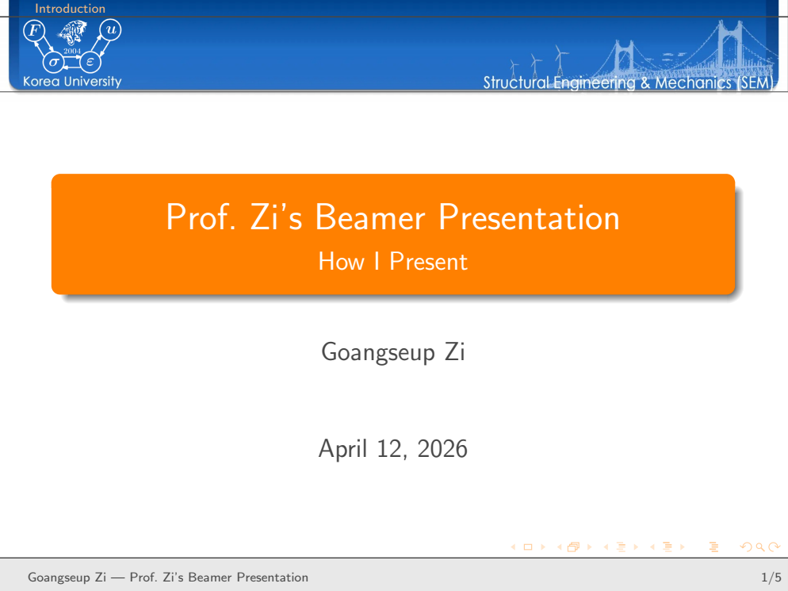
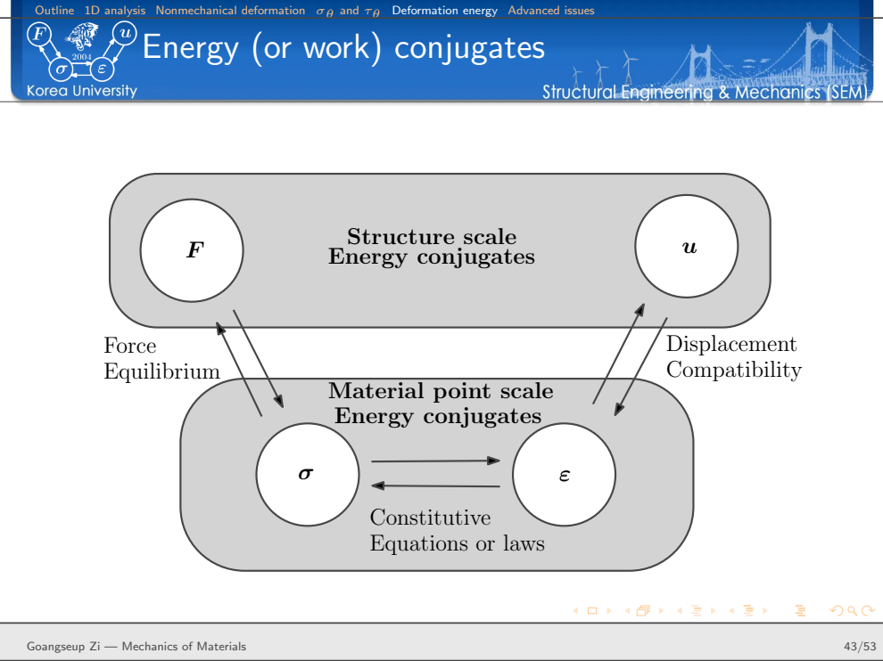

<div class="language-switch">[English](index.qmd) | **한글**</div>

많은 발표에서는 PowerPoint가 더 편하다.

그런데 나는 왜 아직도 공학 강의에 LaTeX Beamer를 사용할까?

Beamer가 더 예쁜 슬라이드를 만들어 주기 때문은 아니다. 모든 발표를 LaTeX로 만들어야 한다고 생각하는 것도 아니다. 사진이나 애니메이션이 중심이고, 레이아웃이 자주 바뀌는 짧은 발표라면 다른 도구가 더 편할 수 있다.

내가 Beamer를 쓰는 이유는 조금 다르다.

내가 가르치는 내용의 상당 부분은 오랫동안 쌓여 온 수식, 그림, 기호, 유도과정과 기술적 논리로 이루어져 있다. 강의를 준비할 때마다 이들을 다시 만들고 싶지 않다.

연구논문을 쓸 때와 강의자료를 만들 때가 **같은 기술 시스템 안에 있기를 원한다.**

> **강의는 서로 떨어진 슬라이드의 모음이 아니라, 재사용할 수 있는 하나의 기술문서여야 한다.**

그래서 나는 아직도 Beamer를 쓴다.

## 진짜 장점은 슬라이드 자체가 아니다

Beamer 발표자료도 최종적으로는 PDF가 된다.

목표가 단지 보기 좋은 페이지 여러 장을 만드는 것이라면 굳이 LaTeX를 고집할 이유는 많지 않다.

장점은 그보다 앞단, 즉 **source**에서 나타난다.

공학 강의에서는 계속 같은 종류의 객체를 사용한다.

- 수식
- 기호와 표기
- 그림
- TikZ 도면
- 참고문헌
- 정의
- 예제
- 유도과정
- 반복되는 시각적 구조

이들은 연구논문, 보고서, 책, 기술노트에서도 다시 등장한다.

LaTeX를 사용하면 이들을 발표자료에만 종속된 그림으로 만들어 버리지 않고 **구조화된 기술 콘텐츠**로 유지할 수 있다.

내 작업 흐름을 개념적으로 쓰면 다음과 같다.

```text
기술 지식
      ↓
수식 + 표기 + 그림 + 참고문헌
      ↓
LaTeX source
      ├──→ 연구논문
      ├──→ 기술노트
      ├──→ Beamer 강의
      └──→ 이후의 교육자료
```

이것은 내가 연구 글쓰기 시스템에서 사용하는 철학과 같다.

**최종 문서는 바뀌더라도 내용은 지속되어야 한다.**

## 강의 내용과 시각적 정체성을 분리한다

내 Beamer 시스템은 역할을 단순하게 나눈다.

```text
강의 내용
      ↓
lecture .tex
      ↓
beamerthemeSEM.sty
      ↓
SEM header + colors + blocks + navigation
      ↓
presentation PDF
```

강의 `.tex` 파일에는 실제로 가르치고 싶은 내용이 들어간다.

theme은 그 내용이 어떻게 보일지를 결정한다.

이 구분이 중요하다.

절 제목, block, navigation, 색상이나 header의 모양을 바꾸고 싶다고 해서 모든 강의 파일을 하나씩 수정하고 싶지는 않다.

새 강의를 만들 때마다 디자인부터 다시 시작하고 싶지도 않다.

시각적 언어는 이미 만들어져 있어야 한다.

{#fig-template fig-align="center" width="92%"}

그림 [-@fig-template]의 템플릿은 강의가 달라져도 일부러 비슷하게 보이도록 만들었다.

이 일관성이 강의를 준비할 때 결정해야 할 것을 줄여준다.

나는 디자인 대신 역학에 집중할 수 있다.

## `beamerthemeSEM.sty`가 발표 인프라를 담당한다

시각적 계층의 중심에는 `beamerthemeSEM.sty`가 있다.

연구 글쓰기 환경에서 공용 style 파일이 맡는 역할과 비슷하다.

theme은 과학기술 내용을 담는 것이 아니라 반복되는 발표 동작을 규정한다.

SEM header, frame title, block, navigation처럼 슬라이드마다 계속 등장하는 요소를 한 곳에서 관리한다.

작은 template presentation에는 title slide, objectives, outline, ordinary block, alert block, example block, 마지막 question slide가 들어 있다.

여기서 중요한 구분은 이것이다.

```text
강의 내용은 매번 바뀐다
발표 인프라는 지속된다
```

공학적으로 보면 modular design과 같은 원리다.

자주 바뀌는 부분과 안정적으로 유지할 부분을 분리한다.

## theme은 일을 줄여줄 때 가치가 있다

presentation theme을 꾸미는 데 너무 많은 시간을 쓸 수도 있다.

그렇게 되면 목적이 뒤집힌다.

개인 Beamer theme의 가치는 무한한 디자인 선택지를 준다는 데 있지 않다.

오히려 반대다.

**내가 해야 할 선택을 줄여준다.**

이미 알고 있다.

- frame title이 어떻게 보일지
- section 정보가 어디에 나타날지
- 일반 block이 어떤 모양일지
- alert는 어떻게 구분할지
- example은 어떻게 표시할지
- 발표를 어떻게 끝낼지

예를 들어 내 template에서는 standard, alert, example block이 시각적으로 구분된다.

이들은 단순히 색만 다른 것이 아니다.

강의에서 역할이 다르다.

```text
standard block  → 핵심 기술 내용
alert block     → 주의, 한계, 반드시 볼 내용
example block   → 앞의 역학을 실제 문제에 적용
```

이런 반복되는 시각 문법이 있으면 학생은 모든 문장을 읽기 전에 정보의 역할을 먼저 알 수 있다.

## 강의 source 자체가 읽을 수 있는 기술문서여야 한다

Beamer를 선호하는 두 번째 이유는 presentation source 자체가 기술문서로 남기 때문이다.

수식은 여전히 수식이다.

예를 들어

$$
\sigma = E\varepsilon
$$

를 그림으로 바꾸어 수동으로 배치할 필요가 없다.

유도과정은 수학적 문장의 연속으로 남는다.

그림은 파일을 참조한 상태로 남는다.

TikZ 그림은 기하학적 구성으로 남는다.

즉, source 안에 강의의 논리 구조가 상당 부분 보존된다.

몇 년 뒤 강의를 다시 고칠 때 이 차이가 크다.

source를 검색하고, 수식을 복사하고, 기호를 바꾸고, 유도과정을 옮기고, 그림을 다른 강의에서 다시 사용할 수 있다.

옛날 슬라이드 이미지를 보면서 다시 해석할 필요가 없다.

> **슬라이드는 출력물이다. 재사용할 자산은 기술 source다.**

## 공학 강의는 이런 방식과 특히 잘 맞는다

공학역학은 보통 서로 독립된 사실을 나열해서 가르치는 과목이 아니다.

결과는 물리적인 추론의 연쇄에서 나온다.

익숙한 축방향 변형식을 생각해 보자.

$$
u=\frac{FL}{EA}.
$$

이 식 하나를 슬라이드에 올리는 것은 쉽다.

하지만 학생에게 그렇게 이해시키고 싶지는 않다.

중요한 구조는

$$
F
\rightarrow
\sigma
\rightarrow
\varepsilon
\rightarrow
u
$$

이다.

균일한 축하중 부재에서는 평형으로부터

$$
\sigma=\frac{F}{A},
$$

구성관계로부터

$$
\varepsilon=\frac{\sigma}{E},
$$

적합조건으로부터

$$
u=\varepsilon L
$$

을 얻는다.

그 다음에야

$$
u=\frac{FL}{EA}
$$

가 나온다.

식은 추론의 시작이 아니라 **끝**이다.

기술 발표 시스템은 이런 논리를 보존하기 쉽게 만들어야 한다.

## 실제 강의는 demo template과 다르다

작은 Beamer template은 몇 장의 슬라이드로도 충분하다.

하지만 실제 강의는 훨씬 복잡하다.

예를 들어 내 축하중 부재 강의는 50장이 넘고 다음 내용이 연결되어 진행된다.

```text
축방향 응답
      ↓
변위, 변형률, 응력장
      ↓
평형
      ↓
부정정계
      ↓
비역학적 변형
      ↓
경사면의 응력
      ↓
일과 변형에너지
      ↓
심화 주제
```

이 정도 규모가 되면 template의 가치가 더 분명해진다.

section 구조가 계속 보인다.

시각적 언어가 유지된다.

수식은 같은 표기법을 쓴다.

예제를 넣을 때마다 새 레이아웃을 발명할 필요가 없다.

결국 발표자료는 안정된 틀 안에서 이어지는 하나의 긴 기술 논증이 된다.

{#fig-real-lecture fig-align="center" width="78%"}

그림 [-@fig-real-lecture]은 내가 기술 슬라이드에서 중요하게 생각하는 점을 보여준다.

모든 슬라이드가 시각적으로 화려할 필요는 없다.

때로는 **수식 자체가 콘텐츠**다.

발표 스타일은 그것을 방해하지 않고 받쳐주면 된다.

## 슬라이드 순서는 software가 아니라 mechanics가 정해야 한다

공학 강의를 만들 때 나는 문제의 물리적 논리에 따라 순서를 정하려고 한다.

축하중 부재라면 먼저 형상과 경계조건을 이상화하고, 변위장을 정의하고, 적합조건에서 변형률을 얻고, 구성법칙에서 응력을 얻고, 마지막에 평형을 만족시킬 수 있다.

부정정 문제에서는 이 구조가 특히 중요하다.

평형만으로는 충분하지 않다.

적합조건과 구성관계가 함께 들어와야 한다.

따라서 발표자료는 추가 방정식이 왜 필요한지를 보여줄 수 있다.

단순히 풀이 절차만 제시하는 것이 아니다.

여기에는 더 일반적인 교육 원칙이 있다.

> **슬라이드의 흐름은 역학의 추론을 재현해야 한다.**

software가 논증의 순서를 정하면 안 된다.

## 그림과 수식은 함께 일해야 한다

공학적 설명에서는 둘 다 필요할 때가 많다.

그림은 형상과 물리적 의미를 보여준다.

수식은 관계를 정확하게 표현한다.

둘 중 하나가 항상 슬라이드를 지배해야 하는 것은 아니다.

그래서 내 강의자료에서는 문제에 따라 여러 배치를 사용한다.

- 그림 옆에 수식
- 그림 아래 compact block
- 유도과정이 frame 대부분을 차지하는 구성
- 관련 그림 두 개를 나란히 배치
- 개념도를 거의 슬라이드 전체에 배치

학생이 무엇을 보아야 하는지에 따라 layout을 정한다.

일관된 theme이 필요하지만 모든 슬라이드의 배치가 같을 필요는 없다.

일관성이란 모든 슬라이드가 똑같이 생긴다는 뜻이 아니다.

**다른 배치라도 같은 발표 언어에 속한다는 뜻이다.**

## Beamer는 Z Diagram과도 자연스럽게 연결된다

내 재료역학 강의에서 특히 중요한 예가 하나 있다.

일과 변형에너지를 설명한 뒤 구조 수준과 재료점 수준의 표현을 에너지 켤레성(energy conjugacy)으로 연결한다.

구조 수준에서는

$$
(F,u)
$$

가 에너지 켤레쌍이고,

재료점 수준에서는

$$
(\sigma,\varepsilon)
$$

가 또 하나의 켤레쌍이다.

이들을 연결하면

$$
F
\leftrightarrow
\sigma
\leftrightarrow
\varepsilon
\leftrightarrow
u
$$

가 된다.

평형은 힘과 응력을 연결한다.

구성법칙은 응력과 변형률을 연결한다.

적합조건은 변형률과 변위를 연결한다.

그리고 에너지는 구조 수준과 재료점 수준을 더 깊게 연결한다.

{#fig-zdiagram fig-align="center" width="78%"}

증분 외력 일은

$$
dW_{\mathrm{ext}} = F\,du,
$$

이고, 여기서 사용한 1차원 형태의 내부 일은

$$
dW_{\mathrm{int}}
=
\int_{\Omega}
\sigma\,d\varepsilon\,d\Omega
$$

로 쓸 수 있다.

이 관계는 나중에 내가 **Z Diagram**이라고 부르는 틀의 일부가 되었다.

이 예가 바로 지속적인 기술 source가 중요한 이유를 보여준다.

어떤 생각은 강의에서 처음 등장할 수 있다.

이후 반복되는 교육의 틀이 될 수 있다.

다른 강의, 기술 글, 더 넓은 역학 설명으로 이어질 수도 있다.

슬라이드는 일시적이다.

**아이디어는 그렇지 않다.**

## 재사용은 완성된 슬라이드를 복사하는 것이 아니다

여기서 구분해야 할 것이 있다.

완성된 슬라이드를 엄청나게 많이 모아 놓고 새 강의에 그대로 복사하는 것이 목표는 아니다.

그렇게 하면 기호가 서로 다르고 이야기의 흐름이 약한 발표가 되기 쉽다.

내가 재사용하고 싶은 것은 **기술 객체**다.

```text
수식
그림
TikZ 도면
정의
표기
참고문헌
유도과정
개념도
```

이들은 새로운 목적에 맞게 다시 배열할 수 있다.

연구논문과 강의에서 같은 수식을 쓰더라도 설명 방식은 다를 수 있다.

학술대회 발표에서는 같은 그림을 쓰되 다른 결과를 강조할 수 있다.

대학원 강의에서는 연구발표에서 생략한 유도과정이 필요할 수도 있다.

즉, 재사용은 **완성된 슬라이드보다 아래 단계**에서 일어난다.

그래야 더 유연하다.

## 연구 글쓰기 시스템과 연결된다

이 Beamer workflow는 내가 논문을 쓰는 방식과 따로 떨어져 있지 않다.

연구 글쓰기 시스템도 지속적인 LaTeX 인프라를 중심으로 한다.

공용 패키지, 공용 명령어, 안정된 표기, 재사용 가능한 그림, master reference system을 사용한다.

그래서 연구에서 교육으로 넘어갈 때 비교적 직접적으로 연결할 수 있다.

```text
연구 프로젝트
      ↓
논문
      ↓
수식 + 그림 + 표기 + 참고문헌
      ↓
Beamer
      ↓
연구발표 또는 강의
```

논문에서 정성스럽게 만든 수식을 presentation software에서 다시 만들 필요가 없다.

기술 그림도 재사용할 수 있다.

수학 명령어는 같은 표기법을 유지시킨다.

참고문헌도 같은 bibliographic system에 연결할 수 있다.

이 시스템은 오래 사용할수록 더 가치가 커진다.

새로운 문서 하나하나가 같은 기술환경에 재사용 가능한 자료를 추가하기 때문이다.

## 일관성은 단순한 미관의 문제가 아니다

같은 Beamer theme을 쓰면 강의가 시각적으로 통일된다.

하지만 공학에서는 일관성이 더 중요한 역할을 한다.

기호가 일관되어야 한다.

부호 규약이 일관되어야 한다.

좌표계가 일관되어야 한다.

같은 기호가 세 장 뒤에서 조용히 다른 뜻으로 바뀌어서는 안 된다.

시각적 시스템이 이런 규율을 도와줄 수는 있지만 대신할 수는 없다.

내가 강의자료를 source 형태로 유지하는 장점 중 하나는 이런 기술적 불일치를 찾고 고치기 쉽다는 것이다.

연구 글쓰기에서도 같은 원칙이 적용된다.

> **표현의 일관성이 중요한 이유는 사고의 일관성을 지지하기 때문이다.**

## Beamer가 잘 못하는 것도 있다

나는 아직 Beamer를 쓰지만 모든 발표에 이상적이라고 생각하지는 않는다.

분명한 단점이 있다.

그래픽 프로그램처럼 객체를 끌어다 놓는 것보다 layout 수정이 느릴 수 있다.

사진 중심의 발표는 다른 도구에서 더 빨리 만들 수 있다.

복잡한 animation은 Beamer의 장점이 아니다.

수학이 거의 없는 일회성 발표라면 LaTeX workflow의 이득이 크지 않을 수도 있다.

그리고 Beamer로 만들었다고 좋은 발표가 되는 것도 아니다.

지나치게 빽빽하고 따라가기 어려운 슬라이드는 어떤 도구로도 만들 수 있다.

Beamer를 쓰는 이유는 취향이나 이념이 아니다.

실용적인 이유다.

> **발표자료가 더 큰 재사용 가능한 기술 지식체계의 일부일 때 Beamer의 가치가 커진다.**

내 공학 강의의 상당 부분이 바로 그런 경우다.

## 내가 최적화하려는 것은 오늘 슬라이드 한 장의 제작시간이 아니다

오늘 한 장의 슬라이드를 만드는 시간만 최소화하려 한다면 다른 도구를 선택할 수도 있다.

하지만 내가 최적화하는 것은 **기술 콘텐츠의 수명**이다.

강의는 내년에 다시 할 수 있다.

한 수식은 다른 과목에 다시 등장할 수 있다.

한 그림은 연구발표에도 사용할 수 있다.

유도과정은 나중에 Engineering Mechanics 글이 될 수 있다.

하나의 개념적 관계가 나중에는 Z Diagram의 일부가 될 수도 있다.

그래서 기술 내용이 그날의 발표가 끝난 뒤에도 살아남는 시스템을 선호한다.

효과는 누적된다.

```text
첫 강의
    ↓
재사용 가능한 source
    ↓
수정
    ↓
다른 강의
    ↓
연구발표
    ↓
기술 글
    ↓
장기 지식 시스템
```

오래 사용할수록 시스템의 가치가 커진다.

## 결국 왜 아직도 Beamer를 쓰는가?

내가 LaTeX Beamer를 계속 쓰는 이유를 단순히 "공학자는 수식을 많이 쓰기 때문"이라고 설명하고 싶지는 않다.

더 중요한 이유는 **공학 지식이 매우 재사용 가능하기 때문**이다.

수식, 표기, 그림, 유도과정과 개념도를 전달 형식이 바뀔 때마다 다시 만들 필요는 없다.

그래서 내 Beamer 시스템은 연구 글쓰기 시스템과 같은 원칙을 따른다.

> **지속적으로 남아야 할 기술 콘텐츠와 일시적인 표현 형식을 분리한다.**

그리고 역학을 가르칠 때는 한 가지 원칙을 더 붙이고 싶다.

> **슬라이드의 순서는 presentation software의 기능이 아니라 역학의 구조가 결정해야 한다.**

이것이 내가 아직도 공학 강의에 LaTeX Beamer를 쓰는 이유다.

## Further reading

이 글은 내가 실제로 사용하는 SEM Beamer template과 재료역학 강의노트를 바탕으로 작성했다.

관련 연구 글쓰기 workflow는 다음 글에서 설명한다.

[**연구 글쓰기를 위한 재사용 가능한 LaTeX 시스템을 어떻게 만들었는가**](../latex-research-workflow/)

강의에서 사용하는 역학적 연결 구조는 Zi’s Structural Engineering & Mechanics의 Z Diagram 부분과 이어진다.
