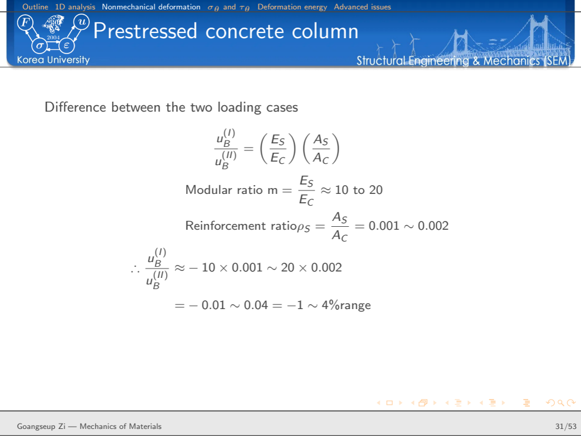

PowerPoint is easier for many presentations.

So why do I still use LaTeX Beamer for engineering lectures?

The answer is not that Beamer produces prettier slides, or that every presentation should be written in LaTeX. For a short presentation dominated by photographs, animations, or rapidly changing layouts, another tool may be more convenient.

My reason is different.

Much of what I teach is built from equations, diagrams, notation, derivations, and technical arguments that have accumulated over many years. I do not want to reconstruct those objects every time I prepare a lecture.

I want the presentation to belong to the same technical system as my research writing.

> **A lecture should not be a collection of isolated slides. It should be a reusable technical document.**

That is why I still use Beamer.

## The real advantage is not the slide

A Beamer presentation ultimately becomes a PDF, just as a presentation created with other software can.

If the only objective were to produce a sequence of attractive pages, there would be little reason to insist on LaTeX.

The advantage appears earlier, in the source.

An engineering lecture repeatedly uses the same kinds of objects:

- equations,
- symbols and notation,
- figures,
- TikZ drawings,
- references,
- definitions,
- examples,
- derivations,
- and recurring visual structures.

These objects also appear in research papers, reports, books, and technical notes.

LaTeX allows them to remain structured technical content rather than becoming presentation-specific graphics.

Conceptually, my workflow is

```text
technical knowledge
      ↓
equations + notation + figures + references
      ↓
LaTeX source
      ├──→ research paper
      ├──→ technical note
      ├──→ Beamer lecture
      └──→ later teaching material
```

This is the same philosophy behind my research-writing system: the content should be persistent even when the final document changes.

## I separate the lecture from its visual identity

My Beamer setup has a simple division of responsibilities.

```text
lecture content
      ↓
lecture .tex file
      ↓
beamerthemeSEM.sty
      ↓
SEM header + colors + blocks + navigation
      ↓
presentation PDF
```

The lecture file contains the material I actually want to teach.

The theme controls how that material looks.

That separation matters.

If I decide to modify the appearance of section headings, blocks, navigation, colors, or the header, I should not have to edit every lecture individually.

Likewise, when I prepare a new lecture, I should not have to redesign the presentation.

The visual language already exists.

{#fig-template fig-align="center" width="92%"}

The template in Figure @fig-template is intentionally recognizable from lecture to lecture.

That consistency reduces decisions during preparation.

I can concentrate on the mechanics.

## `beamerthemeSEM.sty` is the presentation infrastructure

The central visual layer is my Beamer theme, `beamerthemeSEM.sty`.

Its purpose is similar to the role played by shared style files in my research-writing environment.

The theme establishes recurring presentation behavior rather than scientific content.

For example, it controls the persistent SEM header and the appearance of the presentation elements that recur across slides.

My small template presentation demonstrates the resulting visual vocabulary: a title slide, objectives, an outline, ordinary blocks, alert blocks, example blocks, and the closing question slide.

The distinction is important:

```text
content changes every lecture
presentation infrastructure persists
```

This is essentially the same engineering principle as modular design.

Separate the part that changes frequently from the part that should remain stable.

## A theme is useful only if it reduces work

It is easy to spend too much time designing a presentation theme.

That would defeat the purpose.

The value of a personal Beamer theme is not that it provides unlimited visual possibilities. Its value is almost the opposite.

It deliberately limits the choices I have to make.

I already know:

- how a frame title will look,
- where the section information will appear,
- how an ordinary block will look,
- how an alert will be distinguished,
- how an example will be identified,
- and how the presentation will end.

For example, the template uses visually distinct standard, alert, and example blocks.

These are not merely different colors.

They can carry different roles in the lecture:

```text
standard block  → main technical statement
alert block     → warning, limitation, or point requiring attention
example block   → application of the preceding mechanics
```

A recurring visual grammar helps the student recognize the role of the information before reading every word.

## The source of a lecture should remain readable

A second reason I prefer Beamer is that the presentation source itself remains a technical document.

An equation is still an equation.

For example,

$$
\sigma = E\varepsilon
$$

does not have to be converted into an image and positioned manually.

A derivation can remain a sequence of mathematical statements.

A figure can remain a referenced file.

A TikZ drawing can remain a geometrical construction.

The source therefore preserves much of the logical structure of the lecture.

This matters when the material is revised years later.

I can search the source, copy an equation, change notation, move a derivation, or reuse a figure without reverse-engineering an old slide.

> **The slide is an output. The technical source is the reusable asset.**

## Engineering lectures are unusually well suited to this approach

Engineering mechanics is not usually taught as a sequence of independent facts.

A result follows from a chain of physical reasoning.

Consider the familiar axial-bar relation

$$
u=\frac{FL}{EA}.
$$

It is easy to put this formula on a slide.

But that is not how I want students to understand it.

The important structure is

$$
F
\rightarrow
\sigma
\rightarrow
\varepsilon
\rightarrow
u.
$$

For a uniform axially loaded member,

$$
\sigma=\frac{F}{A},
$$

from equilibrium,

$$
\varepsilon=\frac{\sigma}{E},
$$

from the constitutive relation, and

$$
u=\varepsilon L,
$$

from compatibility.

Only then do we obtain

$$
u=\frac{FL}{EA}.
$$

The equation is the end of the reasoning, not the beginning.

A technical presentation system should make it easy to preserve that reasoning.

## A real lecture is different from a demonstration template

My small Beamer template contains only five slides.

A real lecture is much more demanding.

For example, my lecture on axially loaded members contains more than fifty slides and moves through several connected subjects:

```text
axial response
      ↓
displacement, strain, and stress fields
      ↓
equilibrium
      ↓
statically indeterminate systems
      ↓
nonmechanical deformation
      ↓
stress on inclined sections
      ↓
work and deformation energy
      ↓
advanced issues
```

The value of the template becomes much clearer at this scale.

The section structure remains visible.

The visual language remains unchanged.

Equations use the same notation.

Examples can be inserted without inventing a new layout each time.

The presentation becomes a long technical argument held together by a stable framework.

{#fig-real-lecture fig-align="center" width="78%"}

Figure @fig-real-lecture illustrates something I value in technical slides: not every slide needs to be visually elaborate.

Sometimes the equation *is* the content.

The presentation style should support it rather than compete with it.

## Slides should follow the mechanics, not the software

When preparing engineering lectures, I try to organize the sequence according to the physical logic of the problem.

For an axial member, for example, I can begin by idealizing the geometry and boundary conditions, define the displacement field, obtain strain from compatibility, obtain stress from the constitutive law, and finally enforce equilibrium.

This is particularly useful for statically indeterminate problems.

Equilibrium alone is not enough.

Compatibility and constitutive behavior must enter the analysis.

The presentation can therefore reveal why additional equations appear rather than merely presenting a solution procedure.

This is a broader teaching principle:

> **A slide sequence should reproduce the reasoning of the mechanics.**

The software should not determine the argument.

## Figures and equations should work together

Engineering explanation often requires both.

A figure establishes geometry and physical meaning.

An equation expresses the relationship precisely.

Neither should automatically dominate the slide.

My lecture materials therefore use several arrangements depending on the problem:

- figure beside equations,
- figure above a compact block,
- derivation occupying most of the frame,
- two related diagrams side by side,
- or a conceptual diagram occupying nearly the whole slide.

The layout is chosen according to what the student needs to see.

This is another reason I prefer a reusable theme rather than a rigid slide template.

Consistency does not mean that every slide must have the same arrangement.

It means that different arrangements should still belong to the same presentation language.

## Beamer also connects naturally to the Z Diagram

One example from my Mechanics of Materials lecture is particularly important to me.

After introducing work and deformation energy, the lecture connects the structural and material descriptions through energy conjugacy.

At the structural scale,

$$
(F,u)
$$

is an energy-conjugate pair.

At the material-point scale,

$$
(\sigma,\varepsilon)
$$

is another.

The connections are

$$
F
\leftrightarrow
\sigma
\leftrightarrow
\varepsilon
\leftrightarrow
u.
$$

Equilibrium connects force and stress.

The constitutive law connects stress and strain.

Compatibility connects strain and displacement.

And energy provides a deeper connection between the two levels.

{#fig-zdiagram fig-align="center" width="78%"}

For incremental work,

$$
dW_{\mathrm{ext}} = F\,du,
$$

while internal work is expressed through

$$
dW_{\mathrm{int}}
=
\int_{\Omega}
\sigma\,d\varepsilon\,d\Omega
$$

for the one-dimensional form represented here.

This relationship eventually became part of what I call the **Z Diagram**.

That is a good example of why I value persistent technical source material.

An idea may first appear in a lecture.

Later it may become a recurring teaching framework.

It may then be reused in another course, a technical article, or a broader explanation of mechanics.

The slide is temporary.

The idea is not.

## Reuse does not mean copying entire slides

There is an important distinction.

I do not think the objective should be to accumulate a huge library of finished slides and copy them unchanged into new lectures.

That often produces presentations with inconsistent notation and weak narrative flow.

What I want to reuse are the **technical objects**:

```text
equations
figures
TikZ drawings
definitions
notation
references
derivations
conceptual diagrams
```

These objects can be reorganized for a new purpose.

A research paper and a lecture may use the same equation but explain it differently.

A conference presentation may use the same figure but emphasize a different result.

A graduate lecture may require a derivation that a research talk can omit.

Reuse therefore occurs below the level of the finished slide.

That makes the system more flexible.

## The connection to my research-writing system

This Beamer workflow is not independent of the way I write papers.

My research-writing system is also based on persistent LaTeX infrastructure: shared packages, shared commands, stable notation, reusable figures, and a master reference system.

That means the transition from research to teaching can be relatively direct.

```text
research project
      ↓
paper
      ↓
equations + figures + notation + references
      ↓
Beamer
      ↓
research presentation or lecture
```

An equation developed carefully in a paper does not have to be recreated in presentation software.

A technical figure can be reused.

A mathematical command can preserve notation.

A reference can remain connected to the same bibliographic system.

The value becomes larger with time because each new document contributes reusable material to the same technical environment.

## Consistency is not merely cosmetic

A consistent Beamer theme obviously produces a recognizable appearance.

But in engineering, consistency has a more important role.

Notation must remain consistent.

Sign conventions must remain consistent.

Coordinate systems must remain consistent.

The same symbol should not quietly acquire a different meaning three slides later.

The visual system can help reinforce this discipline, but it cannot replace it.

For me, one of the advantages of maintaining the lecture in source form is that these technical inconsistencies are easier to find and correct.

The same principle appears in research writing:

> **Consistency of presentation is useful because it supports consistency of thought.**

## What Beamer does poorly

I still use Beamer, but that does not mean it is ideal for every presentation.

It has real disadvantages.

Layout changes can take longer than dragging objects in graphical presentation software.

Highly visual presentations may be faster to build elsewhere.

Complex animations are not Beamer's natural strength.

A one-off presentation with little mathematics may gain very little from a LaTeX workflow.

And a badly designed Beamer presentation can be just as overcrowded and difficult to follow as a badly designed presentation made with any other software.

The tool does not create good teaching.

The reason to use Beamer is therefore not ideological.

It is practical:

> **Beamer is valuable when the presentation belongs to a larger body of reusable technical knowledge.**

That describes much of my engineering teaching.

## What I optimize for

If I were optimizing only for the time required to create today's slide, I might choose differently.

But that is not my objective.

I am optimizing for the life of the technical material.

A lecture may be taught again next year.

An equation may appear in another course.

A diagram may become part of a research presentation.

A derivation may later be rewritten as an Engineering Mechanics article.

A conceptual relationship may eventually become part of the Z Diagram.

So I prefer a system in which the technical content survives its immediate presentation.

The benefit is cumulative.

```text
first lecture
    ↓
reusable source
    ↓
revision
    ↓
another lecture
    ↓
research presentation
    ↓
technical article
    ↓
long-term knowledge system
```

The longer the system is used, the more valuable it becomes.

## Engineering takeaway

The reason I still use LaTeX Beamer is not simply that engineers use equations.

It is that engineering knowledge is highly reusable.

Equations, notation, figures, derivations, and conceptual diagrams should not have to be rebuilt whenever the communication format changes.

My Beamer system therefore follows the same principle as my research-writing system:

> **Separate persistent technical content from temporary presentation format.**

And for teaching mechanics, I would add one more rule:

> **Let the structure of the mechanics determine the sequence of the slides—not the capabilities of the presentation software.**

That is why I still use LaTeX Beamer for engineering lectures.

## Further reading

This article is based on my own SEM Beamer template and my Mechanics of Materials lecture notes.

For the related writing workflow, see:

[**How I Built a Reusable LaTeX System for Research Writing**](../latex-research-workflow/)

For the mechanics framework used in the lecture, see the Z Diagram section of Zi’s Structural Engineering & Mechanics.
