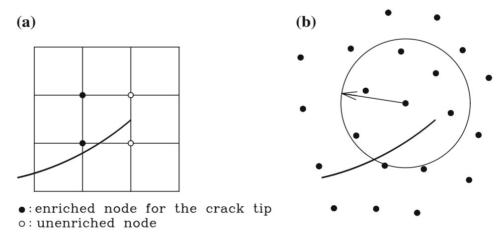
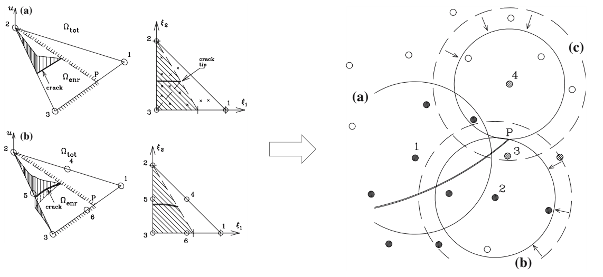
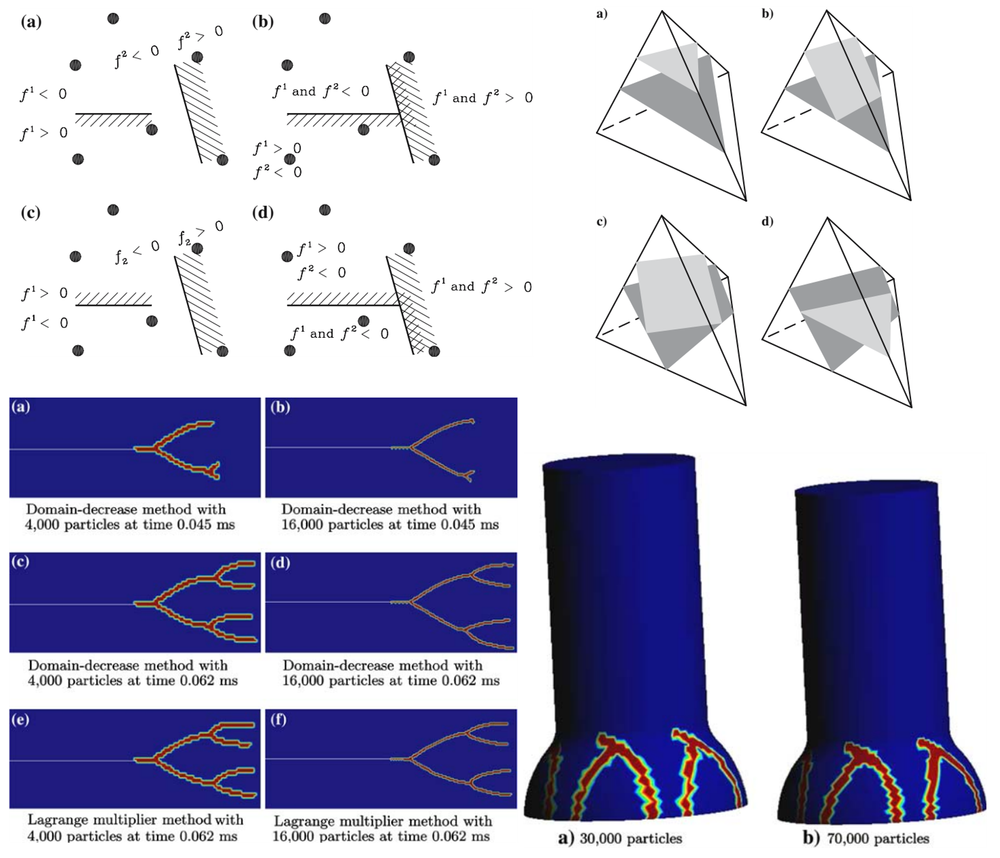

<div class="language-switch">[English](index.qmd) | **한글**</div>

**계산파괴역학 시리즈:** [← 전체 보기](../computational-fracture-overview/index-ko.qmd) · [← XFEM](../xfem-crack-through-mesh/index-ko.qmd) · 7편 중 3편 · [다음: 다중균열 →](../multiple-cracks-fracture-network/index-ko.qmd)

XFEM은 계산파괴역학의 중요한 전제를 하나 바꾸었다. 균열이 더 이상 유한요소망과 일치할 필요가 없어졌다. 대신 균열 때문에 생기는 불연속을 표현할 수 있도록 근사공간을 확충하면 균열은 요소경계와 독립적으로 움직일 수 있다.

그러면 자연스럽게 이런 질문이 생긴다.

> **핵심이 근사공간의 확충이라면 반드시 유한요소망을 사용해야 할 이유가 있을까?**

이 질문에서 **확장무요소법(extended element-free Galerkin method, XEFG)**으로 이어졌다. Timon Rabczuk 교수와 공동연구자들과 함께 XFEM의 단위의 분할(partition of unity) 개념을 무요소 근사에 적용하여 점성파괴, 동적 균열전파, 나아가 3차원 균열의 발생, 분기와 접합까지 다루었다.

## 요소에서 영향영역으로

유한요소법에서는 요소와 절점의 연결관계로 근사공간을 구성한다. EFG에서는 입자 또는 절점이 주변의 일정 영역에 영향을 미치며 이 영향영역을 이용해 근사공간을 만든다.

$$
\mathbf{u}^h(\mathbf{x})=\sum_{I=1}^{n}\Phi_I(\mathbf{x})\mathbf{u}_I
$$

$\Phi_I$는 보통 이동최소제곱법(moving least squares)으로 만드는 무요소 형상함수다. 고정된 요소 연결관계 대신 각 입자가 자기 **영향영역(domain of influence)** 안에서 근사에 기여한다.

하지만 무요소법이라고 균열을 저절로 표현하는 것은 아니다.

$$
[\![\mathbf{u}]\!] \neq \mathbf{0}
$$

이라는 불연속 정보는 여전히 별도로 표현해야 한다.

## 근사공간의 확충이라는 생각은 그대로 남는다

$$
\mathbf{u}^h(\mathbf{x})
=
\sum_I\Phi_I(\mathbf{x})\mathbf{u}_I
+
\sum_{J\in\mathcal{N}_{\mathrm{enr}}}
\Phi_J(\mathbf{x})\Psi_J(\mathbf{x})\mathbf{a}_J
$$

XFEM과 식의 구조가 비슷하다. 배경 근사가 $N_I$에서 $\Phi_I$로 바뀌었을 뿐이다.

> **XFEM과 XEFG는 같은 생각을 서로 다른 배경 근사에 구현한 것이다. 배경 이산화는 기본 근사를 제공하고, 근사공간의 확충은 그 기본 근사가 표현하지 못하는 정보를 추가한다.**

## 하지만 입자의 support는 요소와 다르다

유한요소에는 명확한 요소경계가 있지만 무요소 입자에는 영향영역이 있다. 균열은 support를 전혀 자르지 않을 수도 있고, 완전히 가를 수도 있으며, 균열선단이 support 내부에서 끝날 수도 있다.

```text
균열이 지나가지 않는 support → 일반 입자
균열이 완전히 가르는 support → 불연속 변위공간의 확충
균열이 일부만 가르는 support → 균열선단 처리가 중요
```

따라서 XFEM에서 XEFG로 가는 것은 형상함수 기호 하나를 바꾸는 문제가 아니다.

{#fig-xefg-support fig-align="center" width="78%"}

그림 [-@fig-xefg-support]에서 중요한 것은 물리적인 불연속은 같지만 그 정보를 관리하는 수치적인 방식이 달라진다는 점이다.

## 파괴문제에서 무요소법이 매력적이었던 이유

파괴가 진행되면 기하형상이 계속 바뀐다. 무요소법은 고정된 요소 연결관계에 덜 의존하므로 다중균열, 분기, 접합, 대변형, 3차원 균열면처럼 기하가 크게 변하는 문제에 매력적이다.

그렇다고 흐름이 `FEM이 나쁘다 → 무요소법을 쓰자`는 것은 아니다.

```text
파괴는 기하형상과 독립적인 표현이 필요하다
        ↓
XFEM은 유한요소의 근사공간을 확충한다
        ↓
무요소 근사는 또 다른 유연한 배경 근사를 제공한다
        ↓
XEFG는 그 근사공간도 확충한다
```

## 점성파괴에서는 균열선단 문제가 다시 달라진다

점성균열에서는

$$
\mathbf{t}=\mathbf{t}\left([\![\mathbf{u}]\!]\right)
$$

이고 점성응력이 감소하면서 균열개구가 점진적으로 증가한다. 균열선단에서는 개구가 0으로 수렴해야 한다. 따라서 균열선단을 포함하는 support에서는 불연속이 그 안에서 끝날 수 있어야 한다.

## 왜 branch enrichment를 사용하지 않을 수 있는가?

고전적인 XFEM은 LEFM 점근해의 균열선단 branch function을 흔히 사용한다. 그러나 점성파괴에서는 cohesive zone이 균열선단장을 정규화한다.

> **구성모델에서 균열선단의 특이성을 요구하지 않는데 수치 근사에 굳이 특이 균열선단장을 넣어야 할까?**

XEFG 연구에서는 점성균열에 대해 branch enrichment를 사용하지 않는 방법을 개발했다. 임의의 균열전파를 단순하게 만들면서 근사공간을 점성파괴의 역학과 더 잘 맞추기 위한 선택이었다.

> **근사공간의 확충에는 필요한 물리정보를 넣어야지, 필요하지 않은 수학적 구조까지 넣을 이유는 없다.**

{#fig-xefg-no-branch fig-align="center" width="78%"}

그림 [-@fig-xefg-no-branch]에서 중요한 것은 근사공간의 확충이 **빠져 있는 운동학**을 추가해야 한다는 점이다.

## 균열은 여전히 배경 근사와 독립적이다

XEFG에서는 입자, 영향영역, 균열기하, 근사공간의 확충, 점성 구성법칙, 균열전파 기준을 서로 분리해서 다룬다. 균열이 성장할 때마다 입자를 재배치하는 대신 균열기하와 영향을 받는 support의 확충 상태를 갱신한다.

계산문제는 재요소망 생성에서 **확충된 support와 진화하는 불연속 기하를 관리하는 문제**로 바뀐다.

## 무요소법이라고 수치적분이 없어지는 것은 아니다

약형에는 여전히 영역적분이 있다. 균열이 support나 적분 셀을 가르면 integrand가 불연속이 될 수 있으므로 수치적분 역시 균열기하를 반영해야 한다.

> **근사공간이 기하형상과 독립적이라고 해서 기하형상이 중요하지 않은 것은 아니다.**

균열의 위치는 어떤 입자를 확충할지, 불연속의 양쪽을 어떻게 구분할지, 점성응력을 어디에 적용할지, 균열을 어느 방향으로 성장시킬지를 결정한다.

## 3차원에서 진짜 어려움이 보인다

2차원에서는 균열이 선이고 그 끝이 균열선단이다. 3차원에서는 균열이 면이고 그 경계가 균열전면이다. 전면은 휘어지고 위치마다 서로 다른 방향으로 성장할 수 있으며, 균열면끼리 만나거나 분기할 수도 있다.

```text
2차원
균열선 + 균열선단

3차원
균열면 + 균열전면 + 진화하는 면의 위상
```

어려움은 변위성분이 2개에서 3개로 늘어난 데 있지 않다. **추적해야 하는 기하학적 대상 자체가 달라진다.**

{#fig-xefg-3d fig-align="center" width="82%"}

그림 [-@fig-xefg-3d]에서 보듯 3차원에서는 물리적으로 타당한 **균열면과 균열전면**을 진화하는 배경 근사 안에서 계속 유지해야 한다.

## 균열 접합은 다음 문제로 이어진다

두 균열이 만나면 **불연속 네트워크의 위상 자체가 바뀐다.** XEFG에서는 전체 배경 이산화를 다시 만들지 않고 균열기하와 영향을 받는 support를 갱신할 수 있지만, 균열전면의 방향, 접합기하, 적분영역과 물리적으로 타당한 전파를 유지하는 문제는 남는다.

## XEFG는 XFEM보다 무엇을 얻는가?

XEFG가 더 유연하니 항상 더 좋다고 말하면 곤란하다. XFEM은 성숙한 FE 기반구조, 기존 코드와의 연결, 효율적인 sparse topology, 잘 정립된 적분과 조립절차라는 장점이 있다.

XEFG는 고정 요소 연결관계가 없고 support를 유연하게 정의할 수 있으며 대변형과 복잡하게 진화하는 기하에 매력적이다. 반면 이동최소제곱 형상함수, support 크기, 적분, 필수경계조건, 계산비용과 3차원 복잡성이라는 비용이 따른다.

좋은 질문은 `XFEM과 XEFG 중 어느 것이 더 좋은가?`가 아니다.

> **이 파괴문제에서 가장 어려운 부분을 표현하기에 어떤 배경 근사가 더 적절한가?**

## XFEM에서 XEFG로 가도 변하지 않는 것은 무엇인가?

배경 근사가 달라져도 파괴역학은 여전히 불연속 변위장, 균열선단에서의 closure, 점성파괴의 traction-opening 법칙, 균열발생 기준, 균열전파 방향, 파괴에너지 소산과 진화하는 균열기하의 일관된 처리를 요구한다.

> **수치적인 framework를 바꾼다고 근사공간이 만족해야 하는 물리가 바뀌는 것은 아니다.**

## XEFG를 근사공간 설계의 문제로 보면

배경 근사

$$
\{\Phi_I\}
$$

를 선택하고, 그 근사로 표현할 수 없는

$$
[\![\mathbf{u}]\!] \neq 0
$$

이라는 정보를 찾은 뒤,

$$
\Phi_I\Psi
$$

와 같은 함수를 추가한다. 그리고 진화하는 균열기하를 보고 필요한 위치에만 활성화한다.

```text
배경 근사를 선택한다
        ↓
빠져 있는 해의 특성을 찾는다
        ↓
근사공간을 확충한다
        ↓
필요한 곳에만 국부적으로 적용한다
        ↓
물리가 변함에 따라 갱신한다
```

XFEM은 이 생각을 유한요소 안에서 보여주었고, XEFG는 배경 근사가 달라져도 같은 논리가 유지될 수 있음을 보여주었다.

## XEFG에서 다음 문제로: 여러 균열

요소망과 균열이 기하학적으로 독립되면 다음 자연스러운 문제는 하나의 균열이 아니라 **파괴 네트워크**다. 여러 균열은 발생하고, 상호작용하고, 차폐 또는 증폭하고, 분기하고, 합체하고, 접합한다.

이제 어려운 것은 하나의 불연속을 표현하는 것이 아니다.

**진화하는 불연속의 위상**을 표현해야 한다.

## 결국 핵심은

XFEM에서 XEFG로 넘어간 과정이 보여주는 것은 간단하다.

근사공간의 확충이라는 생각은 유한요소법의 전유물이 아니다.

**근사이론의 문제다.**

배경 수치기법은 매끄러운 장을 표현하기 위한 기본 근사를 제공하고, 근사공간의 확충은 그 기본 근사에 빠져 있는 특성을 추가한다. 파괴문제에서는 그것이 불연속이다.

> **배경 근사가 유한요소인가 무요소인가가 아니다. 균열이 요구하는 운동학이 근사공간 안에 들어 있는가가 중요하다.**

더 일반적으로 말하면,

> **수치적인 scaffold는 편의에 따라 선택하되, 근사공간은 물리에 맞추어 설계하자.**

---

## 시리즈 계속 읽기

[← **이전: XFEM은 어떻게 균열이 요소망을 가로질러 지나가게 하는가?**](../xfem-crack-through-mesh/index-ko.qmd)

[**시리즈 전체: 계산파괴역학은 왜 어려운가?**](../computational-fracture-overview/index-ko.qmd)

[**다음: 여러 균열은 어떻게 분기하고 만나 파괴 네트워크를 만드는가? →**](../multiple-cracks-fracture-network/index-ko.qmd)

## Original research


Rabczuk, T., & Zi, G. (2007).  
**A meshfree method based on the local partition of unity for cohesive cracks.**  
*Computational Mechanics, 39*, 743–760.  
https://doi.org/10.1007/s00466-006-0067-4

Zi, G., Rabczuk, T., & Wall, W. (2007).  
**Extended meshfree methods without branch enrichment for cohesive cracks.**  
*Computational Mechanics, 40*, 367–382.  
https://doi.org/10.1007/s00466-006-0115-0

Rabczuk, T., Bordas, S., & Zi, G. (2007).  
**A three-dimensional meshfree method for continuous multiple-crack initiation, propagation and junction in statics and dynamics.**  
*Computational Mechanics, 40*, 473–495.  
https://doi.org/10.1007/s00466-006-0122-1

Bordas, S., Rabczuk, T., & Zi, G. (2008).  
**Three-dimensional crack initiation, propagation, branching and junction in non-linear materials by an extended meshfree method without asymptotic enrichment.**  
*Engineering Fracture Mechanics, 75*, 943–960.

Rabczuk, T., Bordas, S., & Zi, G. (2010).  
**On three-dimensional modelling of crack growth using partition of unity methods.**  
*Computers & Structures, 88*, 1391–1411.
