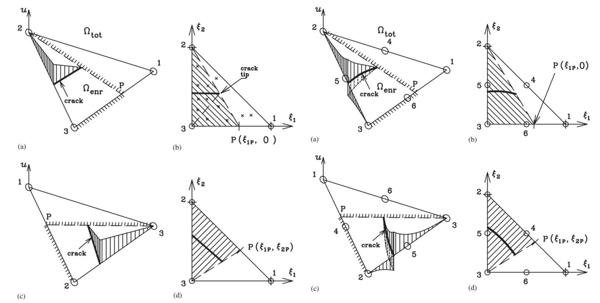
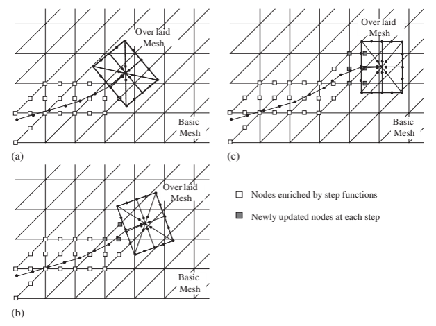
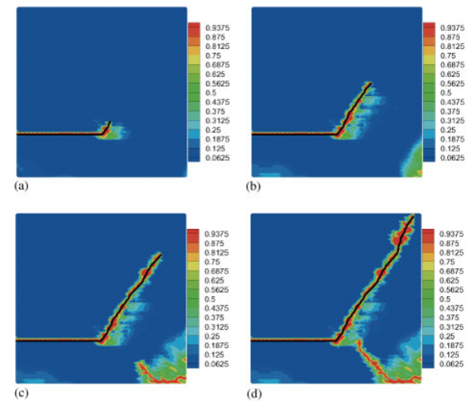

<div class="language-switch">[English](index.qmd) | **한글**</div>

**계산파괴역학 시리즈:** [← 전체 보기](../computational-fracture-overview/index-ko.qmd) · 7편 중 2편 · [다음: XEFG →](../xefg-why-meshfree/index-ko.qmd)

일반적인 유한요소해석에서 요소망은 두 가지 일을 동시에 한다.

물체를 이산화하고, 동시에 그 물체 안에서 표현할 수 있는 변위장의 형태도 강하게 제한한다.

대부분의 구조문제에서는 이것이 문제가 되지 않는다.

파괴는 다르다.

균열이 생기면 요소 내부를 가로질러 변위가 불연속적으로 변할 수 있다. 그런데 기존 유한요소 근사를 그대로 사용하면 하나의 요소 내부에서 그런 변위 점프를 표현할 수 없다.

전통적인 해결방법은 명확하다.

> 균열을 따라 요소망을 만들자.

물론 가능하다.

문제는 균열이 움직이면 요소망도 같이 움직여야 한다는 것이다.

확장유한요소법(extended finite element method, XFEM)은 여기서 질문을 바꾼다.

> **왜 요소망이 균열을 따라가야 하는가?**

균열의 기하형상을 따라 요소망을 계속 바꾸는 대신, XFEM은 **근사공간 자체를 바꿔서 변위장이 불연속을 포함할 수 있게 한다.**

이 글의 핵심은 이 차이다.

> **XFEM은 요소망이 균열을 따라가게 하지 않는다. 근사공간이 균열을 담을 수 있게 만든다.**

## 일반 유한요소 근사에는 무엇이 빠져 있는가?

일반적인 유한요소 근사를 생각해 보자.

$$
\mathbf{u}^h(\mathbf{x})
=
\sum_{I=1}^{n}
N_I(\mathbf{x})\mathbf{u}_I
$$

여기서 $N_I$는 형상함수이고 $\mathbf{u}_I$는 절점변위 자유도다.

보통의 요소 내부에서는 이 근사로부터 형상함수가 허용하는 연속성을 가진 변위장이 만들어진다.

그런데 균열이 생기면 상황이 달라진다.

균열 양쪽 면에서는

$$
[\![\mathbf{u}]\!]
=
\mathbf{u}^{+}-\mathbf{u}^{-}
\neq \mathbf{0}
$$

가 될 수 있다.

실제 해에는 변위점프가 있다.

기존 유한요소 근사공간에는 없다.

바로 이것이 수치적인 충돌이다.

물론 균열면을 요소경계와 일치시키면 해결할 수 있다. 서로 연결되지 않은 요소면 사이에서는 변위 연속성을 강제하지 않기 때문이다.

하지만 그 순간 균열경로는 요소망과 강하게 결합된다.

균열형상이 미리 정해져 있고 움직이지 않는다면 큰 문제가 아닐 수도 있다.

성장하는 균열에서는 이야기가 달라진다.

## 기존 방법: 균열이 움직이면 요소망도 바꾼다

균열이 일반적인 유한요소망을 통과하며 성장한다고 하자.

전형적인 재요소망 생성(remeshing) 절차는 다음과 같다.

```text
해석
→ 균열성장 판단
→ 균열 연장
→ 새로운 요소망 생성
→ 상태변수 전달
→ 다시 해석
```

하나의 균열이 천천히 성장하는 문제라면 충분히 가능하다.

문제는 그 다음이다.

- 균열이 급하게 방향을 바꾸면?
- 여러 균열이 동시에 성장하면?
- 균열이 서로 합체하면?
- 균열이 분기하면?
- 재료가 이력의존적이면?
- 균열이 동적으로 전파되면?

이 경우 요소망을 계속 관리하는 계산 자체가 파괴해석만큼 복잡해질 수 있다.

그래서 다른 접근이 필요했다.

```text
배경 요소망은 그대로 둔다
        +
필요한 위치에서 근사공간만 바꾼다
```

## 단위의 분할은 빠져 있는 정보를 추가할 수 있게 한다

XFEM의 핵심 수학적 도구는 유한요소 형상함수의 **단위의 분할(partition of unity)** 성질이다.

$$
\sum_I N_I(\mathbf{x}) = 1
$$

이 성질 때문에 기존 형상함수에 새로운 함수를 곱해서 국부적으로 근사공간을 확충할 수 있다.

일반적인 확충 근사는

$$
\mathbf{u}^h(\mathbf{x})
=
\sum_{I\in\mathcal{N}}
N_I(\mathbf{x})\mathbf{u}_I
+
\sum_{J\in\mathcal{N}_{\mathrm{enr}}}
N_J(\mathbf{x})
\Psi(\mathbf{x})\mathbf{a}_J
$$

와 같이 쓸 수 있다.

첫 번째 항은 기존 유한요소 근사다.

두 번째 항에는 확충함수 $\Psi$와 추가 자유도 $\mathbf{a}_J$가 들어간다.

배경 요소망의 위상은 그대로인데, **근사공간에서 표현할 수 있는 함수의 종류는 달라진다.**

여기서 중요한 것은 확충항을 하나 더 넣었다는 사실이 아니다.

기존 근사에 빠져 있던 정보를 추가했다는 것이다.

파괴문제에서 가장 대표적으로 빠져 있는 정보가 변위점프다.

## 균열 내부의 변위점프를 어떻게 표현하는가?

균열이 어떤 절점의 support를 완전히 가른다고 하자.

균열 양쪽을 구분하는 Heaviside 형태의 함수는 개념적으로

$$
H(\mathbf{x})
=
\begin{cases}
+1, & \mathbf{x}\ \text{가 균열의 한쪽에 있을 때},\\
-1, & \mathbf{x}\ \text{가 반대쪽에 있을 때}
\end{cases}
$$

와 같이 쓸 수 있다.

그러면 확충항에

$$
N_J(\mathbf{x})H(\mathbf{x})\mathbf{a}_J
$$

와 같은 항이 들어간다.

$H$가 균열면에서 점프하므로 근사된 변위장도 그 위치에서 점프할 수 있다.

요소 자체를 두 개의 일반요소로 나눈 것이 아니다.

**하나의 요소 안에서 균열 양쪽이 서로 다른 변위상태를 가질 수 있도록 근사공간에 자유도를 준 것이다.**

개념적으로는 다음과 같이 볼 수 있다.

```text
일반 자유도
    매끄러운 변위장을 표현

확충 자유도
    균열 때문에 추가로 필요한 운동학을 표현
```

균열은 요소경계를 억지로 따라가는 것이 아니라 **해 공간 안에서 표현**된다.

## 하지만 변위점프가 균열선단을 지나 계속될 수는 없다

균열 내부에서는 불연속함수를 사용하기가 비교적 쉽다.

문제는 균열선단이다.

균열선단 뒤쪽에서는

$$
[\![\mathbf{u}]\!] \neq 0
$$

이지만, 균열선단 앞쪽에서는 아직 재료가 연결되어 있으므로

$$
[\![\mathbf{u}]\!] = 0
$$

이어야 한다.

즉 변위점프가 균열선단에서 적절하게 닫혀야 한다.

이것이 확충 파괴해석에서 중요한 문제 중 하나다.

고전적인 선형탄성파괴역학(LEFM)의 XFEM에서는 균열선단의 점근해에서 나온 branch function을 흔히 사용한다.

2차원 등방성 LEFM에서는 국부 변위장이 대략

$$
\sqrt{r}\,
\left\{
\sin\frac{\theta}{2},
\cos\frac{\theta}{2},
\sin\frac{\theta}{2}\sin\theta,
\cos\frac{\theta}{2}\sin\theta
\right\}
$$

와 같은 함수를 포함한다.

여기서 $(r,\theta)$는 균열선단을 중심으로 한 국부 극좌표다.

이 함수들은 이미 알고 있는 균열선단 거동을 직접 근사공간에 넣는다는 점에서 매우 유용하다.

그런데 여기서 중요한 질문이 하나 생긴다.

> **파괴모델이 고전적인 LEFM이 아니라 점성파괴라면 어떻게 해야 할까?**

## 점성균열에서는 균열선단에 기대하는 물리가 달라진다

점성균열(cohesive crack)에서는 불연속이 생긴 순간 표면력이 바로 0이 되는 것이 아니다.

대신 균열면의 표면력은 균열개구에 따라 변한다.

개념적으로

$$
\mathbf{t}
=
\mathbf{t}\left([\![\mathbf{u}]\!]\right)
$$

이다.

traction-separation 관계 아래의 면적은 파괴에너지에 해당한다.

따라서 국부적인 균열선단 물리도 달라진다.

고전적인 traction-free LEFM의 점근장을 점성균열 선단에 그대로 적용하는 것이 항상 자연스러운 것은 아니다.

Ted Belytschko 교수와 수행한 초기 연구에서 바로 이 문제를 다루었다.

점성균열이 요소 내부에서 끝나면서도 균열선단으로 갈수록 개구가 적절하게 닫히도록 새로운 XFEM 균열선단 요소를 개발했다.

목적은 이론적이면서 동시에 매우 실용적이었다.

- 불필요한 재요소망 생성을 피하고,
- 임의의 균열성장을 허용하며,
- 점성균열의 균열선단 폐합을 만족시키고,
- 균열선단 처리를 단순하게 만드는 것.

여기서 더 일반적인 원칙이 나온다.

> **확충함수에는 기존 근사에 빠져 있는 물리정보를 넣어야 한다.**

{#fig-cohesive-tip fig-align="center" width="72%"}

그림 [-@fig-cohesive-tip]에서 보아야 할 것은 **운동학에서 결과로 이어지는 과정**이다. 균열은 요소를 가로지를 수 있지만, 불연속이 균열선단을 지나 계속될 수는 없다. 균열선단 정식화가 요소망을 바꾸지 않고 필요한 폐합조건을 제공한다.

수학적으로 더 복잡한 확충함수를 쓸 수 있다고 해서 항상 더 좋은 것은 아니다.

## 균열선단의 해상도를 국부적으로 높이는 또 다른 방법

균열과 전체 요소망을 분리하는 방법으로 근사공간의 확충만 연구한 것은 아니다.

Combined extended and superimposed finite element method에서는 전체 배경 유한요소망을 유지하면서 균열선단 부근에 특수한 국부 요소망을 겹쳐 놓는다.

균열선단에서 멀리 떨어진 부분의 불연속은 XFEM이 표현하고, 균열선단 주변에는 국부적으로 겹쳐진 요소망을 이용해 더 높은 해상도를 제공한다.

```text
전체 요소망
→ 구조물 전체를 효율적으로 표현

XFEM에 의한 근사공간 확충
→ 균열을 전체 요소경계와 독립적으로 표현

국부적으로 겹쳐진 요소망
→ 균열선단에서 필요한 추가 해상도 제공
```

중요한 것은 작은 균열선단 영역이 어렵다고 해서 구조물 전체의 요소망을 모두 세분화할 필요는 없다는 점이다.

{#fig-superimposed fig-align="center" width="74%"}

그림 [-@fig-superimposed]이 보여주는 계산역학적 원리는 명확하다.

**물리가 요구하는 곳에 계산해상도를 집중시키고, 구조물 전체가 같은 계산비용을 부담하게 하지 말자.**

## 이제 요소망과 균열은 서로 다른 기하형상이 된다

균열이 요소경계와 일치할 필요가 없어지면 균열의 위치를 요소망과 독립적으로 표현할 방법이 필요하다.

그래서 level set과 같은 암시적 표현이 유용하다.

하나의 스칼라장으로 어떤 점이 균열의 어느 쪽에 있는지를 나타낼 수 있고, 다른 장으로 균열선단의 위치를 나타낼 수 있다.

개념적으로

$$
\phi(\mathbf{x})=0
$$

이 균열면 또는 그 지지면을 나타내고, 다른 함수가 균열선단 위치를 찾는 데 사용될 수 있다.

기호 자체보다 중요한 것은 역할을 분리한 것이다.

```text
요소망
→ 물체의 수치적 이산화

균열기하
→ 불연속의 위치와 형상

근사공간의 확충
→ 불연속에 필요한 운동학

파괴기준
→ 균열의 발생과 성장
```

이 네 가지가 어느 정도 독립적으로 진화할 수 있다.

이러한 모듈성이 XFEM이 강력했던 이유 중 하나다.

## 재요소망 생성은 없어져도 수치적분은 더 어려워진다

재요소망을 하지 않는다고 파괴해석이 쉬워지는 것은 아니다.

균열이 요소 내부를 가르면 적분영역도 나뉜다.

요소는 기하학적으로 하나지만 변위근사는 내부에서 불연속일 수 있다.

따라서 균열이 없는 일반요소처럼 그냥 Gauss 적분을 적용하면 적절하지 않을 수 있다.

수치적분도 내부 불연속의 위치를 알아야 한다.

흔히 균열에 맞춰 cut element를 여러 적분 subdomain으로 나누어 적분한다.

여기서 중요한 구분이 있다.

> **요소망이 균열에 맞을 필요는 없지만, 수치적분은 균열이 어디 있는지 알아야 한다.**

즉 XFEM은 한 가지 어려움을 없애고 다른 어려움을 만든다.

재요소망이라는 위상변경 문제는 크게 줄지만 다음과 같은 문제가 생긴다.

- 어느 절점을 확충할 것인가,
- 불연속 요소를 어떻게 적분할 것인가,
- blending 영역은 어떻게 처리할 것인가,
- 조건수 문제는 어떻게 다룰 것인가,
- 균열선단은 어떻게 표현할 것인가,
- 진화하는 균열기하는 어떻게 관리할 것인가.

계산역학에서는 이런 일이 자주 있다.

강력한 표현이 수치문제를 없애는 것은 아니다.

**더 제어하기 쉬운 곳으로 문제를 옮긴다.**

## 재요소망 생성 없이 균열을 성장시킨다

균열기하와 근사공간을 분리하면 균열성장 절차도 훨씬 명확해진다.

```text
현재 상태 해석
        ↓
파괴기준 평가
        ↓
성장방향 결정
        ↓
균열기하 연장
        ↓
확충 절점 갱신
        ↓
새롭게 잘린 영역 적분
        ↓
다시 해석
```

배경 유한요소의 연결관계를 다시 만들 필요가 없다.

임의의 균열성장과 다중균열 연구에서 이것이 핵심이었다.

특히 여러 균열이 있으면 장점이 더 커진다.

기존 재요소망 방법에서는 하나의 균열이 성장할 때마다 다음 요소망이 만족해야 하는 기하학적 제약도 바뀐다.

확충기법에서는 여러 균열을 같은 배경 요소망 안에 들어 있는 서로 진화하는 불연속 객체로 다룰 수 있다.

## 동적 파괴: 균열이 움직이는 동안 구조물도 가속한다

동적 파괴에서는 관성이 들어간다.

$$
\mathbf{M}\ddot{\mathbf{u}}
+
\mathbf{f}_{\mathrm{int}}
=
\mathbf{f}_{\mathrm{ext}}
$$

이제 균열은 과도응답 중에 움직인다.

균열이 성장하는지뿐 아니라 움직이는 불연속이 응력파, 관성, 점성에너지 소산, 빠르게 변화하는 국부장과 어떻게 상호작용하는지를 계산해야 한다.

우리의 동적 XFEM 연구에서는 국부적인 단위의 분할에 의한 변위공간의 확충과 암시적 균열표현을 이용하여 삼각형 배경 요소망을 그대로 둔 채 임의의 균열경로를 표현했다.

중요한 것은 곡선균열 하나를 그렸다는 것이 아니다.

다음의 분리를 유지했다는 점이다.

```text
움직이는 실제 불연속
        ≠
고정된 수치 요소망
```

{#fig-dynamic-fracture fig-align="center" width="80%"}

그림 [-@fig-dynamic-fracture]의 중요한 점은 물리적인 불연속이 진화하는 동안 배경 이산화는 계산 scaffold로 남는다는 것이다. 따라서 균열경로는 요소방향이 아니라 파괴모델의 지배를 더 많이 받게 된다.

## 여러 균열은 다음 문제를 만든다

균열 하나를 요소망과 독립적으로 움직일 수 있게 되면 자연스럽게 다음 질문이 나온다.

여러 균열이 동시에 움직이면 어떻게 될까?

후속 연구에서는 배경 요소망을 매번 다시 만들지 않고 다중균열 성장, 피로, 합체와 균열위상 변화를 다루었다.

이제 문제는 움직이는 균열선단 하나를 추적하는 것이 아니라 **진화하는 불연속 네트워크**를 추적하는 것으로 바뀐다.

이 문제는 다음 글에서 별도로 다룬다.

여기서 중요한 것은 기하형상과 독립적인 근사공간의 확충이 이런 위상변화 문제를 가능하게 했다는 점이다.

## 근사공간의 확충에는 어떤 정보를 넣어야 하는가?

XFEM은 더 일반적인 계산역학 질문을 던진다.

> **실제 또는 예상되는 해가 알고 있는데 기존 근사공간에는 없는 정보가 무엇인가?**

균열 내부라면

```text
빠져 있는 정보 = 변위점프
```

고전적인 균열선단이라면

```text
빠져 있는 정보 = 특성 균열선단장
```

재료계면이라면

```text
빠져 있는 정보 = 미분값 또는 장의 불연속
```

이 될 수 있다.

다른 국부현상에는 다른 확충함수가 필요할 수 있다.

유한요소 다항식이 모든 어려운 해의 특성을 스스로 발견할 때까지 요소망을 무한히 세분화할 필요는 없다.

물리적으로 타당한 정보를 이미 알고 있다면 그 정보를 근사공간에 넣을 수 있다.

그래서 enrichment는 파괴해석만의 기술이 아니다.

**근사전략이다.**

## XFEM은 항상 remeshing보다 좋은가?

그렇지 않다.

균열경로가 미리 알려져 있고 단순하다면 균열에 맞는 요소망을 사용하는 것이 충분할 수 있다.

기하형상이 고정되어 있다면 확충기법의 구현 복잡성을 감수할 이유가 없을 수도 있다.

XFEM은 특히 불연속이

- 미리 알려져 있지 않고,
- 물체 안을 이동하며,
- 위상이 변하고,
- 다른 균열과 상호작용하거나,
- 반복적인 재요소망 생성을 요구할 때

매력적이다.

물론 비용도 있다.

- 추가 자유도,
- 조건수 문제,
- 복잡한 수치적분,
- blending 오차,
- 3차원 균열추적의 어려움,
- 구현 복잡성.

따라서 공학적인 질문은

> XFEM이 FEM보다 우수한가?

가 아니다.

XFEM도 유한요소법이다.

더 유용한 질문은

> **이 문제에서는 이산화를 바꾸는 것보다 근사공간을 확충하는 것이 불연속 표현문제를 더 효과적으로 해결하는가?**

이다.

## XFEM을 Z Diagram과 연결해 보면

Z Diagram의 기본 관계는

$$
F \leftrightarrow \sigma \leftrightarrow \varepsilon \leftrightarrow u
$$

이다.

균열이 없는 연속체에서는 보통 변위 $u$를 충분히 매끄러운 장으로 생각하고 공간미분을 통해 변형률을 얻는다.

균열이 생기면 이 단순한 그림이 깨진다.

변위장 자체가 불연속이 될 수 있기 때문이다.

따라서 변형률 표현도 bulk 재료의 일반적인 변형과 균열면에서의 국부적인 분리를 구분해야 한다.

구성관계도

```text
bulk 재료
    응력 ↔ 변형률

균열면
    표면력 ↔ 균열개구변위
```

로 나뉠 수 있다.

두 관계 모두 에너지 공액이지만 서로 다른 운동학적 변수에 작용한다.

bulk에서는

$$
\boldsymbol{\sigma}:\dot{\boldsymbol{\varepsilon}}
$$

가 단위체적당 응력일률을 나타낸다.

점성균열에서는

$$
\mathbf{t}\cdot[\![\dot{\mathbf{u}}]\!]
$$

가 단위 균열면적당 일률을 나타낸다.

XFEM은 하나의 수치적인 변위근사가 일반적인 변형과 변위점프를 모두 담을 수 있게 한다.

파괴역학이 좋은 역학문제인 이유가 여기에 있다.

평소 유한요소해석에서는 잘 보이지 않는 **연속성 가정**을 아주 선명하게 드러낸다.

## XFEM이 개념적으로 바꾼 것은 무엇인가?

XFEM의 역사적인 의미를 흔히

> 재요소망 생성 없이 균열을 해석할 수 있다.

라고 설명한다.

맞는 말이다.

하지만 그것만으로는 핵심이 충분히 드러나지 않는다.

더 일반적인 변화는 다음과 같다.

```text
기존 질문
해를 표현하기 위해
요소망을 어떻게 바꿀 것인가?

        ↓

새로운 질문
해를 표현하기 위해
근사공간을 어떻게 바꿀 것인가?
```

이 관점은 이후 많은 계산기법에 영향을 주었다.

근사공간이 요소망과 독립적으로 정보를 담을 수 있다는 생각을 받아들이면 같은 철학을 계면, inclusion, singularity, localization, 무요소법, isogeometric method와 다른 확충기법으로 확장할 수 있다.

## XFEM에서 XEFG로

내 연구에서 다음 단계도 자연스럽게 이어졌다.

핵심이 요소망 변경이 아니라 근사공간의 확충이라면, 배경 근사 자체가 무요소라면 어떻게 될까?

이 질문에서 **확장무요소법(extended element-free Galerkin method, XEFG)**으로 넘어갔다.

유한요소망은 입자와 영향영역으로 바뀌지만 핵심 문제는 같다.

> **불연속이 근사함수의 support를 가로지를 때 어떻게 표현할 것인가?**

다음 글에서 이 문제를 다룬다.

## 결국 핵심은

XFEM에서 가장 기억해야 할 것은 특정한 확충식 하나가 아니다.

**이산화(discretization)와 근사(approximation)를 구분하는 것**이다.

요소망은 수치적인 scaffold다.

실제 해의 모든 기하학적 특징을 그대로 따라 그릴 필요는 없다.

기존 근사공간에 중요한 특성이 빠져 있다면 그 정보를 근사공간에 직접 추가할 수 있다.

파괴문제에서는 그 정보가 불연속이다.

따라서 핵심 원리는 다음과 같다.

> **XFEM은 요소망이 균열을 따라가게 하지 않는다. 근사공간이 균열을 담을 수 있게 만든다.**

그리고 더 일반적인 계산역학의 원리는

> **빠져 있는 물리정보를 근사공간에 직접 표현할 수 있다면 이산화가 어려운 물리현상을 억지로 따라가게 만들지 말자.**

이다.

---

## 시리즈 계속 읽기

[← **시리즈 전체: 계산파괴역학은 왜 어려운가?**](../computational-fracture-overview/index-ko.qmd)

[**다음: 왜 XFEM을 무요소법으로 확장하는가? →**](../xefg-why-meshfree/index-ko.qmd)

## Original research

Zi, G., & Belytschko, T. (2003).  
**New crack-tip elements for XFEM and applications to cohesive cracks.**  
*International Journal for Numerical Methods in Engineering, 57*, 2221–2240.  
https://doi.org/10.1002/nme.849

Belytschko, T., Chen, H., Xu, J., & Zi, G. (2003).  
**Dynamic crack propagation based on loss of hyperbolicity and a new discontinuous enrichment.**  
*International Journal for Numerical Methods in Engineering, 58*, 1873–1905.  
https://doi.org/10.1002/nme.941

Zi, G., Song, J.-H., Budyn, E., Lee, S.-H., & Belytschko, T. (2004).  
**A method for growing multiple cracks without remeshing and its application to fatigue crack growth.**  
*Modelling and Simulation in Materials Science and Engineering, 12*, 901–915.  
https://doi.org/10.1088/0965-0393/12/5/009

Budyn, E., Zi, G., Moës, N., & Belytschko, T. (2004).  
**A method for multiple crack growth in brittle materials without remeshing.**  
*International Journal for Numerical Methods in Engineering, 61*, 1741–1770.  
https://doi.org/10.1002/nme.1130

Lee, S.-H., Song, J.-H., Yoon, Y.-C., Zi, G., & Belytschko, T. (2004).  
**Combined extended and superimposed finite element method for cracks.**  
*International Journal for Numerical Methods in Engineering, 59*, 1119–1136.  
https://doi.org/10.1002/nme.908

Zi, G., Chen, H., Xu, J., & Belytschko, T. (2005).  
**The extended finite element method for dynamic fractures.**  
*Shock and Vibration, 12*, 9–23.
